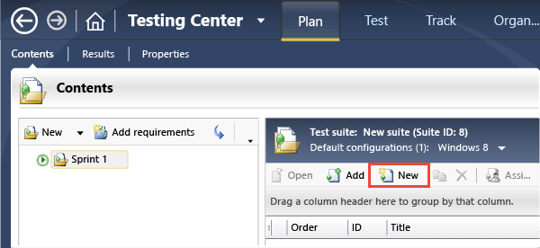
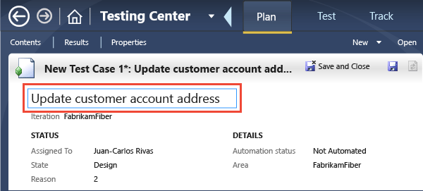
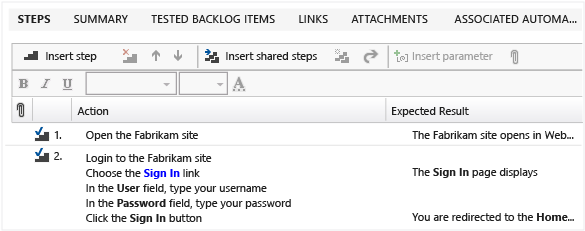
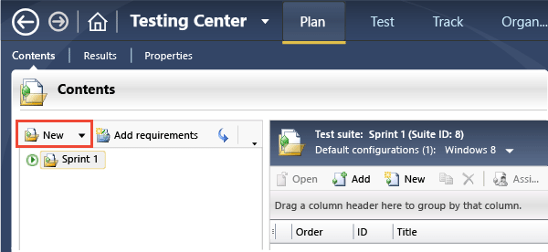
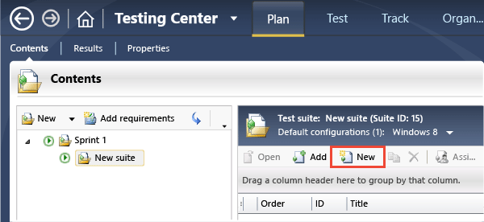
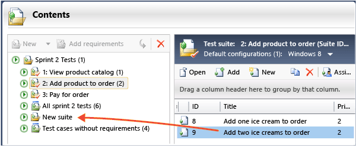

# Plan manual tests with Microsoft Test Manager

[!INCLUDE [version-inc-vs](../_shared/version-inc-vs.md)]

>[!NOTE]
>[!INCLUDE [mtm-deprecate-message](../_shared/mtm-deprecate-message.md)]

At the start of a sprint, find out what you need to test. Discussing test cases is a great way to help the team understand the detail of what your users need. Tests planned in this way provide a clear target for the development team.  

[!INCLUDE [feature-availability](../_shared/feature-availability.md)] 
  
> **TIP**
> You can also use [the web portal to plan manual tests](../create-a-test-plan.md). It is generally more convenient for creating test cases.  
  
1. [Connect to a test plan](connect-microsoft-test-manager-to-your-team-project-and-test-plan.md) if you haven't already.  
  
   The test plan links together the test cases you'll use in this sprint.  
  
1. Add a manual test case to your test plan.  
  
     
  
1. Name the test case.  
  
     
  
1. Add the steps to perform during the test. Don't forget to include the expected results.  
  
     
  
   To add multiple lines in a step, press ALT + Enter.  
  
Now that you've defined a manual test case, you can run it from Microsoft Test Manager and keep the results in Azure DevOps or TFS.  
  
## Organize your test cases with test suites  

Test suites are folders inside a test plan that help you organize tests. When you run tests, you can choose to run all the tests in a suite, one after another.  
  
- Create a new test suite.  
  
    
  
- Select a suite and then create new tests in the suite.  
  
    
  
- Drag test cases from one suite to another, or cut and paste.  
  
    
  
  CTRL + drag or copy and paste to make the same test case appear in more than one suite.  
  
  These operations don't affect the test case itself. Suites contain links to test cases, and it's the links that you're moving or copying.
  For the same reason, removing a test case from a suite doesn't delete the test case from Azure DevOps or TFS.  
  
## Try this next  
  
- [Run manual tests with Microsoft Test Manager](run-manual-tests-with-microsoft-test-manager.md)  
  
### Or, dig deeper:  
  
- [Share steps between test cases](share-steps-between-test-cases.md)  
  
- [Repeat a test with different data](../repeat-test-with-different-data.md)  
  
- [Test different configurations](../test-different-configurations.md)  
  
[!INCLUDE [help-and-support-footer](../_shared/help-and-support-footer.md)] 
