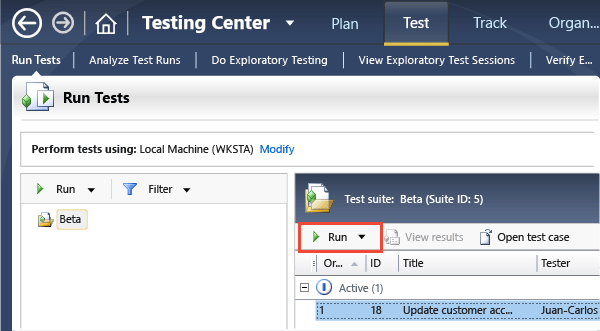
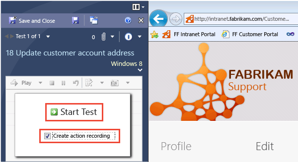
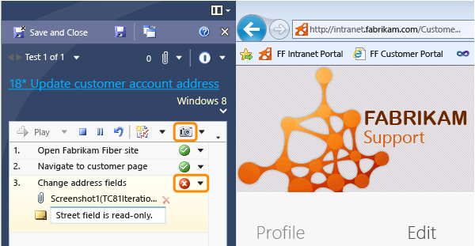
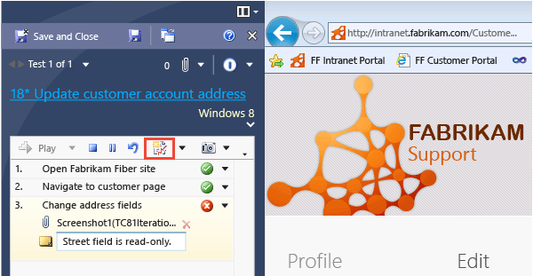
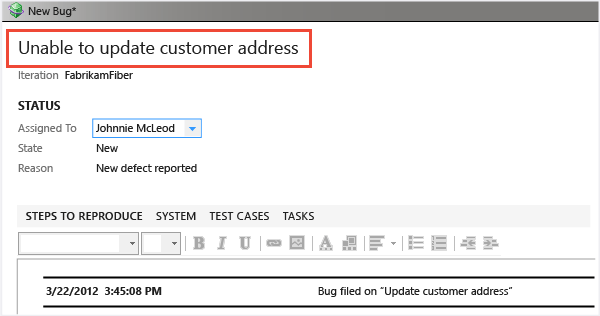
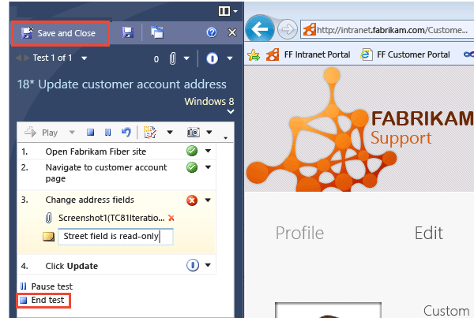
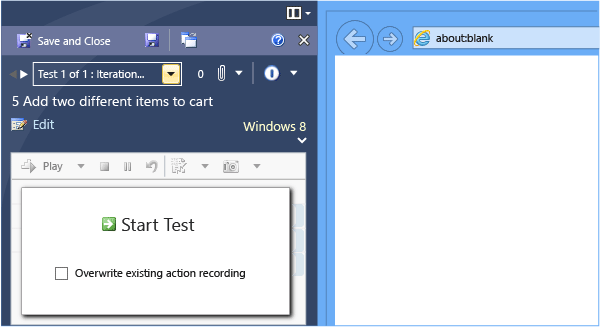
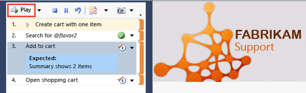
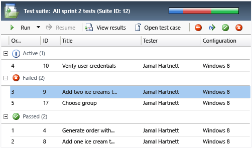

# Run manual tests with Microsoft Test Manager

[!INCLUDE [version-inc-vs](../_shared/version-inc-vs.md)]

>[!NOTE]
>[!INCLUDE [mtm-deprecate-message](../_shared/mtm-deprecate-message.md)]

Microsoft Test Runner sits at the side of the screen while you test your application. It displays the steps you planned and the results you expected, and you check them off as you work. It can record your actions along with comments, screenshots, and other data, so that if you find a bug, it's easy to reproduce.  

[!INCLUDE [feature-availability](../_shared/feature-availability.md)] 
  
>**The web portal or Microsoft Test Runner?** Use the web-based test runner
in [!INCLUDE [test-hub-include-nolink](../_shared/test-hub-include-nolink.md)] when you want to test web applications, and Microsoft 
Test Runner for desktop applications. You can 
[launch Microsoft Test Runner](../run-manual-tests.md#run-desktop)
from [!INCLUDE [test-hub-include-nolink](../_shared/test-hub-include-nolink.md)], instead of using Microsoft Test Manager.
  
### Running test cases with Microsoft Test Runner  
  
1. **Get ready to test.** Here are a few things you might need to do before running your tests:  
  
   - Install the latest version of your app.  
  
   - [Create some test cases.](plan-manual-tests-with-microsoft-test-manager.md) Typically you create them at the start of a sprint, and aim to have them all pass by the end of the sprint. You can create them either with the web portal or Microsoft Test Manager.  
  
   - Install Microsoft Test Manager on the machine where you want to run your tests.
     To get Microsoft Test Manager, install [Visual Studio Enterprise](https://visualstudio.microsoft.com/downloads/) or [Visual Studio Test Professional](https://visualstudio.microsoft.com/vs/test-professional/).
  
   - [Connect Microsoft Test Manager to your test plan](connect-microsoft-test-manager-to-your-team-project-and-test-plan.md)  
  
1. Run a test case.  
  
     
  
   > **TIP**
   > If you are already looking at a test case in the web portal, you can start Test Runner directly from there by choosing **Run in Client**.  
  
   Test Runner appears at the side of the screen. It will stay there while you work with your application.  
  
1. Create an action recording so that you can quickly repeat the test later.  
  
     
  
1. Follow the steps in the test. Mark each step as either Passed or Failed. When a step fails, add a comment to describe what was wrong. You can attach screenshots, too.  
  
     
  
   If you have to attend to something else, Pause the test. You don't want your emails or password included in the recording.  
  
1. Create a bug if you find a problem.  
  
     
  
1. Name the bug and describe the failure.  
  
     
  
   You can assign the bug if you know who'll fix it.  
  
1. End the test and save the results.  
  
     
  
   Now the results are stored in Azure DevOps or TFS.  
  
## Replay previous tests
  
If you ran a test before, you can repeat it quickly by replaying the same actions.  
(This works with most applications, though not all).  
  
1. Start the test. Don't overwrite the recording.  
  
     
  
1. **Play** your recorded actions. You have to verify the results of each step.  
  
     
  
## Track the progress of your tests  

Monitor the progress of your project by seeing how many tests have passed.  
Tests begin in the Active state, meaning that they are ready to run. When a bug has been fixed, you can set the state of a failed test back to Active.  
  
  

## FAQs

### Q: Can I record a test in one test plan and play it back in another?
  
**A:** Yes, this is a great way to do regression tests quickly and accurately. 
If you want to repeat some tests you did in a previous sprint, 
just add those test cases to the test plan for the current sprint.
The recording is linked to the test case, not to its appearance 
in any particular test plan or suite.

### Q: Can I record a test in one test configuration and play it back in a different configuration? The tests for different configurations show up as separate tests in the Run page.
  
**A:** Yes, the recording is linked to the test case, so you can play it back from any instance of that test case, even in different [test configurations](test-configurations-specifying-test-platforms.md), test suites, or test plans.

### Q: Some or all of my actions aren't recorded, or the playback doesn't work properly. Why?
  
**A:** Action recording works best for apps in which each user 
interface field has a unique ID, and for basic actions such as keystrokes, 
clicks, and menu selections. It doesn't work for some apps and web browsers.
See [Supported configurations and platforms for coded UI tests and action recordings](/visualstudio/test/supported-configurations-and-platforms-for-coded-ui-tests-and-action-recordings).
To learn how to develop your app so that it's easier to record tests, 
see [Enable coded UI testing of your controls](/visualstudio/test/enable-coded-ui-testing-of-your-controls).

### Q: Record and playback is great. But can I completely automate a test, including verifying the results?

**A:** Yes, see [Automate system tests](../../pipelines/index.md).
  
## See Also  

* [Repeat a test with different data](../repeat-test-with-different-data.md)   
* [Test configurations: specifying test platforms](../test-different-configurations.md)   
* [Record and play back manual tests](record-play-back-manual-tests.md)   
* [Collect more diagnostic data](collect-more-diagnostic-data-in-manual-tests.md)   
* [Testing Microsoft Store apps](testing-microsoft-store-apps.md)

[!INCLUDE [help-and-support-footer](../_shared/help-and-support-footer.md)] 
