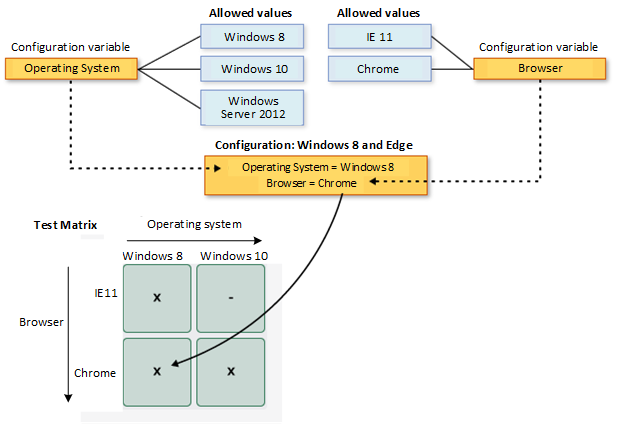

# Test configurations: specifying test platforms

[!INCLUDE [version-inc-vs](../_shared/version-inc-vs.md)]

>[!NOTE]
>[!INCLUDE [mtm-deprecate-message](../_shared/mtm-deprecate-message.md)]

**For Azure DevOps and TFS, see [Test different configurations](../test-different-configurations.md).**

Your users will probably install or run your app on a wide variety of configurations, such as different operating systems, web browsers, and other variations. You will want to run at least some of your tests in environments that have those different configurations. Use your test plan to decide which tests you want to run on which configurations. You have to make sure that when you run your tests that you have set up your environments for the configurations that you need.

You might draw up a schematic matrix of the combinations that you want to test:

Use Microsoft Test Manager to specify test configurations. But you can still run the tests either with the web portal or with Microsoft Test Manager.

**Requirements**

* [Visual Studio Enterprise](https://visualstudio.microsoft.com/downloads/) or [Visual Studio Test Professional](https://visualstudio.microsoft.com/vs/test-professional/)

## Planning tests with configurations  
 
[Connect Microsoft Test Manager](connect-microsoft-test-manager-to-your-team-project-and-test-plan.md)
to your test project and open your test plan. Open your test plan by opening **Testing Center**, **Plan**, **Contents**. 

Select one or more tests, then choose **Configurations**.

Set the configurations you want to run the tests on.

Don't see the configurations you want? Choose **All configurations**. If you still don't see what you need, 
[learn how to define your own configurations](#create-new).

**I have a test case that appears in several test plans and test suites. Do I have to set the configurations for each of these test points?**

Yes. The same test case can have different configuration settings in different test suites and test plans.

## Running tests with configurations  

When you want to [run a test](run-manual-tests-with-microsoft-test-manager.md)
that has multiple configurations, you'll see that it appears more than once in the run list. 

 

Set up a testing platform for a particular configuration, and then sort the list to show the tests to run on that configuration.

 

When you run a test, a reminder of the required configuration appears on the Test Runner window.

| Web portal | Microsoft Test Manager |
| --- | --- |
|  |  |
  
Test Runner doesn't verify that you're actually running on the specified configuration. 
However, if you use Microsoft Test Manager, system information is stored in the test log.

## Create new configurations for your project  

A few configurations are already defined for you, but you'll probably want to add your own.

A _test configuration_ is a combination of _configuration variable_ values. Your configuration variables could be, 
for example, operating system, browser, CPU type, database. A configuration might be "Windows 8 + 32-bit CPU" or "Windows 10 + 64-bit CPU." 

Choose **Testing Center**, **Organize**, **Test Configuration Manager**. 

To add your own configuration variables and values, choose **Manage configuration variables**:

Create new configurations that your tests can use:

**Are different test data a good use of a test configuration variable?**

It's better to use [parameters](../repeat-test-with-different-data.md)
when you want a test to be run with different test data, because it's easy to set different parameters for different test cases. 
Test configurations are better for variations in the hardware or software platform on which the application under test is installed. 

## Improving performance when repeating tests  

Repeating tests on different configurations can be slow and error-prone.
To speed things up, [record your actions](record-play-back-manual-tests.md) on one configuration,
and then play them back on another. 

If you play back on a different browser, choose the **Change browser for playback** option under the play menu in test runner. 
However, be aware that record/playback doesn't work for all browsers and applications. In some cases you might have to play back some steps manually.
  
[!INCLUDE [help-and-support-footer](../_shared/help-and-support-footer.md)] 
