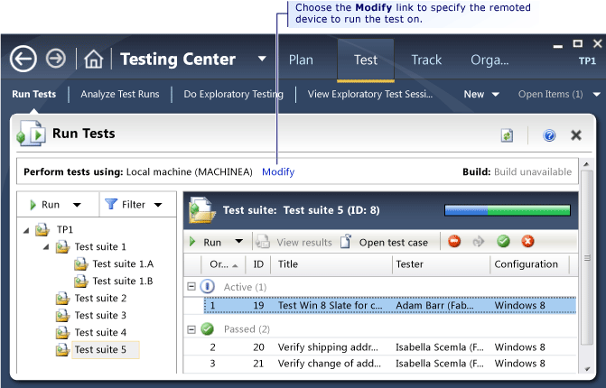
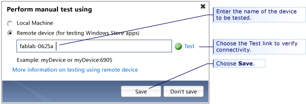
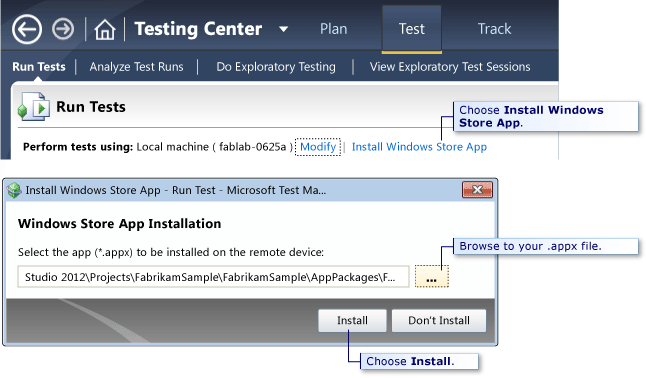
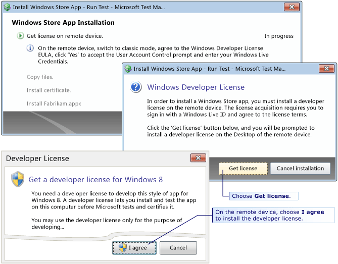
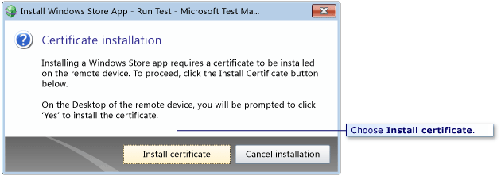

# Testing Microsoft Store apps

[!INCLUDE [version-inc-vs](../_shared/version-inc-vs.md)]

>[!NOTE]
>[!INCLUDE [mtm-deprecate-message](../_shared/mtm-deprecate-message.md)]

You have two options if you want to test Microsoft Store apps on a phone, tablet, or other device:  
  
- Plan and perform your tests using the web portal, using a browser on the device or on another computer. When you use the web portal for testing, the test runner doesn't interact with the software that you're testing; it simply acts as a checklist of the test steps. Therefore, you don't have to run it on the device that you're testing.  
  
  This option requires no special preparation on the device, other than installing the software.  
  
- Couple the device to your computer, and run the tests using Microsoft Test Manager. This option allows you to capture screenshots and [collect diagnostic data](collect-more-diagnostic-data-in-manual-tests.md) from the device.  

[!INCLUDE [feature-availability](../_shared/feature-availability.md)] 
  
### Prepare the Windows device for testing  
  
1. If possible, use the same user credentials or the same Microsoft Live ID on the Windows device and on the computer that is running Microsoft Test Manager. If the user is different, the machine that you are running Microsoft Test Manager from will display a credentials dialog box when you try to connect.  
  
1. Install the Remote Debugger on the device that you want to test. See [Installing the Remote Debugger](/visualstudio/debugger/run-windows-store-apps-on-a-remote-machine#BKMK_download).
   (This is only supported for Windows client operating systems. Windows Server 2012 is not supported.)  
  
   The Microsoft Test Tools Adapter Configuration Tool will appear on the device as a new tile.  
  
1. Choose the Microsoft Test Tools Adapter Configuration Tool tile in Windows.  
  
1. Choose **Start Service** in the configuration dialog box for Microsoft Test Tools Adapter to configure the Microsoft Test Tools Adapter.  
  
### Connect to the remote device  
  
1. On the machine that you are testing from, [open Microsoft Test Manager](connect-microsoft-test-manager-to-your-team-project-and-test-plan.md).  
  
   [Create some test cases](plan-manual-tests-with-microsoft-test-manager.md) if you haven't already done so.  
  
1. On the **Run Tests** page, choose the **Modify** link next to **Perform tests using:** to specify the remote Windows device.  
  
     
  
1. Choose the **Remote device** option and enter the name of the device that you want to test.  
  
     
  
   By default, port 6905 is used by Microsoft Test Manager to communicate with remote devices. If you want to use a different port, enter the remote device as *deviceName***:***port*. For example, `mySlateDevice1:8001`.  You must also change the port on the remote device by opening the service configuration file mttaservice.exe.config in the Visual Studio installation folder.  
  
1. Choose the **Test** link to verify that Microsoft Test Manager can communicate with the remote device.  
  
### Install your Microsoft Store app  
  
1. Choose **Install Microsoft Store App**, and then enter the path and name of the .appx file for the Microsoft Store app that you want to install.  
  
     
  
1. Follow the steps in the installation wizard.  
  
     
  
     
  
### Test your Microsoft Store app  
  
1. Choose **Start Test**.  
  
   Test Runner opens.  
  
1. Perform the steps in the test on the remote device.  
  
   As you complete each step of the test, [mark it passed or failed on the host computer](run-manual-tests-with-microsoft-test-manager.md).  
  
   The following features are supported while you test on a Windows Remote device:  
  
   |Feature|Support|  
   |-------------|-------------|  
   |System info|Yes|  
   |Capture screenshot|Yes|  
   |[Event logs](collect-more-diagnostic-data-in-manual-tests.md)|Yes.|  
   |Action record/playback|Windows Web apps - Yes.   Windows desktop and store apps - No.|  
   |Create a bug|Yes|  
   |Create environment snapshot of the servers in an SCVMM lab environment.|Yes|  
  
## Security

Verify that the share location where the .appx file and certificates are stored is properly secured.
  
[!INCLUDE [help-and-support-footer](../_shared/help-and-support-footer.md)] 
