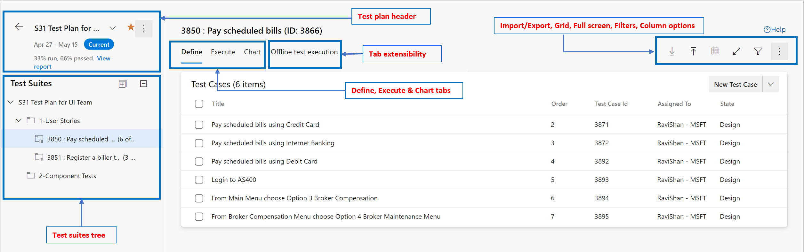
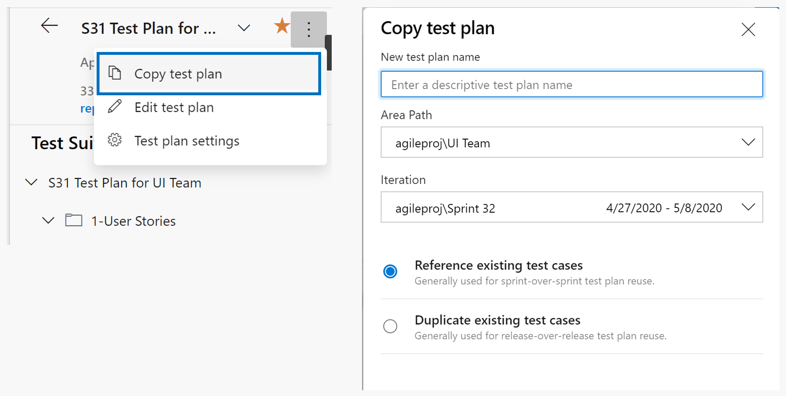
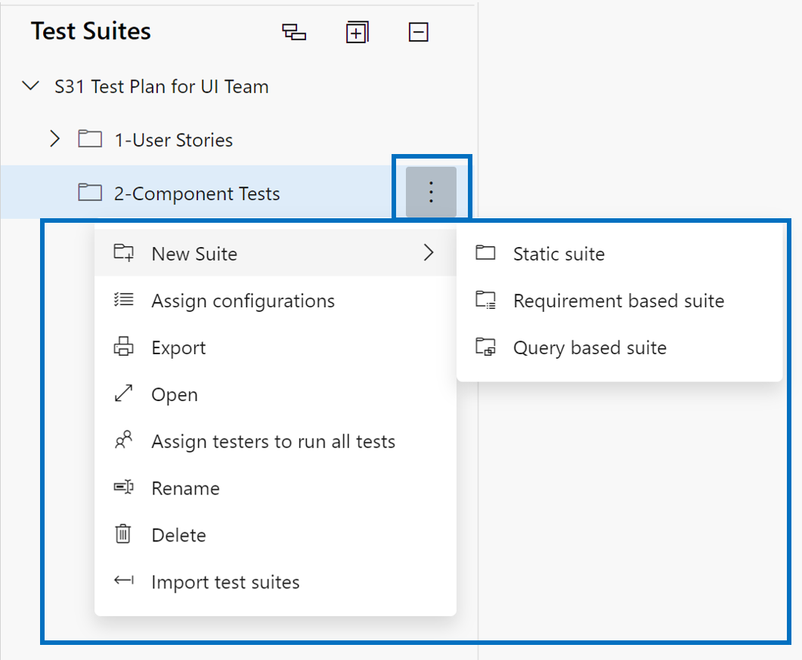
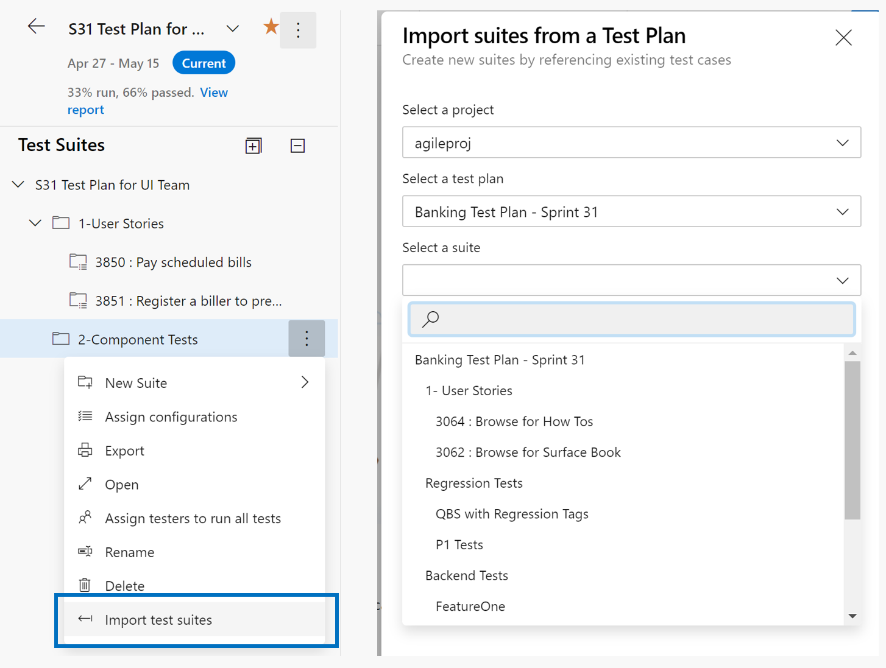

# Overview of New Test Plans page

[!INCLUDE [version-header-devops-services](includes/version-header-devops-services.md)]

[!INCLUDE [feature-availability](includes/feature-availability.md)] 

A new Test Plans Page (Test Plans*) for your planned testing needs is available for all Azure DevOps Services organizations. The new page provides you with streamlined views to help you focus on the task at hand - be it test planning, authoring, execution or tracking. It is also clutter-free and consistent with the rest of Azure DevOps offering. We hope that you find it easy and intuitive to use.

This new page has been in public preview for past few quarters and is being made default for all Test Plans users. During this time, we have continued to add the missing capabilities and address the feedback you have been providing us. We are almost towards the end of this journey and plan to pull out the old page by **Jun 15th 2020**. We highly recommend leveraging the new page and [sharing your feedback](#feedback) with us. However, if you absolutely need to leverage the prior page then enable it using the following steps (only available till Jun 15th 2020):

1. Sign-in into your Azure DevOps Services organization
2. Click on your Avatar on the top right and navigate to "Preview Features"
3. Disable the 'New Test Plans Page' feature and navigate to Test Plans > Test Plans in your project of choice.

> Any action performed in either page will reflect on the other too since their backend store is the same.

## Help me understand the new page

The new Test Plans page has 5 sections:
1. **Test plan header**: Use this to locate, favourite, edit, copy or clone a test plan.
2. **Test suites tree**: Use this to add, manage, export or order test suites. Leverage this to also assign configurations and perform user acceptance testing.
3. **Define tab**: Collate, add and manage test cases in a test suite of choice via this tab.
4. **Execute tab**: Assign and execute tests via this tab or locate a test result to drill into.
5. **Chart tab**: Track test execution and status via charts which can also be pinned to dashboards.

> The Define tab and certain operations are only available to users with [Basic + Test Plans]((https://marketplace.visualstudio.com/items?itemName=ms.vss-testmanager-web)) access level or equivalent. Everything else should be exercisable by a user with 'Basic' access level.

Define tab lets you collate, add and manage test cases for a test suite. Whereas the execute tab is for assigning test points and executing them. **What is a test point?** Test cases by themselves are not executable. When you add a test case to a test suite then test point(s) are generated. A test point is a unique combination of test case, test suite, configuration, and tester. Example: if you have a test case as "Test login functionality" and you add 2 configurations to it as Edge and Chrome then this results in 2 test points. Now these test points can be executed. On execution, test results are generated. Through the test results view (execution history) you can see all executions of a test point. The latest execution for the test point is what you see in the execute tab.  
Hence, test cases are reusable entities. By including them in a test plan or suite, test points are generated. By executing test points, you determine the quality of the product or service being developed.

## Test plan header

**Possible tasks** 

The Test Plan header allows you to perform the following tasks:

- Mark a test plan as favorite 
- Unmark a favorited test plan
- Easily navigate among your favorite test plans
- View the iteration path of the test plan, which clearly indicates if the test plan is Current or Past
- View the quick summary of the Test Progress report with a link to navigate to the report
- Navigate back to the All/Mine Test Plans page

**Context menu options**

The context menu on the Test Plan header provides the following options:

- *Copy test plan*: This is a new option that allows you to quickly copy the current test plan. More details below.
- *Edit test plan*: This option allows you to edit the Test Plan work item form to manage the work item fields.
- *Test plan settings*: This option allows you to configure the Test Run settings (to associate build or release pipelines) and the Test Outcome settings

***Copy test plan (new capability)***

We recommend creating a new Test Plan per sprint/release. When doing so, generally the Test Plan for the prior cycle can be copied over and with few changes the copied test plan is ready for the new cycle. To make this process easy, we have enabled a 'Copy test plan' capability on the new page. By leveraging it you can copy or clone test plans. Its backing REST API is covered [here](https://docs.microsoft.com/rest/api/azure/devops/testplan/test%20plan%20clone/clone%20test%20plan?view=azure-devops-rest-5.1) and the API lets you copy/clone a test plan across projects too. 
For more guidelines on Test Plans usage, refer [here](https://blogs.msdn.microsoft.com/visualstudioalmrangers/2015/07/22/test-planning-and-management-guide-updated/).

## Test suites tree

**Possible tasks** 

The Test suite header allows you to perform the following tasks:

- *Expand/collapse*: This toolbar options allows you to expand or collapse the suite hierarchy tree.
- *Show test points from child suites*: This toolbar option is only visible when you are in the "Execute" tab. This allows you to view all the test points for the given suite and its children in one view for easier management of test points without having to navigate to individual suites one at a time. 
- *Order suites*: You can drag/drop suites to either reorder the hierarchy of suites or move them from one suite hierarchy to another within the test plan. 

**Context menu options**

The context menu on the Test suites tree provides the following options:

- *Create new suites*: You can create 3 different types of suites as follows: 
	- Use static suite or folder suite to organize your tests.
	- Use requirement-based suite to directly link to the requirements/user stories for seamless traceability.
	- Use query-based to dynamically organize test cases that meet a query criteria.
	
- *Assign configurations*: You can assign configurations for the suite (example: Chrome, Firefox, EdgeChromium) and these would then be applicable to all the existing test cases or new test cases that you add later to this suite. 

- *Export as pdf/email*: Export the Test plan properties, test suite properties along with details of the test cases and test points as either "email" or "print to pdf".

- *Open test suite work item*: This option allows you to edit the Test suite work item form to manage the work item fields.

- *Assign testers to run all tests*: This option is very useful for User Acceptance testing (UAT) scenarios where the same test needs to be run/executed by multiple testers, generally belonging to different departments. 

- *Rename/Delete*: These options allow you to manage the suite name or remove the suite and its content from the test plan.

- *Import test suites*: Use this option to import test cases present in other suites from same or other test plans and even across projects. More details below.

***Import test suites (new capability)***

It is now easier to reuse the suites you have created already and import them into the current suite/plan. You can select the project, test plan and test suite from which you want to import the tests. Depending upon the suite selected, then entire hierarchy of that suite and corresponding test cases are imported into the current plan. Note that the test cases are added as a reference and not a clone/copy. 

## Journey

**With the New Test Plans page, you can perform the following tasks:**

- Define tab:
    - Create and add new test cases
    - Grid to add, edit and manage test cases
    - Add existing test cases
    - Manage test cases
    - Filtering
    - Order tests cases
    - See linked items: test suites and plans
    - Column options & sorting on columns
    - See linked items: requirements and bugs
- Execute Tab:
    - Execute test points against a web or desktop application 
    - Bulk execution or mark outcome
    - Assign test points
    - Filtering    
    - View test results
    - 'Run with options' to leverage Microsoft Test Manager for execution
    - Ability to edit test case
    - Column options & sorting on columns
- Charts
    - Existing charts capabilities
- General:
	- Enable [current extensibility points](https://docs.microsoft.com/azure/devops/extend/reference/targets/overview?view=azure-devops)

**Capabilities from the following list will be added every 3 weeks:**

- General:
	- Export/Import Test cases as CSV	

## Provide feedback
Reach us at `devops_tools@microsoft.com` to share your thoughts on the new page. In the process, share screenshots as appropriate.

>[!IMPORTANT]
> When sending feedback email, you may receive the following notification:
>
> `The group <group> only accepts messages from people in its organization or on its allowed senders list, and your email address isn't on the list.`
>
> Even if you receive this message, your feedback to `devops_tools@microsoft.com` is getting through.
> Thank you for your feedback and patience while we resolve the issue that is causing the message. 
