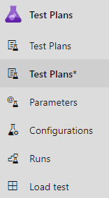

# New Test Plans page

[!INCLUDE [version-header-devops-services](_shared/version-header-devops-services.md)]

A new Test Plans Page (Test Plans*) for your planned testing needs is available in public preview for all Azure DevOps Services organizations. The new page provides you with streamlined views to help you focus on the task at hand - be it test planning, authoring or execution. It is also clutter-free and consistent with the rest of Azure DevOps offering. We hope that you find it easy and intuitive to use.

The existing Test Plans page will continue to be available until we bring in most or all of the capabilities from the existing page to the new page. The new page has additional fresh capabilities to offer too. So far, we have made good strides in offering most of the test execution capabilities. More of test planning and authoring capabilities will be added every 3 weeks. See list on what's coming [next](#journey). We request you to try out the new page and [share your feedback](#feedback).

## How do I enable the new page?

1. Sign-in into your Azure DevOps Services organization
2. Click on your Avatar on the top right and navigate to "Preview Features"
3. Enable 'New Test Plans Page' feature
4. In a project of choice, navigate to Test Plans > Test Plans*. The last test plan you had accessed should load up in the new page.

> Any action performed in either page will reflect on the other too since their backend store is the same.

## Help me understand the new page

The new Test Plans page has 5 sections:
1. **Test Plan segment**: Use this to locate, favourite, edit, copy or clone a test plan.
2. **Test Suites tree**: Use this to add, manage, export or order test suites. Leverage this to also assign configurations and perform user acceptance testing.
3. **Define tab**: Collate, add and manage test cases in a test suite of choice via this tab.
4. **Execute tab**: Assign and execute tests via this tab or locate a test result to drill into.
5. **Chart tab**: Track test execution and status via charts which can also be pinned to dashboards.

> The Define tab and certain operations are only available to users with 'Basic + Test Plans' access level or equivalent. Everything else should be exercisable by a user with 'Basic' access level.

Define tab lets you collate, add and manage test cases for a test suite. Whereas the execute tab is for assigning test points and executing them. **What is a test point?** Test cases by themselves are not executable. When you add a test case to a test suite then test point(s) are generated. A test point is a unique combination of test case, test suite, configuration, and tester. Example: if you have a test case as "Test login functionality" and you add 2 configurations to it as Edge and Chrome then its results in 2 test points. Now these test points can be executed. On execution, test results are generated. Through the test results view (coming soon) you would be able to see all executions of a test point. The latest execution for the test point is what you see in the execute tab.  
Hence, test cases are reusable entities. By including them in a test plan or suite, test points are generated. By executing test points, you determine the quality of the product or service being developed.

## New capabilities

We recommend creating a new Test Plan per sprint/release. When doing so, generally the Test Plan for the prior cycle can be copied over and with few changes the copied test plan is ready for the new period. To make this process easy, we have enabled a 'Copy test plan' capability on the new page. By leveraging it you can copy or clone test plans. Its backing REST API is covered [here](https://docs.microsoft.com/rest/api/azure/devops/testplan/test%20plan%20clone/clone%20test%20plan?view=azure-devops-rest-5.1) and the API lets you copy/clone a test plan across projects too. 
For more guidelines on Test Plans usage, refer [here](https://blogs.msdn.microsoft.com/visualstudioalmrangers/2015/07/22/test-planning-and-management-guide-updated/).

## Journey

**With the New Test Plans page, you can perform the following tasks:**

- Test Plan segment:
    - Locate & favourite
    - Edit test plan 
    - Copy or clone a test plan (**New**)
- Test suites tree:
    - Create and manage suites (static, requirement or query based)
    - Assign configurations
- Define tab:
    - Create and add new test cases
    - Add existing test cases
    - Manage test cases
    - Filtering
- Execute Tab:
    - Execute test points against a web or desktop application 
    - Bulk execution or mark outcome
    - Assign test points
	- Filtering

**Capabilities from the following list will be added every 3 weeks:**

- Test Plan segment:
	- Settings to associate build and release pipelines
- Test suites tree:
	- Order suites
	- Import (i.e. copy) suite from another test plan
	- Show all test cases and points from child suites
	- User acceptance testing
	- Export
- Define tab
	- Order tests cases
	- See linked items: suites, requirements and bugs
	- Column options & sorting on columns
	- Grid to add, edit and manage test cases
- Execute tab:
	- View test results
	- 'Run with options' to leverage Microsoft Test Manager for execution
	- Ability to edit test case
	- Column options & sorting on columns
- Charts
	- Existing charts capabilities
- General:
	- Performance improvements
	- Enable [current extensibility points](https://docs.microsoft.com/azure/devops/extend/reference/targets/overview?view=azure-devops)

 

## Provide feedback
Reach us at newtestplanpage@microsoft.com to share your thoughts on the new page. In the process, share screenshots as appropriate.
