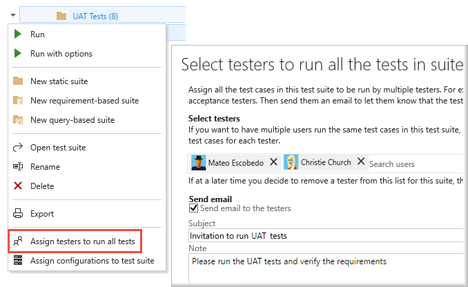
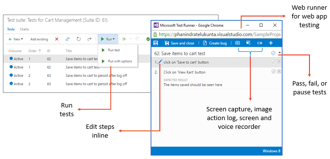

# What is Azure Test Plans?  

**Azure Test Plans | Azure DevOps Server 2020**

Azure Test Plans provides rich and powerful
tools everyone in the team can use to drive quality and collaboration
throughout the development process. The easy-to-use, browser-based 
test management solution provides all the capabilities required for 
planned manual testing, user acceptance testing, exploratory testing,
and gathering feedback from stakeholders.

:::image type="content" source="media/overview/intro-test-plans.png" alt-text="Screenshot of Azure Test Plans, Test Plans, All":::

<!--- Elements to discuss: 

Dev Inner Loop – Unit Testing in Visual Studio IDE
Testing in Continuous Integration (CI) and Release Management (RM) or Continuous Delivery
Manual and exploratory Testing
Load and Performance Testing
Integration with 3rd party test services

  
&nbsp; &nbsp; **Holistic approach to manual testing, types of manual testing, and personas involved**

--> 

> [!NOTE]  
> This article applies to Azure DevOps Services and Azure DevOps Server 2020 and later versions. Most of the information is valid for earlier on-premises versions, however, images show only examples for the latest version. Also, the user interface changed significantly with the release of Azure DevOps Server 2020. For an overview of the new interface and supported capabilities, see [Navigate Test Plans](navigate-test-plans.md). 

## How does Azure Test Plans work? 

Azure Test Plans provides a combination of browser-based test management tools and DevOps integration capabilities to support the following test objectives: 

- [**Manual and exploratory testing**](#manual): Planned manual testing lets you organize tests into test plans and test suites. Test suites can be dynamic (requirements-based-suites and query-based-suites) to help you understand the quality of associated requirements under development, or static to help you cover regression tests. Tests can be authored using an Excel-like grid view or other means available. Testers execute tests assigned to them using a runner to test your app(s). The runner can execute in a browser or as a client on your desktop, enabling you to test on any platform or test any app. During execution, rich diagnostic data is collected to help with debugging or reproducing the issue later. Bugs filed during the process automatically include the captured diagnostic data. 

- [**Automated testing**](#automated): Azure Test Plans is fully integrated with Azure Pipelines to support continuous integration and testing. Test plans and test cases can be associated with build or release pipelines. Pipeline tasks can be added to pipeline definitions to capture and publish test results. Test results can be reviewed via built in progress reports and pipeline test reports.   

- **Load and performance testing**: While Azure DevOps cloud-based load testing service is deprecated, Azure Load Testing Preview is available. Azure Load Testing Preview is a fully managed load testing service that enables you to use existing Apache JMeter scripts to generate high-scale load. To learn more, see [What is Azure Load Testing Preview?](/azure/load-testing/overview-what-is-azure-load-testing). To learn more about the deprecation of Azure DevOps load testing and other, alternative services see [Changes to load test functionality in Visual Studio and cloud load testing in Azure DevOps](/previous-versions/azure/devops/test/load-test/overview).

- [**Traceability**](#traceability): Test cases and test suites linked to user stories, features, or requirements supports end-to-end traceability. Tests and defects are automatically linked to the requirements and builds being tested, which also helps tracking the quality of requirements. Users can add and run tests from the Kanban board, or for larger teams, use the Test plans hub to define test plans and test suites. Pipeline results and the Requirements widget provide a means to track testing of requirements.  

- [**Reporting and analysis**](#reporting): Test result tracking and progress monitoring is supported through configurable tracking charts, test-specific widgets that you can add to dashboards, and built-in reports, such as Progress report, pipeline test result reports, and the Analytics service. 
 
To support planning, authoring, execution, and analysis of manual and automated tests, Azure Test Plans provides several browser-based hubs&mdash;[**Test plans**](#test-plans), [**Progress report**](#progress-report), [**Parameters**](#parameters), [**Configurations**](#configurations), and [**Runs**](#runs). 

### Key benefits

* **Test on any platform**. With the **Test Plans** web portal, you can use any supported browser to access all the manual testing capabilities. It enables you to [create](create-test-cases.md) and [run manual tests](run-manual-tests.md) through an easy-to-use, browser-based interface that can be accessed from all major browsers on any platform.

* **Rich Diagnostic data collection**. Using the web-based Test Runner and Test Runner client you can [collect rich diagnostic data](collect-diagnostic-data.md) during your manual tests. This includes screenshots, an image action log, screen recordings, code coverage, IntelliTrace traces, and test impact data for your apps under test. This data is automatically included in all the bugs you create during test, making it easy for developers to reproduce the issues.

* **End to End Traceability**. Azure DevOps provides [end-to-end traceability of your requirements, builds, tests and bugs](../boards/queries/link-work-items-support-traceability.md?toc=/azure/devops/test/toc.json&bc=/azure/devops/test/breadcrumb/toc.json). Users can track their requirement quality from cards on the Kanban board. Bugs created while testing are automatically linked to the requirements and builds being tested, which helps you track the quality of the requirements or builds.

* **Extensible platform**. You can combine the tools and technologies you already know with the development tools that work best for you to integrate with and [extend Azure DevOps](../integrate/index.md). Use the REST APIs and contribution model available for the Test platform to create extensions that provide the experience you need for your test management lifecycle.

### Supported scenarios and access requirements 

Access to Azure DevOps web portal features are managed through access levels assigned to users. The three main access levels are **Stakeholder**, **Basic**, and **Basic+Test** plans as described in [About access levels](../organizations/security/access-levels.md). The following table indicates the access-level required to exercise the associated tasks with Azure Test Plans. In addition to access levels, select features require permissions to execute. To learn more, see [Manual test access and permissions](manual-test-permissions.md).   
  
 
:::row:::
   :::column span="3":::
      **Scenario and tasks**
   :::column-end:::
   :::column span="1":::
      **Stakeholder**
   :::column-end:::
   :::column span="1":::
      **Basic**
   :::column-end:::
   :::column span="1":::
      **Basic +Test Plans**
   :::column-end:::
:::row-end:::
---
:::row:::
   :::column span="3":::
      **Test planning**
      - Create test plans and test suites
      - Manage test plan run settings
      - Manage configurations 
   :::column-end:::
   :::column span="1":::
       
   :::column-end:::
   :::column span="1":::
       
   :::column-end:::
   :::column span="1":::
      ✔️
   :::column-end:::
:::row-end:::
:::row:::
   :::column span="3":::
      **Test execution**
      - Run tests on any platform (Windows, Linux, Mac) with Test Runner 
   :::column-end:::
   :::column span="1":::
       
   :::column-end:::
   :::column span="1":::
      ✔️
   :::column-end:::
   :::column span="1":::
      ✔️
   :::column-end:::
:::row-end:::
:::row:::
   :::column span="3":::
      **Perform exploratory testing with the Test & Feedback extension**
   :::column-end:::
   :::column span="1":::
      ✔️
   :::column-end:::
   :::column span="1":::
      ✔️
   :::column-end:::
   :::column span="1":::
      ✔️
   :::column-end:::
:::row-end:::
:::row:::
   :::column span="3":::
      **Analyze and review tests**
      - Create charts with various pivots like priority, configuration, etc., to track test progress
      - Browse test results
      - Export test plans and test suites for review
      - User Acceptance Testing – Assign tests and invite by email
   :::column-end:::
   :::column span="1":::
       
   :::column-end:::
   :::column span="1":::
       ✔️
   :::column-end:::
   :::column span="1":::
      ✔️
   :::column-end:::
:::row-end:::

<a id="manual" /> 

## Manual and exploratory testing

Manual and exploratory testing includes the following test activities:  

- **[Planned manual testing](#test-plans)**. Manual testing by organizing tests into test plans and test suites by designated testers and test leads.
- **[User acceptance testing](#user-acceptance)**. Testing carried out by designated user acceptance testers to verify the value delivered meets customer requirements, while reusing the test artifacts created by engineering teams. 
- **[Exploratory testing](#exploratory-testing)**. Testing carried out by development teams, including developers, testers, UX teams, product owners and more, by exploring the software systems without using test plans or test suites. 
- **[Stakeholder feedback](#stakeholder-feedback)**. Testing carried out by stakeholders outside the development team, such as users from marketing and sales divisions.  

To support these activities, Azure Test Plans uses test-specific work item types to plan and author tests. In addition, it provides two test tools to support running tests. 

### Test-specific work item types 

The work item types&mdash;**Test Plans**, **Test Suites**, **Test Cases**, **Shared Steps**, and **Shared Parameters**&mdash;support several explicit links to support requirements tracking and sharing test steps and data across many test cases. Test cases can be assigned as manual or automated. For a description of each of these test items, see [Test objects and terms](test-objects-overview.md).

> [!NOTE]  
> With Azure DevOps Server 2020 and later versions, you can perform automated tests by adding test tasks to pipelines. Defining test plans, test cases, and test suites isn't required when test tasks are used.  
> 
### Test tools 
 
With the following tools, developers, testers, and stakeholders can capture rich data as they execute tests and automatically log code defects linked to the tests. Test your application by executing tests across desktop or web apps. 

- **Test Runner**: A browser-based tool that you launch from the **Test plans** hub to run manual tests. Test Runner supports rich data collection while performing tests, such as: image action log, video recording, code coverage, etc. It also allows users to create bugs and mark the status of tests.  
- **Test & Feedback extension**: A free extension to support exploratory testing that you access from Chrome, Edge, or Firefox browsers. The extension captures interactions with the application being explored through images or video and entering verbal or type-written comments. Information is captured in the Feedback Response work item type to help track response data.

### User acceptance testing

User acceptance testing (UAT) helps ensure the value requested by customers is being delivered. You can create UAT test plans and suites using Azure Test Plans. Invite multiple testers to execute these tests and monitor UAT progress and results using lightweight charts.
To learn how, see [User acceptance testing](user-acceptance-testing.md).

### Exploratory testing for everyone
 
The [Test &amp; Feedback extension](perform-exploratory-tests.md)
is a simple browser-based extension you can use to test web apps 
anytime and anywhere, and is simple enough for everyone in the team to use.
It helps to improve productivity by allowing you to spend more time
finding issues, and less time filing them.

Using the extension is a simple, three step process:

 
* **Capture your findings** quickly and easily using the tools in the extension. 
  Capture notes, screenshots with annotations, and screen recordings 
  to describe your findings and highlight issues. Additionally, in 
  the background the extension automatically captures rich data such
  as user actions as an image action log, page load data,
  and system information about the browser, operating system, memory,
  and more that can serve as a starting point for debugging. 

* **Create work items** such as bugs, tasks, and test cases directly from 
  the extension. The captured findings automatically become a part of the work item. 
  Users can file a bug to report an issue with the product, or create a task that
  indicates a new work requirement. The extension can also be used to 
  create test cases for scenarios discovered during exploration. 

* **Collaborate with your team** by sharing your findings. 
  Export your session report in Standalone mode, or connect to Azure DevOps or
  Team Foundation Server (2015 or later) for a fully integrated experience
  including exploring user stories and backlog items, simplified tracking and triaging of 
  bugs and tasks, and managing feedback requests in one place.

As users perform exploratory testing, you can
[get insights from the sessions](insights-exploratory-testing.md). View completed exploratory sessions and derive meaningful
insights across all sessions. Get end-to-end traceability such as a breakdown 
of the work items created, the work items explored and not explored, session owners,
and more.

### Test web and desktop applications

The **Test Plans** web portal. provides
test runners to run tests for your web and desktop applications. Mark test steps and test outcomes as pass or fail, and collect
diagnostic data such as system information, image action logs, screen recordings, and screen captures as you test. Bugs filed during the tests automatically include all the captured diagnostic data
to help your developers reproduce the issues. To learn more, see [Run tests for web apps](run-manual-tests.md#run-web) and [Run tests for desktop apps](run-manual-tests.md#run-desktop).

### Stakeholder feedback

Seeking feedback from stakeholders outside the development team, such
as marketing and sales teams, is vital to develop good quality software.
Developers can request feedback on their user stories and features. Stakeholders can respond
to feedback requests using the browser-based Test &amp; Feedback extension -
not just to rate and send comments, but also by capturing rich diagnostic
data and filing bugs and tasks directly.
See more at [Request stakeholder feedback](request-stakeholder-feedback.md) 
and [Provide stakeholder feedback](provide-stakeholder-feedback.md).

<a id="automated" /> 

## Automated testing and Test Analytics 

Automated testing is facilitated by running tests within Azure Pipelines. Test analytics provides near real-time visibility into your test data for builds and releases. It helps improve pipeline efficiency by identifying repetitive, high impact quality issues.
 
Azure Test Plans supports automated testing in the following ways: 

- Mark a test case as  
- Specify the Build 
- Integration with Azure Pipelines: Pipelines provides several tasks, including those listed below, that support a comprehensive test reporting and analytics experience. 
	- Pipeline tasks: 
		- [Publish Test Results task](../pipelines/tasks/test/publish-test-results.md): Use to publish test results to Azure Pipelines.
		- [Visual Studio Test task](../pipelines/tasks/test/vstest.md): Use to run unit and functional tests (Selenium, Appium, Coded UI test, and more) using the Visual Studio Test Runner. 
		- [.NET Core CLI task](../pipelines/tasks/build/dotnet-core-cli.md): Use to build, test, package, or publish a dotnet application. 
		- For additional tasks, see [Publish Test Results task](../pipelines/tasks/test/publish-test-results.md)
	- Test failure report
	- Analytics test data 
		- Test analytics for builds
		- Test analytics for releases 
		- Test failures 
 

<a id="test-plans" />

## Define, execute, and chart tests and test progress

The **Test plans** hub of Azure Test Plans provides the tools you need to define, manage, and run your tests. Test cases, both manual and automated, are organized within test suites which are grouped under test plans.  

:::image type="content" source="media/overview/test-plan-define-execute-chart.png" alt-text="Screenshot of Azure Test Plans, Selected test plans":::

### Define test plans and test suites

Create and manage test plans and test suites from the **Test plans** hub. 
Add one or more test suites&mdash;static, requirement-based, or query-based&mdash;to the test plans. Export and share test plans and test suites with your teams.
To learn how, see [Create test plans and test suites](create-a-test-plan.md) and [Copy or clone test plans, test suites, and test cases](copy-clone-test-items.md).

:::image type="content" source="media/overview/test-planning.png" alt-text="Screenshot of Azure Test Plans, Test plans, test suites, Execute tab":::

### Author tests using test cases  

You define manual test cases by defining the test steps and optionally the test data to reference. Test suites consist of one or more test cases. You can share test cases within test suites. The Grid view for defining test cases supports copy, paste, insert, and delete operations. Quickly assign single or multiple testers to execute tests. View test results and references to a test case across test suites. To learn how, see [Create test cases](create-test-cases.md).

:::image type="content" source="media/overview/test-authoring.png" alt-text="Screenshot of Azure Test Plans, Test plans, test suites, Define tab":::

Within each test case, you specify a set of test steps with their expected outcomes. Optionally, you can add [shared steps](share-steps-between-test-cases.md) or [shared parameters](repeat-test-with-different-data.md). For traceability, link test cases to the user stories, features, or bugs that they test. 

:::image type="content" source="media/overview/test-case-form.png" alt-text="Screenshot of test case work item form.":::
 
<a id="parameters" />

## Manage shared parameters across many test cases

Teams use the [Parameters](repeat-test-with-different-data.md) hub, to define and manage parameters shared across test cases. Shared parameters provide support for repeating manual tests several times with different test data. For example, if your users can add different quantities of a product to a shopping cart, then you want to check that a quantity of 200 works just as well as a quantity of 1.  
 
:::image type="content" source="media/overview/parameters.png" alt-text="Screenshot of Azure Test Plans, Parameters hub":::

<a id="configurations" />

## Manage test configurations and variables

With the [Configurations](test-different-configurations.md) hub, teams can define, review, and manage test configurations and variables referenced by test plans. Test configurations provide support for testing your applications on different operating systems, web browsers, and versions. As with shared parameters, test configurations can be shared across multiple test plans. 

:::image type="content" source="media/overview/configurations.png" alt-text="Screenshot of Azure Test Plans, Configurations hub":::

<a id="traceability" /> 

## Traceability 

 
Authoring and running manual tests
In addition, it provides the following tools to link tests to requirements, run tests, create bugs, and capture feedback.  

- **Kanban board inline test tools**: An Azure Boards feature that supports defining test cases from the user stories, features, or bugs from the Kanban board. Also, you can launch the Test Runner or the Test & Feedback extension to run tests or perform exploratory testing. 
 

### Add and run tests from the Kanban board

From the Azure Boards Kanban boards, you can add tests from a user story or feature, automatically linking the test case to the user story or feature. You can  view, run, and interact with test cases directly from the Kanban board, and progressively monitor status directly from the card. Learn more at [Add, run, and update inline tests](../boards/boards/add-run-update-tests.md?toc=/azure/devops/test/toc.json&bc=/azure/devops/test/breadcrumb/toc.json).

:::image type="content" source="media/overview/kanban-board-inline-testing.png" alt-text="Screenshot of Kanban board showing inline tests added to work items.":::
 
<a id="reporting" /> 

## Reporting and analysis 

	- Progress report (Test plan, test suite) 
	- Built-in Test progress reports 
	- Test Results Trend (Advanced) widget (pipeline) 
	- Analytics service, Test 

 

### Track testing status and results  

Quickly configure lightweight charts to track your manual test results
using the chart types of your choice, and pin the charts to your dashboard to
easily analyze these results. Choose a retention policy to control how
long your manual testing results are retained.
See more at [Track test status](track-test-status.md).

<a id="progress-report" />

### View progress reports 

With the [Progress report](progress-report.md) hub, teams can track progress of more than one test plan or test suite. It helps answer the following questions:

- *How much testing is complete?*
- *How many tests have passed, failed or are blocked?*
- *Is testing likely to complete in time?*
- *What is the daily rate of execution?*
- *Which test areas need attention?*

:::image type="content" source="media/overview/progress-report.png" alt-text="Screenshot of Azure Test Plans, Progress Report hub":::

<a id="runs" />

### Review test runs 

The [Runs](insights-exploratory-testing.md) hub displays the results of test runs. This includes all test runs, both manual and automated. 

> [!NOTE]  
> The **Runs** hub is available with Azure DevOps Server 2020 and later versions. It requires enabling the Analytics service which is used to store and manage test run data. To learn more about the service, see [What is the Analytics service?](../report/powerbi/what-is-analytics.md)

:::image type="content" source="media/overview/recent-test-runs.png" alt-text="Screenshot of Recent test runs":::

:::image type="content" source="media/overview/example-run-summary.png" alt-text="Screenshot of selected Test Runs summary":::

<!--- TCM commands: 

### Supported tasks for test objects 

|Test object        | Task                                         | Web portal  | TCM |  
|----------------------------------------------------------------|-------------|-----|  
|Test plans       | Create                                       |    ✔️       |     |  
|                 | Copy                                         |    ✔️       |     |  
|                 | Clone                                        |             |  ✔️ |  
|                 | Add requirements                             |    ✔️       |    |  
|                 | New suites                                   |    ✔️       |    |  
|                 | Export                                       |    ✔️       |    |  
|                 | Import test suites                           |    ✔️       |    |  
|                 | Charts                                       |    ✔️       |    |  
|                 | Configurations                               |    ✔️       |    |  
|                 | Properties                                   |    ✔️       |    |  
|                 | Run settings                                 |    ✔️       |    |
|                 | View/list                                    |    ✔️       |  ✔️ |                  
|Test suite       | Create                                       |    ✔️       |    |  
|                 | Clone                                        |             |  ✔️ |  
|                 | Export                                       |    ✔️       |    |  
|                 | Add and view requirement(s)                  |    ✔️       |    |  
|                 | Assign configurations                        |    ✔️       |    |  
|                 | Assign testers                               |    ✔️       |    |  
|                 | Run                                          |    ✔️       |    |  
|                 | Run with options                             |    ✔️       |    |  
|                 | Run in client                                |    ✔️       |    | 
|                 | View/list                                    |    ✔️       | ✔️ |  
|Test case        | Create                                       |    ✔️       |    |  
|                 | Author test cases using Excel like Grid      |    ✔️       |    |   
|                 | Add existing                                 |    ✔️       |    |  
|                 | View results                                 |    ✔️       |    |  
|                 | Set state: Active, Passed, Fail, Blocked, N/A|    ✔️       |    |  
|Shared steps     | Create                                       |    ✔️       |    |  
|                 | Add to test cases                            |    ✔️       |    |   
|Shared parameters| Create                                       |    ✔️       |     |  
|                 | Add to test cases                            |    ✔️       |     |   
|                 | Manage global view                           |    ✔️       |     |   
|Test runs        | Create                                       |             |  ✔️  |   
|                 | Execute                                      |    ✔️       |  ✔️  |   
|                 | Export                                       |             |  ✔️  |   
|                 | Abort                                        |             |  ✔️  |  
|                 | Delete                                       |    ✔️       |  ✔️  |   
|                 | Publish                                      |              |  ✔️  |  
|                 | View/list                                    |    ✔️       |  ✔️ |  
|Test environments| Create                                       |    ✔️       |     |  
|                 | View/list                                    |    ✔️       |  ✔️ |  

Commands:

tcm configs          Lists test configurations

tcm fieldmapping     Imports or exports the XML file that maps to the type
                     provided.

tcm plans            Provides operations to list and clone test plans

tcm run              Creates, deletes, lists, aborts, publishes,
                     exports, or runs a group of tests.

tcm suites           Provides operations to list and clone test suites

tcm testenvironments Lists test environments

tcm testcase         Imports testcases from a specified assembly or a test file (NOT DOCUMENTED) 

The run command provides the ability to create, delete, list,
abort, execute, export, and publish runs.  The options
available for each of these actions are listed below.

tcm run /delete /id:id [/noprompt] /collection:teamprojectcollectionurl
        /teamproject:project [/login:username,[password]]

tcm run /abort /id:id /collection:teamprojectcollectionurl /teamproject:project
        [/login:username,[password]]

tcm run /export
        /id:id
        /resultsfile:path
        /collection:teamprojectcollectionurl
        /teamproject:project
        [/login:username,[password]]
        [/attachment:attachmentname]

tcm run /list
        /collection:teamprojectcollectionurl
        /teamproject:project
        [/planid:id  |  /querytext:query]
        [/login:username,[password]]

tcm run /create
        /title:title
        /planid:id
        /collection:teamprojectcollectionurl
        /teamproject:project
        (/suiteid:id /configid:configid  |  /querytext:query)
        [/settingsname:name]
        [/owner:owner]
        [/build:buildnumber /builddefinition:builddefinition]
        [/flavor:flavor]
        [/platform:platform]
        [/builddir:directory]
        [/testenvironment:name]
        [/login:username,[password]]
        [/include]

tcm run /publish
        /suiteid:id
        /configid:id
        /resultowner:owner
        /resultsfile:path
        /collection:teamprojectcollectionurl
        /teamproject:project
        [/title:runtitle]
        [/runowner:owner]
        [/build:buildnumber /builddefinition:builddefinition]
        [/flavor:flavor]
        [/platform:platform]
        [/assignfailurestouser:user]
        [/login:username,[password]]
        [/buildverification]

tcm run /execute
        /id:id
        /collection:teamprojectcollectionurl
        /teamproject:project
        [/login:username,[password]]

-->

## Next steps
> [!div class="nextstepaction"]
> [Test objects and terms](test-objects-overview.md)

## Related articles

- [Get started with manual testing](../boards/boards/add-run-update-tests.md?toc=/azure/devops/test/toc.json&bc=/azure/devops/test/breadcrumb/toc.json)
- [Get started with exploratory testing](perform-exploratory-tests.md)
- [Advanced exploratory testing techniques](explore-workitems-exploratory-testing.md)
- [Get stakeholder feedback with exploratory testing](request-stakeholder-feedback.md)
- [Continuous testing](../pipelines/index.yml)

## Additional resources

- [Unit testing](/visualstudio/test/developer-testing-scenarios) 

<!--- Removed content

- [Test Planning and Management Guide](https://vsardata.blob.core.windows.net/projects/Test%20Planning%20and%20Management%20Guide.pdf) 
- 
Quality is a vital aspect of software systems, and manual testing 
and exploratory testing continue to be important techniques for maximizing this.
In today's software development processes,
everybody in the team owns quality - including developers, managers, 
product owners, user experience advocates, and more.

## Planned manual testing

Manual testing has evolved with the software development process
into a more agile-based approach. Azure DevOps and TFS integrate manual testing into your agile processes; the team
can begin manual testing right from their Kanban boards in the Work
hub. Teams that need more advanced capabilities can use the Test
hub for all their test management needs.

Learn how to create tests plans and test cases, and run them using the Azure DevOps web portal. Use the Test &amp; Feedback extension to explore and find bugs in your apps. 

:::row:::
    :::column:::
        :::image type="icon" source="media/testplan-icon.png" border="false":::  
        [Create a test plan](create-a-test-plan.md)  

        :::image type="icon" source="media/marketplace-icon.png" border="false":::  
        [Install the extension](perform-exploratory-tests.md)  
    :::column-end:::
    :::column:::
        :::image type="icon" source="media/testcases-icon.png" border="false":::  
        [Create test cases](create-test-cases.md)  

        :::image type="icon" source="media/connectedmode-icon.png" border="false":::  
        [Test in Connected mode](connected-mode-exploratory-testing.md)  
    :::column-end:::
    :::column:::
        :::image type="icon" source="media/runtests2-icon.png" border="false":::  
        [Run manual tests](run-manual-tests.md)  

        :::image type="icon" source="media/standalonemode-icon.png" border="false":::  
        [Test in Standalone mode](standalone-mode-exploratory-testing.md)  
    :::column-end:::
:::row-end:::

-->