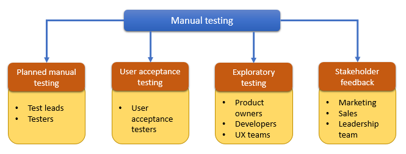
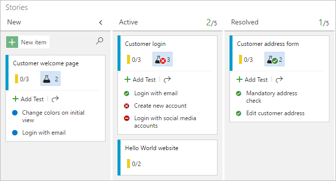
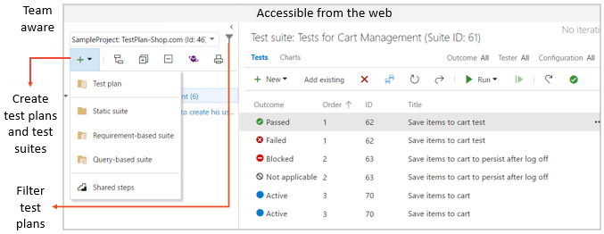
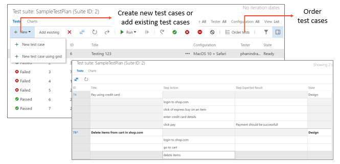
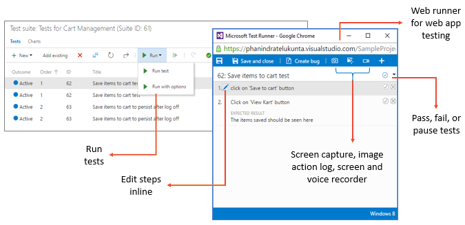
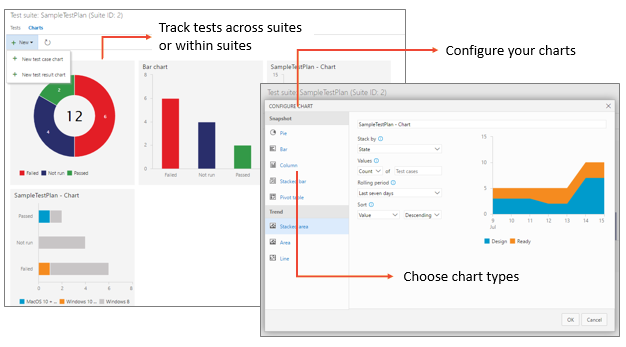
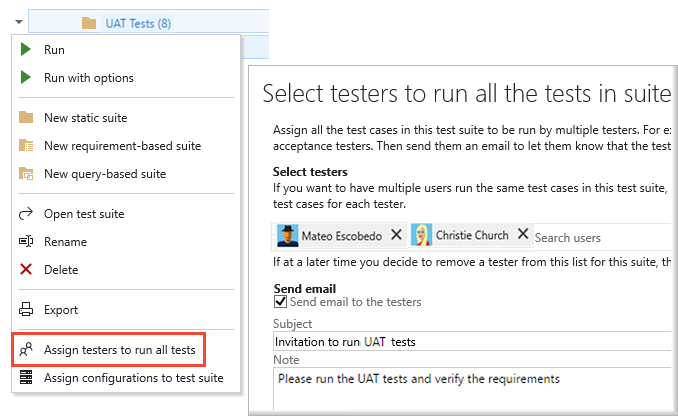
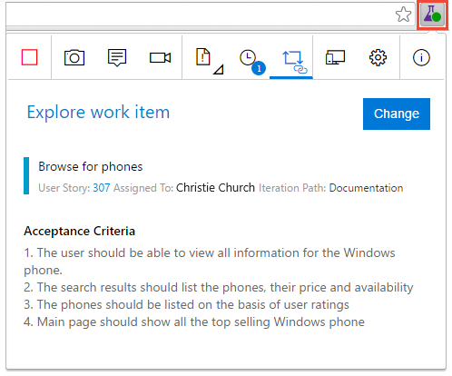
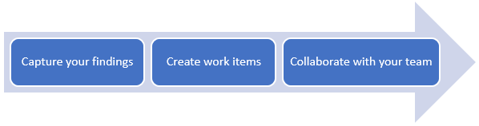
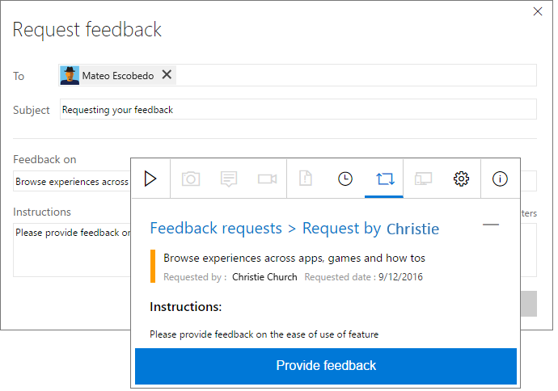

# Exploratory and manual testing scenarios and capabilities

[!INCLUDE [version-header](_shared/version-header.md)]

Quality is a vital aspect of software systems, and manual testing 
and exploratory testing continue to be an important techniques for maximizing this.
In today's software development processes,
everybody in the team owns quality - including developers, managers, 
product owners, user experience advocates, and more.

Azure DevOps and TFS provide rich and powerful
tools everyone in the team can use to drive quality and collaboration
throughout the development process. The easy-to-use, browser-based 
test management solution provides all the capabilities required for 
planned manual testing, user acceptance testing, exploratory testing,
and gathering feedback from stakeholders.

* **[Planned manual testing](#manual-testing)**. Manual testing by organizing tests into test plans and test suites by designated testers and test leads.

* **[User acceptance testing](#user-acceptance)**. Testing carried out by designated user acceptance testers to verify the value delivered meets customer requirements, while reusing the test artifacts created by engineering teams. 

* **[Exploratory testing](#exploratory-testing)**. Testing carried out by development teams, including developers, testers, UX teams, product owners and more, by exploring the software systems without using test plans or test suites. 

* **[Stakeholder feedback](#stakeholder-feedback)**. Testing carried out by stakeholders outside the development team, such as users from marketing and sales divisions.  

  
&nbsp; &nbsp; **Holistic approach to manual testing, types of manual testing, and personas involved**

[!INCLUDE [feature-availability](_shared/feature-availability.md)] 

## Planned manual testing

Manual testing has evolved with the software development process
into a more agile-based approach. Azure DevOps and TFS integrate manual testing into your agile processes; the team
can begin manual testing right from their Kanban boards in the Work
hub. Teams that need more advanced capabilities can use the Test
hub for all their test management needs.

### Manual testing from the Kanban board

Get started with manual testing easily using the Kanban board in 
the Work hub. Add, view, and interact with test cases directly
from the cards on the Kanban board, and then progressively monitor
status directly from the card. Developers and testers can use these
rich capabilities to simplify maximizing quality within their teams.
In Azure DevOps, you need just [Basic access](../organizations/billing/buy-basic-access-add-users.md)
to use these features. See more at [Add, run, and update inline tests](../boards/boards/add-run-update-tests.md?toc=/azure/devops/test/toc.json&bc=/azure/devops/test/breadcrumb/toc.json).

### Manual testing in Test Manager

[!INCLUDE [test-hub-include](_shared/test-hub-include.md)] provides
a rich test management solution for teams that need advanced manual
testing capabilities. It includes all the capabilities
required for the testing lifecycle - including test planning, authoring,
execution, and tracking. Get started using the advanced manual 
testing features with the
[Test Manager extension for Azure Test Plans](https://marketplace.visualstudio.com/items?itemName=ms.vss-testmanager-web).

#### Test planning

Create and manage test plans and test suites for your teams with ease.
Create static suites, requirement-based suites, or query-based suites.
Export and share the test plans and test suites with your team.
See more at [Create test plans](create-a-test-plan.md)

#### Test authoring

Create multiple test cases in one operation, or easily add existing
test cases to a test suite. Assign single or multiple testers to 
execute the tests. View test results and references to a test case
across test suites. See more at [Create test cases](create-test-cases.md).

#### Testing applications

[!INCLUDE [test-hub-include](_shared/test-hub-include.md)] provides
test runners to run tests for your web and desktop applications. Mark test steps and test outcomes as pass or fail, and collect
diagnostic data such as system information, image action logs, screen recordings, and screen captures as you test. Bugs filed during the tests automatically include all the captured diagnostic data
to help your developers reproduce the issues. See more at [Run tests for web apps](run-manual-tests.md#run-web) and [Run tests for desktop apps](run-manual-tests.md#run-desktop).

#### Test tracking

Quickly configure lightweight charts to track your manual test results
using the chart types of your choice, and pin the charts to your dashboard to
easily analyze these results. Choose a retention policy to control how
long your manual testing results are retained.
See more at [Track test status](track-test-status.md).

## User acceptance testing

User acceptance testing (UAT) is a key factor in software development
that ensures the value requested by customers is being delivered
by the engineering team. Azure DevOps and TFS
include capabilities and tools to manage user acceptance testing.
Quickly create UAT plans and suites, and invite multiple testers to
execute these tests using test artifacts provided by the engineering team.
Easily monitor UAT progress and results using lightweight charts.
See more at [User acceptance testing](user-acceptance-testing.md).

## Exploratory testing for everyone

Maximizing quality in modern software development processes is a
shared responsibility between developers, managers, product owners,
user experience teams, and more. Collaborative testing processes and
tools are the key factors in driving quality in these scenarios.

The [Test &amp; Feedback extension](perform-exploratory-tests.md)
is a simple browser-based extension you can use to test web apps 
anytime and anywhere, and is simple enough for everyone in the team to use.
It helps to improve productivity by allowing you to spend more time
finding issues, and less time filing them.

Using the extension is a simple, three step process:

 
* **Capture your findings** quickly and easily using the tools in the extension. 
  Capture notes, screenshots with annotations, and screen recordings 
  to describe your findings and highlight issues. Additionally, in 
  the background the extension automatically captures rich data such
  as user actions as an image action log, page load data,
  and system information about the browser, operating system, memory,
  and more that can serve as a starting point for debugging. 

* **Create work items** such as bugs, tasks, and test cases directly from 
  the extension. The captured findings automatically become a part of the work item. 
  Users can file a bug to report an issue with the product, or create a task that
  indicates a new work requirement. The extension can also be used to 
  create test cases for scenarios discovered during exploration. 

* **Collaborate with your team** by sharing your findings. 
  Export your session report in Standalone mode, or connect to Azure DevOps or
  Team Foundation Server (2015 or later) for a fully integrated experience
  including exploring user stories and backlog items, simplified tracking and triaging of 
  bugs and tasks, and managing feedback requests in one place.

As users perform exploratory testing, you can
[get insights from the sessions](insights-exploratory-testing.md) in [!INCLUDE [test-hub-include-nolink](_shared/test-hub-include-nolink.md)] of 
Azure DevOps or TFS. View completed exploratory sessions and derive meaningful
insights across all the sessions. Get end-to-end traceability such as a breakdown 
of the work items created, the work items explored and not explored, session owners,
and more.

## Stakeholder feedback

Seeking feedback from stakeholders outside the development team, such
as marketing and sales teams, is vital to develop good quality software.
Using Azure DevOps and TFS, developers can request
feedback on their user stories and features. Stakeholders can respond
to feedback requests using the browser-based Test &amp; Feedback extension -
not just to rate and send comments, but also by capturing rich diagnostic
data and filing bugs and tasks directly.
See more at [Request stakeholder feedback](request-stakeholder-feedback.md) 
and [Provide stakeholder feedback](provide-stakeholder-feedback.md).

## Key benefits

* **Test on any platform**. With [!INCLUDE [test-hub-include](_shared/test-hub-include.md)], you can use your browser to access all the manual testing capabilities. It enables you to [create](create-test-cases.md) and [run manual tests](run-manual-tests.md) through an easy-to-use, web-based interface that can be accessed from all major browsers on any platform.

* **Rich Diagnostic data collection**. Using the web-based Test Runner and Test Runner client you can [collect rich diagnostic data](collect-diagnostic-data.md) during your tests. This includes screenshots, an image action log, screen recordings, code coverage, IntelliTrace traces, and test impact data for your apps under test. This data is automatically included in all the bugs you create during test, making it easy for developers to reproduce the issues.

* **End to End Traceability**. Azure DevOps and TFS provide [end-to-end traceability of your requirements, builds, tests and bugs](../boards/queries/link-work-items-support-traceability.md?toc=/azure/devops/test/toc.json&bc=/azure/devops/test/breadcrumb/toc.json). Users can track their requirement quality from cards on the Kanban board. Bugs created while testing are automatically linked to the requirements and builds being tested, which helps you track the quality of the requirements or builds.

* **Extensible platform**. You can combine the tools and technologies you already know with the development tools that work best for you to integrate with and [extend Azure DevOps and TFS](../integrate/index.md). Use the REST APIs and contribution model available for the Test platform to create extensions that provide the experience you need for your test management lifecycle.

## Additional resources

* [Get started with manual testing](../boards/boards/add-run-update-tests.md?toc=/azure/devops/test/toc.json&bc=/azure/devops/test/breadcrumb/toc.json)
* [Advanced manual testing techniques](user-acceptance-testing.md)
* [Get started with exploratory testing](perform-exploratory-tests.md)
* [Advanced exploratory testing techniques](explore-workitems-exploratory-testing.md)
* [Get stakeholder feedback with exploratory testing](request-stakeholder-feedback.md)

> See also [Continuous testing](../pipelines/index.md), [Unit testing](https://docs.microsoft.com/visualstudio/test/developer-testing-scenarios).

[!INCLUDE [help-and-support-footer](_shared/help-and-support-footer.md)] 
