[!INCLUDE [version-header-vs-ts](../../_shared/version-header-vs-ts.md)]

<a name="cloudloadtest"></a>
# Load test your app in the cloud using Visual Studio

Check your app or web site's performance before you launch it or deploy updates to production.
Find problems before your customers do. Start running 
[cloud-based load tests](https://www.visualstudio.com/features/vso-cloud-load-testing-vs) 
in almost no time with Visual Studio and Team Services.

> This example shows how to execute a load test using Visual 
Studio. You can also run cloud-based load tests directly using your 
[Team Services portal](get-started-simple-cloud-load-test.md).
If you prefer to run your tests in a local environment rather
than in the cloud, see [Use a lab environment for your devops](https://docs.microsoft.com/visualstudio/test/lab-management/using-a-lab-environment-for-your-application-lifecycle).

In this example, you'll learn how to:

* [Prepare your environment](#LoadTestVSIDE)
* [Get the sample load test project](#article10)
* [Connect to your Visual Studio Team Services account](#ConnectVSOnline)
* [Run and analyze your load test](#article14)


<a name="LoadTestVSIDE"></a>
## Prepare your environment

* [Download and install Visual Studio Enterprise](https://www.visualstudio.com/downloads/download-visual-studio-vs), 
  if you don't already have it.

* [Create your Team Services account](https://www.visualstudio.com/products/visual-studio-team-services-vs), 
  if you don't have one already. You can have any access 
  level assigned do you in Visual Studio Team Services 
  when you use Visual Studio Enterprise to run load tests.

* If you don't have a load test project, 
  use our sample load test project with your web site or app. 
  Just provide the address for the web site that you want to test. 
  Or, if you have a load test project, jump ahead to 
  [set up your load test project](#article14) to run load tests 
  in Visual Studio Team Services.

<a name="article10"></a>
## Get the sample load test project

1.  [Download the sample load test project](https://code.msdn.microsoft.com/Getting-started-with-17a52e95), 
   unblock the zip file in its **Properties** dialog,
   and unzip the files into a local folder on your computer.

1.  Open the **GettingStartedWithLoadTesting.sln** solution
   in Visual Studio Enterprise.

1.  Open the **SampleWebTest.webtest** file. 
   Replace the URL with the URL of your app's web page.

   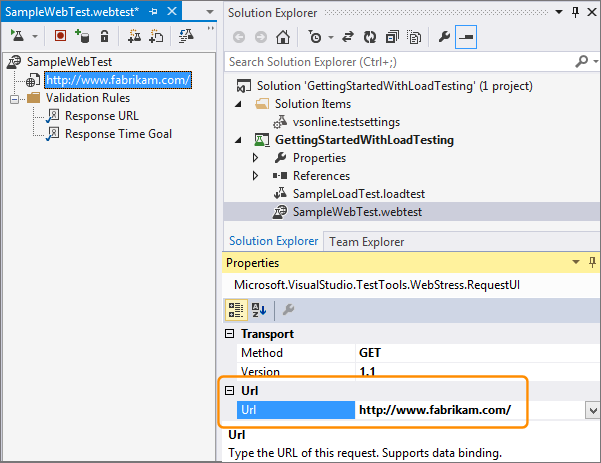

<a name="ConnectVSOnline"></a>
## Connect to your Visual Studio Team Services account

Before you can run load tests in the cloud, 
connect Visual Studio to your Team Services account.

1. If you haven't already, [sign up for a Visual Studio Team Services account](https://go.microsoft.com/fwlink/?LinkId=309297&clcid=0x409&slcid=0x409). 
   Learn more about 
   [signing up for Visual Studio Team Services](https://www.visualstudio.com/products/visual-studio-team-services-vs).

1. In Team Explorer, connect to your Team Services account.

   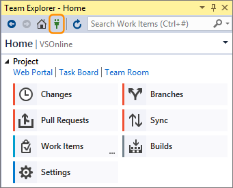

1. Connect to one of your team projects.
 
   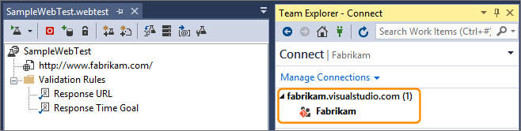

   - If you haven't connected to your Team Services 
     account before, add your account to the server list.

     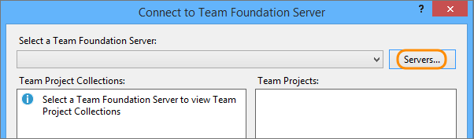

   - Enter your Team Services account name 
     (```{youraccount}.visualstudio.com```).

     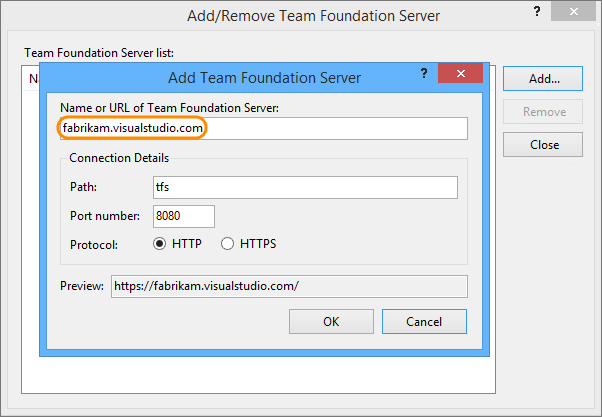

   - If you're prompted to sign in to Team Services, do that.

1. Select your Team Services account from the list, 
   then choose your team project. Now you can connect.
    
   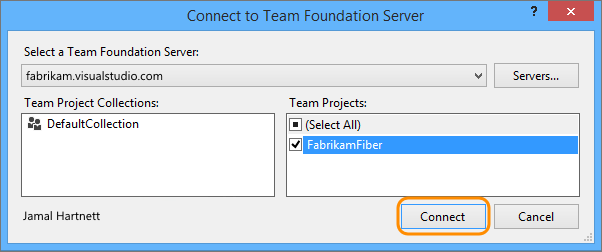

<a name="article14"></a>
## Run and analyze your load test

1. In Solution Explorer, open the load test that you want to run.

   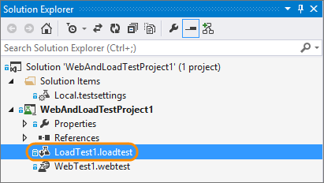

1. To run your test closer to where your users are,
   select a location closer to your users. 

   

   

1. Now run your load test. This will run in the cloud 
   using Team Services.

   

   Your test appears in the queue and waits for its turn to run. 
   When Team Services is ready to run your test, the test status 
   changes to "Acquiring resources".

   

   A large test run might take up to 10 minutes while 
   Team Services sets up virtual machines and agents for you.

1. You can watch your app's performance while the test runs. 
   Look at the details to review errors, warnings, or other information 
   about your test.

   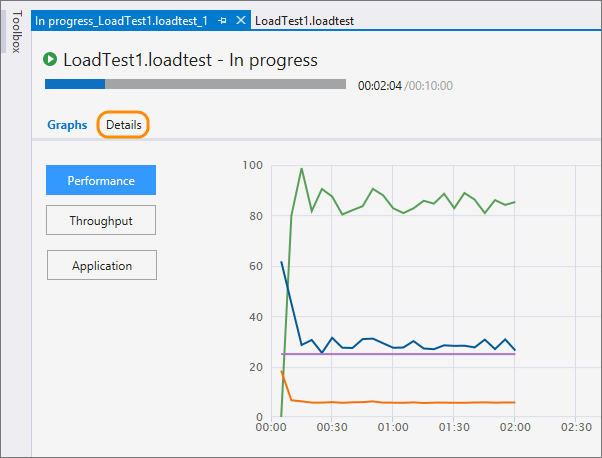

1. When the test is done, download the report to view the results.

   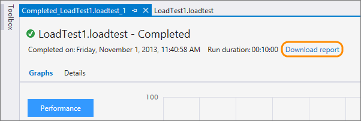

   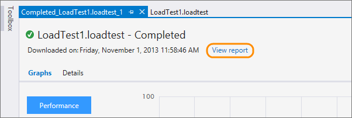

   The results include performance counter data, threshold violations, and error information.

1. Review your test's details. Find the number of users where your 
   app's performance fails to meet your requirements by examining the 
   step load pattern for virtual users.

   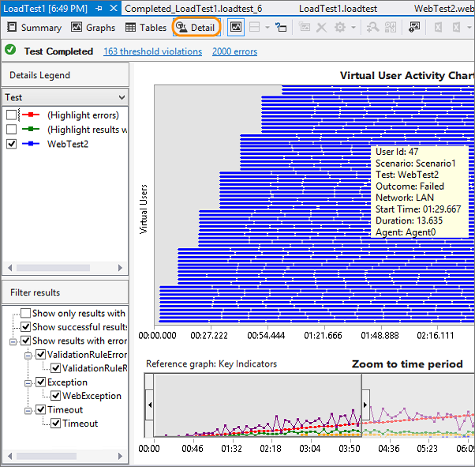

1. Fix any performance issues that you find in your app's code, 
   then rerun the test. 

1. To [simulate real-world loads](https://msdn.microsoft.com/library/ff406975%28v=vs.140%29.aspx) 
   more closely, you can refine your test by specifying web performance 
   test properties, load test scenario properties, and run settings properties.

## Next steps

* [Add app performance data](get-performance-data-for-load-tests.md)
* [View and compare results](performance-reports.md) 
* [Run Apache JMeter load tests](get-started-jmeter-test.md) 
* [Record and replay tests](record-and-replay-cloud-load-tests.md)
* [Profile live Azure web apps with Application Insights](https://docs.microsoft.com/en-us/azure/application-insights/app-insights-profiler)

## See also

* [Q &amp; A for load testing](../reference-qa.md)
* [Load test with Team Services](get-started-simple-cloud-load-test.md) 
* [Load test with Azure portal](../app-service-web-app-performance-test.md) 
* [Tutorial: Run load tests before release](../run-performance-tests-app-before-release.md) 
* [Run Apache JMeter load tests with Visual Studio Team Services](get-started-jmeter-test.md)
* [Analyze load test results using the Load Test Analyzer](https://msdn.microsoft.com/library/ee923686.aspx)

[!INCLUDE [help-and-support-footer](../../_shared/help-and-support-footer.md)] 
