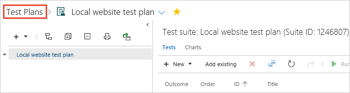
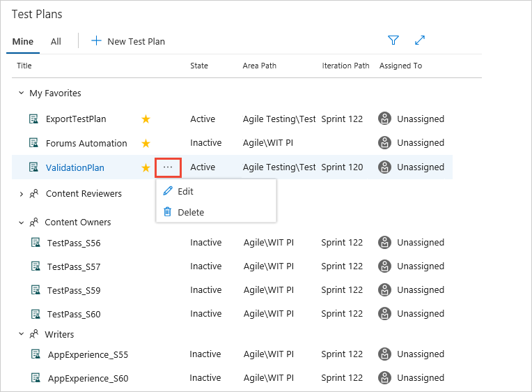
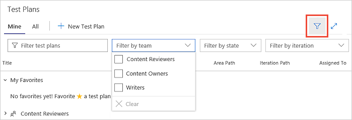
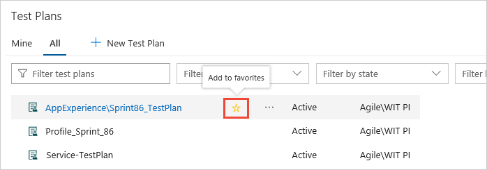
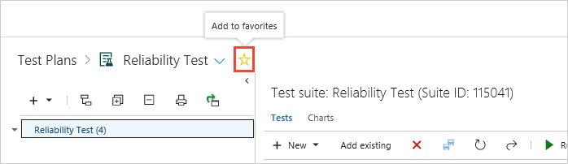

# New test plans view

[!INCLUDE [version-header-devops-services](../_shared/version-header-devops-services.md)] 

A new and fully redesigned user experience is available for test plans in Azure DevOps.
To use this page, you simply need to switch it on using one of the on-screen prompts,
or from the [user profile **Previews** panel](../../project/navigation/preview-features.md#enable-features-for-your-use).

[!INCLUDE [feature-availability](../_shared/feature-availability.md)] 

In [!INCLUDE [test-hub-include](../_shared/test-hub-include.md)], choose the **Test plans** link to access the new test plans view.

## The "Mine" page

The **Mine** page shows a list of test plans that are of interest to you.
This includes plans for teams you are a member of, and test plans you have marked as favorites.
You can expand and hide the plans for each team to make it easier to locate or review specific team plans.
Use the shortcut menu to edit or delete the selected plan.

Show the filter controls to help you find plans if you have a large number of plans in the list.
Filter the plans by name, team, state, or iteration. 

## The "All" page

The **All** page shows a list of all test plans.
Filter test plans, and edit and delete plans using the shortcut menu, in the same way as in the **Mine** page.
Use this page to add any test plan to your favorites list. 

You can also add a plan to your favorites list while you are viewing it.

[!INCLUDE [help-and-support-footer](../_shared/help-and-support-footer.md)] 
