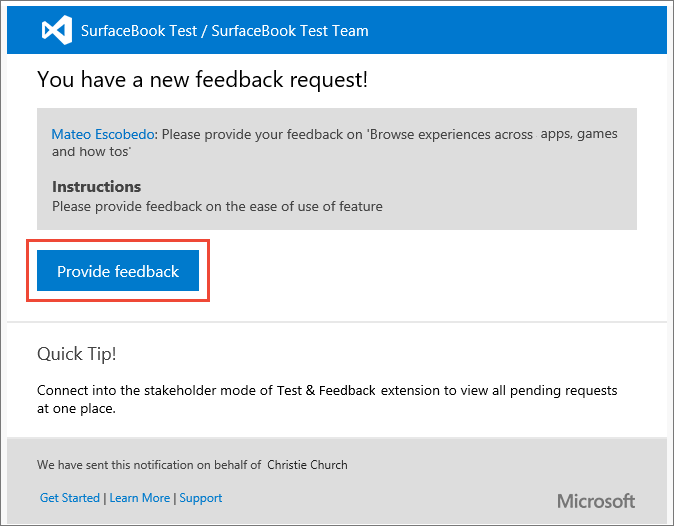
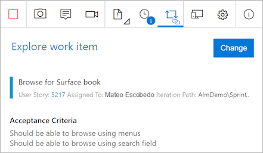
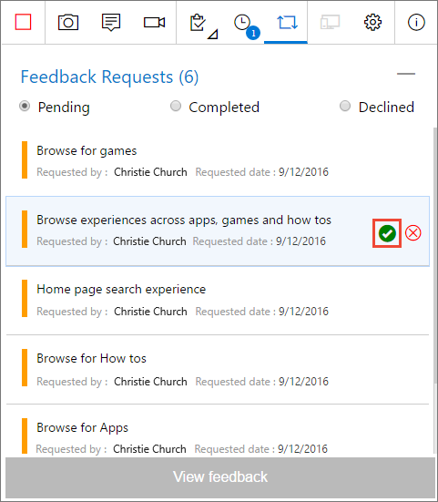
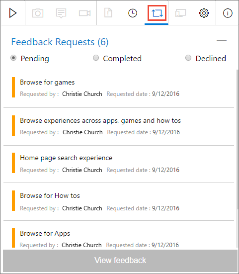
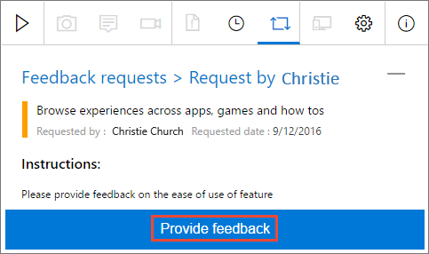

# Provide feedback using the Test & Feedback extension
 
[!INCLUDE [version-lt-eq-azure-devops](../includes/version-lt-eq-azure-devops.md)] 

Stakeholders and other users can respond to feedback requests using the Test & Feedback extension in the following ways:

* [Respond from the link in a feedback request email](#email)
* [Respond directly from the Test & Feedback extension](#direct) 

[!INCLUDE [important-note-request-feedback-unavailable](includes/important-note-request-feedback-unavailable.md)]

## Prerequisites

Ensure you have the [Test & Feedback extension](perform-exploratory-tests.md) installed. 

> [!NOTE]   
> Any user with a Stakeholder access can use the Test & Feedback extension in **Stakeholder** mode. This mode is designed to allow the widest possible range of users to assist test teams by providing feedback.

## Provide feedback directly from a feedback request email

1. In the feedback request email, select **Provide feedback**. 
 
   

   The Azure DevOps landing page opens to confirm that the extension is automatically configured with the feedback request. 
   
2. Choose the  icon in the toolbar to launch the extension.

   

   If you're a **Stakeholder**, the **Feedback requests** page is visible. 
   Read the instructions (if any) in the feedback form to understand how to give the feedback and what the requestor requires. 

   

   If you're a **Basic** user, the **Explore work item** traceability page shows details of the user story on which feedback was requested, and the user acceptance criteria (if any).  

   

3. Read any instructions in the email and this page to understand how to give the feedback, and on which feature.
   

4. Open the application you need to provide feedback on and begin your feedback. For example, select **Capture screenshot** to take a screenshot.
 
   

   You can use all the capabilities of the extension such as capturing screenshots, notes, and screen recordings. For more information, see [Exploratory testing in connected mode](connected-mode-exploratory-testing.md).
 
5. When you're done capturing feedback, do the following actions:

   * If you're a **Stakeholder**, select **Provide feedback**. You can optionally choose to create bugs and tasks when you submit your feedback. The process is the same as described in [Exploratory testing in connected mode](connected-mode-exploratory-testing.md#create-bugs).

   

   
   * If you're a **Basic** user, create a bug or a task. 

   
 
6. All your feedback shows in the response form, bug, or task. Enter a suitable title and optionally select a star rating for the feature you've been testing. 

   

7. Save your feedback, which creates a work item in Azure DevOps containing all your feedback.
 
8. Continue to capture more feedback if necessary. You can submit multiple feedback responses, bugs, and tasks for the same feedback request. 

9. If you're a **Stakeholder**:
   
   * When you're done providing feedback, go to the **Feedback
     requests** page and choose **Feedback requests**.

     

   * In the pending feedback requests page, mark the feedback request as **Completed**.
 
     

10. **Stop** your feedback session. 
     
   

## Provide feedback directly from the Test & Feedback extension

1. Open the Test & Feedback extension in your browser using the  icon in the toolbar. 

2. From the **Connection settings** page, select **Connected** mode.
 
   
 
3. Connect to the server and the project or team that is requesting feedback.
 
   
  
4. Open the **Feedback requests** page to see all your feedback requests
   from the project or team you connected to. 

   
 
5. Select the feedback request you want to respond to and choose 
   **View feedback**. 

   

6. Read the instructions in the feedback request details page, then
   choose **Provide feedback**.

   
 
7. Capture and submit your feedback as [previously shown](#capture-feedback).

## Related articles

* [Exploratory test and submit feedback directly from your browser](perform-exploratory-tests.md)
* [Overview of manual and exploratory testing](index.yml)
