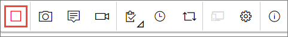

# Provide feedback using the Test &amp; Feedback extension
 
[!INCLUDE [feedback-header-text](_shared/feedback-header-text.md)] 

Stakeholders and other users can respond to feedback requests using the 
Test &amp; Feedback extension in two ways:

* [From the link in a feedback request email](#email)
* [Directly from the Test &amp; Feedback extension](#direct) 

Before you start, ensure you have installed the 
[Test &amp; Feedback extension](perform-exploratory-tests.md). 
This is required in order to respond to feedback requests.

>Any user with a Stakeholder access can use the
Test &amp; Feedback extension in **Stakeholder** mode. This
mode is designed to allow the widest possible range of users
to assist test teams by providing feedback.

## Provide feedback directly from a feedback request email

1. Open the feedback request email and choose the 
   **Provide feedback** link. 
 
   

1. The Azure DevOps or TFS landing page opens to confirm
   that the extension has been automatically configured with 
   the feedback request. Choose the 
   icon in the toolbar to launch the extension.

   

   If you are a **Stakeholder**, you see the **Feedback requests** page. 
   Read the instructions (if any) in the feedback form to 
   understand how to give the feedback and what the requestor 
   requires. 

   

   If you are a **Basic** user, you see the **Explore work item** traceability
   page showing details of the user story on which feedback was requested,
   and the user acceptance criteria (if any).  

   

1. Read any instructions in the email and this page
   to understand how to give the feedback, and on what feature.
   
   
1. Open the application you need to provide feedback on
   and begin your feedback. For example, choose 
   **Capture screenshot** to take a screenshot.
 
   

   You can use all the capabilities of the extension
   such as capturing screenshots, notes, and screen recordings.
   For more details, see [this topic](connected-mode-exploratory-testing.md). 

   >Some browsers may not provide all the capture capabilities.
   See [Which web browsers does the extension support?](reference-qa.md#browser-support) 
 
1. When you are done capturing feedback:

   * If you are a **Stakeholder**, choose **Provide feedback**.
     You can optionally choose to create bugs and tasks when you 
     submit your feedback. The process is the same as described in 
     [this topic](connected-mode-exploratory-testing.md#create-bugs).

     

     
   * If you are a **Basic** user, create a bug or a task. 

     
 
1. All your feedback captured is shown in the response form, bug, or task. 
   Type a suitable title and, optionally, select a star rating for 
   the feature you've been testing. 

   

1. Save your feedback. This create a work item in Azure DevOps
   or TFS containing all your feedback.
 
1. Continue to capture more feedback if required. You can submit 
   multiple feedback responses, bugs, and tasks for the same feedback request. 

1. If you are a **Stakeholder**:
   
   * When you are done providing feedback, go to the **Feedback
     requests** page and choose **Feedback requests**.

     

   * In the pending feedback requests page, mark the feedback request as **Completed**.
 
     

1. Choose the **Stop** icon to end your feedback session. 
     
   

## Provide feedback directly from the Test &amp; Feedback extension

1. Open the Test &amp; Feedback extension in your browser using the
   
   icon in the toolbar. 

1. In the **Connection settings** page, choose **Connected** mode.
 
   
 
1. Connect to the server and the project or team that is requesting feedback.
 
   
  
1. Open the **Feedback requests** page to see all your feedback requests
   from the project or team you connected to. 

   
 
1. Select the feedback request you want to respond to and choose 
   **View feedback**. 

   

1. Read the instructions in the feedback request details page, then
   choose **Provide feedback**.

   
 
1. Capture and submit your feedback as [shown above](#capture-feedback).

## See also

* [Request stakeholder feedback using the Test &amp; Feedback extension](request-stakeholder-feedback.md#request)
* [Voluntary stakeholder feedback using the Test &amp; Feedback extension](voluntary-stakeholder-feedback.md#voluntary)
* [Track stakeholder feedback using the Test &amp; Feedback extension](track-stakeholder-feedback.md#track)
* [Exploratory test and submit feedback directly from your browser](perform-exploratory-tests.md)
* [Overview of manual and exploratory testing](index.md)

[!INCLUDE [help-and-support-footer](_shared/help-and-support-footer.md)] 
