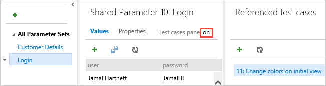

# FAQs for manual testing

[!INCLUDE [version-inc-vs-all](_shared/version-inc-vs-all.md)] 

## Creating manual test plans

[Go to related topic &gt;](create-a-test-plan.md)

### Q: Can I rename my test plan?

**A:** Yes, open the test plan from the shortcut menu and rename it.

### Q: Can I permanently delete my test plan?

**A:** Yes, do this from the shortcut menu for the test plan.

See also [Delete test artifacts](../boards/backlogs/delete-test-artifacts.md)

### Q: Can I group and reorder my requirement-based test suites together?

**A:** Yes, you can create a static test suite that can 
contain any type of test suites - just like folders. 
Drag test suites to group them in a static test plan.
Drag and drop tests to reorder them.

### Q: What are query-based test suites ?

**A:** Use a query to group together test cases that have a particular characteristic, 
for example, all tests that have Priority=1. The suite will automatically include 
every test case that is returned by the query that you define.

### Q: Can I copy or clone test plans and test suites?

**A:** Yes. For test plans, use [this API](https://docs.microsoft.com/rest/api/azure/devops/testplan/test%20plan%20clone/clone%20test%20plan?view=azure-devops-rest-5.1). For test suites, use [this API](https://docs.microsoft.com/rest/api/azure/devops/testplan/test%20suite%20clone?view=azure-devops-rest-5.1). We plan to expose these capabilities through the out-of-box UI in a future release.

### Q: Can I export the test plan to share or review offline?

**A:** Yes, you can export test plans, test suites, and test cases. Select the details 
that you want in the report. Then email or print this report for review.

Change the test case fields in the report by adding or removing columns from 
the list view of the test suite.

### Q: When I export a test plan, can I just view the data or copy it to a Word document?

**A:** Yes, choose Print in the Export dialog box, then choose Cancel in the Print dialog box. 
This displays the data in the report. Select all the text, then copy and paste it 
into a Word document, if you want. All the formatting in the report is retained.

### Q: When I export a test plan, can I customize the report?

**A:** You can only do this if you are using an on-premises Team Foundation Server. 
You can [edit the XSLT file](https://msdn.microsoft.com/library/dd380763.aspx#XSLT).

### Q: Can I track changes to test plans and test suites that I create with Azure DevOps?

**A:** Yes, you can track changes to test plans and test suites. Open the work item 
for the test plan or test suite, then view the work item history.

For test suites, other actions are tracked in the Test Suite Audit field. 
For example, adding and removing test cases from a test suite are tracked in this field.

*****

## Creating manual test cases

[Go to related topic &gt;](create-test-cases.md)

### Q: Can I rename or permanently delete test cases?

**A:** Yes. Open the test case from its shortcut menu.

Then rename it.

Or permanently delete it.

See also [Delete test artifacts](../boards/backlogs/delete-test-artifacts.md)

### Q: Can I add an extra line to a test step?

**A:** Yes, press Shift+Enter in the action or expected 
results field to add an extra line.

### Q: How do I insert a test step into a test case?

**A:** Select a test step. Press Alt+P to insert a new test step 
above the selected step.

### Q: Is there a way to quickly add multiple test cases at the same time?

**A:** Yes, use the grid view when you add test cases to 
the test suite.

On the grid shortcut menu, you can add, delete, or clear rows.

Switch between Grid and List views using the View menu at the right of the window.

> **Note**: Do not use the Team plugin for Excel to add or update test case work items.
  Excel cannot parse the format used to store test steps, and in some cases
  this may affect the formatting of the test case work items. 

### Q: Can I bulk edit multiple test cases?

**A:** Yes, switch the view from List to Grid. The grid shows 
all the test cases for the current test suite and all the 
test steps for those cases. This is a helpful view if you 
want to review your test cases with other team members. 
When you review, you can update and add new test cases.

Or, you can filter and sort the test cases in list view. Then select 
just the ones that you want to bulk edit using the grid.

To return to the test suite view, switch the view 
from Grid back to List.

### Q: Can I copy test cases and test steps from an existing Excel worksheet?

**A:** Yes, copy the columns from Excel that you want to use for 
the title, action, and expected results fields. No column 
formatting, other than multiline, is copied from the
worksheet. Paste these columns into the grid view, 
edit if necessary, and save them. (This is supported only with 
Internet Explorer and Chrome browsers.)

### Q: Can I copy test cases from the grid to an Excel worksheet?

**A:** Yes, copy the data from the grid and paste it into your 
Excel worksheet. No test step formatting, other than multiline, 
is copied into the worksheet. (This is supported only 
with Internet Explorer and Chrome browsers.)

### Q: Can I edit other fields in the grid view?

**A:** Yes, in List view use the column options to select the fields in the test 
case work item.

You can then view and edit these fields when you switch to 
the grid view.

### Q: Can I reorder test cases in a test suite?

**A:** Yes, you can reorder manual test cases in static suites, 
requirement-based suites, and query-based suites. Choose 
**Order tests** on the tool bar, then drag and drop one or more tests.
Or open the shortcut menu for a test to move it to the top or to another
position. After reordering the tests, you can sort them by the 
**Order** field and then run them in that order with the web runner. 

### Q: Can I tag test cases so that I can see only tests with specific tags?

**A:** Yes, you can tag test cases in a suite with any tag that 
you want. For example, tag all the tests related to login so that 
you can rerun these tests if a bug is fixed for the login page. 
Then you can filter on that tag from [!INCLUDE [test-hub-include](_shared/test-hub-include.md)]. 

You can add and edit tags when you edit a test case, or bulk edit tags 
in the grid view. You can also create suites based on queries when
you use tags.

], on the Test Plans page, choose or add tags from the test case pane](_img/create-test-cases/TestHubTags.png)

### Q: Can I share test steps between test cases?

**A:** Yes, choose the steps that you want to share. Find out more about 
[sharing test steps](mtm/share-steps-between-test-cases.md).

### Q: Can I add parameters to a test case so it can run multiple times with different data?

**A:** Yes, choose a test step, and then add the parameter. Find out more about
[repeating test steps with different data](repeat-test-with-different-data.md).

### Q: Can I share parameter data between test cases?

**A:** Yes. That way, test cases with the same parameters can run with same data, 
so you get consistent results. To share parameter data, convert your existing
parameters to shared parameters.

After you create a shared parameter set, open another test case, 
and add the shared parameter set to that test case. Find out more about 
[sharing parameters](repeat-test-with-different-data.md#share-parameters-between-test-cases).

Add, edit, and rename your shared parameter sets on the Parameters page. 
In the test cases pane, view the test cases that use those parameters.

Each shared parameter set is a work item. On the Properties page, 
you can view or make changes to this work item. For example, 
you can assign owners and track changes.

### Q: Can I import parameter values from an Excel spreadsheet to my shared parameter sets?

**A:** Yes, copy the data from your Excel spreadsheet and paste it into your 
shared parameters grid. You can also copy the data from your grid back 
into Excel, if necessary.

### Q: How can I find out if a test case was added to other test suites?

**A:** Select a test case, then view the test suites details. The Associated
test suites pane shows you any test suite for any test plan that contains 
this test case. This includes all projects. 

Click the associated test suite to view it. To view the project and the test 
plan for that test suite, move your pointer over the test suite.

 

### Q: What happens when I delete a test case from a requirement-based test suite?

**A:** The test case still exists in your project, but the 
test case is removed from the test suite. Also, it's no 
longer linked to the backlog item for that test suite.

### Q: Why do I see the wrong test suite and tests when I click 'View Tests' from the notification email about tests that are assigned to me?

**A:** This might happen if you were prompted to enter sign-in 
credentials for Azure DevOps when you clicked this link. 
Without signing out of Azure DevOps, click 'View Tests' 
again to see the correct test suite and tests.

*****

## Running manual tests

[Go to related topic &gt;](run-manual-tests.md)

### Q: How do I rerun a test?

**A:** Just select any test and choose **Run**.

### Q: Can I run all the tests in a test suite together?

**A:** Yes, select a test suite and choose **Run**. This runs all the active 
tests in the test suite. If you haven't run a test yet, its state 
is active. You can reset the state of a test to active if you want to rerun it.  

### Q: Can I choose a build to run tests against?

**A:** Yes, Choose **Run** and then select **Run with options**.

 

Select the build you want from the drop-down list.

 

Any bug filed during the run will automatically be associated 
with the selected build, and the test outcome will be published
against that build.

### Q: Can I fix my test steps while I'm running a test?

**A:** Yes, if you have the Test Manager for Azure DevOps. 
You can insert, move, or delete steps. 
Or you can edit the text itself. Use the edit icon next to the test 
step number to do this.
    
 

The tool to edit the test steps is shown.
    
 

### Q: Can I add a screenshot to the test results when I am running a test?

**A:** If you are using Google Chrome or Firefox, you can use 
the web runner to take screenshots of the web 
app while testing. For Microsoft Internet Explorer or Microsoft Edge browsers,
or for desktop app testing, you can download and use the [Test Runner desktop client](https://aka.ms/ATPTestRunnerDownload).

 

For more information, see [Collect diagnostic data](collect-diagnostic-data.md#web-screenshot).

### Q: Can I capture my actions on the app as a log?

**A:** If you are using Google Chrome or Firefox, you can use 
the web runner capture your actions on the web 
app as image logs while testing. For Microsoft Internet Explorer or Microsoft Edge browsers,
or for desktop app testing, you can download and use the [Test Runner desktop client](https://aka.ms/ATPTestRunnerDownload).
 
 

For more information, see [Collect diagnostic data](collect-diagnostic-data.md#web-log).

### Q: Can I capture screen recordings of my app?

**A:** If you are using Google Chrome or Firefox, you can use 
the web runner to capture screen recordings of 
your web and desktop apps while testing. For Microsoft Internet Explorer or Microsoft Edge browsers,
or for desktop app testing, you can download and use the [Test Runner desktop client](https://aka.ms/ATPTestRunnerDownload).

 

For more information, see [Collect diagnostic data](collect-diagnostic-data.md#web-recording).

### Q: How do I control how long I keep my test data?

**A:** [Learn more here](how-long-to-keep-test-results.md).

### Q: Where can I download the Test Runner client?

**A:** The Test Runner desktop client can be downloaded from [here](https://aka.ms/ATPTestRunnerDownload).

### Q: What are the supported operating systems for the Test Runner client?

**A:** The Test Runner desktop client is currently supported only on Windows. 

### Q: Can I opt out of telemetry for the Test Runner client? 

**A:** No. The Test Runner desktop client does not collect any user-identifiable data and so,
in adherence to the [Microsoft Privacy policy](https://privacy.microsoft.com/en-us/PrivacyStatement),
no opt-out mechanism is provided. 

### Q: Can I run tests offline and then import the results?

**A:** Yes, see the [Offline Test Execution extension](https://marketplace.visualstudio.com/items?itemName=ms-devlabs.OfflineTestExecution).

*****

## Tracking test status

[Go to related topic &gt;](track-test-status.md)

### Q: Can I view the recent test results for an individual test case?

**A:**  Yes, select the test case within a test suite and then 
choose to view the test details pane.

View the recent test results for this test case.

### Q: How is data shown in the charts for test cases that are in multiple test suites?

**A:**  For test case charts, if a test case has been added to 
multiple test suites in a plan then it's only counted once.
For test result charts, each instance of a test that is run 
is counted for each of the test suites separately.

### Q: Who can create charts?

**A:** You need at least a Basic access to create charts.

### Q: How can I edit or delete a chart?

**A:** Select the option you want from the chart's context menu.

### Q: How do I control how long I keep my test data?

**A:** [Learn more here](how-long-to-keep-test-results.md).

*****

<a name="repeatdifferent"><a/>
## Repeating a test with different data

[Go to related topic &gt;](repeat-test-with-different-data.md)

### Q: Are parameters the best way to specify that the test should be run on different operating system platforms? And with different browsers, databases, and so on?

**A**: It's better to use [test configurations](test-different-configurations.md) for that.
With test case parameters, you run the different parameter values one after another, 
which makes it difficult to switch from one platform to another.

### Q: Can I use parameters in shared steps?

**A**: Yes. You set the parameter values in the test cases where you use the shared steps.

### Q: Can I import parameter values from an Excel spreadsheet to my shared parameter sets?

**A**: Yes. Copy the data from your Excel spreadsheet and paste it 
into your shared parameters grid. You can also copy the data from 
your grid back into Excel if you need to.

*****

<a name="manageresults"><a/>
## Managing test results

[Go to related topic &gt;](how-long-to-keep-test-results.md)

### Q: What are the default retention limits?

**A**: For projects created before October 2015, 
Azure DevOps doesn't delete results from automated tests 
and manual tests unless you change the retention limit. 

For new projects created after October 2015, 
Azure DevOps deletes all test results after one year (365 days),
unless you chose to indefinitely retain a build associated with those results. 

### Q: What is the default test retention policy for XAML builds?

**A**: By default, a XAML build pipeline is set up to delete builds older 
than the 10 most recent builds. But related test results aren't automatically
deleted when those builds are deleted. 
[Learn more](https://msdn.microsoft.com/library/ms181716%28v=vs.120%29.aspx). 

### Q: Why isn't test data deleted for XAML builds by default? 

**A**: By default, this is turned off because 10 builds can happen very quickly, 
especially with continuous integration builds. 
Test results are often deleted before you can analyze them. 

### Q: How do I keep a build indefinitely?

**A**: Like this:

*****

<a name="sharesteps"><a/>
## Sharing steps between test cases

[Go to related topic &gt;](mtm/share-steps-between-test-cases.md)

### Q: Can I share steps between test plans and projects?**  

**A:** Yes. But don't forget that if you edit shared steps, the changes appear in every place you use them.  
  
### Q: Can I use parameters in shared steps?**  

**A:** Yes. You provide values for the [parameters](repeat-test-with-different-data.md) in the test cases where the shared steps are used.  
You don't have to provide values in the shared steps definition. However, you can provide one default row of values, which is used when you create an action recording of a standalone shared step.

*****

<a name="tandfext"><a/>
## Test &amp; Feedback extension

[Go to related topic &gt;](perform-exploratory-tests.md)

<a name="browser-support"><a/>
### Q: Which web browsers does the extension support?

**A:** The Test &amp; Feedback extension is currently available for
[Google Chrome](https://www.google.com/chrome/)
and [Mozilla Firefox version 50.0 and higher](https://www.mozilla.org/).
Edge support is planned. 

Some browser versions do not currently support all the features of the Test &amp; Feedback extension.

| Feature | Chrome | Firefox |
| --- | --- | --- |
| Capture screenshots with inline annotations | &nbsp; **Yes** | &nbsp; **Yes** |
| Capture notes | &nbsp; **Yes** | &nbsp; **Yes** |
| Capture screen recordings | &nbsp; **Yes** | &nbsp; **No** |
| Capture page load data | &nbsp; **Yes** | &nbsp; **No** |
| Capture user actions log | &nbsp; **Yes** |&nbsp; **No** |
| Capture system information | &nbsp; **Yes** |&nbsp; **No** |
| Create bugs | &nbsp; **Yes** | &nbsp; **Yes** |
| Create tasks and test cases | &nbsp; **Yes** | &nbsp; **Yes** |
| Create feedback requests | &nbsp; **Yes** | &nbsp; **Yes** |
| Export session report for sharing | &nbsp; **Yes** | &nbsp; **Yes** |
| End-to-end traceability for workitems | &nbsp; **Yes** | &nbsp; **Yes** |
| Simplified bug and task tracking and triaging | &nbsp; **Yes** | &nbsp; **Yes** |
| View and get insights from sessions | &nbsp; **Yes** | &nbsp; **Yes** |
| View similar existing bugs | &nbsp; **Yes** | &nbsp; **Yes** |
| Test app on devices using cloud providers such as Perfecto | &nbsp; **Yes** | &nbsp; **No** |
| Manage feedback requests | &nbsp; **Yes** | &nbsp; **Yes** |

For more details, see 
[Visual Studio Marketplace](https://marketplace.visualstudio.com/items/ms.vss-exploratorytesting-web), Azure DevOps tab.

<a name="recording-playback"><a/>
### Q: How do I play the video recordings I created with the extension?

**A:** The video recordings created by the Test &amp; Feedback extension can be
viewed in [Google Chrome](https://www.google.com/chrome/) browser and in the
[VLC Video Player](http://www.videolan.org/vlc/download-windows.html).

### Q: Does the extension support Team Foundation Server?

**A:** The Test &amp; Feedback extension supports Team Foundation Server 2015 and later. 
All users, including stakeholders, can use the extension in Connected
mode with all the functionality except session insights and the request
and provide feedback flow, which are supported only for TFS 2017.

### Q: Can I edit an existing bug instead of creating a new bug when using the Test &amp; Feedback extension?

**A:** Yes, the extension automatically shows bugs that may be related to the one you are creating
and allows you to add your screenshots, notes, and videos to this existing bug. 
For more details, see [Add findings to existing bugs with exploratory testing](add-to-bugs-exploratory-testing.md).

### Q: On Google Chrome, the mouse offset towards the left makes it difficult to use. Do you have a workaround?

**A:** The workaround is:
1. Navigate to **chrome://flags/#enable-use-zoom-for-dsf** 
2. Search for 'Use Blink's zoom for device scale factor'
3. Change it to **Disabled**

*****

[!INCLUDE [help-and-support-footer](_shared/help-and-support-footer.md)] 
