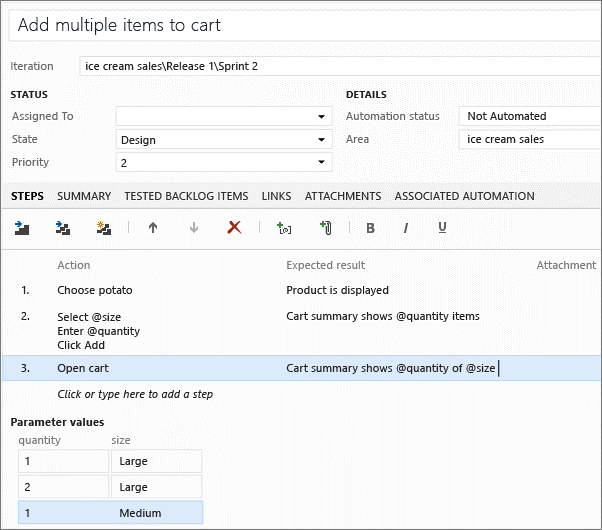
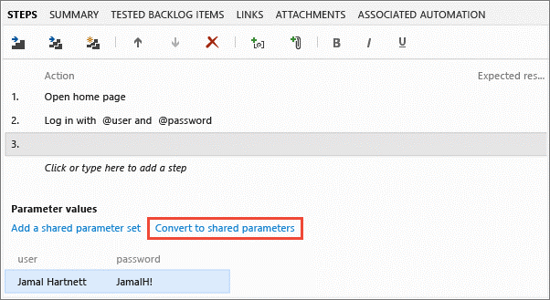
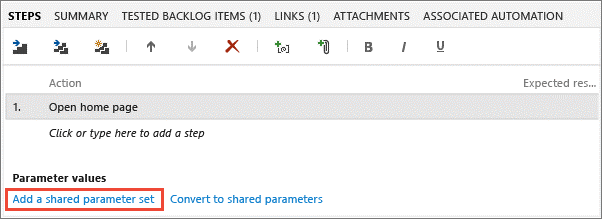
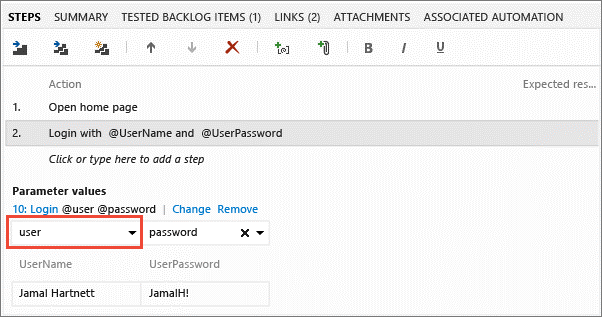
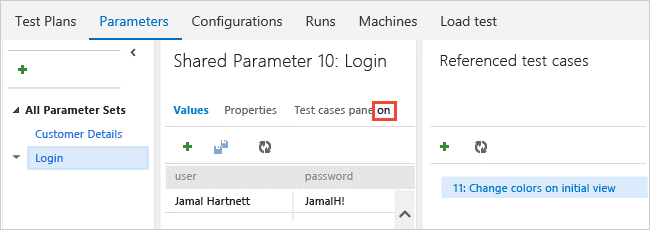
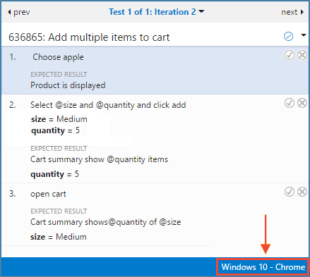
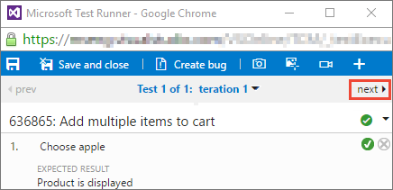
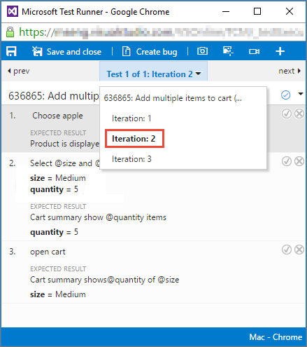
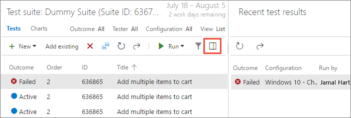
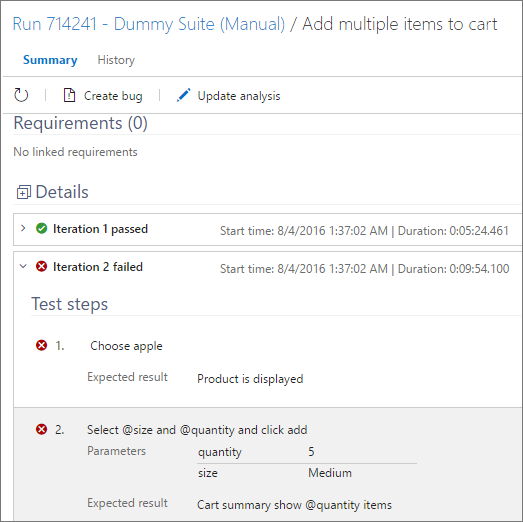

# Repeat a test with different data

[!INCLUDE [version-header](_shared/version-header.md)] 

When you write a [manual test](create-test-cases.md), 
you often want to specify that the test should be repeated several 
times with different test data. For example, if your users can add 
different quantities of a product to a shopping cart, then you want 
to check that a quantity of 200 works just as well as a quantity of 1.

To do this, you insert parameters in your test steps. Along with 
the test steps, you provide a table of parameter values. You can 
also share parameters and their data between test cases when you 
use the web portal with TFS 2015 and later or 
Azure DevOps. That way you can run multiple test cases with the 
same data.

[!INCLUDE [feature-availability](_shared/feature-availability.md)] 

## Add parameters to a test case

1. Create a parameter by typing a name preceded by "**@**" in the 
   actions and expected results of your test steps.

   

1. Underneath the list of steps, add combinations of parameter values. 
   You might need to scroll down to see them.

## Share parameters between test cases

1. Convert existing parameters to shared parameters so that you 
   can use them and the associated data in other test cases.

   
 
1. After you've created a shared parameter set, open another 
   test case and add the shared parameter set to that test case. 
   You can search for the shared parameter set by name.

   
 
   The shared parameter set is displayed in the **Parameter values**
   section after you add it. You can now use these parameters in 
   your test case steps. 
 
1. If the test case has different parameter names for 
   these shared parameters, map the shared parameters to 
   the local parameters to use the shared parameter data.

   
 
   When they are correctly mapped, the data associated with the 
   shared parameter is displayed. 
 
1. Add, edit and rename your shared parameter sets in the 
   **Parameters** page. View the test cases that reference 
   them in the **Test cases** pane.

   
 
1. Each shared parameter set is a work item. Open the **Properties**
   page to view or make changes to this work item. For example, 
   you can assign owners and track changes.

>You can't add more than one shared parameter set to a single test case. If two test cases share similar data, for example, one test case needs
customer ID, name, email, and phone, and the second needs customer ID, name and address, you might consider creating a single shared parameter set
containing all of the parameters - even though a few of the columns in the set will remain unused in each test case. 

## Run a test case with parameters

1. Select a test case with parameters and start it running.
The Test Runner shows the first row of parameter values.
 
   

1. When you've completed the steps, mark the test passed or failed.
   Then go on to the next iteration of the test, which uses the next 
   row of parameter values.  

   

1. Use the drop down to navigate to other iterations.

   

1. If any of the parameter values are incorrect, fix them 
   without canceling the test by choosing **Edit** from step's
   shortcut menu.

## Review the test results 

The outcome of the test is based on a precedence hierarchy of all the iteration outcomes. The hierarchy order is Paused, Failed, Blocked, Passed, Not Applicable and Unspecified (Active). For example, if you marked any iteration as failed and all the rest as passed, the outcome of the entire test is shown as failed. This is different from test cases that do not have parameters, where the outcome displays the status of the last run.

1. Check the test result by opening the details pane.

   
 
1. Double-click a test result to view the test run details, 
   and the test results for each iteration.

   
 
## Speed up test iterations by using record and playback

It can be error-prone and tedious to work through a long table of 
parameter combinations. To speed things up, create an action 
recording when you run the test with the first set of parameter 
values, and then play it back for the other sets.

1. Use Microsoft Test Manager to [run the test](run-manual-tests.md).

1. Select **Create action recording** before you choose **Start**.

1. Complete the first test iteration and then move on to the next one.

1. Mark each step as passed or failed as you work. Enter parameter 
   values in the application exactly as they are displayed in the test script.

1. Choose **Play** to run the test with the next set of parameter values. 
   Your actions will be played back automatically, but you must still 
   verify the results. 

Record and playback doesn't work with all applications. For details, see 
[Supported Configurations and Platforms for Coded UI Tests and Action Recordings](/visualstudio/test/supported-configurations-and-platforms-for-coded-ui-tests-and-action-recordings).

## See also

* [FAQs for manual testing](reference-qa.md#repeatdifferent)
* [Overview of manual and exploratory testing](index.md)
* [Testing different configurations](test-different-configurations.md)
* [Collect diagnostic data](collect-diagnostic-data.md)
* [Manage test results](how-long-to-keep-test-results.md)

[!INCLUDE [help-and-support-footer](_shared/help-and-support-footer.md)] 
