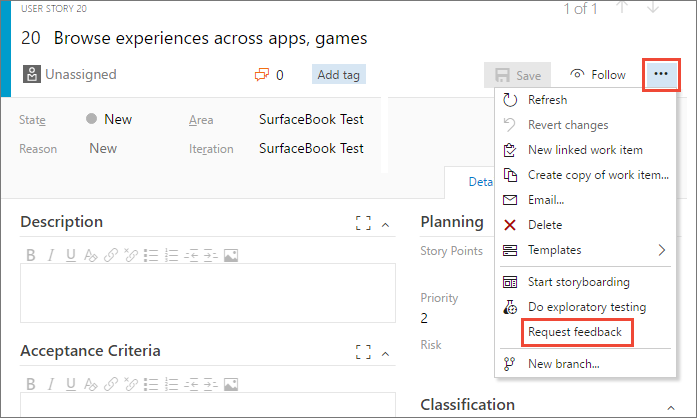
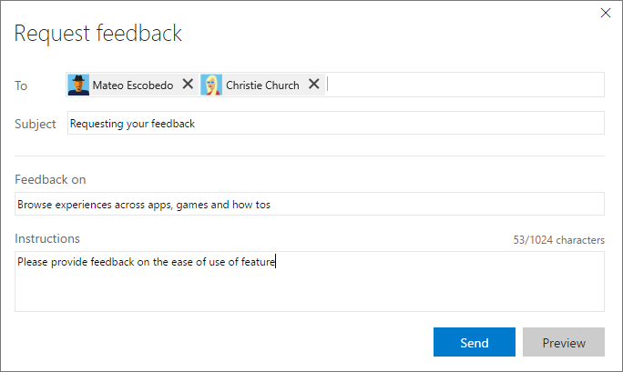

# Request stakeholder feedback using the Test &amp; Feedback extension

[!INCLUDE [version-lt-eq-azure-devops](../includes/version-lt-eq-azure-devops.md)] 

[!INCLUDE [feedback-header-text](includes/feedback-header-text.md)] 

## Request feedback from stakeholders

Request feedback from stakeholders directly from an Azure DevOps work item. 

1. Open the work item form for the user story or feature for which
   you want to request feedback.

1. Open the shortcut menu from the ellipses (**...**) and choose **Request feedback**.

   
   
1. Type or select the names of the stakeholder(s) you want to send 
   the request to, and optionally add any instructions or notes that 
   will help them provide meaningful feedback. 
 
   

1. Choose **Send** to generate emails to all the selected stakeholders.

> [!IMPORTANT]
> The **Request feedback** shortcut menu is unavailable in [New Boards Hub](https://aka.ms/newboardshub). However, there are alternative ways to request feedback, such as through email and chat, in addition to utilizing the [Test & Feedback extension](./voluntary-stakeholder-feedback.md).

> [!NOTE]
> Teams can request feedback from other team members, such as users having Basic access. 
> Just add their names in the feedback request form so that a **Request feedback** email is sent to them.
> Also see [Can users with Basic access respond to feedback requests](provide-stakeholder-feedback.md#non-stakeholder-feedback).

## Related articles

* [Provide stakeholder feedback using the Test &amp; Feedback extension](provide-stakeholder-feedback.md#provide)
* [Voluntary stakeholder feedback using the Test &amp; Feedback extension](voluntary-stakeholder-feedback.md#voluntary)
* [Track stakeholder feedback using the Test &amp; Feedback extension](track-stakeholder-feedback.md#track)
* [Exploratory test and submit feedback directly from your browser](perform-exploratory-tests.md)
* [Overview of manual and exploratory testing](index.yml)

 

