# Request and provide stakeholder feedback

[!INCLUDE [version-lt-eq-azure-devops](../includes/version-lt-eq-azure-devops.md)]

Use the Test & Feedback extension in Azure DevOps to collect stakeholder feedback. The available workflow depends on your platform:

- **Azure DevOps Services (cloud):** The formal **Request feedback** action and the extension's **Feedback requests** page aren't available. Stakeholders and Basic users use the extension to capture screenshots, notes, and screen recordings, and then create bugs or tasks.
- **Azure DevOps Server:** The full feedback workflow is available. You can send formal feedback requests from work items, stakeholders respond through the extension's **Provide feedback** flow, and responses are captured in *Feedback Response* work items.

## Prerequisites

| Category | Requirement |
|----------|-------------|
| **Project access** | [Project member](../organizations/security/add-users-team-project.md) |
| **Permissions** | At least **Stakeholder** access. Basic users can also provide feedback. |
| **To track feedback** | Permissions to view and run work item queries. For more information, see [Set query permissions](../boards/queries/set-query-permissions.md). |
| **Extensions** | [Test & Feedback extension](perform-exploratory-tests.md) installed in your browser |

---

::: moniker range="azure-devops"

## Azure DevOps Services (cloud)

In Azure DevOps Services, the **Request feedback** menu action and the extension's **Feedback requests** page aren't available. To collect stakeholder feedback, ask stakeholders via email or chat to test a feature using the Test & Feedback extension, then create bugs or tasks from their findings.

### Request feedback

Because the built-in **Request feedback** action isn't available in Azure DevOps Services, use one of these alternatives:

- Send an email or chat message to stakeholders with a link to the feature or page to test, along with instructions on what to look for.
- Ask stakeholders to install the [Test & Feedback extension](perform-exploratory-tests.md) and use it to capture and submit bugs or tasks.

### Provide feedback (Azure DevOps Services)

When a stakeholder or Basic user receives a request via email or chat, they use the Test & Feedback extension to capture feedback and create work items.

1. Open the Test & Feedback extension in your browser using the  icon in the toolbar.

2. In **Connection settings**, select **Connected** mode.

   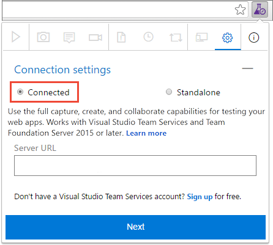

3. Connect to the Azure DevOps organization and project.

   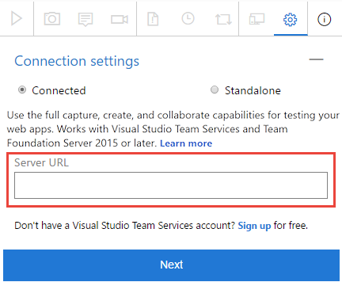

4. Start an exploratory testing session.

   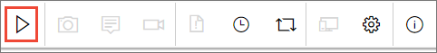

5. Open the application or web page to test. Use the extension to capture feedback:
   - Capture screenshots (with inline annotations)
   - Record a short screen capture
   - Add notes or steps

   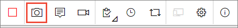

   Some browsers might not provide all capture capabilities. See [Supported web browsers for the extension](perform-exploratory-tests.md#browser-support).

6. Create a bug or task from the captured information.

   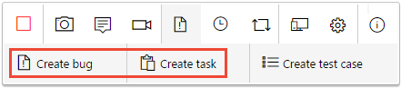

   The process is the same as described in [Exploratory testing in connected mode](connected-mode-exploratory-testing.md#create-bugs).

7. Select the **Stop** icon to end your session.

   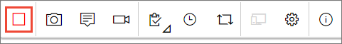

::: moniker-end

::: moniker range="< azure-devops"

## Azure DevOps Server

Azure DevOps Server supports the full feedback request and response workflow. You can send formal feedback requests from work items, and stakeholders respond through the extension's **Provide feedback** flow. Responses are captured as *Feedback Response* work items.

### Request feedback from stakeholders

1. Open the work item form for the user story or feature you want feedback on.
2. Open the shortcut menu (ellipsis …) and select **Request feedback**.

3. Enter or select one or more stakeholder names, and optionally add instructions or notes for meaningful feedback.

   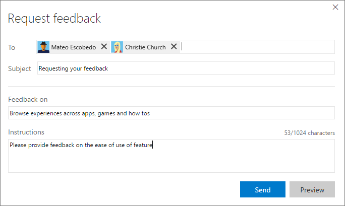

4. Select **Send**. Azure DevOps sends a Request feedback email to the selected stakeholders.

Teams can request feedback from other team members, including users with Basic access. Add their names to the request form so a Request feedback email gets sent to them. For more information about Basic user responses, see the [Nonstakeholder (Basic user) workflow](#non-stakeholder-feedback).

### Provide feedback from a feedback request email

Follow these steps when you receive a Request feedback email.

1. In the feedback request email, choose **Provide feedback**.

   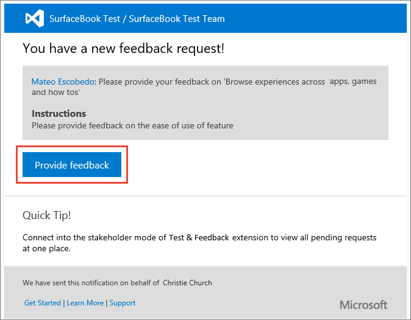

2. The Azure DevOps landing page opens and confirms the extension is configured for the request.

3. Launch the extension by selecting the Test & Feedback icon () in the browser toolbar.

   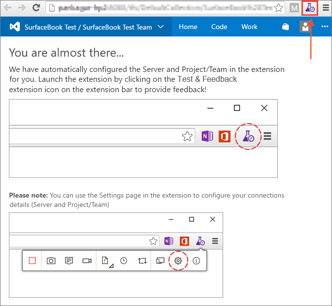

   - If the extension doesn't open or configure automatically, open the extension, sign in, and connect to the server and project that sent the request.

4. Read the instructions in the feedback form to learn what to test and any special notes from the requestor.

   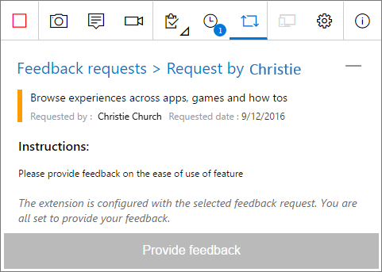

5. Depending on your access level:
   - **Stakeholders:** open the **Feedback requests** page in the extension to view and manage any pending requests.
   - **Basic users:** the extension opens the **Explore work item** traceability page that shows the user story, acceptance criteria, and context.

   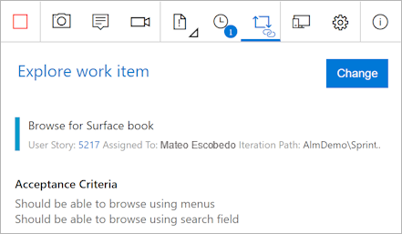

6. Open the app or web page to test and capture feedback using the extension. You can:
   - Capture screenshots (with inline annotations)
   - Record a short screen capture
   - Add notes or steps
   - Annotate screenshots and highlight UI elements

   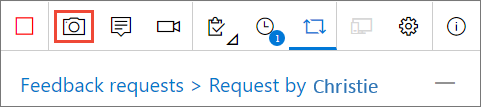

7. Submit your feedback:
   - **Stakeholders:** choose **Provide feedback** in the extension. Optionally create bugs or tasks when you submit.
   - **Basic users:** create a bug or a task from the captured information (nonstakeholder flow).

   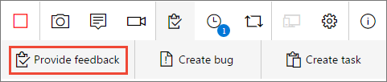
   

8. Review the feedback and enter a meaningful title. Optionally choose a star rating, and then save. The extension creates a work item that contains your feedback and attachments.

   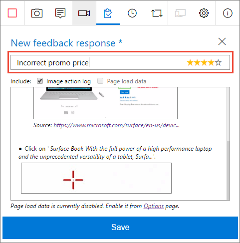

9. If you responded as a Stakeholder:
   - Open **Feedback requests** in the extension and mark the request **Completed** when you finish.

   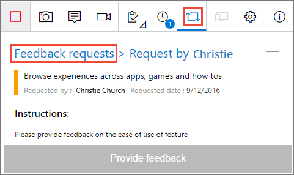
   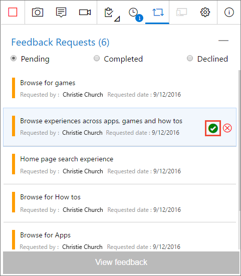

10. End your feedback session by selecting **Stop** in the extension.

    

### Provide feedback from the Test & Feedback extension

Use this flow when you want to manage multiple requests or work directly from the extension.

1. Launch the extension from the toolbar icon ().
2. In Connection settings, select **Connected** mode and sign in to the Azure DevOps Server instance that hosts the request.
3. Connect to the server and the project or team that requested feedback.

   

4. Open the **Feedback requests** page to list all requests for the connected project or team.

   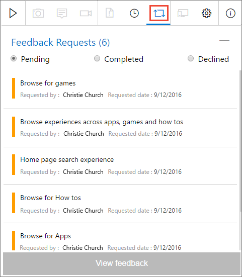

5. Select a request and choose **View feedback**, read the instructions, then choose **Provide feedback**.

   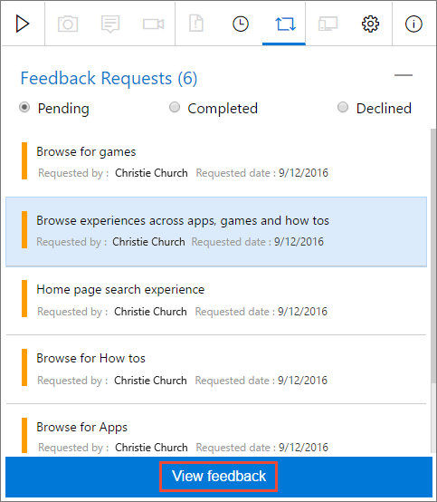
   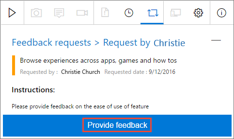

6. Capture and submit feedback as [previously described](#email).

### Provide voluntary feedback

Use the Test & Feedback extension to provide voluntary feedback on Azure DevOps Server, even if you don't receive a feedback request.

1. Open the Test & Feedback extension in your browser using the  icon in the toolbar.

2. In the **Connection settings** page, select **Connected**.

   

3. Connect to the server and appropriate project or team.

   

4. Start the exploratory testing session.

   

5. Open the application you want to provide feedback on and begin your feedback. For example, select **Capture screenshot**.

   

   You can use all the capabilities of the extension such as capturing screenshots, notes, and screen recordings.

   Some browsers might not provide all of the capture capabilities. See [Supported web browsers for the extension](perform-exploratory-tests.md#browser-support).

6. When you're done capturing feedback, choose **Provide feedback**.

   

   You can optionally choose to create bugs and tasks when you submit your feedback. The process is the same as described in [Exploratory testing in connected mode](connected-mode-exploratory-testing.md#create-bugs).

7. All your feedback captured is shown in the response form. Enter a suitable title and, optionally, select a star rating for the feature you're testing.

   

8. **Save** your feedback, which creates a work item in Azure DevOps containing all your feedback.

9. Continue to capture more feedback if necessary. You can submit multiple feedback responses, bugs, and tasks for the same feedback request.

10. Select the **Stop** icon to end your feedback session.

    

### Nonstakeholder (Basic user) workflow

If you have Basic access and the requestor invited you to respond, the extension opens the Explore work item view. Use that view to capture details and then create a bug or task from the captured feedback. For full instructions, see [Exploratory testing in connected mode](connected-mode-exploratory-testing.md#create-bugs).

::: moniker-end

## Track feedback requests

All feedback gets captured in a *Feedback Response* work item. You can track feedback, whether captured by the Test & Feedback extension or the [Microsoft Feedback client](/previous-versions/azure/devops/project/feedback/give-feedback), through a work item query.

::: moniker range="<=azure-devops"

1. To view feedback, use the **Feedback** shared query.
2. Select your project and open **Boards** > **Queries**.
3. Under **Queries**, select **All**.
4. In the Shared Queries, select **Feedback**.

   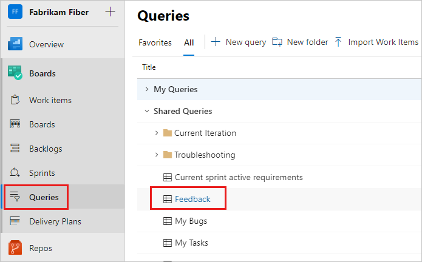

The query displays a list of all the feedback responses received. For more information, see [Web portal navigation](../project/navigation/index.md).

### Create a feedback query

1. Select **Boards** > **Queries** and then select **New query**.

1. In the **Editor** for your new query, enter the following values:

   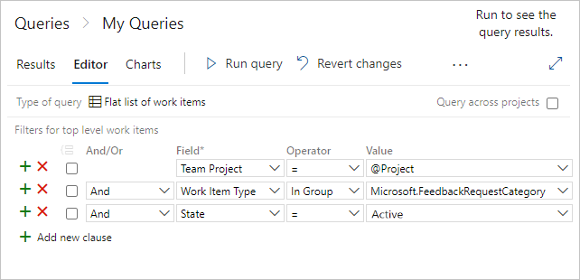

   - `Team Project` `=` `@Project`
   - `Work Item Type` `In Group` `Microsoft.FeedbackRequestCategory`
   - `State` `=` `Active`

1. Select **Save query** and enter a name.

1. Select **Run query** to see a list of active feedback responses for your team project.

   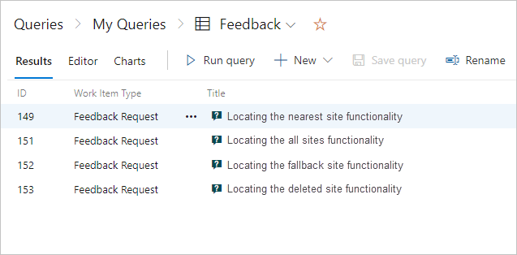

1. Select a response work item to see the details of the feedback.

::: moniker-end

## Tips for capturing feedback

- Capture multiple screenshots and short recordings to show steps to reproduce.
- Add clear, actionable notes and include expected vs. actual behavior.
- Use annotation tools to highlight UI elements, errors, and the important parts of a screen.
- Follow any requestor-provided instructions to give the feedback they expect.

## Related content

- [Perform exploratory tests and submit feedback from your browser](perform-exploratory-tests.md)
- [What is Azure Test Plans?](overview.md)
- [Get feedback](/previous-versions/azure/devops/project/feedback/get-feedback)
- [Define a work item query](../boards/queries/using-queries.md)
- [Overview of manual and exploratory testing](index.yml)
