# Collect and provide stakeholder feedback

[!INCLUDE [version-gt-eq-2022](../includes/version-gt-eq-2022.md)]

Use the **Test & Feedback** extension in Azure DevOps to collect stakeholder feedback. The available workflow depends on your platform:

- **Azure DevOps Services:** The formal **Request feedback** action and the extension's **Feedback requests** page aren't available. Stakeholders and Basic users can use the extension for exploratory testing and create permitted work items, such as bugs or tasks.
- **Azure DevOps Server 2022:** The formal feedback workflow is available. Users with Basic access or higher can send requests from a work item. Stakeholders can submit formal responses through the extension, while invited Basic users explore the work item and create bugs or tasks.

[!INCLUDE [version-selector](../includes/version-selector.md)]

## Prerequisites

::: moniker range="azure-devops"

| Category | Requirement |
|----------|-------------|
| **Project access** | Membership in an [Azure DevOps project](../organizations/security/add-users-team-project.md) with Stakeholder or Basic access. |
| **Permissions** | To create or modify bugs, tasks, or other work items, set **View work items in this node** and **Edit work items in this node** to **Allow** for the applicable Area Path. To create new tags, set **Create tag definition** to **Allow**. |
| **Extensions** | [Test & Feedback extension](perform-exploratory-tests.md) installed in your browser. |
| **Tracking** | Permission to view and run work item queries. For more information, see [Set query permissions](../boards/queries/set-query-permissions.md). |

::: moniker-end

::: moniker range="azure-devops-2022"

| Category | Requirement |
|----------|-------------|
| **Project access** | Membership in an [Azure DevOps project](../organizations/security/add-users-team-project.md). Requesters need Basic access or higher. Stakeholders can submit formal responses; invited Basic users can explore the linked work item and create bugs or tasks. |
| **Permissions** | To create or modify bugs, tasks, or other work items, set **View work items in this node** and **Edit work items in this node** to **Allow** for the applicable Area Path. |
| **Email** | An administrator must [configure an SMTP server](/azure/devops/server/admin/setup-customize-alerts) so Azure DevOps Server can send feedback request emails. |
| **Extensions** | [Test & Feedback extension](perform-exploratory-tests.md) installed in your browser. |
| **Tracking** | Permission to view and run work item queries. For more information, see [Set query permissions](../boards/queries/set-query-permissions.md). |

::: moniker-end

---

::: moniker range="azure-devops"

## Azure DevOps Services

In Azure DevOps Services, the **Request feedback** menu action and the extension's **Feedback requests** page aren't available. Basic and Stakeholder users don't initiate or respond to formal feedback requests through the extension. Instead, coordinate testing through email or chat, and use the extension to create bugs or tasks from the findings.

### Coordinate feedback through email or chat

Share the feature or page to test through email or chat:

- Include a link to the feature or page and explain what feedback you need.
- Ask participants to install the [Test & Feedback extension](perform-exploratory-tests.md) and use it to capture findings and create bugs or tasks.

### Capture findings in Azure DevOps Services

After a Stakeholder or Basic user receives testing instructions through email or chat, they use the Test & Feedback extension for exploratory testing and create work items. This process isn't a formal feedback request or response workflow.

1. Open the Test & Feedback extension in your browser by selecting the  icon in the toolbar.

2. In **Connection settings**, select **Connected** mode.

   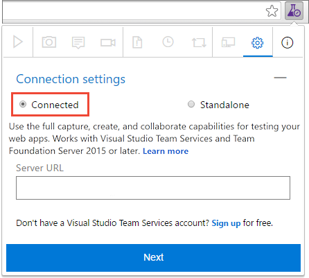

3. Connect to the Azure DevOps organization and project.

   

4. Start an exploratory testing session.

   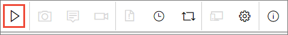

5. Open the application or web page to test. Use the extension to capture feedback:
   - Capture screenshots (with inline annotations)
   - Record a short screen capture
   - Add notes or steps

   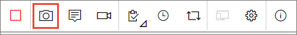

   Some browsers might not provide all capture capabilities. See [Supported web browsers for the extension](perform-exploratory-tests.md#supported-web-browsers-for-the-extension).

6. Create a bug or task from the captured information.

   

   The process is the same as described in [Create bugs or tasks](connected-mode-exploratory-testing.md#create-bugs-or-tasks).

7. Select the **Stop** icon to end your session.

   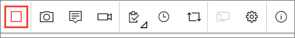

::: moniker-end

::: moniker range="azure-devops-2022"

## Azure DevOps Server 2022

Azure DevOps Server supports the full feedback request and response workflow. You can send formal feedback requests from work items, and stakeholders respond through the extension's **Provide feedback** flow. Responses are captured as *Feedback Response* work items.

Choose the workflow that matches your goal:

| Goal | Workflow |
|------|----------|
| Send a formal request | [Request feedback from stakeholders](#request-feedback-from-stakeholders) |
| Respond as a stakeholder from an email | [Provide feedback from a feedback request email](#provide-feedback-from-a-feedback-request-email) |
| Review multiple pending requests | [Provide feedback from the Test & Feedback extension](#provide-feedback-from-the-test--feedback-extension) |
| Provide feedback without a request | [Provide voluntary feedback](#provide-voluntary-feedback) |
| Respond with Basic access | [Basic user workflow](#basic-user-workflow) |

### Request feedback from stakeholders

1. Open the work item form for the user story or feature you want feedback on.
2. Open the shortcut menu (ellipsis …) and select **Request feedback**.

3. Enter or select one or more stakeholder names, and optionally add instructions or notes for meaningful feedback.

   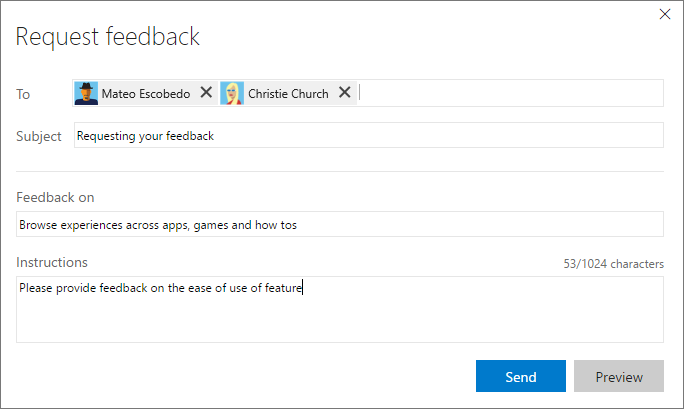

4. Select **Send**. Azure DevOps sends a Request feedback email to the selected stakeholders.

Users with Basic access or higher initiate this formal request from the work item, not from the Test & Feedback extension. You can invite team members who have Basic access, but they respond through the [Basic user workflow](#basic-user-workflow) by creating a bug or task rather than a formal *Feedback Response*.

### Provide feedback from a feedback request email

Follow these steps when you receive a Request feedback email.

1. In the feedback request email, choose **Provide feedback**.

   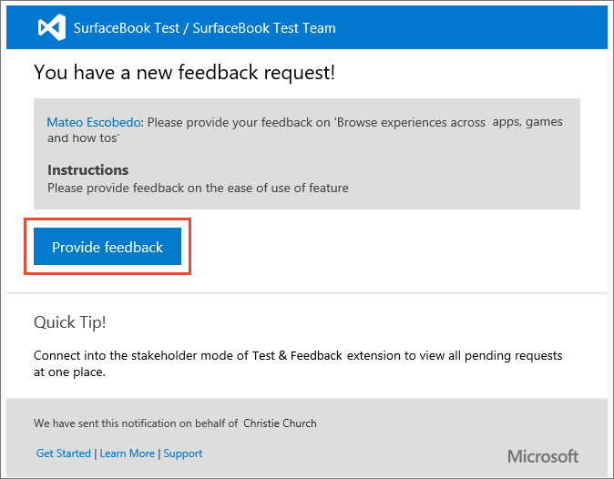

2. The Azure DevOps landing page opens and confirms the extension is configured for the request.

3. Launch the extension by selecting the Test & Feedback icon () in the browser toolbar.

   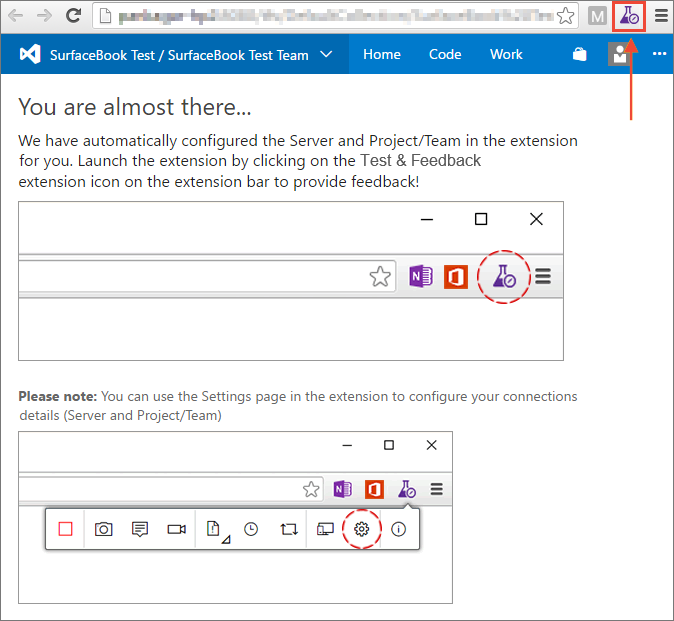

   - If the extension doesn't open or configure automatically, open the extension, sign in, and connect to the server and project that sent the request.

4. Read the instructions in the feedback form to learn what to test and any special notes from the requester.

   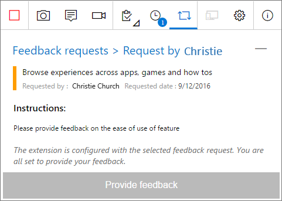

5. Depending on your access level:
   - **Stakeholders:** open the **Feedback requests** page in the extension to view and manage any pending requests.
   - **Basic users:** the extension opens the **Explore work item** traceability page that shows the user story, acceptance criteria, and context.

   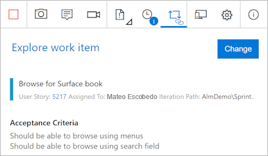

6. Open the app or web page to test and capture feedback using the extension. You can:
   - Capture screenshots (with inline annotations)
   - Record a short screen capture
   - Add notes or steps
   - Annotate screenshots and highlight UI elements

   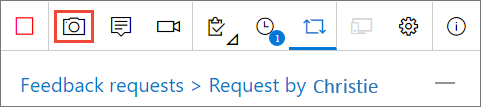

7. Submit your feedback:
   - **Stakeholders:** choose **Provide feedback** in the extension. Optionally create bugs or tasks when you submit.
   - **Basic users:** create a bug or a task from the captured information (nonstakeholder flow).

   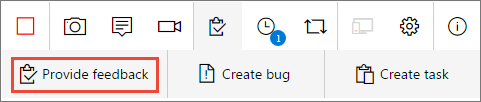
   

8. If you responded as a Stakeholder, review the feedback and enter a meaningful title. Optionally choose a star rating, and then save. The extension creates a *Feedback Response* work item that contains your feedback and attachments.

   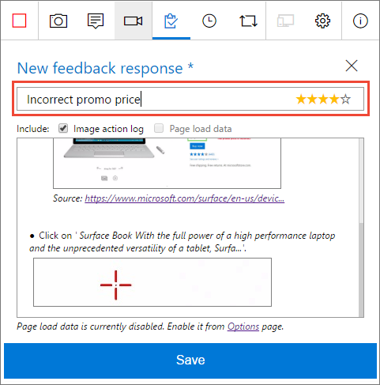

9. If you responded as a Stakeholder:
   - Open **Feedback requests** in the extension and mark the request **Completed** when you finish.

   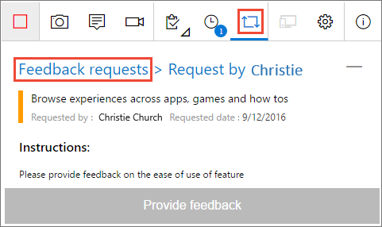
   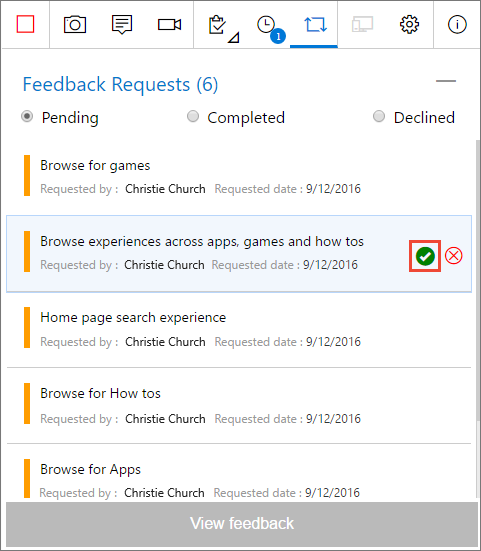

10. End your feedback session by selecting **Stop** in the extension.

    

### Provide feedback from the Test & Feedback extension

Use this flow when you want to manage multiple requests or work directly from the extension.

1. Launch the extension from the toolbar icon ().
2. In Connection settings, select **Connected** mode and sign in to the Azure DevOps Server instance that hosts the request.
3. Connect to the server and the project or team that requested feedback.

   

4. Open the **Feedback requests** page to list all requests for the connected project or team.

   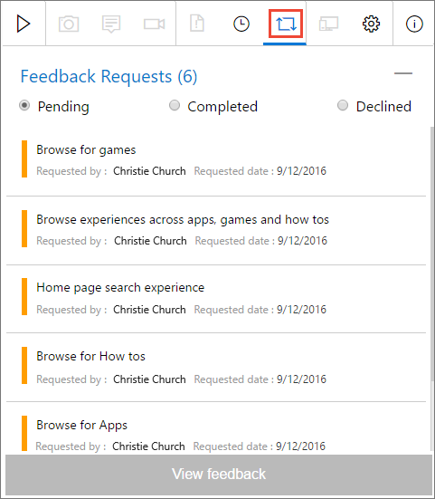

5. Select a request and choose **View feedback**, read the instructions, and then choose **Provide feedback**.

   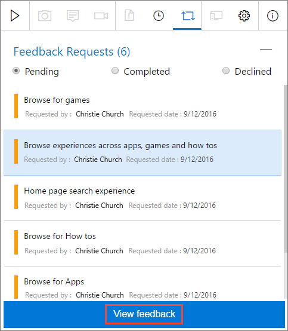
   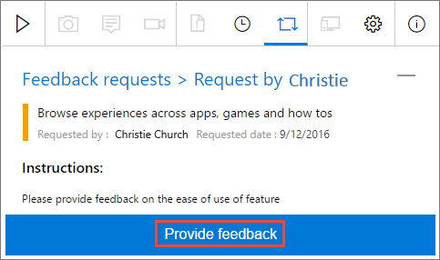

6. Capture and submit feedback as described in [Provide feedback from a feedback request email](#provide-feedback-from-a-feedback-request-email).

### Provide voluntary feedback

Use the Test & Feedback extension to provide voluntary feedback on Azure DevOps Server, even if you don't receive a feedback request.

1. Open the Test & Feedback extension in your browser by selecting the  icon in the toolbar.

2. In the **Connection settings** page, select **Connected**.

   

3. Connect to the server and appropriate project or team.

   

4. Start the exploratory testing session.

   

5. Open the application you want to provide feedback on and begin your feedback. For example, select **Capture screenshot**.

   

   Use all the capabilities of the extension, such as capturing screenshots, notes, and screen recordings.

   Some browsers might not provide all of the capture capabilities. See [Supported web browsers for the extension](perform-exploratory-tests.md#supported-web-browsers-for-the-extension).

6. When you're done capturing feedback, choose **Provide feedback**.

   

   You can optionally choose to create bugs and tasks when you submit your feedback. The process is the same as described in [Create bugs or tasks](connected-mode-exploratory-testing.md#create-bugs-or-tasks).

7. All your feedback captured is shown in the response form. Enter a suitable title and, optionally, select a star rating for the feature you're testing.

   

8. **Save** your feedback, which creates a work item in Azure DevOps containing all your feedback.

9. Continue to capture more feedback if necessary. You can submit multiple feedback responses, bugs, and tasks during the same exploratory testing session.

10. Select the **Stop** icon to end your feedback session.

    

### Basic user workflow

If you have Basic access and the requester invited you to respond, the extension opens the **Explore** work item view. Use that view to capture details and then create a bug or task from the captured feedback. For full instructions, see [Create bugs or tasks](connected-mode-exploratory-testing.md#create-bugs-or-tasks).

::: moniker-end

::: moniker range="azure-devops"

## Track findings in Azure DevOps Services

The extension stores each finding as the work item type selected during submission, such as a bug or task. It doesn't create a formal *Feedback Response* work item.

1. In your project, select **Boards** > **Queries** > **New query**.
1. Add clauses for the work items your team uses to capture feedback. For example:
   - `Team Project` `=` `@Project`
   - `Work Item Type` `In` `Bug, Task`
1. Add filters such as **Area Path**, **Created By**, **Created Date**, or a team-defined tag to narrow the results to the feedback activity.
1. Select **Run query** and verify that the results contain the bugs and tasks created during the exploratory testing sessions.
1. Select **Save query** and enter a name.

::: moniker-end

::: moniker range="azure-devops-2022"

## Track formal feedback in Azure DevOps Server 2022

Formal feedback produces *Feedback Request* and *Feedback Response* work items. Use separate queries when you need to distinguish outstanding requests from submitted responses.

### Use the shared Feedback query

1. Select your project and open **Boards** > **Queries**.
2. Under **Queries**, select **All**.
3. In **Shared Queries**, select **Feedback**.

   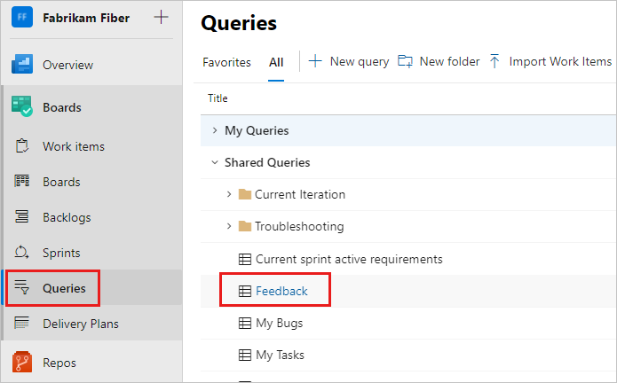

The query displays a list of all the feedback responses received. For more information, see [Web portal navigation](../project/navigation/index.md).

### Create a feedback request query

1. Select **Boards** > **Queries** and then select **New query**.

1. In the **Editor** for your new query, enter the following values:

   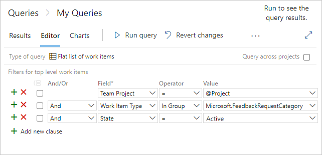

   - `Team Project` `=` `@Project`
   - `Work Item Type` `In Group` `Microsoft.FeedbackRequestCategory`
   - `State` `=` `Active`

1. Select **Save query** and enter a name.

1. Select **Run query** to see a list of active feedback requests for your team project.

   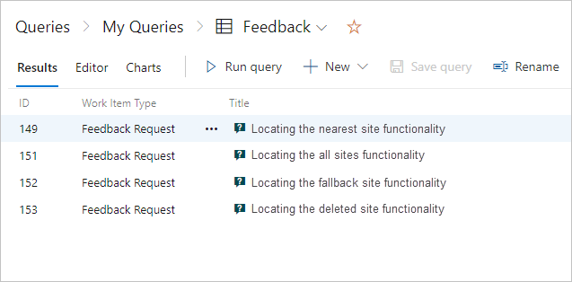

1. Select a request work item to see its details.

### Create a feedback response query

1. Select **Boards** > **Queries** > **New query**.
1. Add the following clauses:
   - `Team Project` `=` `@Project`
   - `Work Item Type` `In Group` `Microsoft.FeedbackResponseCategory`
1. Select **Run query** to see the submitted feedback responses for your team project.
1. Select **Save query** and enter a name.

::: moniker-end

## Troubleshoot feedback workflows

| Issue | Resolution |
|-------|------------|
| **Request feedback** isn't available in Azure DevOps Services | This behavior is expected. Coordinate testing through email or chat, and ask participants to create bugs or tasks with the extension. |
| A Server feedback request email doesn't arrive | Ask an administrator to verify the [SMTP server and email configuration](/azure/devops/server/admin/setup-customize-alerts). |
| The extension can't connect | Verify the Azure DevOps URL, authentication, project, and team selection. For more information, see [Connect to Azure DevOps](connected-mode-exploratory-testing.md#connect-to-azure-devops). |
| A participant can't create a bug or task | Verify that **View work items in this node** and **Edit work items in this node** are set to **Allow** for the applicable Area Path. |
| The shared **Feedback** query isn't available in Azure DevOps Server 2022 | Create the applicable request or response query described in this article. |

## Tips for capturing feedback

- Capture multiple screenshots and short recordings to show steps to reproduce.
- Add clear, actionable notes and include expected vs. actual behavior.
- Use annotation tools to highlight UI elements, errors, and the important parts of a screen.
- Follow any requester-provided instructions to give the feedback they expect.

## Related content

- [Perform exploratory tests and submit feedback from your browser](perform-exploratory-tests.md)
- [What is Azure Test Plans?](overview.md)
- [Define a work item query](../boards/queries/using-queries.md)
- [Overview of manual and exploratory testing](index.yml)

::: moniker range="azure-devops-2022"

- [Configure SMTP for Azure DevOps Server](/azure/devops/server/admin/setup-customize-alerts)

::: moniker-end
