# Run automated tests from test plans

[!INCLUDE [version-lt-eq-azure-devops](../includes/version-lt-eq-azure-devops.md)] 

Automate test cases in your test plans and run them directly from **Azure Test Plans**. Automated tests provide you with the following benefits:

* A user-friendly process for testers who might not be well versed with running tests in Build or Release workflows.
* The flexibility to run selected tests on demand, rather than scheduled testing in Build or Release workflows where all tests meeting the filter criteria are run.
* The ability to rerun a few tests that failed due to test infrastructure issues, or you have a new build that includes fixes for failed tests.

## Prerequisites

| Category | Requirements |
|--------------|-------------|
| **Access levels** | - At least **Basic** access, with permissions to view work items under the corresponding Area Path. - To add test plans and test suites, delete test artifacts, and define test configurations: [Basic + Test Plans](https://marketplace.visualstudio.com/items?itemName=ms.vss-testmanager-web) access. Or, one of the following **Visual Studio subscriptions**:  - [Enterprise](https://visualstudio.microsoft.com/vs/enterprise/) - [Test Professional](https://visualstudio.microsoft.com/vs/test-professional/)   - [MSDN Platforms](https://visualstudio.microsoft.com/msdn-platforms/) |
| **Permissions** | - To add or modify test plans, test suites, test cases, or other test-based work item types: **Edit work items in this node** permission set to **Allow** under the corresponding **Area Path**. - To modify test plan properties such as build and test settings: **Manage test plans** permission set to **Allow** under the corresponding **Area Path**. - to create and delete test suites, add and remove test cases from test suites, change test configurations associated with test suites, and modify a test suite hierarchy (move a test suite): **Manage test suites** permission set to **Allow** under the corresponding **Area Path**. - Permissions to create and manage releases, edit a release environment, and manage deployment.  For more information, see [Release permissions](../pipelines/policies/permissions.md#release-pipeline-permissions) |
|**Tools and configurations** |- A [test plan](create-a-test-plan.md) that contains your automated tests associated with automated test methods using [Visual Studio 2017](associate-automated-test-with-test-case.md) or [Visual Studio 2015 or earlier](/previous-versions/visualstudio/visual-studio-2013/dd380741(v=vs.120)). - A [build pipeline](../pipelines/apps/aspnet/build-aspnet-4.md) that generates builds containing the test binaries. - An app to test. You can deploy the app as part of the [build and release workflow](../pipelines/get-started/what-is-azure-pipelines.md) and also use it for on-demand testing.|

## Set up your environment

1. In the **Test Plans** page, choose your test plan, open the shortcut menu, and then select **Test plan settings**.

   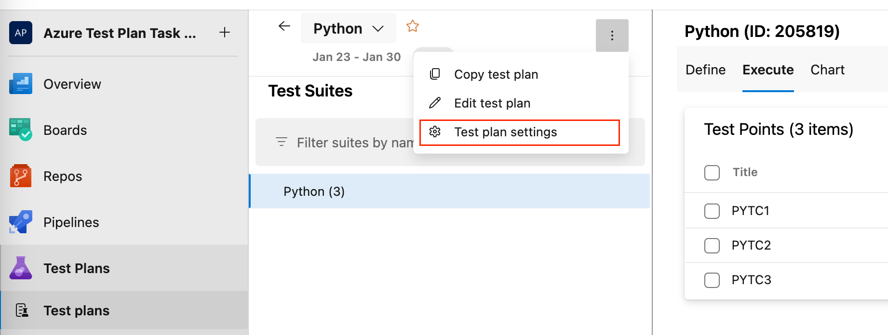

2. In the Test plan settings dialog, select the build pipeline that generates builds that
   contain the test binaries (both, Classic and YAML build pipelines are supported). You can then select a specific build number to test, or let the
   system automatically use the latest build when tests are run.

   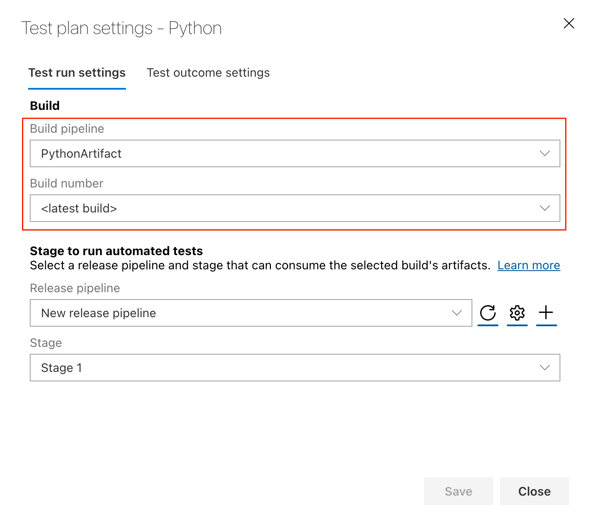

3. You need a release pipeline that was created from the **Run automated tests from Test Manager** template to run tests from test plans in **Azure Test Plans**. If you have an existing release pipeline created using this template, select it and then select the existing stage in the release pipeline for the test execution (both, Classic and YAML release pipelines are supported). Otherwise, select **Create new** in the dialog to create a new release pipeline that contains a single stage with the **Visual Studio Test** task already added.

   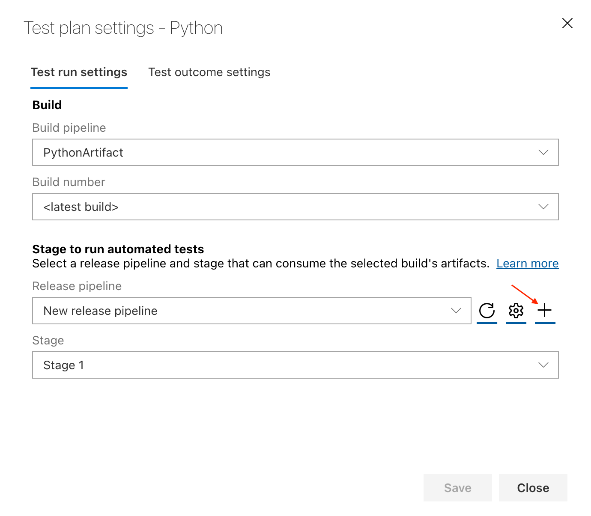

   [How do I pass parameters to my test code from a build or release pipeline?](#pass-params)

4. Assign meaningful names to the release pipeline and stage as required.

5. If Visual Studio is already installed on the agent computer, skip this step.
   If not, add the [Visual Studio Test Platform Installer task](/azure/devops/pipelines/tasks/reference/deploy-visual-studio-test-agent-v2)
   to the pipeline definition.

6. Add the [Visual Studio Test task](/azure/devops/pipelines/tasks/reference/vstest-v2) to the release pipeline and configure it as follows:
 
   * Verify that you are using the version 3 of the Visual Studio Test task.

   * Verify that **Select tests using** is set to **Test run**.
     [What does this setting mean?](#faq-ondemandruns) 

   * For the **vsTestVersion**, select **toolsInstaller**. 

   * If you have UI tests that run on **physical browsers** or **thick clients**, ensure that the agent is set to run as an interactive process with autologon enabled. You must set up an agent to run interactively before you queue the build or release. The **Test mix contains UI tests** checkbox doesn't configure the agent in interactive mode automatically - used only as a reminder to configure the agent appropriately to avoid failures.
   * If you're running UI tests on a **headless browser**, the interactive process configuration isn't required.
   * Select how the test platform gets provisioned, and the version of Visual Studio or the location of the test platform that is installed on the test machines. 
   * If your tests need **input parameters** such as app URLs or database connection strings, select the relevant settings file from the build artifacts. You can use the **Publish build artifacts** tasks in your build pipeline to publish the settings file in a drop location if this file isn't included in the artifacts. In the following example, the application URL is exposed in the run settings file, and is overridden to set it to a staging URL using the **Override test run parameters** setting.

    

     For information about the option settings of the Visual Studio Test task, see [Visual Studio Test task](/azure/devops/pipelines/tasks/reference/vstest-v3).

7. Choose the **Agent job** item and verify that the deployment queue is set to the one containing the machines where you want to run the tests. If your tests require special machines from the agent pool, you can add demands that select at runtime.

   You might be able to minimize test times by distributing tests across multiple agents by setting **Parallelism** to **Multiple executions** and specifying the number of agents.

   > [!NOTE]
   > If you're running UI tests such as CodeUI or Selenium on physical browsers such as IE, Firefox, or Chrome, the agent on the machines must be running in interactive mode and not as a service. [More details](#faq-agentmode). 

9. In the **Pipeline** page of the release pipeline, verify that the build pipeline containing the test binaries links to this release pipeline as an artifact source.  

   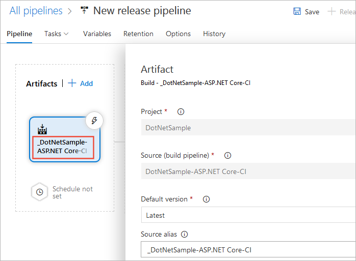
 
10. **Save** the release pipeline.

11. If you chose **Create new** in the Test plan settings dialog in step 2 of this example, return to the browser page that contains your test plan settings. In the Test plan settings dialog, select the release pipeline and stage you saved.

    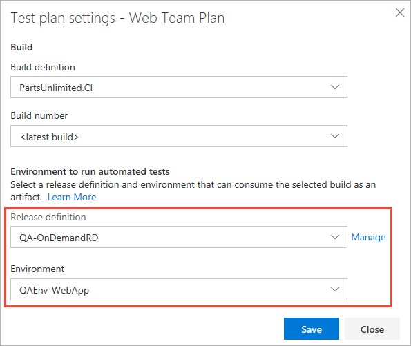

## Run the automated tests

1. In the **Test Plans** web portal, open the test plan and select a test suite that contains the
   automated tests.

2. Select the test case(s) you want to run, then click on **Run for web application**. 

   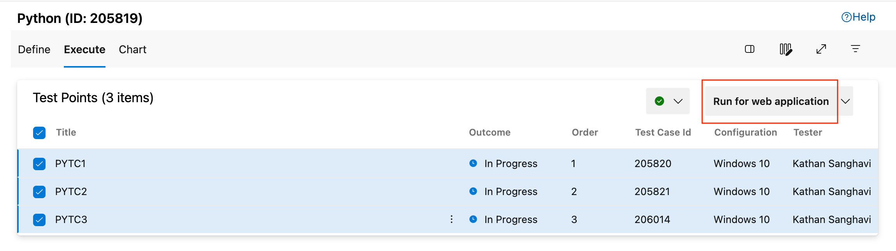

   The test binaries for these tests must be available in the build artifacts generated by your build pipeline.

3. The system checks that only automated tests get selected (any manual tests are ignored), validates the stage to ensure the Visual Studio Test task is present and has valid settings, checks the user's permission to create a release for the selected release pipeline, creates a test run, and then triggers the creation of a release to the selected stage.

    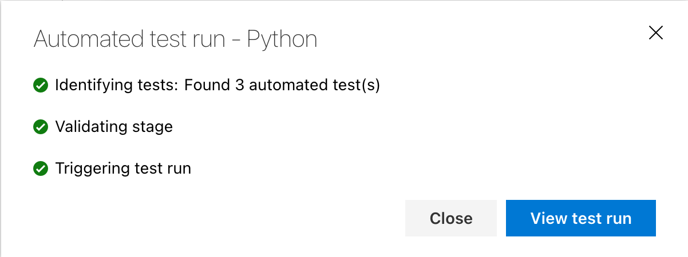

4. Select **View test run** to view the test progress and analyze the failed tests. Test results have the relevant information for debugging failed tests such as the error message, stack trace, console logs, and attachments. 
 
5. After test execution is complete, the **Runs** page of the **Azure Test Plans**  shows the test results. The **Run summary** page shows an overview of the run.

   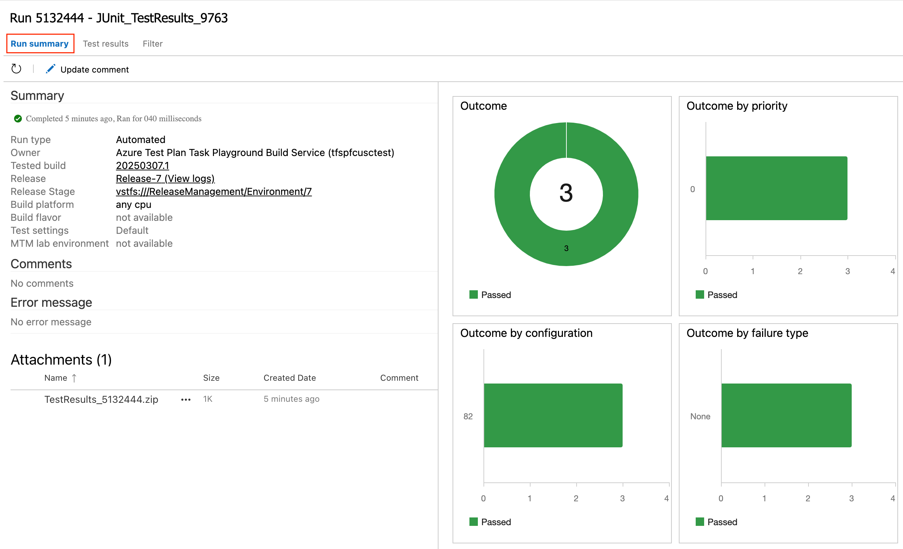
 
   There's a link to the **Release** used to run the tests, which makes it easy to find the release that ran the tests if you need to come back later and analyze the results. Also use this link if you want to open the release to view the release logs.

  > [!NOTE]
  > Manually attachment of files isn't supported for automated test results.

   [What are the typical error scenarios or issues I should look out for if my tests don't run?](#faq-errors)

6. The **Test results** page lists the results for each test in the test run. Select a test to see debugging information for failed tests such as the error message, stack trace, console logs, and attachments. 

   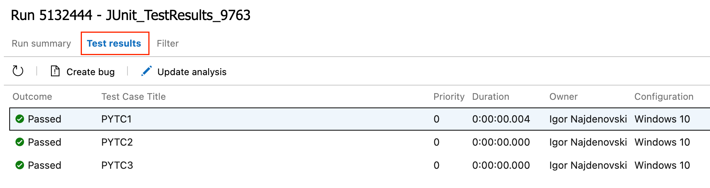

7. In **Test Plans** go to the **Runs** page where you can find an overiew of all your test runs. From here, you can open the detailed view of each test run.

   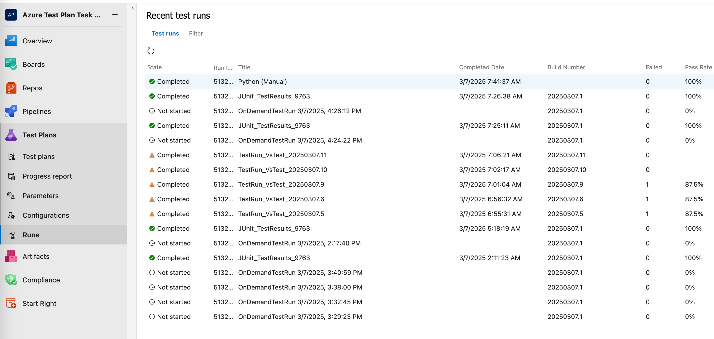

## FAQ

See the following frequently asked questions (FAQs) about Azure Test Plans.

### Q: What permissions do I need to run automated tests from Azure Test Plans?

**A:** Be a Project Contributor, or have the following permissions:

* Create releases
* Manage releases
* Edit release stage
* Manage deployment

For more information, see [Release permissions](../pipelines/policies/permissions.md#release-pipeline-permissions).

### Q: Can I override the build or stage set at the test plan level for a specific instance of test run?

**A:** Yes, you can do this using the **Run with options** command.
Open the shortcut menu for the test suite in the left column and select **Run with options**.

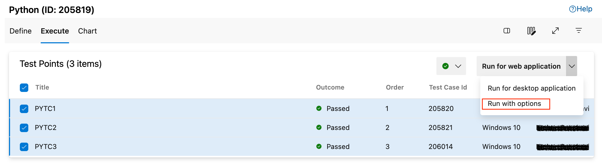

Enter the following values in the Run with options dialog and then select **OK**:

* **Test type and runner**: Select **Automated tests using Release Stage**.
* **Build**: Select the build that has the test binaries. The test results are associated with this build.
* **Release Pipeline**: Select a pipeline from the list of release pipelines that can consume the selected build artifact. 
* **Release Stage**: Select the name of the stage configured in your release pipeline.

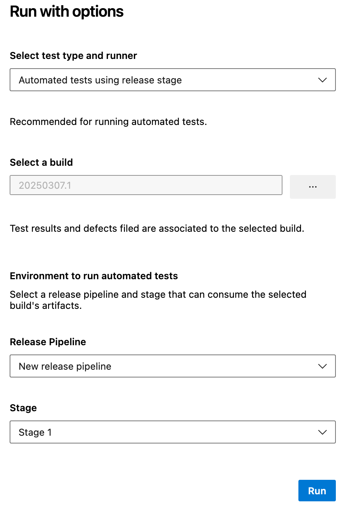

### Q: Why use release stages to run tests? 

**A:** Azure Pipelines offers a compelling orchestration workflow to obtain test binaries as artifacts and run tests. This workflow shares the same concepts used in the scheduled testing workflow, meaning users running tests in scheduled workflow find it easy to adapt; for example, by cloning an existing scheduled testing release pipeline.

Another major benefit is the availability of a rich set of tasks in the task catalog that enable a range of activities to be performed before and after running tests. Examples include preparing and cleaning test data, creating and cleaning configuration files, and more.

### Q: How does selecting "Test run" in the Visual Studio Test task version 2 work?

**A:** The Test management subsystem uses the test run object to pass the list of tests selected for execution. The test task looks up the test run identifier, extracts the test execution information such as the container and test method names, runs the tests, updates the test run results, and sets the test points associated with the test results in the test run. From an auditing perspective, the Visual Studio task provides a trace from the historical releases and the test run identifiers to the tests that were submitted for on-demand test execution.

### Q: Should the agent run in interactive mode or as a service?

**A:** If you run UI tests such as [coded UI](/visualstudio/test/use-ui-automation-to-test-your-code) or [Selenium](../pipelines/test/continuous-test-selenium.md) tests, the agent on the test machines must be running in interactive mode with autologon enabled, not as a service, to allow the agent to launch a web browser. If you're using a headless browser such as [PhantomJS](https://phantomjs.org/), the agent can be run as a service or in interactive mode. For more information, see [Build and release agents](../pipelines/agents/agents.md), [Deploy an agent on Windows](../pipelines/agents/windows-agent.md), and [Agent pools](../pipelines/agents/pools-queues.md).

### Q: Where can I find detailed documentation on how to run Selenium tests?

**A:** See [Get started with Selenium testing](../pipelines/test/continuous-test-selenium.md).

### Q: What happens if I select multiple configurations for the same test?

**A:** Currently, the on-demand workflow isn't configuration-aware.

### Q: What if I need to download product binaries and test binaries from different builds? Or if I need to obtain artifacts from a source such as Jenkins?

**A:** The current capability is optimized for a single team build
to be tested on-demand using an Azure Pipelines workflow.
We evaluate support for multi-artifact releases, including
non-Azure Pipelines artifacts such as Jenkins, based on user feedback.

### Q: I already have a scheduled testing release pipeline. Can I reuse the same pipeline to run test on-demand, or should I create a new pipeline? 

**A:** We recommend you use a separate release pipeline and stage for on-demand automated testing from Azure Test Plans because:

* You might not want to deploy the app every time you want to run a few on-demand tests.
Scheduled testing stages are typically set up to deploy the product and then run tests.

* New releases are triggered for every on-demand run. If you have many testers who execute a few on-demand test runs every day, your scheduled testing release pipeline could be overloaded with releases for these runs, making it difficult to find releases that trigger for the pipeline that contains scheduled testing and deployment to production.

* You might want to configure the Visual Studio Test task with a Test run identifier as an input so that you can trace what triggered the release. For more information, see [How does selecting "Test run (for on-demand runs)" in the Visual Studio Test task work?](#faq-ondemandruns).

### Q: Can I trigger these runs and view the results in Microsoft Test Manager?

**A:** No. Microsoft Test Manager doesn't support running automated tests against Team Foundation
builds. It only works in the web-based interface for Azure Pipelines. All new manual and automated testing product development investments are in the web-based interface. No further development is planned for Microsoft Test Manager. See
[Guidance on Microsoft Test Manager usage](/previous-versions/azure/devops/test/mtm/guidance-mtm-usage).

### Q: I have multiple testers in my team. Can they run tests from different test suites or test plans in parallel using the same release pipeline?

**A:** They can use the same release pipeline to trigger multiple
test runs in parallel if:

* The agent pool associated with the stage has sufficient agents to cater for parallel requests. If sufficient agents aren't available, runs can still be triggered but releases queue for processing until agents become available.

* You have sufficient jobs to enable parallel jobs. For more information, see [Parallel jobs in Azure Pipelines](../pipelines/licensing/concurrent-jobs.md) or [Parallel jobs in TFS](../pipelines/licensing/concurrent-pipelines-tfs.md).

* Testers don't run the same tests in parallel. Doing so might cause results to be overwritten depending on the order of execution.

To enable multiple different test runs to execute in parallel, set the Azure Pipelines stage trigger option for [behavior when multiple releases are waiting to be deployed](../pipelines/release/triggers.md) as follows:

* If your application supports tests running in parallel from different sources, set this option to **Allow multiple releases to be deployed at the same time**.

* If your application doesn't support tests running in parallel from different sources, set this option to **Allow only one active deployment at a time**.

### Q: How do I pass parameters to my test code from a build or release pipeline?

**A:** Use a [runsettings](/visualstudio/test/configure-unit-tests-by-using-a-dot-runsettings-file)
file to pass values as parameters to your test code. For example, in a release that contains several stages, you can pass the appropriate app URL to each the test tasks in each one. The runsettings file and matching parameters must be specified in the [Visual Studio Test task](/azure/devops/pipelines/tasks/reference/vstest-v2). 

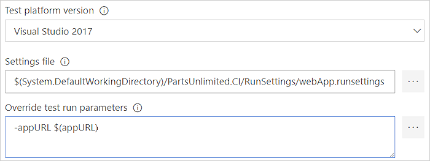

### Q: What are the typical error scenarios or issues I should look out for if my tests don't run?

**A:** Check and resolve issues as follows:

* The release pipeline and stage in which I want to run tests
  aren't shown after I select the build.
   - Make sure the build pipeline that is generating the build is linked
     as the primary artifact in the **Artifacts** tab of the release pipeline.

 
* I get an error that I don't have sufficient permission to trigger a release.
   - Configure **Create releases** and **Manage deployments** permissions for
     the user in the **Security** menu of the release pipeline.
     See [Release permissions](../pipelines/policies/permissions.md#release-pipeline-permissions).

   
* I get an error that no automated tests were found.
   - Check the automation status of the selected tests. Do so in the work item for the test case, or use the **Column options** link in **Azure Test Plans** to add the **Automation status** column to the list of tests. For more information, see the [prerequisites section](run-automated-tests-from-test-hub.md#prerequisites).

* My tests didn't execute, and I suspect the release pipeline is incorrect.
   - Use the link in the **Run summary** page to access the release instance used to run the tests, and view the release logs.
 

* My tests go into the error state, or remain "in-progress" even after release to the stage is triggered.
   - Check if the release stage that you selected has the correct task
     and version selected. You must use version 2 or higher of the **Visual Studio
     Test** task. Version 1 of the task, and the **Run Functional Tests** task,
     aren't supported.
 

## Related articles

* [Associate automated tests with test cases](associate-automated-test-with-test-case.md)
* [Associate automated test results with requirements](../pipelines/test/requirements-traceability.md)
* [Continuous testing scenarios and capabilities](index.yml)
