# Run manual tests

[!INCLUDE [version-lt-eq-azure-devops](../includes/version-lt-eq-azure-devops.md)]

Use Microsoft Test Runner to run manual tests and record results for each test step. You can test both web and desktop applications, run all active tests in a suite or select specific test cases, and run tests against a specific build.

During a test run, you can capture screenshots, record actions, and create or update bugs directly from Test Runner with test steps, screenshots, and comments automatically included.

[!INCLUDE [test-point-definition](includes/test-point-definition.md)]

## Run options

Azure Test Plans provides the following runners for manual tests:

| Runner | Best for | Details |
|--------|----------|---------|
| **Web browser runner** | Web applications | Runs in any supported browser. Supports screenshots, action logs, and screen recordings. |
| **Test Runner desktop client** | Desktop applications | Downloadable Windows x64 client. Supports the same diagnostic data capture as the web runner. [Download Test Runner desktop client](https://aka.ms/ATPTestRunnerDownload). |

[!INCLUDE [retirement-test-runner-client-windows](includes/retirement-test-runner-client-windows.md)]

To access run options, in the **Execute** tab, select a test, and then select **Run with options**. The **Run with options** dialog lets you:

- Select a specific build to test against (see [Run tests for a build](#run-tests-for-a-build))
- Choose between the web browser runner and the Test Runner desktop client
- Run automated tests by using a release stage (see [Run automated tests from test plans](run-automated-tests-from-test-hub.md))

## Prerequisites

[!INCLUDE [prerequisites-run](includes/prerequisites-run.md)] 

[!INCLUDE [prerequisites-tcm](includes/prerequisites-tcm.md)] 

<a name="run-web"></a>

## Run tests for web apps

1. From the web portal, open your project and select **Test Plans** > **Test plans**. If you haven't created test cases yet, see [Create test cases](create-test-cases.md#test-cases).

1. Select **Mine** or **All**, or use **Filter by title** to find your test plan and select it. Select the **Execute** tab.

   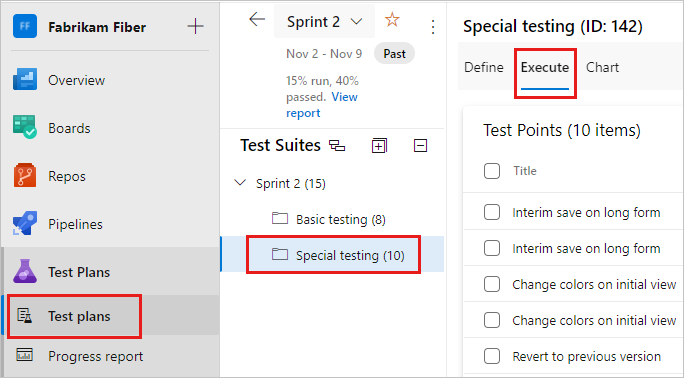

1. Select one or more tests, or all the tests from a test suite. Then select **Run for web application**.

   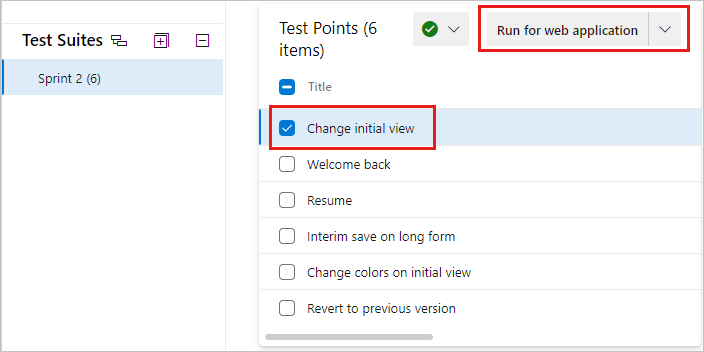

   Microsoft Test Runner opens in a new browser window.

1. Start the app that you want to test.

   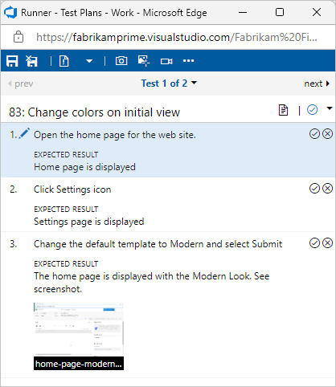

   The app under test doesn't have to run on the same computer as Test Runner. For example, you might run Test Runner on a desktop while testing a mobile or tablet app on a separate device.

1. Mark each test step as either passed or failed based on the expected results.

   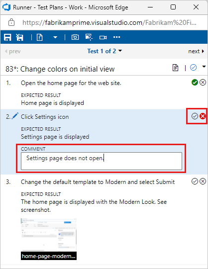

   If a test step fails, you can enter a comment on why it failed or [collect diagnostic data for the test](collect-diagnostic-data.md).
   You can also [create or add to a bug](#create-or-add-to-a-bug).

   > [!IMPORTANT]
   > A test step with an expected result is a *validation test step*. Testers must mark each validation test step as passed or failed. The overall test case result is **failed** if any validation test step is marked as failed or left unmarked.

## Create or add to a bug

When a test step fails, you can create a new bug or update an existing bug directly from Test Runner. Test steps, comments, and diagnostic data are automatically included.

### Create a new bug

1. When a step fails, enter a comment and select **Create bug**.

   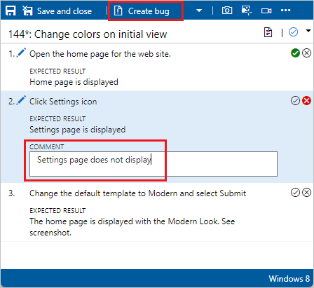

1. In the **New bug** dialog box, enter a name for the bug. The steps and your comments are automatically added.

   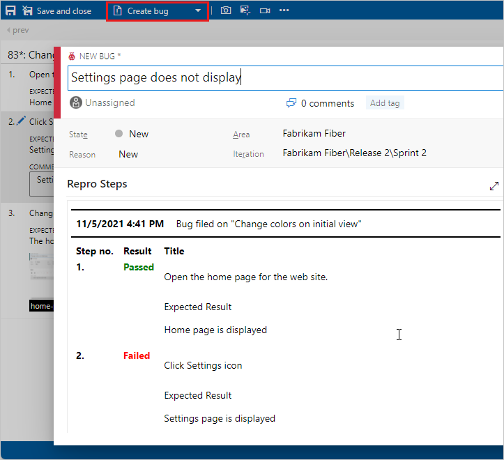

   If Test Runner is running in a web browser, you can paste a screenshot from the clipboard directly into the bug.

1. Optionally, assign the bug, add comments, or link to other work items. Select **Save & Close** when done.

You can see any bugs reported during your test session.

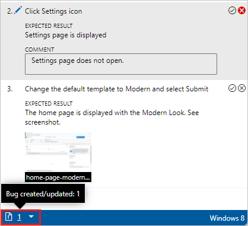

> [!NOTE]
> If the **Create bug** button doesn't launch a bug work item, verify the team settings:
>
> 1. Go to **Project settings** > **Team** and verify that the correct team is set as default.
> 1. Select the **Iterations and Area paths** link to open the Team configuration page.
> 1. Verify that the **Iterations**, **Default**, and **Backlog iterations** match the team for the test case.
> 1. Select **Areas** and verify that the **Default area** matches the team for the test case.

### Add to an existing bug

Instead of creating a bug, you can update an existing bug with the failure details. Select **Add to existing bug** from the **Create bug** drop-down menu.

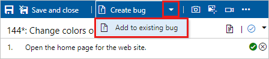

## Save and review results

1. When you finish running tests, select **Save and close**. Azure Test Plans stores all the test results.

1. In the **Execute** tab, view the testing status for your test suite. The most recent result for each test is shown.

   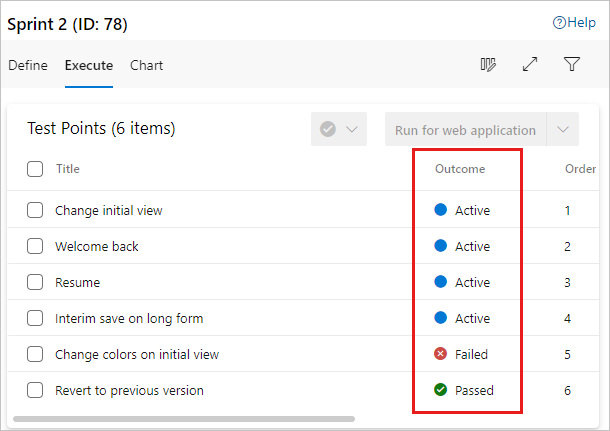
   
   Tests that haven't been run yet show a state of **Active**. To rerun a test, reset its state to **Active**.

1. To view bugs filed during a test, open the test case work item and check the **Related Work** section for child bug links.

   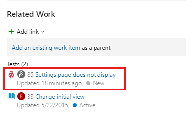     

> [!TIP]
> You can also run tests offline and then import the results. For more information, see the [Offline Test Execution extension](https://marketplace.visualstudio.com/items?itemName=ms-devlabs.OfflineTestExecution).

<a name="run-desktop"></a>

## Run tests for desktop apps

[!INCLUDE [retirement-test-runner-client-windows](includes/retirement-test-runner-client-windows.md)]

You can use the web browser runner to test desktop applications. Run Test Runner in a browser window alongside your desktop app and mark each test step as passed or failed.

1. Follow the steps in [Run tests for web apps](#run-tests-for-web-apps) to open your test plan in the **Execute** tab.

1. Select one or more tests, then select **Run for web application**.

1. Open your desktop app and follow the test steps, marking each step as passed or failed in Test Runner.

The web runner supports screenshots, action logs, and screen recordings for desktop apps. For more information, see [Collect diagnostic data while testing](collect-diagnostic-data.md).

> [!NOTE]
> When you use the web runner for desktop apps, screenshots and action logs capture the browser window, not the desktop application. Use screen recordings to capture the full screen, including the desktop app.

## Run all tests

You can run all the tests in a test suite at once.

Select a test suite and select **Run for web application** or **Run for desktop application** to run all the active tests.

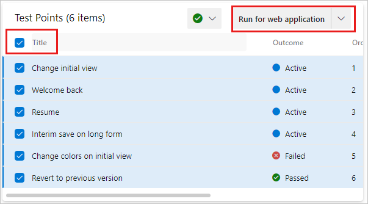

## Run tests for a build

To run tests against a specific build, choose the build from the run options.

1. From the dropdown, select **Run with options**.

   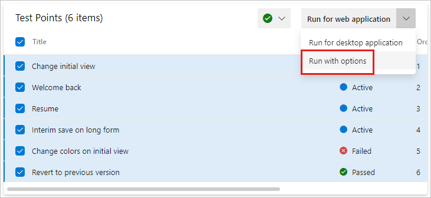

1. In the **Run with options** dialog box, select the build you want.

   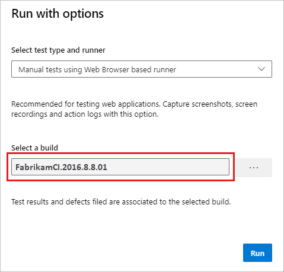

   > [!NOTE]
   > The selected build must be from the project in which the tests are defined.

Select a build for the following options:

- Manual tests that use the web browser-based runner
- Automated tests that use the release stage

The dialog box offers different fields depending on which option you select.
For more information, see [Run options](#run-options).

Any bug you file during the run associates with the selected build.
The test outcome publishes against that build.

## Modify a test step during a test run

Fix problems with your test steps while the test is still running.
Select the **Edit test step** icon.

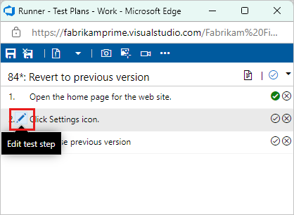

You can insert, reorder, or delete steps.
You can also edit the text itself.

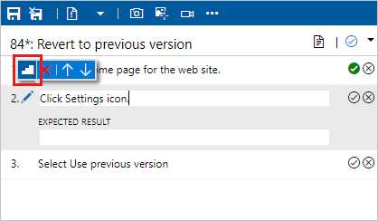

## Capture rich diagnostic data

While running your tests, you can add screenshots, capture actions as a log, and record video or voice.

### Add a screenshot

Add a screenshot to the test results while running a test.

Use the web runner to take screenshots of the web app while testing.
For desktop app testing, use the [Test Runner desktop client](https://aka.ms/ATPTestRunnerDownload).

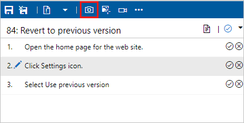

For more information, see [Collect diagnostic data](collect-diagnostic-data.md#web-screenshot).

### Capture actions from a test

Capture your actions on the application as a log.

Use the web runner to capture your actions on the web app as image logs while testing.
For desktop app testing, use the [Test Runner desktop client](https://aka.ms/ATPTestRunnerDownload).

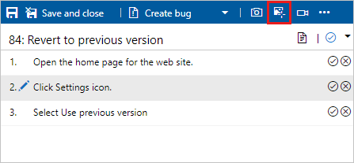

For more information, see [Collect diagnostic data](collect-diagnostic-data.md#web-log).

### Capture screen recordings of your app being tested

Capture screen recordings of your app during testing.

Use the web runner to capture screen recordings of your web and desktop apps while testing.
For desktop app testing, use the [Test Runner desktop client](https://aka.ms/ATPTestRunnerDownload).

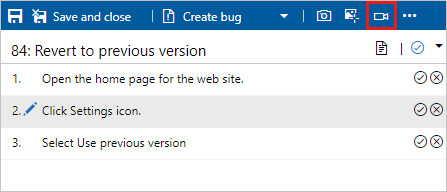

For more information, see [Collect diagnostic data](collect-diagnostic-data.md#web-recording).

## Run tests with TCM

You can run tests that are part of a test plan using the Test Case Management (TCM) command-line tool. This tool lets you create and start a test run, and then manage all your existing test runs. Use the tcm commands documented here to accomplish these tasks.

[List test runs](#list-test-runs) | [Create test runs](#create-test-runs) | [Execute test runs](#execute-test-runs) | [Abort test runs](#abort-test-runs) | [Delete test runs](#delete-test-runs) | [Export test runs](#export-test-runs) | [Publish test runs](#publish-test-runs) 

<a id="list-test-runs"></a> 

### List test runs  

Use `tcm run /list` to list the runs available in a test plan and to show their **ID**. The **ID** corresponds to the work item ID defined when you create the run.

```tcm 
tcm run /list /collection:teamprojectcollectionurl /teamproject:project 
           [/planid:id  |  /querytext:query] [/login:username,[password]]
```

| Parameter | Description |  
|----------|------------| 
|**/planid**:`id`| Optional. Returns only test runs that are associated with the specified test plan.    |
|**/querytext**:`query`| Optional. Specifies the query to use to list a subset of test runs.    |

[!INCLUDE [prerequisites-define](includes/common-tcm-parameters.md)] 

**Example**

The following command lists the test runs defined for the *Fabrikam Fiber* project hosted in the *fabrikamprime* organization. The **ID** and **Title** correspond to the work item ID and title defined for the test run. For example, test run *1000052* is titled *Test Plan for Cycle 1 (Manual)*.  

```tcm 
tcm run /list /collection:https://fabrikamprime.visualstudio.com /teamproject:"Fabrikam Fiber"

Id        Title                              Owner               Date Completed
--------- ---------------------------------- ------------------- -----------
1000006   Sprint 2 (Manual)                  Thomas Margand      11/5/2021
1000032   33 : Change initial view (Manual)  Danielle Brasseur   11/11/2021
1000040   Sprint 2 (Manual)                  Thomas Margand      11/16/2021
1000042   Sprint 3 (Manual)                  Thomas Margand      11/16/2021
1000046   Special testing (Manual)           Nicoletta Guibord   11/18/2021
1000052   Test Plan for Cycle 1 (Manual)     Bukhosi Bhengu      12/1/2021
1000060   Game Shopping (Manual)             Bukhosi Bhengu      12/6/2021
```

<a id="create-test-runs"></a> 

### Create test runs  

Use `tcm run /create` to create a test run associated with the specified test plan. In addition to the test plan, specify the test suite and configuration you want to use by their corresponding **ID**. Use the `tcm plans /list`, `tcm suites /list`, and `tcm configs /list` commands to gather these **IDs**.

```tcm 
tcm run /create /title:title /planid:id /collection:CollectionURL /teamproject:project 
            (suiteid:id /configid:configid | /querytext:query) 
            [/settingsname:name] [/owner:owner] [/builddir:directory]  
            [/testenvironment:name] [/login:username,[password]] [/include]

```

| Parameter | Description |  
|----------|------------|
|**/title**:`title`| Specifies the title for the test run that you create.    |
|**/planid**:`id`| Specifies the test plan where you want to create the test run.    |
|**/suiteid**:`id`| Specifies the test suite that you want to use for your test run.    |
|**/configid**:`id`| Specifies the test configuration you want to run for your test suite.    |
|**/querytext**:`query`| Optional if you specify `suiteid` and `configid`. Specifies the query to use to select the tests that you want to run. <br><br>**Tip:** Use the `/querytest` parameter to run more than one test suite. For example: `querytext:“SELECT * FROM TestPoint WHERE (ConfigurationId=20 OR ConfigurationId=21) AND (Suiteid=1185 OR Suiteid=1186)”`.    |
|**/settingsname**:`name`| Optional. Specifies the test settings that you want to use for this test run. If you don't select test settings, the default test settings in the test plan are used.    |
|**/owner**:`owner`| Optional. Specifies the owner of the test run.    |
|**/builddir**:`directory`| Optional. Specifies the build directory to use to locate the test assemblies for the test. If you don't specify this parameter, the build location is used based on the build that is currently assigned to the test plan.    |
|**/testenvironment**:`name`| Optional. Specifies the test environment that you want to use for this test run. If you don't select a test environment, the default test environment in the test plan is used.    |
|**/include**| Optional. Includes all tests selected for the test run, even if the tests aren't currently in the Active state.    |

[!INCLUDE [prerequisites-define](includes/common-tcm-parameters.md)]

**Example**

The following command creates a test run named **MyTestRun** in the test plan with **ID** *77*. The run uses the test suite with **ID** *161* and the test configuration with **ID** *9*. The run is defined for the *Fabrikam Fiber* project hosted in the *fabrikamprime* organization.

In this example, the test run has an **ID** of *1000082*.  

```tcm 
tcm run /create /title:MyTestRun /planid:77 /collection:https://fabrikamprime.visualstudio.com /teamproject:"Fabrikam Fiber" /suiteid:161 /configid:9

Run created with ID: 1000082.

```

<a id="execute-test-runs"></a>

### Execute test runs  

Use `tcm run /execute` to start one of the runs in your test plan. The **ID** you specify corresponds to the work item ID defined when you create the run. To see a list of all test run identifiers, use the [tcm run /list](#list-test-runs) command.

```tcm
tcm run /execute /id:id /collection:teamprojectcollectionurl /teamproject:project [/login:username,[password]]
```

| Parameter | Description |  
|----------|------------|
|**/id**:`id`| Specifies the **ID** for the test run that you want to run.    |

[!INCLUDE [prerequisites-define](includes/common-tcm-parameters.md)]

**Example**

The following command starts a test run for the **ID** *1000082* for the *Fabrikam Fiber* project hosted in the *fabrikamprime* organization. The results appear in your CLI window.

```tcm 
tcm run /execute /id:1000082 /collection:https://fabrikamprime.visualstudio.com /teamproject:"Fabrikam Fiber"

Executing run: MyTestRun

Results
------------------------
Total:                   2
Passed:                  1
Failed:                  1
Inconclusive:            0
```

<a id="abort-test-runs"></a>

### Abort test runs  

Use `tcm run /abort` to cancel a test run that's in progress. The **ID** you specify corresponds to the work item ID defined when you create the run.

```tcm 
tcm run /abort /id:id /collection:teamprojectcollectionurl /teamproject:project [/login:username,[password]]
```

| Parameter | Description |  
|----------|------------| 
|**/id**:`id`| Specifies the **ID** for the test run that you want to cancel.    |

[!INCLUDE [prerequisites-define](includes/common-tcm-parameters.md)] 

**Example**

The following command stops the test run with the **ID** *1000082* for the *Fabrikam Fiber* project hosted in the *fabrikamprime* organization. The results confirm the **ID** and **Title** of the canceled run.

```tcm 
tcm run /abort /id:1000082 /collection:https://fabrikamprime.visualstudio.com /teamproject:"Fabrikam Fiber"

Run with ID [1000082] and title [MyTestRun] has been aborted.
```

<a id="delete-test-runs"></a>

### Delete test runs  

Use `tcm run /delete` to delete a test run from your test plan. The **ID** you specify corresponds to the work item ID defined when the test run was created.

```tcm 
tcm run /delete /id:id [/noprompt] /collection:teamprojectcollectionurl /teamproject:project [/login:username,[password]]
```

| Parameter | Description |  
|----------|------------| 
|**/id**:`id`| Specifies the **ID** for the test run that you want to delete.    |
|**/noprompt**| Optional. Specifies that the user isn't prompted to confirm deletion of a test run.    |

[!INCLUDE [prerequisites-define](includes/common-tcm-parameters.md)]

**Example**

The following command deletes the test run with the **ID** *1000082* for the *Fabrikam Fiber* project hosted in the *fabrikamprime* organization. The user is prompted to confirm that they want to delete the specified test run and the result is provided.

```tcm
tcm run /delete /id:1000082 /collection:https://fabrikamprime.visualstudio.com /teamproject:"Fabrikam Fiber"

Are you sure you want to delete run [MyTestRun]? (Yes/No) y

Run [MyTestRun] has been deleted.
```

<a id="export-test-runs"></a> 

### Export test runs  

Use `tcm run /export` to export a test run to a specified location. The **ID** you specify corresponds to the work item ID defined when the run was created.

```tcm
tcm run /export /id:id /resultsfile:path /collection:teamprojectcollectionurl /teamproject:project [/login:username,[password]]
```

| Parameter | Description |  
|----------|------------|
|**/id**:`id`| Specifies the test run **ID** that you want to export.    |
|**/resultsfile**:`path`| Specifies a location and filename for the test run you want to export.    |

[!INCLUDE [prerequisites-define](includes/common-tcm-parameters.md)]

**Example**

The following command exports the test run with the **ID** *1000082* for the *Fabrikam Fiber* project hosted in the *fabrikamprime* organization to *c:\temp\ResultsForDeveloper.trx*.

```tcm
tcm run /export /id:1000082 /resultsfile:"c:\temp\ResultsForDeveloper.trx" /collection:https://fabrikamprime.visualstudio.com /teamproject:"Fabrikam Fiber"
```

<a id="publish-test-runs"></a>

### Publish test runs  

Use `tcm run /publish` to publish the results from a Visual Studio test run results file for a specified test plan.

```tcm 
tcm run /publish /suiteid:id /configid:id /resultowner:owner /resultsfile:path 
            /collection:teamprojectcollectionurl /teamproject:project [/title:runtitle] 
            [/runowner:owner] [/build:buildnumber /builddefinition:builddefinition] 
            [/flavor:flavor] [/platform:platform] [/assignfailurestouser:user] 
            [/login:username,[password]] [/buildverification]
```

| Parameter | Description |  
|----------|------------| 
|**/suiteid**:`id`| Specifies the test suite to use when you publish a test run.   |
|**/configid**:`id`| Specifies which test configuration you want to use when you publish a test run.    |
|**/resultowner**:`owner`| Specifies the owner for the test results.    |
|**/resultsfile**:`path`| Specifies the location of the test run you want to publish, for example, "c:\temp\ResultsForDeveloper.trx."    |
|**/title**:`runtitle`| Optional. Specifies a title that you want to use for the test run that you publish.    |
|**/runowner**:`owner`| Optional. Specifies the owner of the test run.    |
|**/build**:`buildnumber`| Optional. Specifies the build number to use to publish a test run. This parameter must be used with `/builddefinition`.    |
|**/builddefinition**:`builddefinition`| Optional. Specifies the build definition to use to publish a test run. This parameter must be used with `/build`.    |
|**/flavor**:`flavor`| Optional. Specifies the build flavor, such as **Release**. This parameter can only be used if the `/build` parameter is used.    |
|**/platform**:`platform`| Optional. Specifies the build platform, such as **x86**. This parameter can only be used if the `/build` parameter is used.    |
|**/assignfailurestouser**:`user`| Optional. Specifies the user to whom any failed tests in the test run are assigned.    |
|**/buildverification**| Optional. Specifies that this test run contains build verification tests that check the basic functionality of your build.    |

[!INCLUDE [prerequisites-define](includes/common-tcm-parameters.md)] 

**Example**

The following command publishes a test run for the test suite with **ID** *161* and test configuration with **ID** *9* and reassigns the owner. This command updates the existing test points for the test cases in the test suite that pairs with this configuration and publishes the results in the specified *.trx* file. The command assigns any failed tests in the test run to the specified user.

```tcm 
tcm run /publish /suiteid:167 /configid:9 /resultowner:"Thomas Margand" /resultsfile:"c:\temp\ResultsForDeveloper.trx" /assignfailurestouser:"Bukhosi Bhengu" /collection:https://fabrikamprime.visualstudio.com /teamproject:"Fabrikam Fiber"
```

## Frequently asked questions

Here are some common questions.

### Q: How do I run a test again?

**A:** Select a test and choose **Run**.

### Q: Can I run all the tests in a test suite together?

**A:** Yes, select a test suite and choose **Run**.
This option runs all the active tests in the test suite.
If you didn't run a test yet, its state is active.
You can reset the state of a test to active if you want to run it again.  

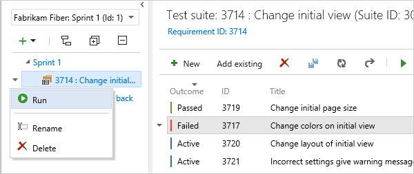

### Q: Can I choose a build to run tests against?

**A:** Yes, choose **Run** and then select **Run with options**.

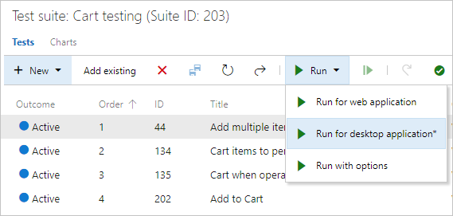

Select the build you want from the drop-down list.

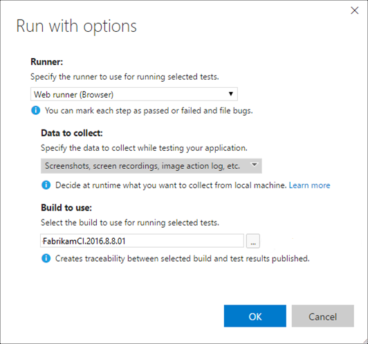 

Any bug you file during the run automatically associates with the selected build.
The test outcome is published against that build.

> [!NOTE]
> The selected build must come from the project where the tests are defined.

### Q: Can I fix my test steps while I'm running a test?

**A:** Yes, if you have Azure Test Plans for Azure DevOps.
You can insert, move, or delete steps.
Or you can edit the text itself.
Use the edit icon next to the test step number.

 

The tool to edit the test steps is shown.

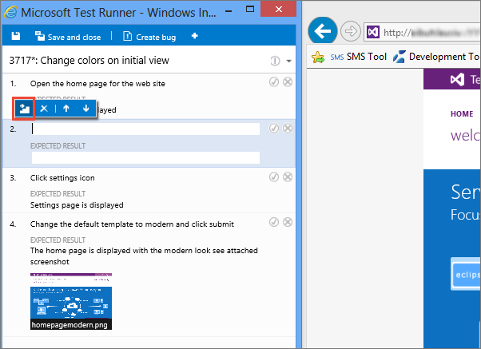

### Q: Can I add a screenshot to the test results when I run a test?

**A:** Use the web runner to take screenshots of the web app while testing.
For desktop app testing, you can download and use the [Test Runner desktop client](https://aka.ms/ATPTestRunnerDownload).

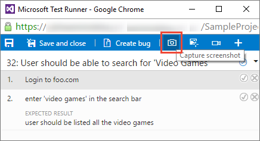

For more information, see [Collect diagnostic data](collect-diagnostic-data.md#web-screenshot).

### Q: Can I capture my actions on the app as a log?

**A:** Use the web runner to capture your actions on the web app as image logs while testing.
For desktop app testing, you can download and use the [Test Runner desktop client](https://aka.ms/ATPTestRunnerDownload).

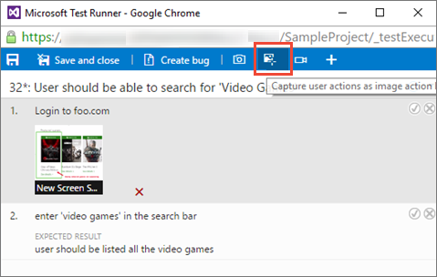

For more information, see [Collect diagnostic data](collect-diagnostic-data.md#web-log).

### Q: Can I capture screen recordings of my app?

**A:** Use the web runner to capture screen recordings of your web and desktop apps while testing.
For desktop app testing, download and use the [Test Runner desktop client](https://aka.ms/ATPTestRunnerDownload).

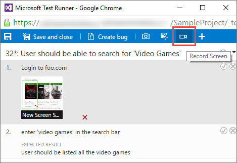

For more information, see [Collect diagnostic data](collect-diagnostic-data.md#web-recording).

### Q: Some of the attachments for the test run don't show the preview option. Why?

**A:** You can preview only files with `.txt` and `.log` extensions. Select the preview option for `.txt` or `.log` files, and another UI opens with the drop-down field showing all the attachments for the test run. If you select a file with an extension type other than `.txt` or `.log`, the following message displays: "You can only preview files with txt and log extensions, click here to download the attachment."

### Q: How do I control how long I keep my test data?

**A:** For more information, see [Set test retention policies](how-long-to-keep-test-results.md).

### Q: Where can I download the Test Runner client?

**A:** Download the [Test Runner desktop client](https://aka.ms/ATPTestRunnerDownload).

### Q: What are the supported operating systems for the Test Runner client?

**A:** The Test Runner desktop client currently supports only the Windows x64 platform.

### Q: I'm observing test run failures when using the Azure Test Runner desktop client.

**A:** Make sure you're using the latest version of Test Runner desktop client. Download the [Test Runner desktop client](https://aka.ms/ATPTestRunnerDownload).

### Q: Does the Azure Test Runner desktop client work on devices with Microsoft Entra Conditional Access enabled?

**A:** Azure Test Runner might not work if your organization uses a conditional access policy via Microsoft Entra. For more information, see [Conditional access common decisions](/entra/identity/conditional-access/overview#common-decisions). This experience is a known limitation and our recommendation is to use web runner in this scenario.

### Q: Can I opt out of telemetry for the Test Runner client?

**A:** No.
The Test Runner desktop client doesn't collect any user-identifiable data.
It doesn't provide an opt-out mechanism.
For more information, see the [Microsoft Privacy policy](https://privacy.microsoft.com/PrivacyStatement).

### Q: Can I run tests offline and then import the results?

**A:** Yes, see the [Offline Test Execution extension](https://marketplace.visualstudio.com/items?itemName=ms-devlabs.OfflineTestExecution).

## Next step

> [!div class="nextstepaction"]
> [View your test progress](track-test-status.md)

## Related content

- [FAQs for manual testing](reference-qa.yml#test-status-tracking-charts)
- [Collect diagnostic data while testing](collect-diagnostic-data.md)
- [Exploratory testing with the Test & Feedback extension in Connected mode](connected-mode-exploratory-testing.md)
- [Run automated tests from test plans](run-automated-tests-from-test-hub.md)

