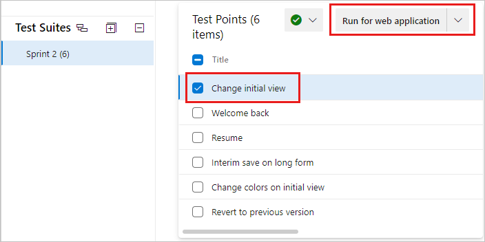
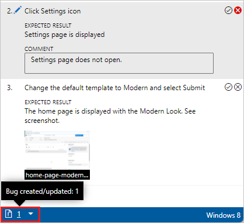

# Run manual tests

[!INCLUDE [version-lt-eq-azure-devops](../includes/version-lt-eq-azure-devops.md)]

Run your manual tests and record the test results for each test step using Microsoft Test Runner.
You can run tests for both web applications and desktop apps.

Test Runner lets you run all active tests as a batch or specific test cases.
Modify tests while running them.
You can run tests for a specific build.

While testing, gather information like a screenshot or your testing actions.
If you find an issue when testing, use Test Runner to create a bug.
Include test steps, screenshots, and comments in the bug.

> [!NOTE]
> You execute test points and not test cases.
> When you add a test case to a test suite, test point(s) are generated.
> A test point represents a unique combination of test case, test suite, configuration, and tester.
>
> For example, a test case named *Test login functionality*, which has two configurations for the Edge and Chrome browsers, generates two test points.
> You can execute or run each of these test points.
> On execution, test results are generated.
> Through the test results view, or execution history, you can see all executions of a test point.
> The latest execution for the test point is what you see in the **Execute** tab.

## Supported clients and run options

In addition to running tests for a specific build, run options support various test scenarios.
To see the options, in the **Execute** tab, select a test, and then select **Run with options**.

**Select test type and runner** offers these options:

- **Manual tests using Web Browser based runner**
  You can select a specific build to test, as described in [Run tests for a build](#run-tests-for-a-build).
  Select **Find builds** to open the **Find builds** dialog box and search for a build to test against.

- **Manual tests using Test Runner client**
  You can run manual tests for desktop applications by using the Test Runner client. If necessary, install the [Test Runner desktop client](https://aka.ms/ATPTestRunnerDownload).

- **Automated tests using release stage**
  To run tests using a release stage, select a build.
  Select a release pipeline and stage to consume the build's artifacts.
  For more information, see [Run automated tests from test plans](run-automated-tests-from-test-hub.md).

- **Manual tests using Microsoft Test Manager 2017 client**
  Collects data from a local machine. Select a build. Select one or more data collectors: **Action log**, **Event log**, **Screen and voice recorder**, and **System information**.

- **Manual tests using Microsoft Test Manager 2015 or earlier client**

The Test Center in the Microsoft Test Manager client is a desktop-based manual testing solution.
Testers can use it for manual testing needs. For more information, see [Guidance on Microsoft Test Manager usage](/previous-versions/azure/devops/test/mtm/guidance-mtm-usage).
To get Microsoft Test Manager, install [Visual Studio Enterprise](https://visualstudio.microsoft.com/downloads/) or [Visual Studio Test Professional](https://visualstudio.microsoft.com/vs/test-professional/).

[!INCLUDE [prerequisites-define](includes/prerequisites-run.md)] 

[!INCLUDE [prerequisites-define](includes/prerequisites-tcm.md)] 

<a name="run-web"></a>

## Run tests for web apps

Follow these steps to run tests for web applications.

::: moniker range=">=azure-devops-2020"
1. From the web portal, open your project and select **Test Plans** > **Test plans**.

1. If you haven't already, [create your manual tests](create-test-cases.md#test-cases).

1. Select **Mine** or **All**, or use **Filter by title** to find your test plan and select it. Select the **Execute** tab.

   

1. Select one or more tests, or all the tests from a test suite. Then select **Run for web application**.

   

   Microsoft Test Runner opens and runs in a new browser.

1. Start the app that you want to test.

   

   Your app doesn't have to run on the same computer as Test Runner.
   You just use Test Runner to record which test steps pass or fail while you manually run a test.

   For example, you might run Test Runner on a desktop computer and run your store app for Windows 8 that you test on a Windows 8 tablet.

1. Mark each test step as either passed or failed based on the expected results.

   

   If a test step fails, you can enter a comment on why it failed or [collect diagnostic data for the test](collect-diagnostic-data.md).
   You can also [Create or add to a bug](#create-or-add-to-a-bug).

::: moniker-end
::: moniker range="<=azure-devops-2019"
1. If you haven't already, [create your manual tests](create-test-cases.md#test-cases).

1. Select a test from a test suite and run it.
      
   

   Microsoft Test Runner opens and runs in a new browser.

1. Start the app that you want to test. Your app doesn't have to run on 
   the same computer as Test Runner. You just use Test Runner to record which 
   test steps pass or fail while you manually run a test. For example, you 
   might run Test Runner on a desktop computer and run your Windows 8 store 
   app that you are testing on a Windows 8 tablet.

   

1. Mark each test step as either passed or failed based on the expected results. If a test step fails, you can enter a comment on why it failed  or
   [collect diagnostic data for the test](collect-diagnostic-data.md). You can also [Create or add to a bug](#create-or-add-to-a-bug).

   

::: moniker-end
   > [!IMPORTANT]
   > Any test step that has expected result is called a *validation test step*. Testers must mark a test step with a status if it is a validation test step. The overall result for a test case reflects the status of all the test steps that the tester marked. Therefore, the test case will have a status of failed if the tester marked any test step as failed or not marked.

## Create or add to a bug

If a test step fails, enter a comment about the behavior and collect diagnostic data.
You can create a bug to capture and track the issue.
You can also update an existing bug with information about the failure.

::: moniker range=">=azure-devops-2020"
1. When a step fails, enter a comment and select **Create bug**.

   

1. In the **New bug** dialog box, enter a name for the bug.

   

   The steps and your comments are automatically added to the bug.
   If Test Runner is running in a web browser window, you can copy a screenshot from the clipboard directly into the bug.

1. You can assign the bug, enter comments, or link to other issues. Select **Save & Close** when done.
   The test case is linked to the bug you created.

You can see any bugs reported during your test session.



Instead of creating a bug, you can update an existing bug with information about this step. Select **Add to existing bug** from the **Create bug** drop-down menu.


::: moniker-end

::: moniker range="<=azure-devops-2019"
1. In the Test Runner window, select **Create bug**.

   

   The steps and your comments are automatically added to the bug.
   If Test Runner is running in a web browser window, you can copy a screenshot from the clipboard directly into the bug.

1. You can assign the bug, enter comments, or link to other issues. Select **Save & Close** when done.
   The test case is linked to the bug you created.

You can see any bugs that you reported during your test session.


Instead of creating a bug, you can update an existing bug with information about this step.
Select the **+** icon for **Create bug**, then **Add to existing bug**.
Find and update an existing bug.
::: moniker-end

## Save results, close the session, and review results

After you complete testing, save your results, close the session, and review test results.

1. When you've run all your tests, select **Save and close**.
   All the test results are stored in Azure Test Plans.

1. View the testing status for your test suite.
   You see the most recent results for each test.

   ::: moniker range=">=azure-devops-2020"
   
   ::: moniker-end
   ::: moniker range="<=azure-devops-2019"
   
   ::: moniker-end

   If you haven't run a test yet, its state is active.
   Reset the state of a test to active if you want to rerun it.  

1. Open a test suite and choose the test case in the **Related Work** section.
   Then use the child links in the **Related Work** section of that work item to view the bugs filed by the tester.

   ::: moniker range=">=azure-devops-2020"
     
   ::: moniker-end
   ::: moniker range="<=azure-devops-2019"
   
   ::: moniker-end  

You can run tests offline and then import the results. For more information, see the [Offline Test Execution extension](https://marketplace.visualstudio.com/items?itemName=ms-devlabs.OfflineTestExecution).

<a name="run-desktop"></a>

## Run tests for desktop apps
::: moniker range=">=azure-devops-2020"

If you want to collect more diagnostic data for your desktop application, run your tests using Test Runner client.

1. From the web portal, open your project and select **Test Plans** > **Test plans**.

1. Select **Mine** or **All**, or use **Filter by title** to find your test plan and select it. Select the **Execute** tab.

   

1. Launch Test Runner from Azure Test Plans by selecting **Run for desktop application** from the dropdown menu.

   

1. If necessary, download and install the [Test Runner desktop client](https://aka.ms/ATPTestRunnerDownload).

   

   > [!NOTE]
   > Check that the Test Runner client is available for your platform. Currently, the Test Runner client is available only for x64.

1. Select **Launch** and start testing as described in the previous section. For more information about data collection, see [Collect diagnostic data while testing](collect-diagnostic-data.md).

::: moniker-end

::: moniker range="<=azure-devops-2019"

If you want to collect more diagnostic data for your desktop application, run your tests using Test Runner client:

1. Launch the test runner client from Azure Test Plans by choosing **Run for desktop application** from the **Run** menu. 

   

1. **Download** and install the [Test Runner desktop client](https://aka.ms/ATPTestRunnerDownload) if you haven't already set it up:

   

   > [!NOTE]
   > Check that the Test Runner client is available for your platform. Currently, the Test Runner client is available only for x64.

1. Choose **Launch** and start testing the same way as [described above](#run-web) for web apps. For more information about data collection, see [Collect diagnostic data while testing](collect-diagnostic-data.md).

::: moniker-end

## Run all tests

You can run all the tests in a test suite at once.

::: moniker range=">=azure-devops-2020"
Select a test suite and select **Run for web application** or **Run for desktop application** to run all the active tests.


::: moniker-end
::: moniker range="<=azure-devops-2019"
Select a test suite and select **Run** to run all the active tests.

 
::: moniker-end

## Run tests for a build

Choose a build to run tests against.

::: moniker range=">=azure-devops-2020"
1. From the dropdown, select **Run with options**.

   

1. In the **Run with options** dialog box, select the build you want.

   
::: moniker-end
::: moniker range="<=azure-devops-2019"
1. Choose **Run** and then select **Run with options**.

   

1. Select the build you want.

   
::: moniker-end

   > [!NOTE]
   > The selected build must be from the project in which the tests are defined.

You can select a build for the following options:

- Manual tests using Web Browser based runner
- Automated tests using release stage
- Manual tests using Microsoft Test Manager 2017 client

The fields that the dialog box offers differ depending on which option you select.
For more information, see [Supported clients and run options](#supported-clients-and-run-options).

Any bug filed during the run is associated with the selected build.
The test outcome will be published against that build.

## Modify a test step during a test run

Fix problems with your test steps while the test is still running.
Select the **Edit test step** icon.

::: moniker range=">=azure-devops-2020"

::: moniker-end
::: moniker range="<=azure-devops-2019"

::: moniker-end

You can insert, reorder, or delete steps.
You can also edit the text itself.

::: moniker range=">=azure-devops-2020"

::: moniker-end
::: moniker range="<=azure-devops-2019"

::: moniker-end

## Capture rich diagnostic data

While running your tests, you can add screenshots, capture actions as a log, and record video or voice.

### Add a screenshot

Add a screenshot to the test results while running a test.

If you use Google Chrome or Firefox, use the web runner to take screenshots of the web app while testing.
For Microsoft Internet Explorer or Microsoft Edge browsers, or for desktop app testing, use the [Test Runner desktop client](https://aka.ms/ATPTestRunnerDownload).

::: moniker range=">=azure-devops-2020"

::: moniker-end
::: moniker range="<=azure-devops-2019"

::: moniker-end

For more information, see [Collect diagnostic data](collect-diagnostic-data.md#web-screenshot).

### Capture actions from a test

Capture your actions on the application as a log.

If you use Google Chrome or Firefox, use the web runner capture your actions on the web app as image logs while testing.
For Microsoft Internet Explorer or Microsoft Edge browsers, or for desktop app testing, use the [Test Runner desktop client](https://aka.ms/ATPTestRunnerDownload).

::: moniker range=">=azure-devops-2020"

::: moniker-end
::: moniker range="<=azure-devops-2019"

::: moniker-end

For more information, see [Collect diagnostic data](collect-diagnostic-data.md#web-log).

### Capture screen recordings of your app being tested

Capture screen recordings of my app during testing.

If you use Google Chrome or Firefox, use the web runner to capture screen recordings of your web and desktop apps while testing.
For Microsoft Internet Explorer or Microsoft Edge browsers, or for desktop app testing, use the [Test Runner desktop client](https://aka.ms/ATPTestRunnerDownload).

::: moniker range=">=azure-devops-2020"

::: moniker-end
::: moniker range="<=azure-devops-2019"

::: moniker-end

For more information, see [Collect diagnostic data](collect-diagnostic-data.md#web-recording).

## Run tests with TCM

You can run tests that are part of a test plan using the TCM command-line tool. This tool lets you create and start a test run, and then manage all your existing test runs. Use the tcm commands documented here to accomplish these tasks.

[List test runs](#list-test-runs) | [Create test runs](#create-test-runs) | [Execute test runs](#execute-test-runs) | [Abort test runs](#abort-test-runs) | [Delete test runs](#delete-test-runs) | [Export test runs](#export-test-runs) | [Publish test runs](#publish-test-runs) 

<a id="list-test-runs" /> 

### List test runs  

Use `tcm run /list` to list the runs available in a test plan and to show their **ID**.  The **ID** corresponds to the work item ID defined when the run was created.


```tcm 
tcm run /list /collection:teamprojectcollectionurl /teamproject:project 
           [/planid:id  |  /querytext:query] [/login:username,[password]]
```

| Parameter | Description |  
|----------|------------| 
|**/planid**:`id`| Optional. Indicates that only those test runs associated with the specified test plan are returned in the list.    |
|**/querytext**:`query`| Optional. Specifies the query to use to list a subset of test runs.    |


[!INCLUDE [prerequisites-define](includes/common-tcm-parameters.md)] 


**Example**

The following command lists the test runs defined for the *Fabrikam Fiber* project hosted in the *fabrikamprime* organization. The **ID** and **Title** correspond to the work item ID and title defined for the test run. For example, test run *1000052* is titled *Test Plan for Cycle 1 (Manual)*.  

```tcm 
tcm run /list /collection:https://fabrikamprime.visualstudio.com /teamproject:"Fabrikam Fiber"

Id        Title                              Owner               Date Completed
--------- ---------------------------------- ------------------- -----------
1000006   Sprint 2 (Manual)                  Thomas Margand      11/5/2021
1000032   33 : Change initial view (Manual)  Danielle Brasseur   11/11/2021
1000040   Sprint 2 (Manual)                  Thomas Margand      11/16/2021
1000042   Sprint 3 (Manual)                  Thomas Margand      11/16/2021
1000046   Special testing (Manual)           Nicoletta Guibord   11/18/2021
1000052   Test Plan for Cycle 1 (Manual)     Bukhosi Bhengu      12/1/2021
1000060   Game Shopping (Manual)             Bukhosi Bhengu      12/6/2021
```

<a id="create-test-runs" /> 

### Create test runs  

Use `tcm run /create` to create a test run associated with the specified test plan. In addition to the test plan, you also define the test suite and configuration you want to use by their corresponding **ID**. You can gather these **IDs** using the `tcm plans /list`, `tcm suites /list`, and `tcm configs /list` commands.

```tcm 
tcm run /create /title:title /planid:id /collection:CollectionURL /teamproject:project 
            (suiteid:id /configid:configid | /querytext:query) 
            [/settingsname:name] [/owner:owner] [/builddir:directory]  
            [/testenvironment:name] [/login:username,[password]] [/include]

```

| Parameter | Description |  
|----------|------------|
|**/title**:`title`| Specifies the title that you want to use for the test run that you create.    |
|**/planid**:`id`| Specifies the test plan that where you want to create the test run.    |
|**/suiteid**:`id`| Specifies the test suites that you want to use for your test run.    |
|**/configid**:`id`| Specifies the test configuration you want to run for your test suites.    |
|**/querytext**:`query`| Optional if you specify `suiteid` and `configid`. Specifies the query to use to select the tests that you want to run. <br><br>**Tip:** You can use the `/querytest` parameter to run more than one test suite. For example: `querytext:“SELECT * FROM TestPoint WHERE (ConfigurationId=20 OR ConfigurationId=21) AND (Suiteid=1185 OR Suiteid=1186)”`.    |
|**/settingsname**:`name`| Optional. Specifies the test settings that you want to use for this test run. If you don't select test settings, the default test settings in the test plan are used.    |
|**/owner**:`owner`| Optional. Specifies the owner of the test run.    |
|**/builddir**:`directory`| Optional. Specifies the build directory to use to locate the test assemblies for the test. If this isn't specified, the build location is used based on the build that is currently assigned to the test plan.    |
|**/testenvironment**:`name`| Optional. Specifies the test environment that you want to use for this test run. If you don't select a test environment, the default test environment in the test plan is used.    |
|**/include**| Optional. Specifies that all tests that are selected for the test run are included, even if the tests are not currently set to the Active state.    |

[!INCLUDE [prerequisites-define](includes/common-tcm-parameters.md)]

**Example**

The following command creates a test run called **MyTestRun** in the test plan with **ID** *77*. The run uses the test suite with **ID** *161* and the test configuration with **ID** *9*. The run is defined for the *Fabrikam Fiber* project hosted in the *fabrikamprime* organization.

In this example, a test run is created with an **ID** of *1000082*.  

```tcm 
tcm run /create /title:MyTestRun /planid:77 /collection:https://fabrikamprime.visualstudio.com /teamproject:"Fabrikam Fiber" /suiteid:161 /configid:9

Run created with ID: 1000082.

```

<a id="execute-test-runs" /> 

### Execute test runs  

Use `tcm run /execute` to kick off one of the runs in your test plan. The **ID** you specify corresponds to the work item ID defined when the run was created. You can see a list of all test run IDs with the [tcm run /list](#list-test-runs) command.

```tcm
tcm run /execute /id:id /collection:teamprojectcollectionurl /teamproject:project [/login:username,[password]]
```

| Parameter | Description |  
|----------|------------|
|**/id**:`id`| Specifies the **ID** for the test run that you want to run.    |

[!INCLUDE [prerequisites-define](includes/common-tcm-parameters.md)]

**Example**

The following command starts a test run for the **ID** *1000082* for the *Fabrikam Fiber* project hosted in the *fabrikamprime* organization. The results are returned in your CLI window.

```tcm 
tcm run /execute /id:1000082 /collection:https://fabrikamprime.visualstudio.com /teamproject:"Fabrikam Fiber"

Executing run: MyTestRun

Results
------------------------
Total:                   2
Passed:                  1
Failed:                  1
Inconclusive:            0
```

<a id="abort-test-runs" /> 

### Abort test runs  

Use `tcm run /abort` to cancel a test run that is in progress. The **ID** you specify corresponds to the work item ID defined when the run was created.

```tcm 
tcm run /abort /id:id /collection:teamprojectcollectionurl /teamproject:project [/login:username,[password]]
```

| Parameter | Description |  
|----------|------------| 
|**/id**:`id`| Specifies the **ID** for the test run that you want to cancel.    |


[!INCLUDE [prerequisites-define](includes/common-tcm-parameters.md)] 

**Example**

The following command stops the test run with the **ID** *1000082* for the *Fabrikam Fiber* project hosted in the *fabrikamprime* organization. The results confirm the **ID** and **Title** of the cancelled run.

```tcm 
tcm run /abort /id:1000082 /collection:https://fabrikamprime.visualstudio.com /teamproject:"Fabrikam Fiber"

Run with ID [1000082] and title [MyTestRun] has been aborted.
```

<a id="delete-test-runs" /> 

### Delete test runs  

Use `tcm run /delete` to delete a test run from your test plan. The **ID** you specify corresponds to the work item ID defined when the test run was created.

```tcm 
tcm run /delete /id:id [/noprompt] /collection:teamprojectcollectionurl /teamproject:project [/login:username,[password]]
```

| Parameter | Description |  
|----------|------------| 
|**/id**:`id`| Specifies the **ID** for the test run that you want to delete.    |
|**/noprompt**| Optional. Specifies that the user isn't prompted to confirm deletion of a test run.    |

[!INCLUDE [prerequisites-define](includes/common-tcm-parameters.md)]

**Example**

The following command deletes the test run with the **ID** *1000082* for the *Fabrikam Fiber* project hosted in the *fabrikamprime* organization. The user is prompted to confirm that they want to delete the specified test run and the result is provided.

```tcm
tcm run /delete /id:1000082 /collection:https://fabrikamprime.visualstudio.com /teamproject:"Fabrikam Fiber"

Are you sure you want to delete run [MyTestRun]? (Yes/No) y

Run [MyTestRun] has been deleted.
```

<a id="export-test-runs" /> 

### Export test runs  

Use `tcm run /export` to export a test run to a specified location. The **ID** you specify corresponds to the work item ID defined when the run was created.

```tcm
tcm run /export /id:id /resultsfile:path /collection:teamprojectcollectionurl /teamproject:project [/login:username,[password]]
```

| Parameter | Description |  
|----------|------------|
|**/id**:`id`| Specifies the test run **ID** that you want to export.    |
|**/resultsfile**:`path`| Specifies a location and filename for the test run you want to export.    |

[!INCLUDE [prerequisites-define](includes/common-tcm-parameters.md)]

**Example**

The following command specifies that the test run with the **ID** *1000082* for the *Fabrikam Fiber* project hosted in the *fabrikamprime* organization is exported to *c:\temp\ResultsForDeveloper.trx*.

```tcm
tcm run /export /id:1000082 /resultsfile:"c:\temp\ResultsForDeveloper.trx" /collection:https://fabrikamprime.visualstudio.com /teamproject:"Fabrikam Fiber"
```

<a id="publish-test-runs" /> 

### Publish test runs  

Use `tcm run /publish` to publish the results from a Visual Studio test run results file for a specified test plan.

```tcm 
tcm run /publish /suiteid:id /configid:id /resultowner:owner /resultsfile:path 
            /collection:teamprojectcollectionurl /teamproject:project [/title:runtitle] 
            [/runowner:owner] [/build:buildnumber /builddefinition:builddefinition] 
            [/flavor:flavor] [/platform:platform] [/assignfailurestouser:user] 
            [/login:username,[password]] [/buildverification]
```

| Parameter | Description |  
|----------|------------| 
|**/suiteid**:`id`| Specifies the test suite to use when you publish a test run.   |
|**/configid**:`id`| Specifies which test configuration you want to use when you publish a test run.    |
|**/resultowner**:`owner`| Specifies the owner for the test results.    |
|**/resultsfile**:`path`| Specifies the location of the test run you want to publish. For example, "c:\temp\ResultsForDeveloper.trx".    |
|**/title**:`runtitle`| Optional. Specifies a title that you want to use for the test run that you publish.    |
|**/runowner**:`owner`| Optional. Specifies the owner of the test run.    |
|**/build**:`buildnumber`| Optional. Specifies the build number to use to publish a test run. This parameter must be used with `/builddefinition`.    |
|**/builddefinition**:`builddefinition`| Optional. Specifies the build definition to use to publish a test run. This parameter must be used with `/build`.    |
|**/flavor**:`flavor`| Optional. Specifies the build flavor, such as **Release**. This parameter can only be used if the `/build` parameter is used.    |
|**/platform**:`platform`| Optional. Specifies the build platform, such as **x86**. This parameter can only be used if the `/build` parameter is used.    |
|**/assignfailurestouser**:`user`| Optional. Specifies the user to whom any failed tests in the test run are assigned.    |
|**/buildverification**| Optional. Specifies that this test run contains build verification tests that check the basic functionality of your build.    |

[!INCLUDE [prerequisites-define](includes/common-tcm-parameters.md)] 

**Example**

The following command publishes a test run for the test suite with **ID** *161* and test configuration with **ID** *9* and reassigns the owner. This updates the existing test points for the test cases in the test suite that is paired with this configuration and publishes the results in the specified *.trx* file. And any failed tests in the test run are assigned to the specified user.

```tcm 
tcm run /publish /suiteid:167 /configid:9 /resultowner:"Thomas Margand" /resultsfile:"c:\temp\ResultsForDeveloper.trx" /assignfailurestouser:"Bukhosi Bhengu" /collection:https://fabrikamprime.visualstudio.com /teamproject:"Fabrikam Fiber"
```

## Frequently asked questions

Here are some common questions.

### Q: How do I rerun a test?

**A:** Just select any test and choose **Run**.

### Q: Can I run all the tests in a test suite together?

**A:** Yes, select a test suite and choose **Run**.
This option runs all the active tests in the test suite.
If you haven't run a test yet, its state is active.
You can reset the state of a test to active if you want to rerun it.  


### Q: Can I choose a build to run tests against?

**A:** Yes, Choose **Run** and then select **Run with options**.


Select the build you want from the drop-down list.

 

Any bug filed during the run will automatically be associated with the selected build.
The test outcome will be published against that build.

> [!NOTE]
> The selected build must be from the project in which the tests are defined.

### Q: Can I fix my test steps while I'm running a test?

**A:** Yes, if you have Azure Test Plans for Azure DevOps.
You can insert, move, or delete steps.
Or you can edit the text itself.
Use the edit icon next to the test step number.

 

The tool to edit the test steps is shown.


### Q: Can I add a screenshot to the test results when I run a test?

**A:** If you're using Google Chrome or Firefox, use the web runner to take screenshots of the web app while testing.
For Microsoft Internet Explorer or Microsoft Edge browsers, or for desktop app testing, you can download and use the [Test Runner desktop client](https://aka.ms/ATPTestRunnerDownload).


For more information, see [Collect diagnostic data](collect-diagnostic-data.md#web-screenshot).

### Q: Can I capture my actions on the app as a log?

**A:** If you're using Google Chrome or Firefox, use the web runner capture your actions on the web app as image logs while testing.
For Microsoft Internet Explorer or Microsoft Edge browsers, or for desktop app testing, you can download and use the [Test Runner desktop client](https://aka.ms/ATPTestRunnerDownload).


For more information, see [Collect diagnostic data](collect-diagnostic-data.md#web-log).

### Q: Can I capture screen recordings of my app?

**A:** If you're using Google Chrome or Firefox, use the web runner to capture screen recordings of your web and desktop apps while testing.
For Microsoft Internet Explorer or Microsoft Edge browsers, or for desktop app testing, download and use the [Test Runner desktop client](https://aka.ms/ATPTestRunnerDownload).


For more information, see [Collect diagnostic data](collect-diagnostic-data.md#web-recording).

### Q: How do I control how long I keep my test data?

**A:** For more information, see [Set test retention policies](how-long-to-keep-test-results.md).

### Q: Where can I download the Test Runner client?

**A:** Download the [Test Runner desktop client](https://aka.ms/ATPTestRunnerDownload).

### Q: What are the supported operating systems for the Test Runner client?

**A:** The Test Runner desktop client is currently supported only on Windows.

### Q: Can I opt out of telemetry for the Test Runner client?

**A:** No.
The Test Runner desktop client doesn't collect any user-identifiable data.
No opt-out mechanism is provided.
For more information, see [Microsoft Privacy policy](https://privacy.microsoft.com/PrivacyStatement).

### Q: Can I run tests offline and then import the results?

**A:** Yes, see the [Offline Test Execution extension](https://marketplace.visualstudio.com/items?itemName=ms-devlabs.OfflineTestExecution).

## Next step

> [!div class="nextstepaction"]
> [View your test progress](track-test-status.md)

## Related articles

- [FAQs for manual testing](reference-qa.yml#runtests)
- [Collect diagnostic data while testing](collect-diagnostic-data.md)
- [Exploratory testing with the Test & Feedback extension in Connected mode](connected-mode-exploratory-testing.md)
- [Run automated tests from test plans](run-automated-tests-from-test-hub.md)
- [Run manual tests with Microsoft Test Manager](/previous-versions/azure/devops/test/mtm/run-manual-tests-with-microsoft-test-manager)
