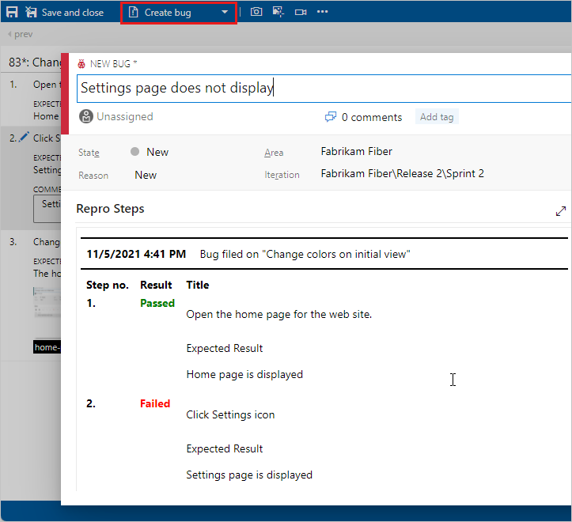

# Run manual tests

[!INCLUDE [version-header](includes/version-header.md)] 

Run your manual tests and record the test results for each test step 
using Microsoft Test Runner. If you find an issue when testing, 
use Test Runner to create a bug. Test steps, screenshots, and comments 
are automatically included in the bug. 
You can use the web runner for web apps, or the desktop runner for desktop app data collection.  

 
[!INCLUDE [prerequisites-define](includes/prerequisites-run.md)] 

## Run tests for web apps
::: moniker range=">=azure-devops-2020"
1. If you haven't already, [create your manual tests](create-test-cases.md#test-cases).

1. Select a test from a test suite and run it.
      
   

   Microsoft Test Runner opens and runs in a new browser.

1. Start the app that you want to test. Your app doesn't have to run on 
   the same computer as Test Runner. You just use Test Runner to record which 
   test steps pass or fail while you manually run a test. For example, you 
   might run Test Runner on a desktop computer and run your Windows 8 store 
   app that you test on a Windows 8 tablet.

   

1. Mark each test step as either passed or failed based on the expected results. If a test step fails, you can enter a comment on why it failed  or
   [collect diagnostic data for the test](collect-diagnostic-data.md).

   

   > [!IMPORTANT]
   >  Any test step that has expected result is called a validation test step. Testers must mark a test step with a status if it is a validation test step. The overall result for a test case reflects the status of all the test steps that the tester marked. Therefore, the test case will have a status of failed if the tester marked any test step as failed or not marked.
 
1. Create a bug to describe what failed.

   

   The steps and your comments are automatically added to the bug. Also, 
   the test case is linked to the bug.

   If Test Runner is running in a web browser window, 
   you can copy a screenshot from the clipboard directly into the bug.

1. You can see any bugs reported during your test session.

   

1. When you've run all your tests, save the results and close Test Runner. 
   All the test results are stored in Azure Test Plans.
   [How do I resume testing, or run one or more tests again?](reference-qa.md#qanda)

1. View the testing status for your test suite.
   You see the most recent results for each test.

   

1. Open a test and choose the test case in the **Related Work** section.
   Then use the **Child** links in the **Related Work** section of that 
   work item to view the bugs filed by the tester.
   
     

[Can I run tests offline and then import the results?](reference-qa.md#runoffline)
::: moniker-end

::: moniker range="<=azure-devops-2019"
1. If you haven't already, [create your manual tests](create-test-cases.md#test-cases).

1. Select a test from a test suite and run it.
      
   

   Microsoft Test Runner opens and runs in a new browser.

1. Start the app that you want to test. Your app doesn't have to run on 
   the same computer as Test Runner. You just use Test Runner to record which 
   test steps pass or fail while you manually run a test. For example, you 
   might run Test Runner on a desktop computer and run your Windows 8 store 
   app that you are testing on a Windows 8 tablet.

   

1. Mark each test step as either passed or failed based on the expected results. If a test step fails, you can enter a comment on why it failed  or
   [collect diagnostic data for the test](collect-diagnostic-data.md).

   

   > [!IMPORTANT]
   >  Any test step that has expected result is called a validation test step. Testers must mark a test step with a status if it is a validation test step. The overall result for a test case reflects the status of all the test steps that the tester marked. Therefore, the test case will have a status of failed if the tester marked any test step as failed or not marked.
 
1. Create a bug to describe what failed.

   

   The steps and your comments are automatically added to the bug. Also, 
   the test case is linked to the bug.

   If Test Runner is running in a web browser window, 
   you can copy a screenshot from the clipboard directly into the bug.

1. You can see any bugs that you have reported during your test session.

   

1. When you've run all your tests, save the results and close Test Runner. 
   All the test results are stored in Azure DevOps.
   [How do I resume testing, or run one or more tests again?](reference-qa.md#qanda)

1. View the testing status for your test suite.
   You see the most recent results for each test.

   

1. Open a test and choose the test case in the **Related Work** section.
   Then use the **Child** links in the **Related Work** section of that 
   work item to view the bugs filed by the tester.
   
     

[Can I run tests offline and then import the results?](reference-qa.md#runoffline)
::: moniker-end

## Run tests for desktop apps
::: moniker range=">=azure-devops-2020"

If you want to collect more diagnostic data for your desktop application, run your tests using Test Runner client:

1. Launch the test runner client from Azure Test Plans by choosing **Run for desktop application** from the **Run** menu. 

   

1. **Download** and install the [Test Runner desktop client](https://aka.ms/ATPTestRunnerDownload) if you haven't already set it up:

   

   > [!NOTE]
   > Check that the Test Runner client is available for your platform. Currently, the Test Runner client is available only for x64.

1. Choose **Launch** and start testing the same way as [described above](#run-web) for web apps. For more information about data collection, see [Collect diagnostic data while testing](collect-diagnostic-data.md).

[Can I run tests offline and then import the results?](reference-qa.md#runoffline)
::: moniker-end

::: moniker range="<=azure-devops-2019"

If you want to collect more diagnostic data for your desktop application, run your tests using Test Runner client:

1. Launch the test runner client from Azure Test Plans by choosing **Run for desktop application** from the **Run** menu. 

   

1. **Download** and install the [Test Runner desktop client](https://aka.ms/ATPTestRunnerDownload) if you haven't already set it up:

   

   > [!NOTE]
   > Check that the Test Runner client is available for your platform. Currently, the Test Runner client is available only for x64.

1. Choose **Launch** and start testing the same way as [described above](#run-web) for web apps. For more information about data collection, see [Collect diagnostic data while testing](collect-diagnostic-data.md).

[Can I run tests offline and then import the results?](reference-qa.md#runoffline)
::: moniker-end

## Use test options
::: moniker range=">=azure-devops-2020"

### Run all tests

You can run all the tests in a test suite at once.

Select a test suite and choose **Run** to run all the active tests.
If you haven't run a test yet, its state is active.
You can reset the state of a test to active if you want to rerun it.  

If you haven't run a test yet, its state is active.
You can reset the state of a test to active if you want to rerun it.  

### Run tests for a build

You can choose a build to run tests against. Select **Run** and then select **Run with options**.

 

Select the build you want from the drop-down list.

Any bug filed during the run will automatically be associated with the selected build.
The test outcome will be published against that build.

> [!NOTE]
> The selected build must be from the project in which the tests are defined.

### Modify a test step during a test run

You can fix problems with your test steps while the test is still running.

Use the edit icon next to the test step number to insert, reorder, or delete steps. You can also edit the text itself.

The tool to edit the test steps is shown.

### Add a screenshot

You can add a screenshot to the test results while running a test.

If you use Google Chrome or Firefox, use the web runner to take screenshots of the web app while testing.
For Microsoft Internet Explorer or Microsoft Edge browsers, or for desktop app testing, use the [Test Runner desktop client](https://aka.ms/ATPTestRunnerDownload).

For more information, see [Collect diagnostic data](collect-diagnostic-data.md#web-screenshot).

### Capture actions from a test

You can capture your actions on the app as a log.

If you use Google Chrome or Firefox, use the web runner capture your actions on the web app as image logs while testing.
For Microsoft Internet Explorer or Microsoft Edge browsers, or for desktop app testing, use the [Test Runner desktop client](https://aka.ms/ATPTestRunnerDownload).

For more information, see [Collect diagnostic data](collect-diagnostic-data.md#web-log).

### Capture screen recordings of your app being tested

You can capture screen recordings of my app during testing.

If you use Google Chrome or Firefox, use the web runner to capture screen recordings of your web and desktop apps while testing.
For Microsoft Internet Explorer or Microsoft Edge browsers, or for desktop app testing, use the [Test Runner desktop client](https://aka.ms/ATPTestRunnerDownload).

For more information, see [Collect diagnostic data](collect-diagnostic-data.md#web-recording).

::: moniker-end

## Next step

> [!div class="nextstepaction"]
> [View your test progress](track-test-status.md)

## Related articles

- [FAQs for manual testing](reference-qa.md#runtests)
