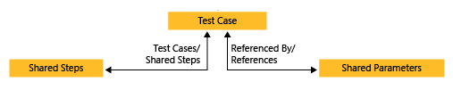
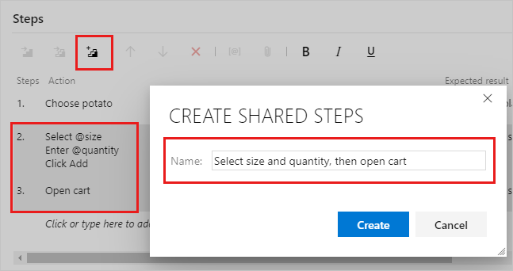
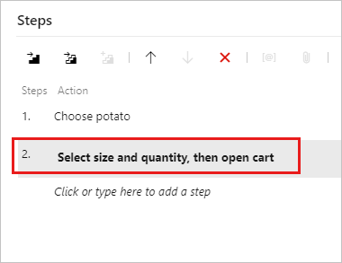
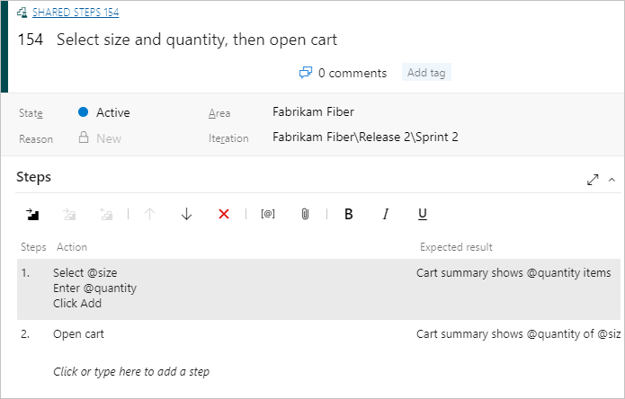
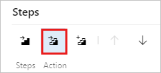
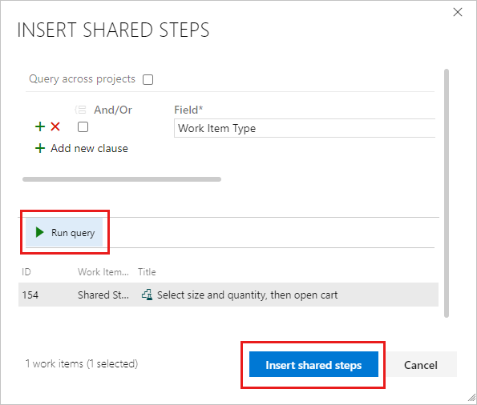
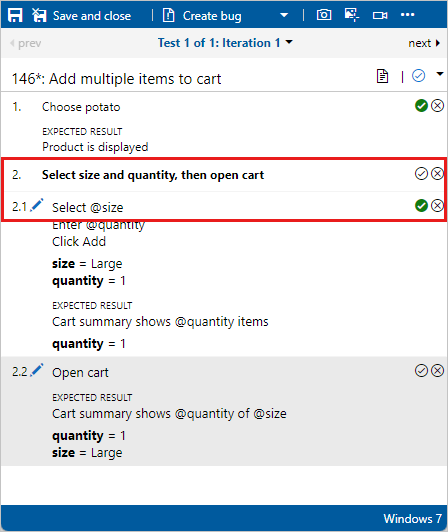

# Share steps between test cases

[!INCLUDE [version-lt-eq-azure-devops](../includes/version-lt-eq-azure-devops.md)]

Many manual tests require performing an identical sequence of steps and test data. For example, logging in to a web app or saving form data are common steps performed in several test sequences. With the use of **Shared Steps** and **Shared Parameters** work items, you can minimize the creation of test steps and data that you need to enter and manage. **Shared Steps** define a sequence of steps that can be referenced by many different test cases. Similarly, **Shared Parameters** define a set of test data that can be referenced by many different test cases. These work item types are explicitly linked with the **Test Cases/Shared Steps** and **Reference By/References** link types as shown in the following image.

This article describes how to define and use **Shared Steps**. To learn how to define and reference **Shared Parameters**, see [Repeat a test with different data](repeat-test-with-different-data.md).

[!INCLUDE [prerequisites-define](includes/prerequisites-define.md)]

[!INCLUDE [note-new-ui](includes/note-new-ui.md)]
  
## Create shared steps
::: moniker range=">=azure-devops-2020"

To create shared steps, follow these steps:

1. Select **Test Plans** to view your test plans. Select **Mine** or **All** or **Filter by title** to find a particular test plan. Select the plan to see test cases.

1. Double click a test case to edit it. Under **Steps**, select several steps and then select the **Create shared steps** icon.

1. In the **Create shared steps** dialog box, type a name for these shared step, and then select **Create**.

     
  
   Your title appears in place of the selected steps:

   

1. Select **Save & Close** to save the work item.

If you reopen the work item, you can select the shared step to open a new shared steps work item you created.
  
     
::: moniker-end

::: moniker range="<=azure-devops-2019"

While you're editing a test case, select a sequence of steps that you want to share:  
  
  
  
The steps you selected are replaced with a link to the new shared steps work item:  
  
  
::: moniker-end

You can edit shared steps at any time.
Any changes you make appear in every test case where you use the shared steps.

You can use parameters in shared steps.
For more information about parameters, see [parameters](repeat-test-with-different-data.md).

You provide values for the parameters in the test cases that use the shared steps.
You don't have to provide values in the shared steps definition.
However, you can provide one default row of values.
These values are used when you create an action recording of a standalone shared step.

## Insert shared steps into other test cases
::: moniker range=">=azure-devops-2020"

You can add shared steps to other test cases.

1. Double-click test case to edit it. Under **Steps**, select the **Insert shared steps** icon.

     

1. The **Insert shared steps** dialog box opens. Select **Run query** to find the steps you want to insert.

   

1. Select shared steps and insert them.

::: moniker-end

::: moniker range="<=azure-devops-2019"

Now you can use the shared steps in another test case:  
  
  
  
A query opens. Run it to find the steps you want to insert:  
  
  
::: moniker-end

## Mark shared steps when running a test
::: moniker range=">=azure-devops-2020"

When you [run a test](run-manual-tests.md), you can either mark the whole shared sequence as passed or failed, or mark each step separately:  
  

::: moniker-end

::: moniker range="<=azure-devops-2019"

When you [run a test](run-manual-tests.md), you can either mark the whole shared sequence as passed or failed, or mark each step separately:  
  

::: moniker-end

## Related articles

- [Test objects and terms](test-objects-overview.md)
- [Create a test case](create-test-cases.md)
- [Repeat a test with different data](repeat-test-with-different-data.md)
- [Copy or clone test plans, test suites, and test cases](copy-clone-test-items.md)
- [FAQs for manual testing](reference-qa.yml)
