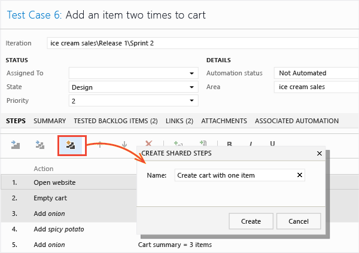
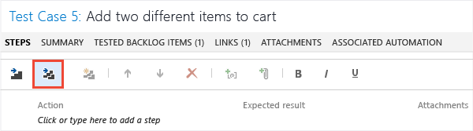
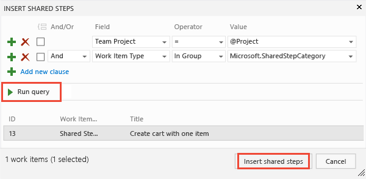
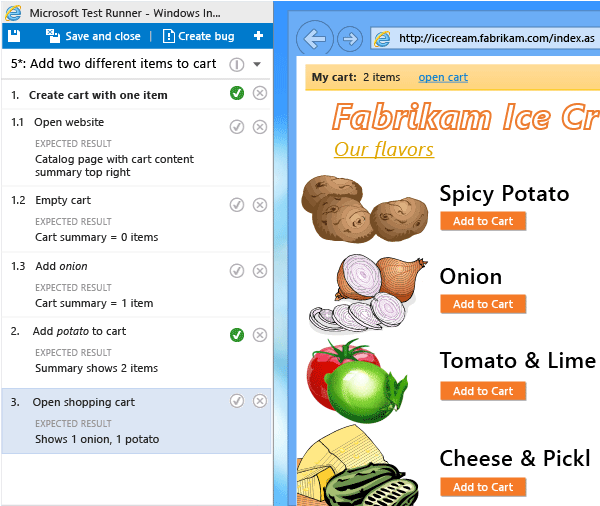

# Share steps between test cases

[!INCLUDE [version-header](includes/version-header.md)] 

When you [plan manual tests](create-a-test-plan.md) there are some sequences of steps, such as logging in, that occur in many test cases. To avoid having to enter these sequences again and again, create *shared steps*.  

[!INCLUDE [prerequisites-define](includes/prerequisites-define.md)] 

[!INCLUDE [note-new-ui](includes/note-new-ui.md)] 
  
## Create shared steps 
 
While you're editing a test case, select a sequence of steps that you want to share:  
  
  
  
The steps you selected are replaced with a link to the new shared steps work item:  
  
  
  
## Use shared steps  

Now you can use the shared steps in another test case:  
  
  
  
A query opens. Run it to find the steps you want to insert:  
  
  
  
## When you run a test with shared steps  

When you [run a test](run-manual-tests.md), you can either mark the whole shared sequence as passed or failed, or mark each step separately:  
  
  
  
## Related articles

* [Test objects and terms](test-objects-overview.md) 
- [FAQs for manual testing](https://docs.microsoft.com/azure/devops/test/reference-qa#sharesteps)
