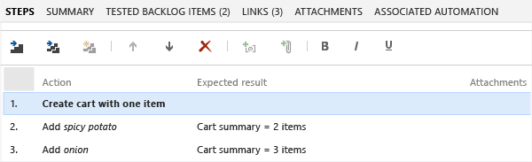

# Share steps between test cases

[!INCLUDE [version-header](includes/version-header.md)] 

When you [plan manual tests](create-a-test-plan.md) there are some sequences of steps, such as logging in, that occur in many test cases. To avoid having to enter these sequences again and again, create *shared steps*.  

[!INCLUDE [prerequisites-define](includes/prerequisites-define.md)] 

[!INCLUDE [note-new-ui](includes/note-new-ui.md)] 
  
## Create shared steps
::: moniker range=">=azure-devops-2020"

1. Select **Test Plans** to view your test plans. Select **Mine** or **All** or **Filter by title** to find a particular test plan. Select the plan to see test cases.

1. Double click a test case to edit it. Under **Steps**, select several steps and then select the **Create shared steps** icon.

1. In the **Create shared steps** dialog box, type a name for these shared step, and then select **Create**.

     
  
   Your title appears in place of the selected steps:

   

1. Select **Save & Close** to save the work item.

If you reopen the work item, you can select the shared step to open a new shared steps work item you created.
  
     
::: moniker-end

::: moniker range="<=azure-devops-2019"

While you're editing a test case, select a sequence of steps that you want to share:  
  
  
  
The steps you selected are replaced with a link to the new shared steps work item:  
  
  
::: moniker-end

## Use shared steps
::: moniker range=">=azure-devops-2020"

You can use the shared steps in another test case.

1. Double click test case to edit it. Under **Steps**, select the **Insert shared steps** icon.

     

1. The **Insert shared steps** dialog box opens. Select **Run query** to find the steps you want to insert.

   

1. Select shared steps and insert them.

::: moniker-end

::: moniker range="<=azure-devops-2019"

Now you can use the shared steps in another test case:  
  
  
  
A query opens. Run it to find the steps you want to insert:  
  
  
::: moniker-end

## When you run a test with shared steps  
::: moniker range=">=azure-devops-2020"

When you [run a test](run-manual-tests.md), you can either mark the whole shared sequence as passed or failed, or mark each step separately:  
  

::: moniker-end

::: moniker range="<=azure-devops-2019"

When you [run a test](run-manual-tests.md), you can either mark the whole shared sequence as passed or failed, or mark each step separately:  
  

::: moniker-end

## Related articles

- [Test objects and terms](test-objects-overview.md) 
- [FAQs for manual testing](reference-qa.md#sharesteps)
