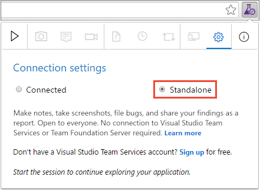
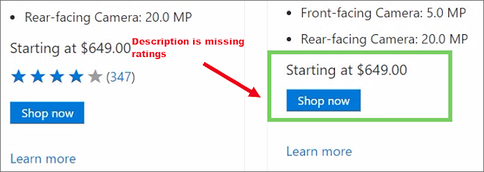
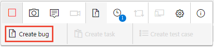
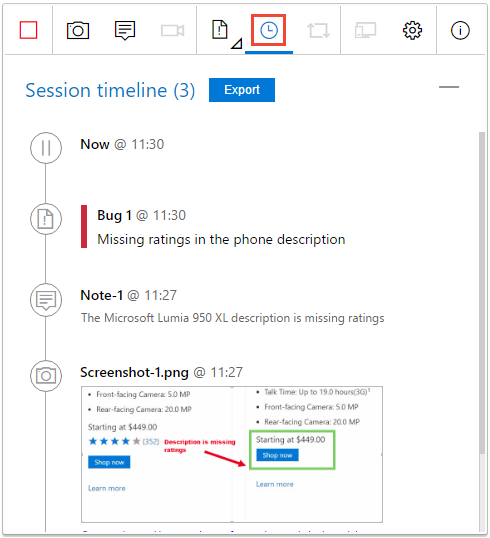

# Exploratory testing with the Test &amp; Feedback extension in Standalone mode

[!INCLUDE [version-lt-eq-azure-devops](../includes/version-lt-eq-azure-devops.md)] 

All teams can use the Test & Feedback extension in **Standalone** mode. 
Users don't need an Azure DevOps subscription to use this mode.

## Prerequisites

| Category | Requirement |
|--------------|-------------|
| **Project access** | [Project member](../organizations/security/add-users-team-project.md). |
| **Access levels** | To request or provide feedback: At least **Stakeholder** access. |
| **Extensions** |[Test & Feedback extension](perform-exploratory-tests.md).|

## Start testing in Standalone mode

1. If you haven't already, [install the Test & Feedback extension](perform-exploratory-tests.md).

2. Open the extension in your web browser and select **Standalone** mode.

   

3. Open the web application you want to explore and
   start the testing session.

   

4. When you find an area that has a bug, take a screenshot of the entire screen or any part of it.

   

5. You can annotate the screenshot using the tools available in the inline annotation toolbar. 

   

6. Make notes about the issue to share with your team, and then **Save** the note.

   

## Create a bug

1. When you finish capturing information for an issue, select **Create bug**.

   

2. The bug form contains all your captured information. Enter a title for the bug and add any other notes you require to the description. Then **Save** the bug.

   

3. View a list of all your activities in reverse chronological order in the **Session timeline** page. This page shows all the screenshots and notes you captured and the bugs you already created.

   

## End your testing session

1. Continue to explore the application. Create more bugs as you encounter issues with the app.
   
2. When you're done, stop your session.

   

   The extension automatically creates a session report that contains details of all the bugs created during the session, and any attachments. 
  
   

3. The report saves in the default **Downloads** folder of your web browser. Share it with the rest of your team as an email attachment, or copy it to OneNote, Word, or in any other format you prefer.

   [How do I play the video recordings I created with the extension?](reference-qa.yml#recording-playback)

## Next steps

> [!div class="nextstepaction"]
> [Use the extension in Connected mode](connected-mode-exploratory-testing.md)
