# Test different configurations

[!INCLUDE [version-header](_shared/version-header.md)] 

Your users will probably install or run your app 
on a wide variety of configurations, such as different 
operating systems, web browsers, and other variations. 
You will want to run at least some of your tests in 
stages that have those different configurations. 

Use your test plan to decide which tests you want to run 
on which configurations. You have to make sure that when 
you run your tests that you have set up your stages 
for the configurations that you need.

You might draw up a schematic matrix of the combinations that you want to test:

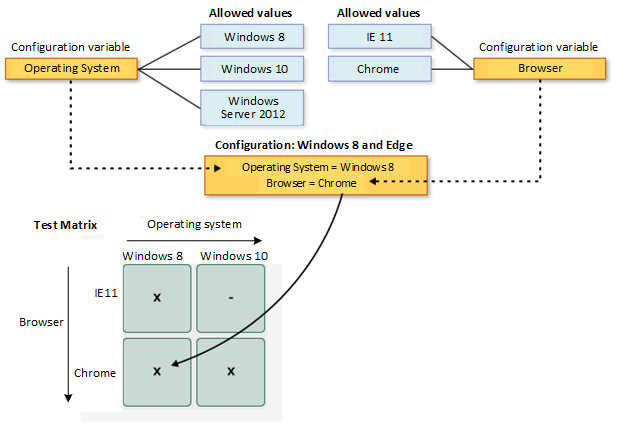

Then you can:

* [Create the configurations and variables](#create-configs)
* [Assign the configurations to test plans and test suites](#assign-configs)
* [Run tests with each of the configurations](#run-configs)
* [Track your test results for each configuration](#track-configs)

> **Note**: This feature is available only in Azure DevOps.
In addition, Stakeholders and Basic users cannot create or manage configurations.

[!INCLUDE [feature-availability](_shared/feature-availability.md)] 

## Create configurations and variables

A test configuration is a combination of configuration variable 
values. Your configuration variables could be, for example, 
operating system, browser, CPU type, database. A configuration 
might be "Windows 8 + 32-bit CPU" or "Windows 10 + 64-bit CPU."

You must create the configuration variables first. Then combine 
multiple variable values to create a configuration.
 
1. Open the **Configurations** page in [!INCLUDE [test-hub-include](_shared/test-hub-include.md)], choose 
   the  icon, and select 
   **New configuration variable**.

   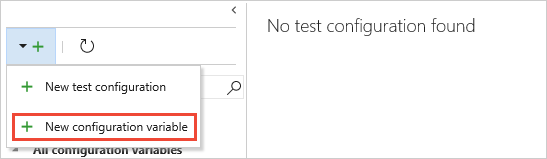
 
1. Type a name for the variable, such as **Browser**, and type a value.
   Add as many values as you wish to the configuration variable, and then save it.
 
   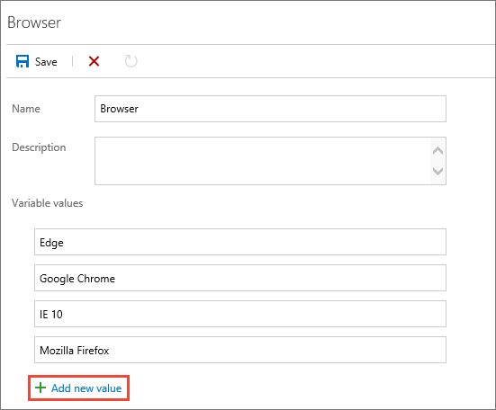

1. Repeat the steps to create any other configuration variables
   you need. For example, create a configuration variable named **Operating system**
   with the names of each operating system on which you want to test.

   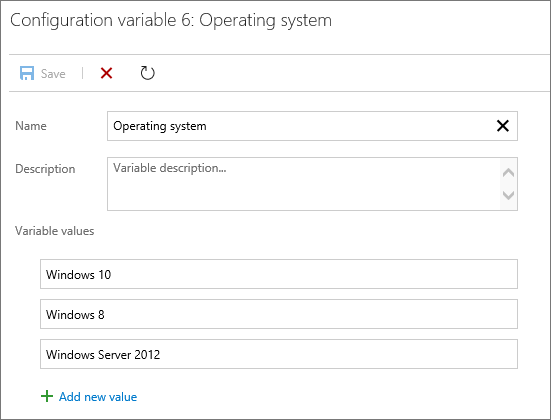

1. Choose the  icon and select 
   **New test configuration**. 

   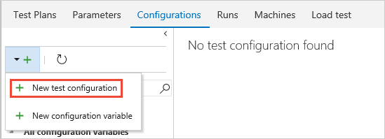

1. Type a name for the test configuration and add the configuration 
   variables you created. Choose a value for each variable for this configuration.  

   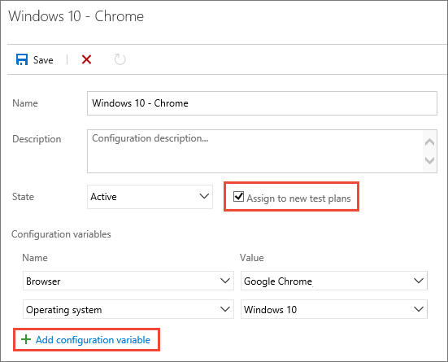

   Ensure **Assign to new test plans** is checked to make this the default 
   configuration for all the new test plans you create.
 
1. Save your new test configuration. 

## Assign configurations to test plans and suites

You can assign configurations to a test plan, a test suite,
or an individual test case. Configurations assigned to a test plan 
or test suite apply to all tests or suites within it.

1. To assign a configuration to a test plan, in the **Test plans** page, open the shortcut
   menu for the plan and choose **Assign configuration to test plan**. 

   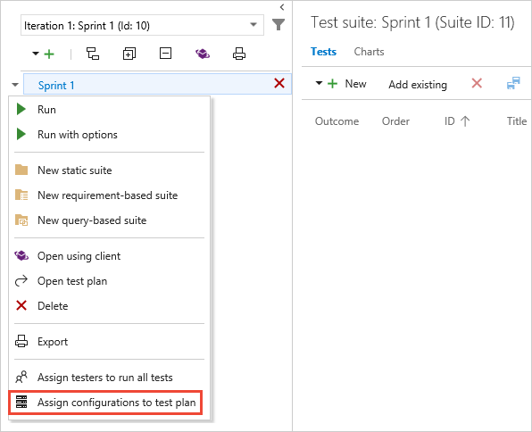

1. To assign a configuration to a test suite, open the shortcut
   menu for the suite and choose **Assign configuration to test suite**. 

   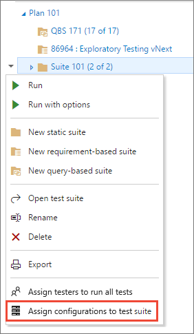

   If you add multiple configurations to a test plan or suite, 
   the tests cases are repeated in the plan or suite with the 
   each of the configurations you have assigned.
 
   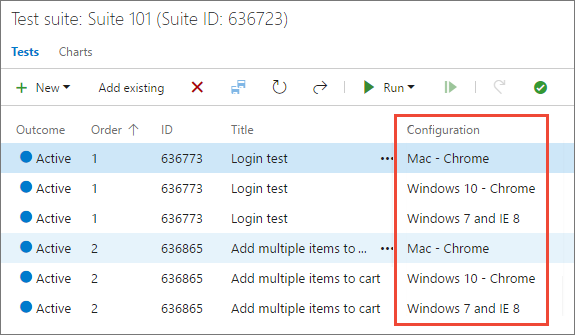
 
1. If necessary, override the default configuration assigned to a test case
   and assign the configuration you need. Select one or more
   test cases, open the shortcut menu, and choose **Assign configurations**. 

   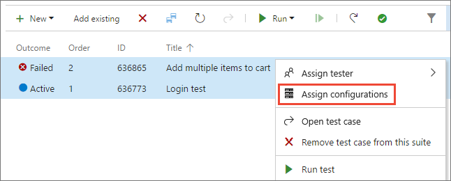

1. Search for and select the configurations to assign to these test case(s).

   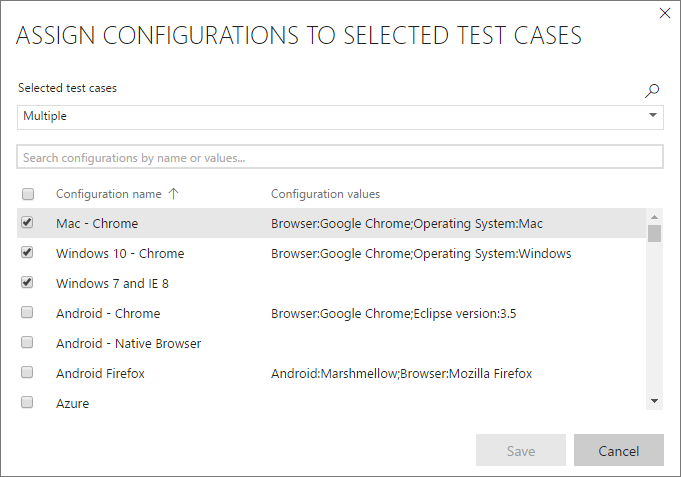

## Run tests with each configuration

1. Set up a testing platform for a particular configuration, such
   as testing the app using Google Chrome on Windows 10.

1. Select and run a test that has this configuration assigned.

   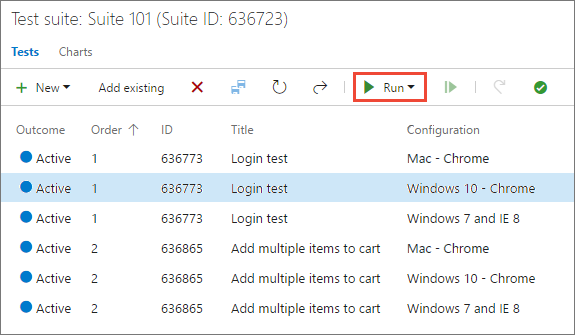

   As you run the test, a reminder of the required configuration 
   in shown in the status bar of the Test Runner window.

   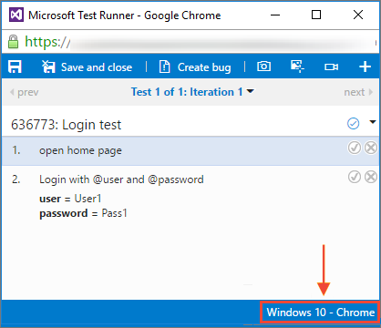

## Track test results for each configuration

1. Open the **Charts** page for your test plan or test suite, choose 
   **New**, and select **New test result chart**.
 
   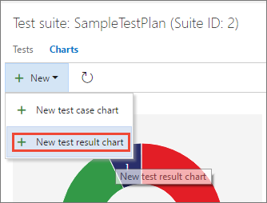

1. Choose the type of chart you require, select **Configuration**
   in the **Group by** list, and choose **OK**.
 
   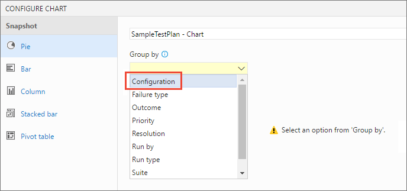

   A chart is created that can help you track your tests based on configurations. 
   You can pin this chart to your dashboard.

   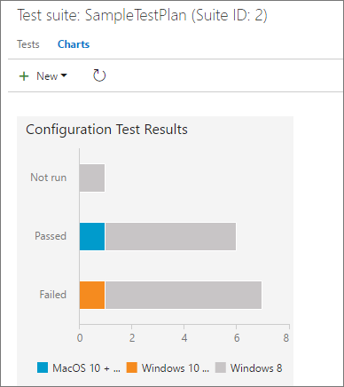

> If you have a test case that appears in several test plans and test suites, you can set the different configurations for each of these. 
The same test case can have different configuration settings in different test suites and test plans.

## See also

* [Overview of manual and exploratory testing](index.md)
* [Exploratory test and submit feedback directly from your browser](perform-exploratory-tests.md)

[!INCLUDE [help-and-support-footer](_shared/help-and-support-footer.md)] 
