# Test different configurations

[!INCLUDE [version-lt-eq-azure-devops](../includes/version-lt-eq-azure-devops.md)] 

Your users will probably install or run your app 
on a wide variety of configurations, such as different 
operating systems, web browsers, and other variations. 
You will want to run at least some of your tests in 
stages that have those different configurations. 

Use your test plans to decide which tests you want to run 
on which configurations. You have to make sure that when 
you run your tests that you have set up your stages 
for the configurations that you need.

You might draw a schematic matrix of the combinations that you want to test:

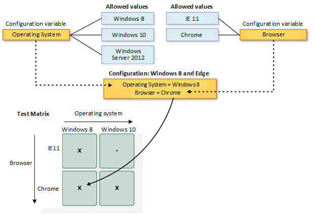

Then you can:

* [View available configurations and variables](#view-configs)
* [Create configurations and variables](#create-configs)
* [Assign the configurations to test plans and test suites](#assign-configs)
* [Run tests with each of the configurations](#run-configs)
* [Track your test results for each configuration](#track-configs)

## Prerequisites

- You must connect to a project. If you don't have a project yet, [create one](/azure/devops/user-guide/sign-up-invite-teammates).
- You must be added to a project. To get added, [Add users to a project or team](/azure/devops/organizations/security/add-users-team-project).
- To view or add test configurations, you must have **Basic** access or higher.
- To add test configurations, you must have the project-level **Manage test configurations** permission set to **Allow**. By default, this permission is granted to members of the Contributors and Project Administrator groups.

To learn more, see [Manual test access and permissions](/azure/devops/test/manual-test-permissions).

[!INCLUDE [prerequisites-define](includes/prerequisites-tcm.md)]

<a name="view-configs"></a>

## View configurations and variables

You often want to see the configurations that are already available to run your tests.

# [Browser](#tab/browser)

You can view a list of test configurations and configuration variables from the **Configurations** page.

While in your project, select **Test Plans** > **Configurations** from the left navigation area. Here you'll see all of the test configurations and variables currently available for your test plans.

:::image type="content" source="media/testing-configurations/viewing-test-configurations.png" alt-text="Screenshot of Query Editor, Query test plans.":::

Select a configuration or variable to see more information about it in the window to the right.

# [TCM CLI](#tab/tcm-cli)

Use `tcm configs /list` to view the configurations available for the test plans and test suites in your project. When no optional parameters are specified, all test configurations are listed for the team project.

```tcm
tcm configs /list [/querytext:query] /collection:teamprojectcollectionurl
            /teamproject:project [/login:username,[password]]
```

| Parameter | Description |  
|----------|------------|
|**/querytext**:`query`| Optional. Specifies the query to use to list a subset of test configurations.    |

[!INCLUDE [prerequisites-define](includes/common-tcm-parameters.md)]

**Example**

The following command lists the test configurations available in the *Fabrikam Fiber* project hosted in the *fabrikamprime* organization. The **ID** corresponds to the configuration **Name**. For example, configuration ID *9* is aligned with the *Google Chrome on Windows 10* test configuration.

```tcm
tcm configs /list /collection:https://dev.azure.com/fabrikamprime /teamproject:"Fabrikam Fiber"

Id        Name
--------- ----------------------------------------------------------------
2         Windows 8
7         Windows 7
9         Google Chrome on Windows 10
```

***

<a name="create-configs"></a>

## Create configurations and variables
::: moniker range=">=azure-devops-2020"

A test configuration is a combination of configuration variable values.
Your configuration variables could be, for example, operating system, browser, CPU type, database.
A configuration might be "Windows 8 + 32-bit CPU" or "Windows 10 + 64-bit CPU."

Create the configuration variables first.
Then combine multiple variable values to create a configuration.

1. Open the **Configurations** page in the **Test Plans** web portal, select the **+** icon, and select **New configuration variable**.

   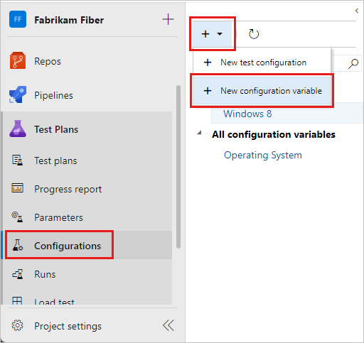

1. Type a name for the variable, such as **Browser**, and a description.
   Select **Add new value**, and then add a value.
   Add as many values as you wish to the configuration variable, and then save it.

   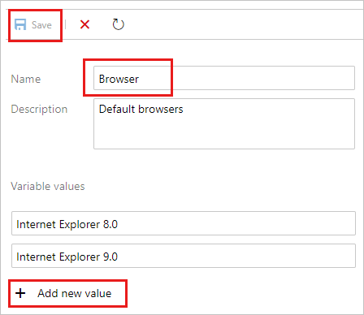

1. Repeat the steps to create any other configuration variables you need.
   For example, create a configuration variable named **Operating system** with the names of each operating system on which you want to test.

   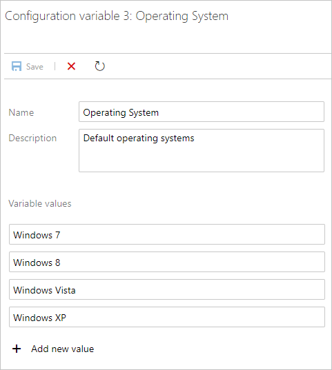

1. Select the **+** icon and select  **New test configuration**.

   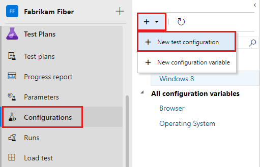

1. Type a name for the test configuration and add the configuration variables you created.
   Choose a value for each variable for this configuration.  

   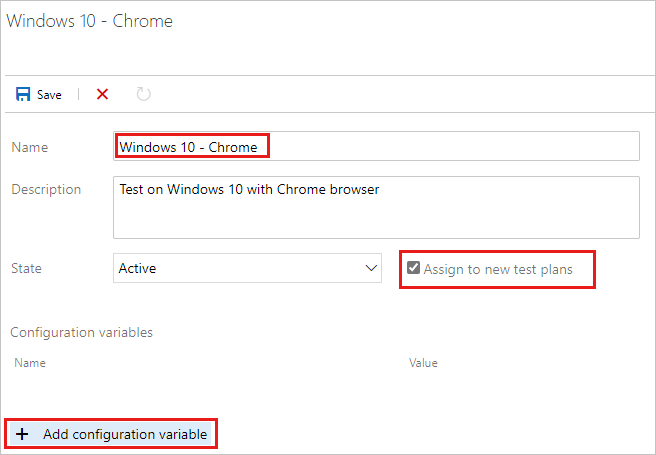

   Be sure that **Assign to new test plans** is checked to make this configuration the default for all the new test plans you create.

1. Save your new test configuration.
::: moniker-end

::: moniker range="<=azure-devops-2019"

A test configuration is a combination of configuration variable 
values. Your configuration variables could be, for example, 
operating system, browser, CPU type, database. A configuration 
might be "Windows 8 + 32-bit CPU" or "Windows 10 + 64-bit CPU."

You must create the configuration variables first. Then combine 
multiple variable values to create a configuration.
 
1. Open the **Configurations** page in the **Test Plans** web portal, choose 
   the  icon, and select 
   **New configuration variable**.

   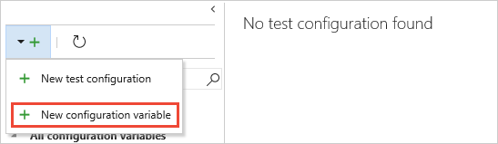
 
2. Type a name for the variable, such as **Browser**, and type a value.
   Add as many values as you wish to the configuration variable, and then save it.
 
   

3. Repeat the steps to create any other configuration variables
   you need. For example, create a configuration variable named **Operating system**
   with the names of each operating system on which you want to test.

   

4. Choose the  icon and select 
   **New test configuration**. 

   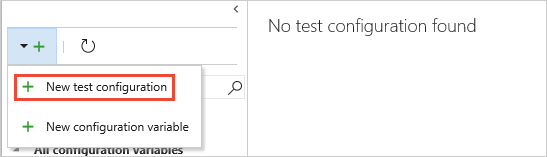

5. Type a name for the test configuration and add the configuration 
   variables you created. Choose a value for each variable for this configuration.  

   

   Ensure **Assign to new test plans** is checked to make this the default 
   configuration for all the new test plans you create.
 
6. Save your new test configuration. 
::: moniker-end

<a name="assign-configs"></a>

## Assign configurations to test plans and suites
::: moniker range=">=azure-devops-2020"

You can assign configurations to a test suite or an individual test case.
Configurations assigned to a test suite apply to all tests or suites within it.

1. To assign a configuration to a test suite, in the **Test plans** page, select a plan.
   In the **Test Suites** area, select a test suite and select **More options** or right-click to open the context menu and then select **Assign configuration**.

   

   If you add multiple configurations to a test suite, the tests cases are repeated with each of the configurations you have assigned.

   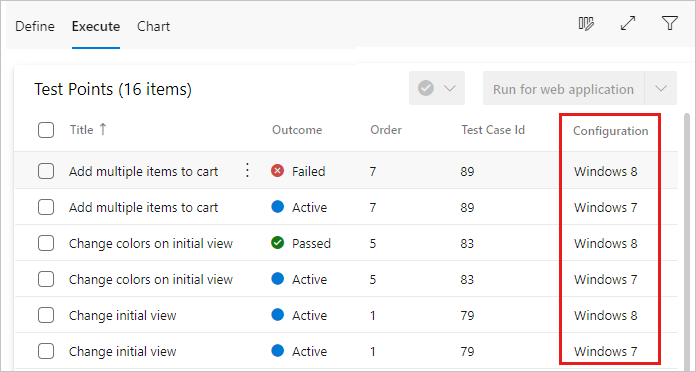

1. If necessary, override the default configuration assigned to a test case and assign the configuration you need.
   Select one or more test cases, open the context menu, and select **Assign configuration**.

   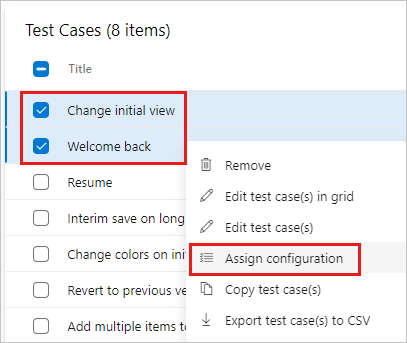

1. Search for and select the configurations to assign to the test cases.

   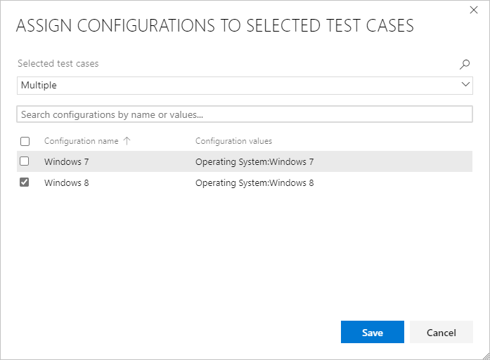
::: moniker-end
::: moniker range="<=azure-devops-2019"

You can assign configurations to a test plan, a test suite,
or an individual test case. Configurations assigned to a test plan 
or test suite apply to all tests or suites within it.

1. To assign a configuration to a test plan, in the **Test plans** page, open the shortcut
   menu for the plan and choose **Assign configuration to test plan**. 

   

1. To assign a configuration to a test suite, open the shortcut
   menu for the suite and choose **Assign configuration to test suite**. 

   

   If you add multiple configurations to a test plan or suite, 
   the tests cases are repeated in the plan or suite with
   each of the configurations you have assigned.
 
   
 
1. If necessary, override the default configuration assigned to a test case
   and assign the configuration you need. Select one or more
   test cases, open the shortcut menu, and choose **Assign configurations**. 

   

1. Search for and select the configurations to assign to these test case(s).

   
::: moniker-end

<a name="run-configs"></a>

## Run tests with each configuration
::: moniker range=">=azure-devops-2020"

Set up a testing platform for a particular configuration, such as testing the app using Google Chrome on Windows 10.

1. Select and run a test that has this configuration assigned.

   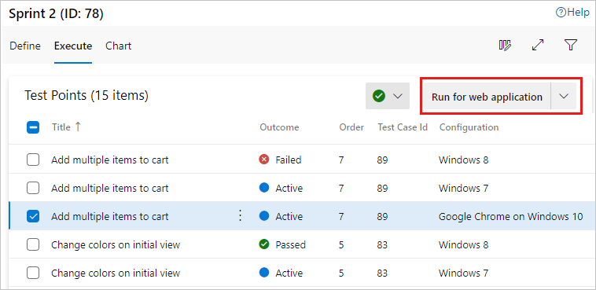

   As you run the test, a reminder of the configuration appears in the status bar.

   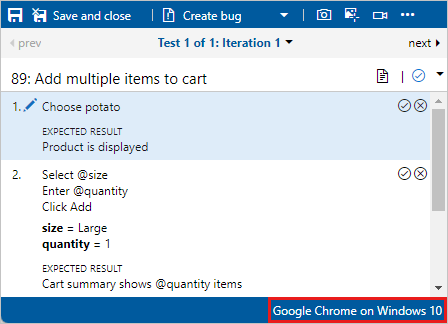
::: moniker-end

::: moniker range="<=azure-devops-2019"

1. Set up a testing platform for a particular configuration, such
   as testing the app using Google Chrome on Windows 10.

1. Select and run a test that has this configuration assigned.

   

   As you run the test, a reminder of the required configuration 
   in shown in the status bar of the Test Runner window.

   
::: moniker-end

<a name="track-configs"></a>

## Track test results for each configuration
::: moniker range=">=azure-devops-2020"

1. Open the **Charts** page for your test suite, select **New**, and select **New test result chart**.

   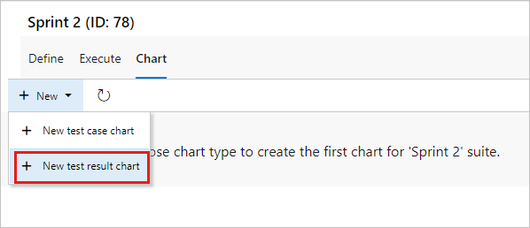

1. Choose a type of chart, like a pie chart or bar chart, and then select **Group by** > **Configuration** and choose **OK**.

   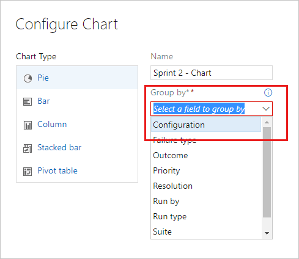

   A chart is created that can help you track your tests based on configurations.
   You can pin this chart to your dashboard.

   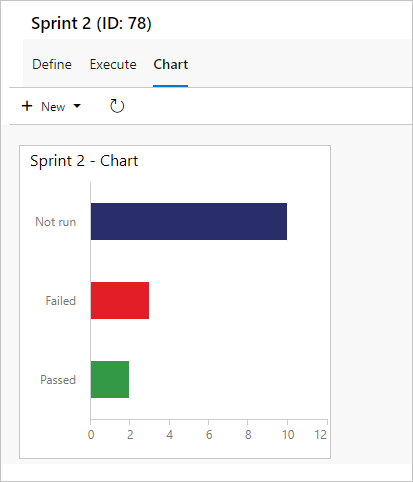

If you have a test case that appears in several test suites, you can set the different configurations for each suite.
The same test case can have different configuration settings in different test suites and test plans.
::: moniker-end

::: moniker range="<=azure-devops-2019"

1. Open the **Charts** page for your test plan or test suite, choose 
   **New**, and select **New test result chart**.
 
   

1. Choose the type of chart you require, select **Configuration**
   in the **Group by** list, and choose **OK**.
 
   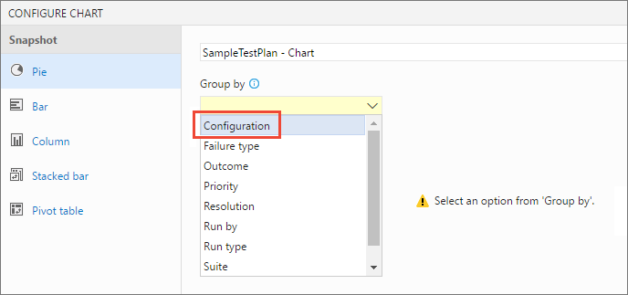

   A chart is created that can help you track your tests based on configurations. 
   You can pin this chart to your dashboard.

   

> If you have a test case that appears in several test plans and test suites, you can set the different configurations for each of these. 
The same test case can have different configuration settings in different test suites and test plans.
::: moniker-end

## Related articles

* [Overview of manual and exploratory testing](index.yml)
* [Exploratory test and submit feedback directly from your browser](perform-exploratory-tests.md)

 
