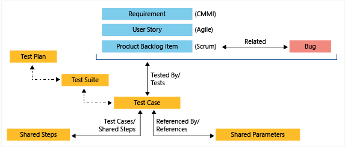

# Test objects and terms

[!INCLUDE [version-lt-eq-azure-devops](../includes/version-lt-eq-azure-devops.md)]

Read this article to gain an understanding of the objects and terms used in manual and exploratory testing. 

## Prerequisites

[!INCLUDE [prerequisites-run](includes/prerequisites-run.md)]

## Test-specific work item types 

To support manual and automated testing, add and group three main types of test-specific work item types: **Test Plans**, **Test Suites**, and **Test Cases**. To support sharing of various test steps and test parameters, define **Shared Steps** and **Shared Parameters**. The work tracking data store stores these objects as specific types of work items. 

The following table describes the work item types used to support the Azure DevOps test experience. Test-specific work items link together by using the link types shown in the previous image.  
 
 
:::row:::
   :::column span="1":::
     **Work item type**
   :::column-end:::
   :::column span="3":::
      **Description**
   :::column-end:::
:::row-end:::
---
:::row:::
   :::column span="1":::
     **Test plans**
   :::column-end:::
   :::column span="3":::
      Group test suites and individual test cases. To define a test plan, see [Create test plans and test suites](create-a-test-plan.md). 
   :::column-end:::
:::row-end:::
:::row:::
   :::column span="1":::
     **Test suite**
   :::column-end:::
   :::column span="3":::
      Group test cases into separate testing scenarios within a single test plan. Grouping test cases makes it easier to see which scenarios are complete. When creating a test suite, you can specify one of three types: 
      - **Static test suites**: Used to group test cases under a single test suite. 
      - [**Requirement-based suites**](create-a-test-plan.md#backlog): Select one or more requirements from a query that you link to the test suite. 
      - [**Query-based suites**](reference-qa.yml#what-s-the-difference-between-static--requirement-based--and-query-based-test-suites): Select one or more test cases that you link to the test suite.    
      > [!TIP]
      > The [**Test Suite Type**](../boards/queries/build-test-integration.md) read-only field indicates the type of suite selected. To add test suites, see [Create test plans and test suites](create-a-test-plan.md). 
   :::column-end:::
:::row-end:::
:::row:::
   :::column span="1":::
     **Test cases**
   :::column-end:::
   :::column span="3":::
      Define the steps used to test code or an app for deployment. Define test cases to ensure your code works correctly, has no errors, and meets business and customer requirements. You can add individual test cases to a test plan without creating a test suite. More than one test suite or test plan can refer to a test case. You can effectively reuse test cases without needing to copy or clone them for each suite or plan. There are two types of test cases: 
      - [**Manual**](create-test-cases.md): Test cases that define different steps that you run by using Test Runner or other supported client. 
      - [**Automated**](run-automated-tests-from-test-hub.md): Test cases that are designed to run within an Azure Pipeline.
      > [!TIP]
      > You can create a test case that automatically links to a requirement&mdash;User Story ([Agile](../boards/work-items/guidance/agile-process.md)), Product Backlog Item ([Scrum](../boards/work-items/guidance/scrum-process.md)), Requirement ([CMMI](../boards/work-items/guidance/cmmi-process.md)), or Issue ([Basic](../boards/get-started/plan-track-work.md))&mdash;when you create a test from the board. For more information, see [Add, run, and update inline tests](../boards/boards/add-run-update-tests.md). 
   :::column-end:::
:::row-end:::
:::row:::
   :::column span="1":::
     **Shared steps**
   :::column-end:::
   :::column span="3":::
      Use to share steps between multiple test cases. For example, log-in and verify steps for signing into an application are steps that you can share across a number of test cases. To learn how, see [Share steps between test cases](share-steps-between-test-cases.md). 
   :::column-end:::
:::row-end:::
:::row:::
   :::column span="1":::
     **Shared parameters**
   :::column-end:::
   :::column span="3":::
      Use to specify different parameters for executing test a test step within a test case. To learn how, see [Repeat a test with different data](repeat-test-with-different-data.md). 
   :::column-end:::
:::row-end:::
---

## Common fields for all test-specific work item types 

Most work items include the following fields and tabs. Each tab tracks specific information, such as :::image type="icon" source="../boards/backlogs/media/icon-history-tab-wi.png" border="false"::: history, :::image type="icon" source="../boards/backlogs/media/icon-links-tab-wi.png" border="false"::: links, or :::image type="icon" source="../boards/backlogs/media/icon-attachments-tab-wi.png" border="false"::: attachments. These three tabs provide a history of changes, view of linked work items, and ability to view and attach files.  

The only required field for all work item types is **Title**. When you save the work item, the system assigns it a unique **ID**. The form highlights required fields in yellow. For information about test-related fields, see [Query based on build and test integration fields](../boards/queries/build-test-integration.md). For all other fields, see [Work item field index](../boards/work-items/guidance/work-item-field.md). 

  
 
:::row:::
   :::column span="":::
      **Field**
   :::column-end:::
   :::column span="3":::
      **Usage**
   :::column-end:::
:::row-end:::
---
:::row:::
   :::column span="":::
      [Title](../boards/queries/titles-ids-descriptions.md)
   :::column-end:::
   :::column span="3":::
      Enter a description of 255 characters or less. You can always modify the title later.
   :::column-end:::
:::row-end:::
:::row:::
   :::column span="":::
      [Assigned To](../boards/queries/query-by-workflow-changes.md)
   :::column-end:::
   :::column span="3":::
      Assign the work item to the team member responsible for performing the work. For more information about identity search and selection, see [Query by assignment or workflow changes](../boards/queries/query-by-workflow-changes.md#people-picker).
      > [!NOTE]  
      > You can only assign work to a single user. If you need to assign work to more than one user, add a work item for each user and distinguish the work to be done by title and description.
   :::column-end:::
:::row-end:::
:::row:::
   :::column span="":::
      [State](../boards/queries/query-by-workflow-changes.md)
   :::column-end:::
   :::column span="3":::
      When you create the work item, the State defaults to the first state in the workflow. As work progresses, update it to reflect the current status. 
   :::column-end:::
:::row-end:::
:::row:::
   :::column span="":::
      [Reason](../boards/queries/query-by-workflow-changes.md)
   :::column-end:::
   :::column span="3":::
      Use the default first. Update it when you change state as need. Each State is associated with a default reason. 
   :::column-end:::
:::row-end:::
:::row:::
   :::column span="":::
      [Area (Path)](../boards/queries/query-by-area-iteration-path.md)
   :::column-end:::
   :::column span="3":::
      Choose the area path associated with the product or team, or leave it blank until assigned during a planning meeting. To change the dropdown list of areas, see [Define area paths and assign to a team](../organizations/settings/set-area-paths.md).
   :::column-end:::
:::row-end:::
:::row:::
   :::column span="":::
      [Iteration (Path)](../boards/queries/query-by-workflow-changes.md)
   :::column-end:::
   :::column span="3":::
      Choose the sprint or iteration in which to complete the work, or leave it blank and assign it later during a planning meeting. To change the drop-down list of iterations, see [Define iteration paths and configure team iterations](../organizations/settings/set-iteration-paths-sprints.md).
   :::column-end:::
:::row-end:::
:::row:::
   :::column span="":::
      [Description](../boards/queries/titles-ids-descriptions.md)
   :::column-end:::
   :::column span="3":::
      Provide enough detail to create a shared understanding of scope and support estimation efforts. Focus on the user, what they want to accomplish, and why. Don't describe how to develop the product. Provide sufficient details so that your team can write tasks and test cases to implement the item.
   :::column-end:::
:::row-end:::
---

## Common controls to all test-specific work item types 

Several controls appear in several test-specific work items, as described in the following table. If you're not interested in these controls, you can hide them from the work item form layout as described in [Add and manage fields (Inheritance process)](../organizations/settings/work/customize-process-field.md#hide-a-field-or-custom-control).

 
:::row:::
   :::column span="":::
      **Control**
   :::column-end:::
   :::column span="3":::
      **Description**
   :::column-end:::
:::row-end:::
---
:::row:::
   :::column span="":::
       **Deployment**
   :::column-end:::
   :::column span="3":::
       Provides insight into whether a feature or user story is deployed and to what stage. You gain visual insight into the status of a work item as it's deployed to different release environments as well as quick navigation to each release stage and run.
       You can access this control from **Test Plans**, **Test Suites**, and **Test Cases**. 
   :::column-end:::
:::row-end:::
:::row:::
   :::column span="":::
      **Development**
   :::column-end:::
   :::column span="3":::
       Records all Git development processes that support completion of the work item. Typically, you use it to [drive Git development from a requirement](../boards/backlogs/connect-work-items-to-git-dev-ops.md). This control supports traceability by providing visibility into all the branches, commits, pull requests, and builds related to the work item.
       You can access this control from **Test Plans**, **Test Suites**, and **Test Cases**. 
   :::column-end:::
:::row-end:::
:::row:::
   :::column span="":::
      **Related Work**
   :::column-end:::
   :::column span="3":::
       Use this control in **Test Plans**, **Test Suites**, and **Test Cases** to show or link to other work items such as requirements and bugs, usually through the **Related** link type. 
   :::column-end:::
:::row-end:::
:::row:::
   :::column span="":::
      **Test Cases**
   :::column-end:::
   :::column span="3":::
       Use this control in **Shared Steps** and **Shared Parameters** work items to indicate or link to **Test Cases**. 
   :::column-end:::
:::row-end:::
---

## Customize test-specific work item types

For the Inherited process, you can customize test plans, test suites, and test cases. For the On-premises XML process, you can customize all test-specific work item types. For more information, see [Customize work tracking objects to support your team's processes](../reference/customize-work.md). 
 
## Permissions for test work items 

Project-level and Area Path permissions control which tasks you can perform with test-specific work items, such as creating test runs, managing test plans, and managing test suites. You can't change the work item type of test-specific work items, even though the option appears on the work item form.

For the full list of permissions, default security group assignments, and access level requirements, see [Manual test access and permissions](manual-test-permissions.md). To set permissions, see [Set permissions and access for testing](../organizations/security/set-permissions-access-test.md). 

## Export, import, and bulk update of test-specific work items 

As with other work items, you can bulk edit test-specific work items. For more information, see the following articles:  

::: moniker range="<=azure-devops"
- [Bulk modify work items](../boards/backlogs/bulk-modify-work-items.md). 
- [Import and export test cases](bulk-import-export-test-cases.md)
- [Navigate Test Plans, Test suite More options](navigate-test-plans.md#test-suite-more-options)
::: moniker-end

## Test terms 

The following table describes several terms used in manual and exploratory testing. 
 

:::row:::
   :::column span="1":::
     **Test points**
   :::column-end:::
   :::column span="3":::
      [!INCLUDE [test-point-definition](includes/test-point-definition.md)]
   :::column-end:::
:::row-end:::
:::row:::
   :::column span="1":::
     **Test result**
   :::column-end:::
   :::column span="3":::
      The recorded outcome of a single test case execution within a test run. Each test result captures whether the test passed, failed, or had another outcome, along with diagnostic data and attachments. For details, see [Review test runs](test-runs.md).
   :::column-end:::
:::row-end:::
:::row:::
   :::column span="1":::
     **Test run**
   :::column-end:::
   :::column span="3":::
      A logical grouping of test results created when one or more test cases are executed. The system creates a test run when you run test cases from a test plan or pipeline. Each test run captures outcomes, duration, environment, and diagnostic data. For details, see [Review test runs](test-runs.md).
   :::column-end:::
:::row-end:::
:::row:::
   :::column span="1":::
     **Test run settings**
   :::column-end:::
   :::column span="3":::
      Dialog used to associate test plans with a build or release pipelines.
   :::column-end:::
:::row-end:::
:::row:::
   :::column span="1":::
     **Test outcome settings**
   :::column-end:::
   :::column span="3":::
      Dialog used to choose how test outcomes in multiple suites under the same test plans should be configured.  
   :::column-end:::
:::row-end:::
:::row:::
   :::column span="1":::
     **Test step**
   :::column-end:::
   :::column span="3":::
      An individual action within a test case, consisting of an **Action** (what the tester does) and an **Expected Result** (the anticipated behavior). During execution, each test step is marked as passed or failed. Test steps can reference shared steps and include attachments. For details, see [Create test cases](create-test-cases.md).
   :::column-end:::
:::row-end:::
:::row:::
   :::column span="1":::
     **Traceability**
   :::column-end:::
   :::column span="3":::
      Ability to trace test results with the requirements and bugs that they are linked to.  
   :::column-end:::
:::row-end:::
:::row:::
   :::column span="1":::
     **User acceptance testing (UAT)**
   :::column-end:::
   :::column span="3":::
      A testing approach in which business stakeholders or end users verify that delivered functionality meets customer requirements. In Azure Test Plans, you can assign testers to test suites, send email invitations, and track progress through charts. Users with Stakeholder access can participate. For details, see [User acceptance testing](user-acceptance-testing.md).
   :::column-end:::
:::row-end:::
  

## Related content

- [Exploratory and manual testing scenarios and capabilities](overview.md)  
- [Navigate Test Plans](navigate-test-plans.md)
- [About pipeline tests](../pipelines/test/test-glossary.md) 
