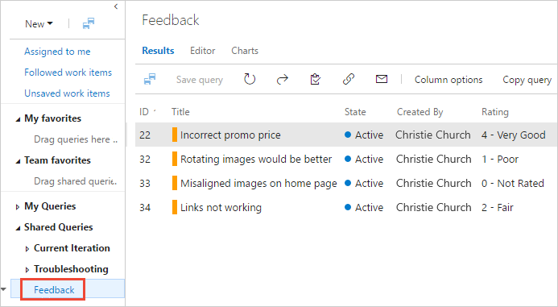

# Track stakeholder feedback using the Test &amp; Feedback extension

[!INCLUDE [version-header](_shared/version-header.md)] 

[!INCLUDE [feedback-header-text](_shared/feedback-header-text.md)] 

## Track feedback requests

1. Select your project and open the **Queries** page of the **Agile** section in Azure DevOps or the **Work** hub in TFS.
   [Web portal navigation](../project/navigation/index.md)

1. In the list of shared queries, select **Feedback**. 
   This query displays a list of all the feedback responses received.

   

1. Open the response work item to see the details of the feedback.

## See also

* [Request stakeholder feedback using the Test &amp; Feedback extension](request-stakeholder-feedback.md#request)
* [Provide stakeholder feedback using the Test &amp; Feedback extension](provide-stakeholder-feedback.md#provide)
* [Voluntary stakeholder feedback using the Test &amp; Feedback extension](voluntary-stakeholder-feedback.md#voluntary)
* [Exploratory test and submit feedback directly from your browser](perform-exploratory-tests.md)
* [Overview of manual and exploratory testing](index.md)

[!INCLUDE [help-and-support-footer](_shared/help-and-support-footer.md)] 
