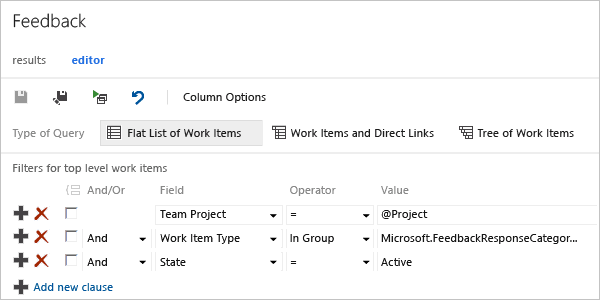
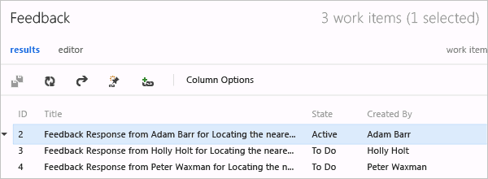

# Track stakeholder feedback using the Test &amp; Feedback extension

[!INCLUDE [version-header](includes/version-header.md)] 

[!INCLUDE [feedback-header-text](includes/feedback-header-text.md)] 

## Track feedback requests

1. Select your project and open **Boards>Queries** or **Work>Queries**. To learn how, see [Web portal navigation](../project/navigation/index.md).

1. In the list of shared queries, select **Feedback**. 
   This query displays a list of all the feedback responses received.

   

	Or, create a feedback query with the parameters, as shown.

	  

1.	You should see a list of all active feedback responses for your team project. 

	  

1. Open the response work item to see the details of the feedback.

## Related articles

* [Request stakeholder feedback using the Test &amp; Feedback extension](request-stakeholder-feedback.md#request)
* [Provide stakeholder feedback using the Test &amp; Feedback extension](provide-stakeholder-feedback.md#provide)
* [Voluntary stakeholder feedback using the Test &amp; Feedback extension](voluntary-stakeholder-feedback.md#voluntary)
* [Exploratory test and submit feedback directly from your browser](perform-exploratory-tests.md)
* [Overview of manual and exploratory testing](index.yml)

 
