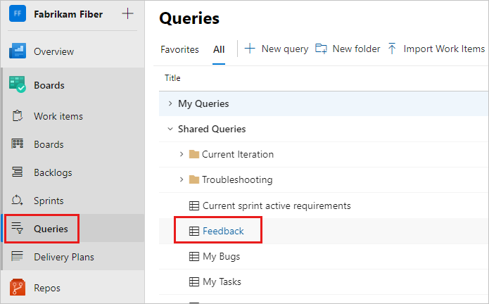
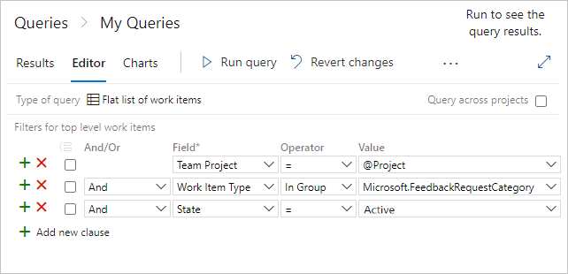
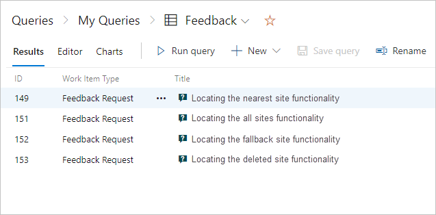

# Track stakeholder feedback

[!INCLUDE [version-lt-eq-azure-devops](../includes/version-lt-eq-azure-devops.md)]

All feedback is captured in a *Feedback Response* work item.
You can track feedback, whether captured by the [Test & Feedback extension](provide-stakeholder-feedback.md) or the [Microsoft Feedback client](/previous-versions/azure/devops/project/feedback/give-feedback), through a work item query.

[!INCLUDE [prerequisites-queries](../boards/includes/prerequisites-queries.md)]

## Track feedback requests
::: moniker range=">=azure-devops-2019"

To view feedback, use the **Feedback** shared query.
Select your project and open **Boards** > **Queries**.
Under **Queries**, select **All**.
In the Shared Queries, select **Feedback**.

This query displays a list of all the feedback responses received.
To learn more, see [Web portal navigation](../project/navigation/index.md).

To create a feedback query, follow these steps:

1. Select **Boards** > **Queries** and then select **New query**.

1. In the **Editor** for your new query, enter the following values:

   

   - Team Project = @Project
   - Work Item Type In Group Microsoft.FeedbackRequestCategory
   - State = Active

1. Select **Save query** and enter a name.

1. Select **Run query** to see a list of active feedback responses for your team project.

     

1. Select a response work item to see the details of the feedback.

::: moniker-end

::: moniker range="<azure-devops-2019"
1. Select your project and open **Boards>Queries** or **Work>Queries**. To learn how, see [Web portal navigation](../project/navigation/index.md).

1. In the list of shared queries, select **Feedback**. 
   This query displays a list of all the feedback responses received.

   

	Or, create a feedback query with the parameters, as shown.

	  

1.	You should see a list of all active feedback responses for your team project. 

	  

1. Open the response work item to see the details of the feedback.

::: moniker-end

## Related articles

- [What is Azure Test Plans?](overview.md)
- [Request feedback using the Test & Feedback extension](request-stakeholder-feedback.md)
- [Get feedback](/previous-versions/azure/devops/project/feedback/get-feedback)
- [Provide feedback using the Test & Feedback extension](provide-stakeholder-feedback.md#provide)
- [Define a work item query](../boards/queries/using-queries.md)
