# Track test status

[!INCLUDE [version-lt-eq-azure-devops](../includes/version-lt-eq-azure-devops.md)] 

View the status of planned tests or monitor testing progress by defining test case or test result charts. To learn more about test planning, see [Create test plans and test suites](create-a-test-plan.md). For information about test result terms, see [Test objects and terms](test-objects-overview.md#test-terms).

::: moniker range=">= azure-devops-2020"
To track the progress of more than one test plan or test suite, open the [Progress Report](progress-report.md).
::: moniker-end

<a id="charts" /> 

## Track testing progress

Use test results charts to track how your testing is going.
Choose from a fixed set of pre-populated fields related to results.

Add your own charts for test results to visualize what's important for your team.
If you already know how to add a chart, jump to the [examples](#TestResultsExamples) below of charts that you can create.

::: moniker range=">=azure-devops-2020"
To add a chart, follow these steps:

1. Select **Test Plans** to open the **Test Plans** page. Select a test plan to open it, then select the **Charts** tab.

1. Under **Charts**, select **New** > **New test result chart**.

   

1. Select the chart type, in this example, a pie chart.
   Based on the chart, configure the fields that you want to use to group by, or for the rows and columns.

   

   All charts roll up the information for any child test suites of the test plan or test suite that you selected.

1. Select **OK** to save the chart.
   The chart is displayed in the **Charts** page for your test plan or test suite.

   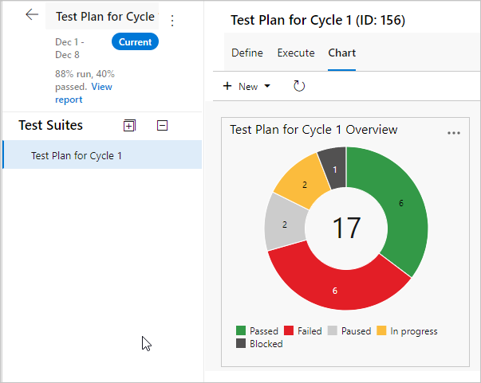

::: moniker-end

::: moniker range="<=azure-devops-2019"
By default, a pie chart is created for each test plan. This chart is grouped by the outcome field to show the latest results
for all the tests in the test plan. View this default chart from the **Charts** page.

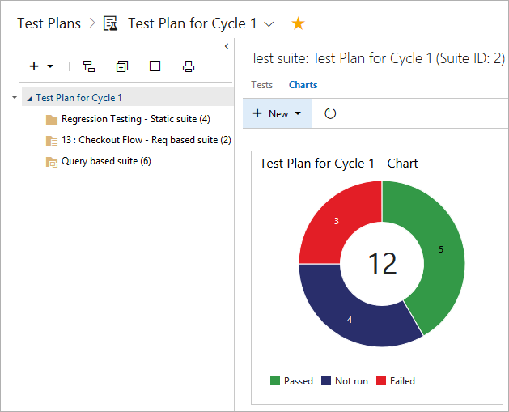

To add a chart, follow these steps:

1. Select the test plan or test suite for your chart in the **Test Plans** page. Then create a new chart.

   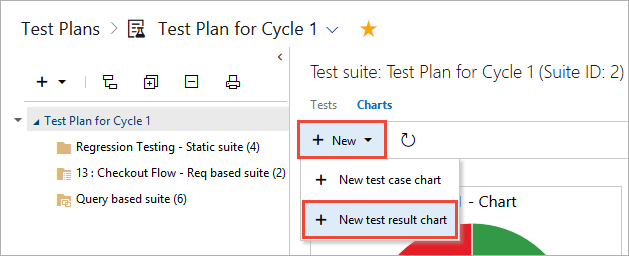

1. Select the chart type. Based on the chart, configure the fields that you want to use to group by, or for the rows and columns.

   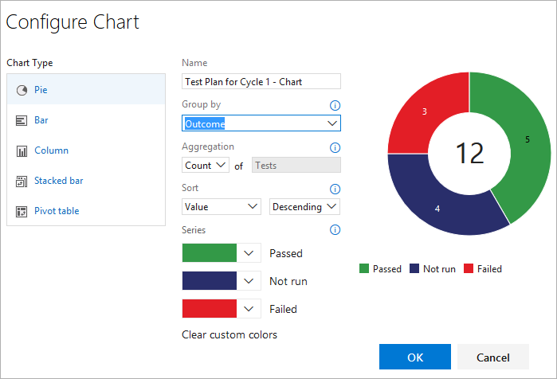

   All charts roll up the information for any child test suites of the test plan or test suite that you selected.

1. Save the chart. Now it will be displayed in the **Charts** page for the test plan or test suite that you selected.
::: moniker-end

## Test results examples

This section includes examples of useful charts.

### Check test status for a test suite

You can check the test status for a specific test suite.

Select **Test Plans** to open the **Test Plans** page, and then select a plan to view a test suite.
Select **New** > **New test result chart** to create a test results pie chart.
Group by **Outcome**.

::: moniker range=">=azure-devops-2020"

::: moniker-end
::: moniker range="<=azure-devops-2019"

::: moniker-end

### Check status for user stories per sprint

If you created requirement-based test suites in your test plan for your user stories, you can create a chart to review status for user stories that your team is testing in the current sprint.

Create a static test suite that groups your requirement-based test suites together.
Select that static test suite in the **Test Plans** page.
Add a test results stacked bar chart.

Select **Suite** as the **Y-axis** and **Outcome** as **Group by**.

::: moniker range=">=azure-devops-2020"
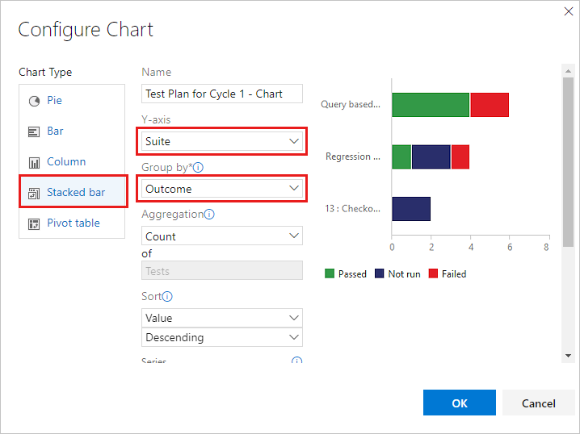
::: moniker-end
::: moniker range="<=azure-devops-2019"
   
::: moniker-end

### Check tests for each tester

You can check how many tests that each tester left to run.

Select your test plan in the **Test Plans** page and add a test results pivot table chart.
Choose **Tester** as **Rows** and **Outcome** as **Columns** pivot.

::: moniker range=">=azure-devops-2020"
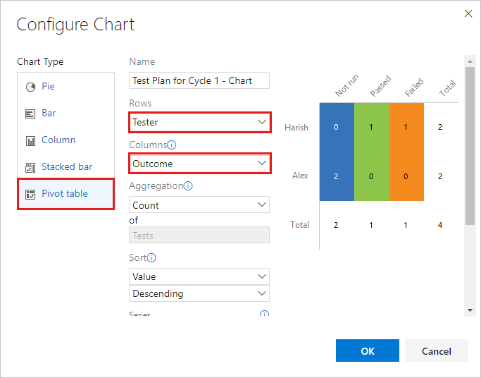
::: moniker-end
::: moniker range="<=azure-devops-2019"
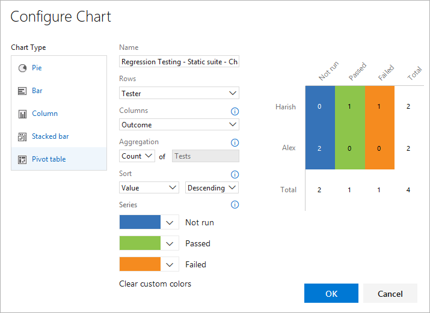
::: moniker-end

### Check quality based on the configuration

Use either a stacked bar chart or a pivot table chart.
Specify **Configuration** and **Outcome** as pivots.

### Track why tests are failing

You can track why tests are failing for your team.

For failure analysis, use either a stacked bar chart or a pivot table chart.
Select **Tester** and **Failure type**.

> [!NOTE]
> Failure type for test results can only be set using Microsoft Test Manager.

### Track resolutions for failing tests

You can track the resolution for failing tests for your team.

For resolution analysis, use either a stacked bar chart or a pivot table chart.
Choose **Tester** and **Resolution**.

> [!NOTE]
> Resolution type for test results can only be set using Microsoft Test Manager.

## Track test case status

Use test case charts to find out the progress of your test case authoring.
The charts for test cases give you the flexibility to report on columns that you add to the tests page.
By default, test case fields aren't added to the view in the tests page.

If you already know how to add a chart, jump to the [examples](#ExamplesTestCase) below of charts that you can create for test cases.

::: moniker range=">=azure-devops-2020"

1. From the **Define** or **Execute** tabs, add any fields you want to use for your test case chart by using  **Column Options**.
   Those fields appear as choices in the lists for grouping for your test case charts.

1. Select the test plan or test suite for your chart in the **Test Plans** page.
   Under **Charts**, select **New** > **New test case chart**.

   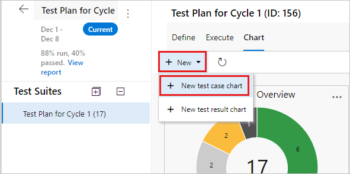

   All charts roll up the information for any child test suites of the test plan or test suite that you selected.

1. Select the chart type.
   Based on the chart, configure the fields that you want to use to group by, for rows and columns, or the range for trend charts.

   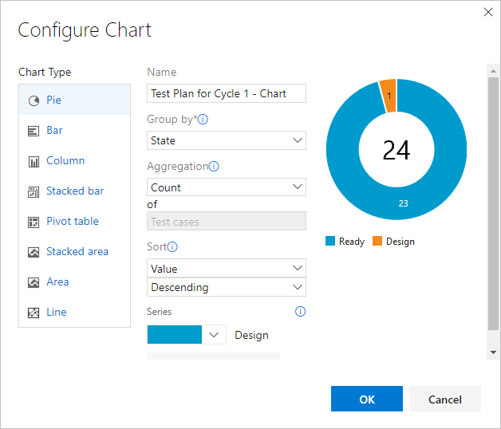

   You can't group by test suite for the test case charts.

1. Select **OK** to save the chart.
   The chart is displayed in the **Charts** page for your test plan or test suite.
::: moniker-end

::: moniker range="<=azure-devops-2019"
1. Add any fields you want to use for your test case chart 
   from the tests page with Column options. Then the fields will 
   appear as choices in the drop-down lists for grouping for 
   your test case charts.

1. Select the test plan or test suite for your chart in 
   the Test Plans page. Then add a test case chart.

   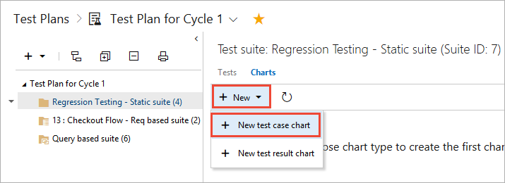

   All charts roll up the information for any child test suites 
   of the test plan or test suite that you selected.

1. Select the chart type. Based on the chart, configure the 
   fields that you want to use to group by, for rows and columns,
   or the range (trend charts only).

   

   You can't group by test suite for the test case charts.

1. Save the chart. Now it will be displayed in the charts 
   page for the test plan or test suite that you selected.
::: moniker-end

## Test case examples

These examples show common ways to interact with test case results.

### View recent test results

You can view the recent test results for an individual test case.

::: moniker range=">=azure-devops-2020"
Select the **Execute** tab in a test suite and then select a test case. Select **More options** or right-click to open the context menu. Select **View test result**.

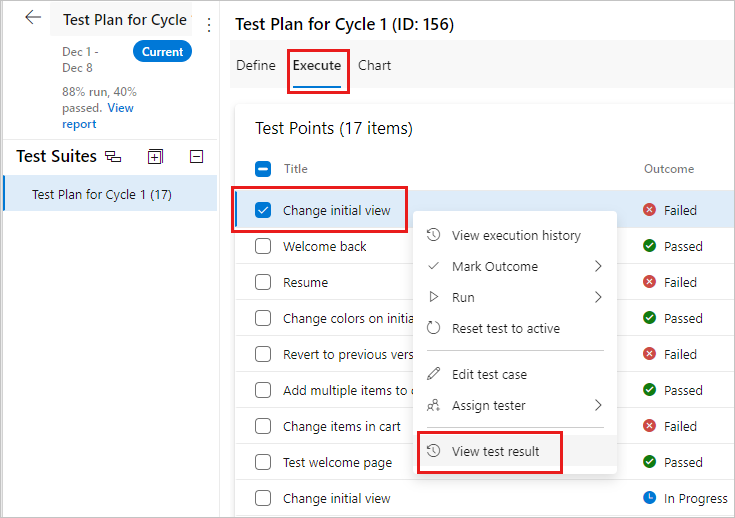

::: moniker-end
::: moniker range="<=azure-devops-2019"
Select the test case within a test suite and then choose to view the test details pane.

::: moniker-end

View the recent test results for this test case.
::: moniker range=">=azure-devops-2020"
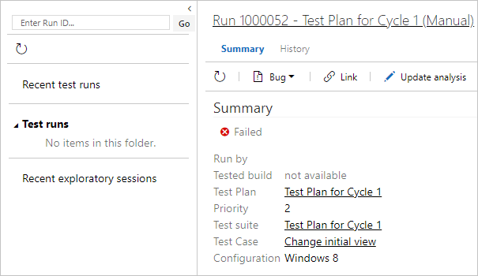
::: moniker-end
::: moniker range="<=azure-devops-2019"

::: moniker-end

### Track burn down by using a stacked area chart

You can track burn down for test case creation.

Create a stacked area trend chart to view the burn down for how many test cases are ready to be run.
Select **State** for the stack by field and **Ascending** for the sort field.

::: moniker range=">=azure-devops-2020"
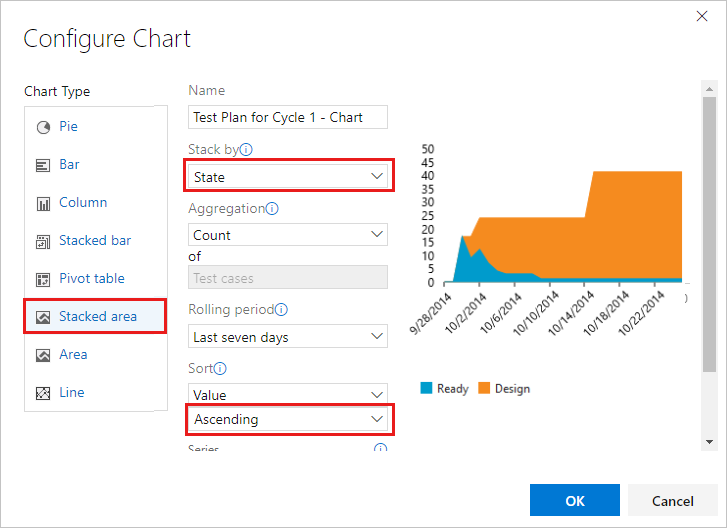
::: moniker-end
::: moniker range="<=azure-devops-2019"

::: moniker-end

You can track burn down for automation status.

Use a stacked area trend chart to view the burn down for how many test cases have been automated.
Select **Automation status** for the **Stack by** field and **Ascending** for the **Sort** field.

### See test ownership and priorities

If multiple teams own test cases in your test plan, you can see how many test cases each team owns and the priorities of the tests.

If your teams are organized by area path, use a test case pie chart.
Select **Area path** for **Group by**.

If you want to know the priorities of these tests, create a stacked bar chart.
Select **Area path** for the **Y-axis** and **Priority** for **Group by**.

### Track test creation status

You can track test creation status for team members by creating a chart that includes the **Assigned to** value.
Use a stacked bar chart or a pivot table chart.
Select **Assigned to** for **Y-axis** or **Rows**.
Select **State** for **Group by** or **Columns**.

## Share charts on your team's dashboard

Pin a chart to your team's dashboard for all the team to view.
Use the chart's context menu.

::: moniker range=">=azure-devops-2020"
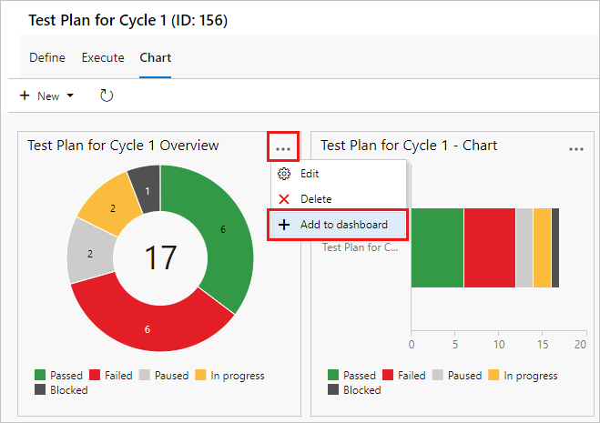
::: moniker-end
::: moniker range="<=azure-devops-2019"
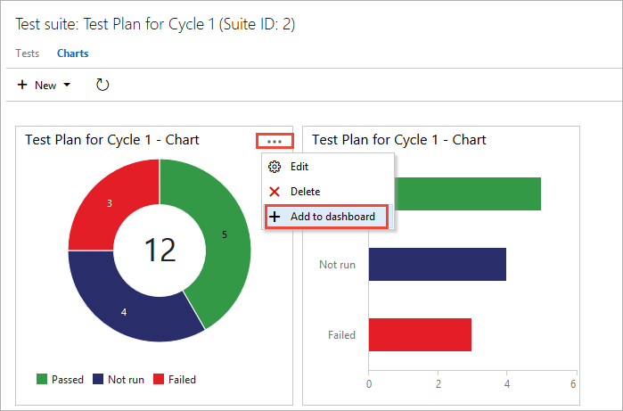
::: moniker-end
You can [configure the dashboard widget](../report/dashboards/widget-catalog.md) to show a range of chart types.

> [!NOTE]
> You must be a team administrator to configure the dashboard widget, but team members with Stakeholder access can view the charts on the dashboard.

## Related articles

- [Progress report](progress-report.md) 
- [Control how long to keep test results](how-long-to-keep-test-results.md)
- [FAQs for manual testing](reference-qa.yml#trackstatus)
- [Widget catalog](../report/dashboards/widget-catalog.md)
- [Team administration](../organizations/settings/manage-teams.md) 

