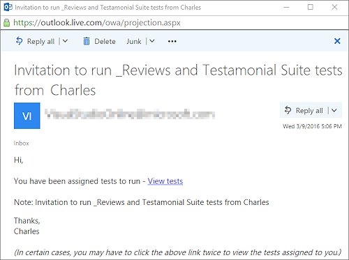
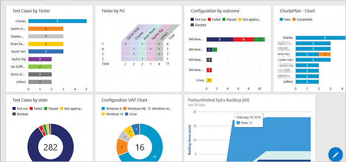

# Perform user acceptance testing

[!INCLUDE [version-header](_shared/version-header.md)] 

Today's faster development pace requires tools that 
enable test teams to more easily verify value based
on business requirements, and the high quality 
software demanded by customers.
This type of testing is often referred to as 
_user acceptance testing_ and is available as a 
feature in Azure DevOps and Team 
Foundation Server (TFS).

Typically you create a Test Suite using a formal 
requirement work item type. However, today's 
agile teams often prefer to work from User Stories 
or Product Backlog items as their requirements.

[!INCLUDE [feature-availability](_shared/feature-availability.md)] 

## Before you start

You must have already created work items and 
a test plan. If not, follow the steps in:

* [Create your backlog](../boards/backlogs/create-your-backlog.md)
* [Create a test plan](create-a-test-plan.md)

## Assign and invite testers

Azure DevOps makes it easy to assign
testers to individual test cases.  A typical 
scenario for user acceptance testing is the ability
to not just assign one tester to a test case (see 
[Search for and assign testers](#search-assign)) but assign 
multiple testers an entire set of tests. 

This can also be accomplished by selecting the 
suite and choosing **Assign testers to run all 
tests**. This option also enables the sending of
emails to the testers assigned to the tests.

An important feature of user acceptance testing 
is that the testers may in fact be the business 
owners who created the original business 
requirements.

## Search for and assign testers

In scenarios where you have large development teams
the ability search for an individual is also 
important.

Choose **Assign tester** from the drop-down
menu. In the shortcut menu, choose **Assign testers
to run all tests** and select the testers you want to
include. Set the **Send email** option to send all
of them a notification email.

## Easily track results

A key principle of good user acceptance testing practice
is to minimize the effort required to determine whether a
requirement has been achieved. 
There are two ways you can do this: you can focus on
individual test runs and tests to see which failed, or
you can use the chart views that make it much easier to
track your test results. These views are accessible by all
members of your team.   

> Note: The dashboard display shown here is also used
for other types of testing such as continuous testing.

If you don't see the data or information you expect in
the dashboard charts, verify that the columns in your
data have been added to the Tests view.
For details see [this blog post](https://blogs.msdn.microsoft.com/visualstudioalm/2016/03/10/visual-studio-team-services-manual-testing-tips-charts-iterations-and-runs/).

[!INCLUDE [help-and-support-footer](_shared/help-and-support-footer.md)] 
