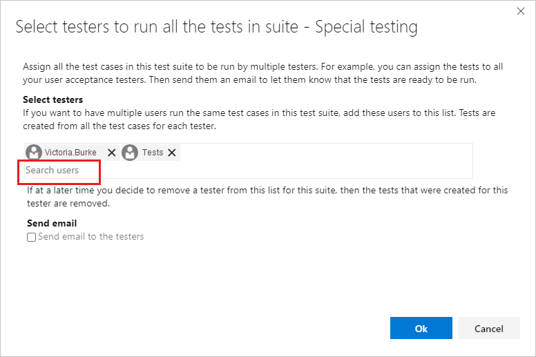
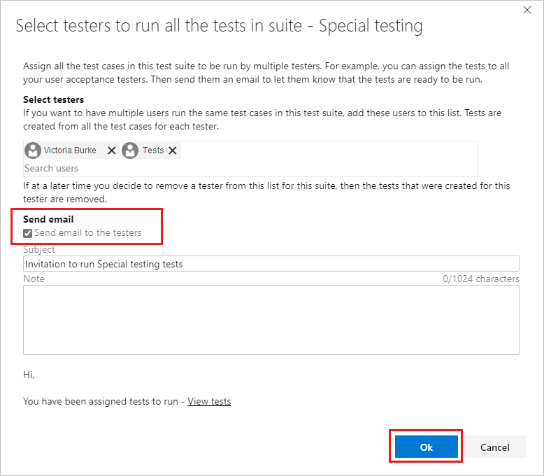
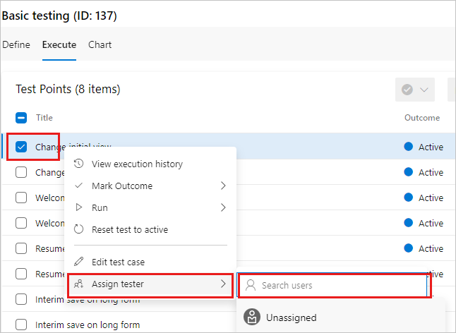
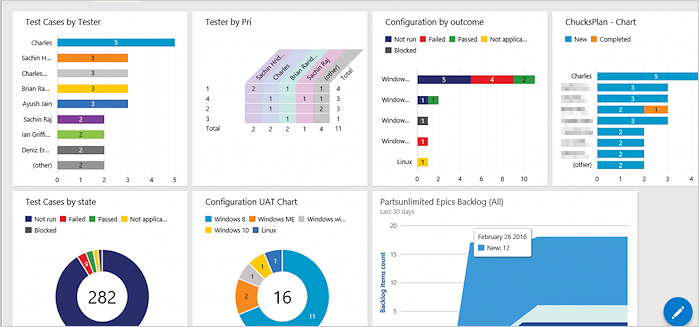

# Assign tests for user acceptance testing

[!INCLUDE [version-lt-eq-azure-devops](../includes/version-lt-eq-azure-devops.md)] 

Today's faster development pace requires tools that let test teams more easily verify value based
on business requirements, and the high quality software demanded by customers. This type of testing is often referred to as _user acceptance testing_.

Typically you create a Test Suite using a formal requirement work item type. However, today's 
agile teams often prefer to work from User Stories or Product Backlog items as their requirements.

## Prerequisites

| Category | Requirement |
|--------------|-------------|
| **Project access** | [Project member](../../organizations/security/add-users-team-project.md). |
| **Access levels** | To request or provide feedback: At least **Stakeholder** access. |
| **Permissions** | - To add or modify bugs or other work item types: **Edit work items in this node** permission set to **Allow** under the corresponding **Area Path**.   - To add new tags: **Create tag definition** permission set to **Allow**.   For more information, see [Set permissions and access for testing](../../organizations/security/set-permissions-access-test.md). |
|**Configuration**  |Work items and a test plan. If you don't have these, [create your backlog](../boards/backlogs/create-your-backlog.md) and [create a test plan](create-a-test-plan.md).|

## Assign and invite testers

For user acceptance testing, you can assign multiple testers to a set of tests. You can even assign the stakeholders, who created the business requirements, as testers.

1. Go to **Test plans**. You can select **Mine** to see your favorites or **All** to see all test plans. Open a test plan.

2. Select a test suite and then select **More options** or right-select to view the context menu and **Assign testers to run all tests**.

3. In **Search users**, enter a name or partial name to find the testers you want. You can select multiple testers.

   

   > [!TIP]
   > You can select individual users who are a members of the Project Valid Users group.
   > You can't select user groups.

4. To notify testers, select **Send email**.

   

5. Enter a message subject and note, as needed, and select **Ok**.
::: moniker range="< azure-devops"

   > [!NOTE]
   > For on-premises Azure DevOps, have an SMTP server configured for your deployment.
   > For more information, see [Configure an SMTP server](/azure/devops/server/admin/setup-customize-alerts)
::: moniker-end

If you have a large pool of potential testers, you might need to search for testers, as previously described.

To assign a tester to an individual test case, the search option appears in the context menu.
Select the **Execute** tab, select a test case, and then select **More options** or right-select to open the context menu.

When you select **Assign tester**, use the search option to find a tester.

## Track results

A key principle of good user acceptance testing practice is to minimize the effort required to determine whether a requirement is achieved. There are two ways you can do so: Focus on individual test runs and tests to see what failed, or use the chart views, which make it easier to track your test results. All members of your team can access these views.   

The example dashboard is also used for other types of testing, such as continuous testing.

If you don't see the data or information you expect in the dashboard charts, verify that the columns in your data are added to the Tests view. For more information, see [this blog post](https://devblogs.microsoft.com/devops/visual-studio-team-services-manual-testing-tips-charts-iterations-and-runs/).

## Related articles

- [Test objects and terms](test-objects-overview.md)
- [Collect diagnostic data while testing](collect-diagnostic-data.md)
- [Copy or clone test plans, test suites, and test cases](copy-clone-test-items.md)
- [FAQs for manual testing](reference-qa.yml)
