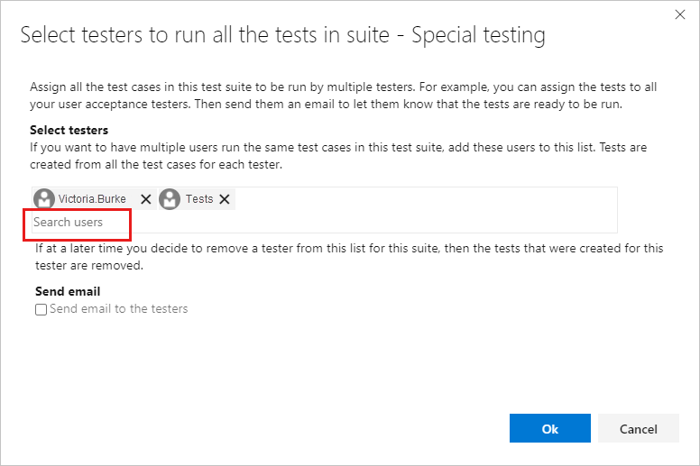
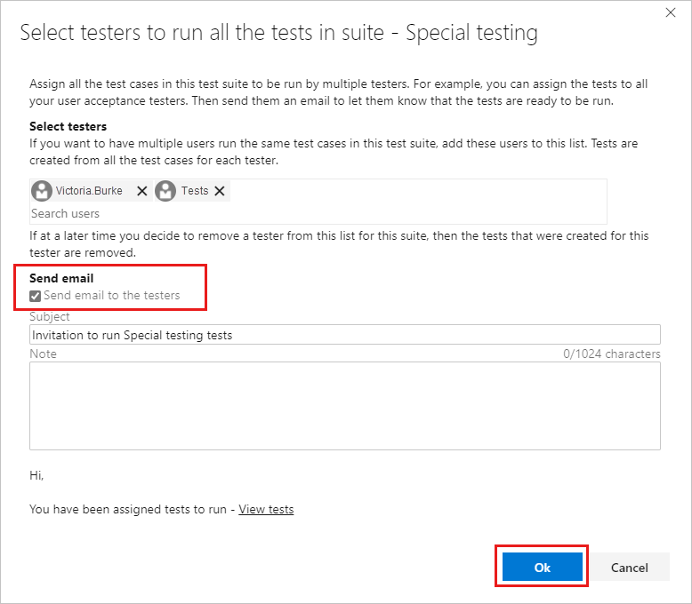
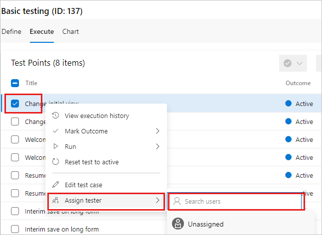
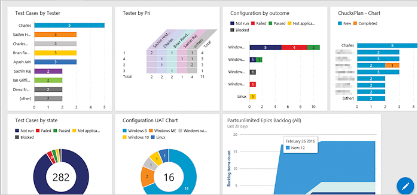

# Assign tests for user acceptance testing

[!INCLUDE [version-lt-eq-azure-devops](../includes/version-lt-eq-azure-devops.md)] 

User acceptance testing (UAT) helps business stakeholders and end users verify that deliverables meet their needs. In Azure Test Plans, organize UAT around requirement work items such as user stories or product backlog items, assign testers, and track results.

## Prerequisites

| Category | Requirement |
|--------------|-------------|
| **Project access** | [Project member](../organizations/security/add-users-team-project.md). |
| **Access levels** | To prepare UAT and assign testers: **Basic + Test Plans** access or an eligible Visual Studio subscription. To execute tests, mark outcomes, and view charts: At least **Basic** access. Users with **Stakeholder** access can't use the Test Plans web portal. For more information, see [Manual test access and permissions](manual-test-permissions.md). |
| **Permissions** | For the applicable Area Path, set **View work items in this node**, **Edit work items in this node**, and **Manage test suites** to **Allow**. For more information, see [Set permissions and access for testing](../organizations/security/set-permissions-access-test.md). |
| **Configuration** | Work items and a test plan. If you don't have these items, [create your backlog](../boards/backlogs/create-your-backlog.md) and [create a test plan](create-a-test-plan.md). |

## Assign and invite testers

For user acceptance testing, you can assign multiple testers to a set of tests. Business stakeholders who create the requirements can participate as testers after they receive at least Basic access.

1. In your project, select **Test Plans** > **Test plans**. Select **Mine** to access your favorites or **All** to access all test plans, and then open a test plan.

2. Select a test suite, and then select **More options** > **Assign testers to run all tests**. You can also right-select the test suite to open the context menu.

3. In **Search users**, enter a name or partial name to find the testers you want. You can select multiple testers.

   

   > [!TIP]
   > You can select individual users who are members of the Project Valid Users group.
   > You can't select user groups.

4. To notify testers, select **Send email**.

   

5. Enter a message subject and note, as needed, and select **OK**.
::: moniker range="< azure-devops"

   > [!NOTE]
   > For on-premises Azure DevOps, configure an SMTP server for your deployment.
   > For more information, see [Configure an SMTP server](/azure/devops/server/admin/setup-customize-alerts).
::: moniker-end

If you have a large pool of potential testers, you might need to search for testers, as previously described.

To assign a tester to an individual test case, the search option appears in the context menu.
Select the **Execute** tab, select a test case, and then select **More options** or right-select to open the context menu.

When you select **Assign tester**, use the search option to find a tester.

## Remove tester assignments

Tester assignments apply to *test points*, which are unique combinations of a test case, test suite, configuration, and tester. Removing an assignment doesn't delete the underlying Test Case work item. For more information, see [Execute tests and test points](navigate-test-plans.md#execute-tests).

### Remove a tester from all tests in a suite

1. Select the test suite, and then select **More options** > **Assign testers to run all tests**.
2. In the **Select testers to run all the tests in suite** dialog, select the **X** next to the tester you want to remove.
3. Select **OK**.

Azure Test Plans removes the test points that the suite-wide assignment created for that tester. It doesn't delete the Test Case work items, remove them from the suite, change their **Assigned To** values, or remove test points created for other testers.

### Clear the tester from an individual test point

1. On the **Execute** tab, select the test point.
2. Select **More options** > **Assign tester** > **Unassigned**.

The test point remains in the suite, but it no longer has a tester assigned.

## Track results

A key principle of good user acceptance testing practice is to minimize the effort required to determine whether a requirement is achieved. There are two ways to track results:

- Review individual test runs to identify failed tests.
- Use charts to track your test results.

Team members with at least Basic access can use these chart views.

The example dashboard is also used for other types of testing, such as continuous testing.

If the expected data isn't available in the dashboard charts, verify that you add the relevant columns to the Tests view. For more information, see [Track test status](track-test-status.md).

## Related content

- [Test objects and terms](test-objects-overview.md)
- [Collect diagnostic data while testing](collect-diagnostic-data.md)
- [Copy or clone test plans, test suites, and test cases](copy-clone-test-items.md)
- [FAQs for manual testing](reference-qa.yml)
