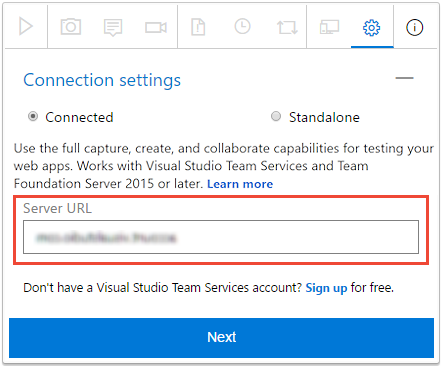
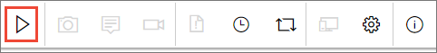
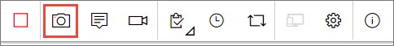
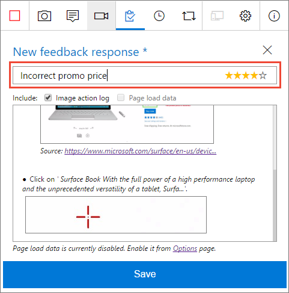
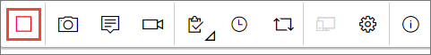

# Voluntarily provide stakeholder feedback using the Test &amp; Feedback extension

[!INCLUDE [version-header](_shared/version-header.md)] 

[!INCLUDE [feedback-header-text](_shared/feedback-header-text.md)] 

## Provide voluntary feedback  

You can use the Test &amp; Feedback extension to provide feedback
voluntarily, even if you haven't received a specific
[feedback request](request-stakeholder-feedback.md#request). 

1. Open the Test &amp; Feedback extension in your browser using the
   
   icon in the toolbar. 

1. In the **Connection settings** page, choose **Connected** mode.
 
   
 
1. Connect to the server and the project or team that is requesting feedback.
 
   

1. Start the exploratory testing session.

   

1. Open the application you want to provide feedback on
   and begin your feedback. For example, choose 
   **Capture screenshot** to take a screenshot.
 
   

   You can use all the capabilities of the extension
   such as capturing screenshots, notes, and screen recordings.

   >Some browsers may not provide all of the capture capabilities.
   See [Which web browsers does the extension support?](reference-qa.md#browser-support) 
 
1. When you are done capturing feedback, Choose **Provide feedback**.

   

   You can optionally choose to create bugs and tasks when you 
   submit your feedback. The process is the same as described 
   [here](connected-mode-exploratory-testing.md#create-bugs).
 
1. All your feedback captured is shown in the response form. 
   Type a suitable title and, optionally, select a star rating for 
   the feature you've been testing. 

   

1. Save your feedback. This create a work item in Azure DevOps
   or TFS containing all your feedback.
 
1. Continue to capture more feedback if required. You can submit 
   multiple feedback responses, bugs, and tasks for the same feedback request. 

1. Choose the **Stop** icon to end your feedback session. 
     
   

## See also

* [Request stakeholder feedback using the Test &amp; Feedback extension](request-stakeholder-feedback.md#request)
* [Provide stakeholder feedback using the Test &amp; Feedback extension](provide-stakeholder-feedback.md#provide)
* [Track stakeholder feedback using the Test &amp; Feedback extension](track-stakeholder-feedback.md#track)
* [Exploratory test and submit feedback directly from your browser](perform-exploratory-tests.md)
* [Overview of manual and exploratory testing](index.md)

[!INCLUDE [help-and-support-footer](_shared/help-and-support-footer.md)] 
