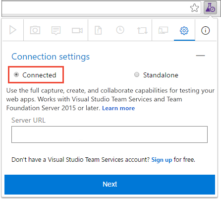
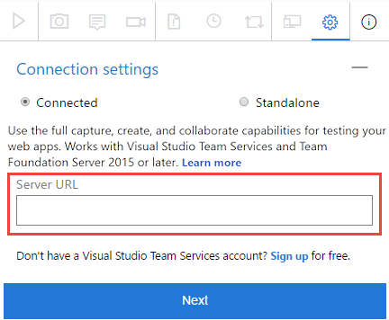
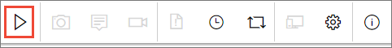
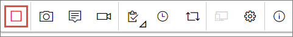

# Provide stakeholder feedback with the Test & Feedback extension

[!INCLUDE [version-lt-eq-azure-devops](../includes/version-lt-eq-azure-devops.md)] 

[!INCLUDE [feedback-header-text](includes/feedback-header-text.md)] 

## Prerequisites

| Category | Requirement |
|--------------|-------------|
| **Project access** | [Project member](../../organizations/security/add-users-team-project.md). |
| **Access levels** | To request or provide feedback: At least **Stakeholder** access. |
| **Extensions** |[Test & Feedback extension](perform-exploratory-tests.md).|

## Provide voluntary feedback  

Use the Test & Feedback extension to provide voluntary feedback, even if you don't receive a  [feedback request](request-stakeholder-feedback.md#request). 

[!INCLUDE [important-note-request-feedback-unavailable](includes/important-note-request-feedback-unavailable.md)]

1. Open the Test & Feedback extension in your browser using the  icon in the toolbar. 

2. In the **Connection settings** page, select **Connected**.
 
   
 
3. Connect to the server and appropriate project or team.
 
   

4. Start the exploratory testing session.

   

5. Open the application you want to provide feedback on and begin your feedback. For example, select **Capture screenshot**.
 
   

   You can use all the capabilities of the extension such as capturing screenshots, notes, and screen recordings.

   Some browsers might not provide all of the capture capabilities. See [Supported web browsers for the extension](perform-exploratory-tests.md#browser-support).
 
6. When you're done capturing feedback, Choose **Provide feedback**.

   

   You can optionally choose to create bugs and tasks when you 
   submit your feedback. The process is the same as described 
   [here](connected-mode-exploratory-testing.md#create-bugs).
 
7. All your feedback captured is shown in the response form. Enter a suitable title and, optionally, select a star rating for the feature you're testing. 

   

8. **Save** your feedback, which creates a work item in Azure DevOps containing all your feedback.
 
9. Continue to capture more feedback if necessary. You can submit multiple feedback responses, bugs, and tasks for the same feedback request. 

10. Select the **Stop** icon to end your feedback session. 
     
   

## Related articles

* [Request stakeholder feedback using the Test &amp; Feedback extension](request-stakeholder-feedback.md#request)
* [Provide stakeholder feedback using the Test &amp; Feedback extension](provide-stakeholder-feedback.md#provide)
* [Track stakeholder feedback using the Test &amp; Feedback extension](track-stakeholder-feedback.md#track)
* [Exploratory test and submit feedback directly from your browser](perform-exploratory-tests.md)
* [Overview of manual and exploratory testing](index.yml)
