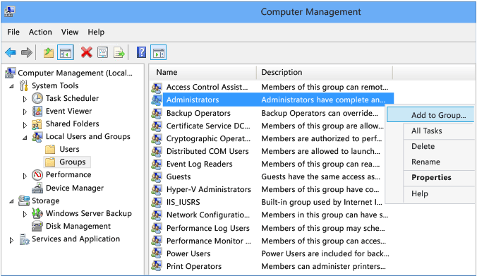
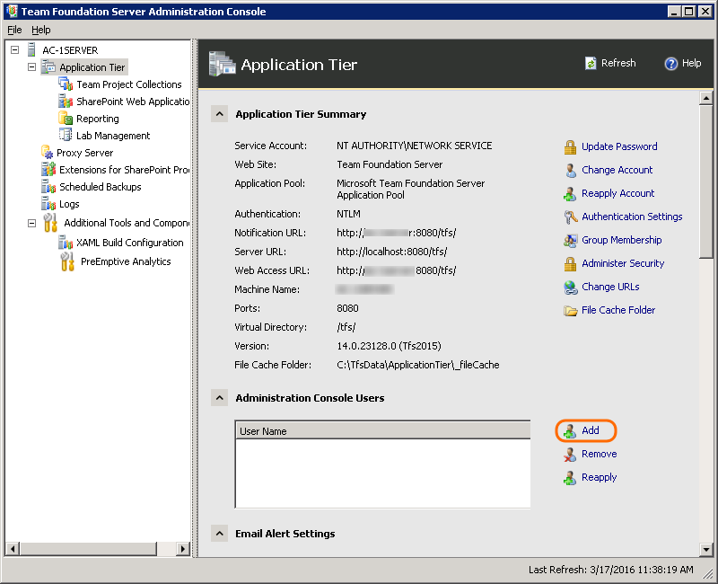
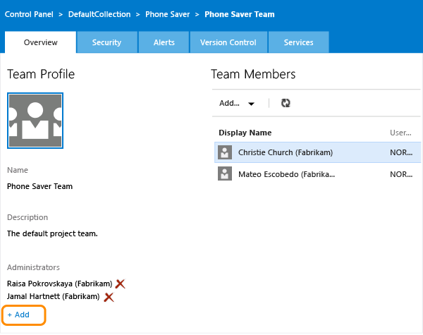

# Add administrators to TFS

**TFS 2018** | **TFS 2017** | **TFS 2015** | **TFS 2013**

Administrators in VSTS and TFS exist at three levels:
the team, the team project, and the team project collection.

In TFS, there are also server-level administrators.

See adding administrators to [project collections](../security/set-project-collection-level-permissions.md) and 
[projects](../accounts/add-administrator-team-project.md).

## Server

To perform system maintenance, schedule backups, add functionality, and do other tasks,
TFS server administrators must be able to configure and control all aspects of TFS.
As a result, TFS server administrators require administrative permissions
in the software that TFS interoperates with,
in addition to TFS itself.

You can quickly grant these permissions to administrators by adding them to the **Team Foundation Administrators**
group in Team Foundation Server (TFS).

1.  On the application-tier server, add the user to the local Administrators group.

    

2.  In the TFS administration console and add the user to the set of users who can run the administration console.

    

    If you're running a standard single-server deployment,
	or a multi-server deployment without SharePoint or reporting, that's it!
	However, if you have multiple application tiers,
	you'll need to repeat these two steps on every application tier server.
	And if you have SharePoint or reporting on other servers,
	you might need to manually add administrative users to those products separately. 

	See [Set SharePoint site permissions](../security/set-sharepoint-permissions.md) or [Grant permissions to view or create SQL Server reports in TFS](../report/admin/grant-permissions-to-reports.md). 

## Team

0. From the team page, click the  to go to the team administration page.

0. Add an administrator.

	
