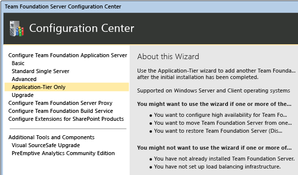
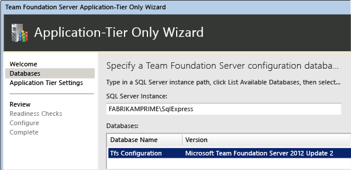
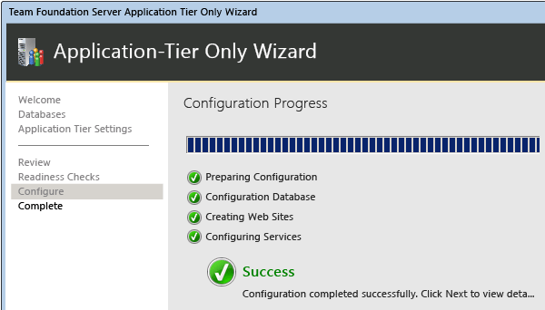
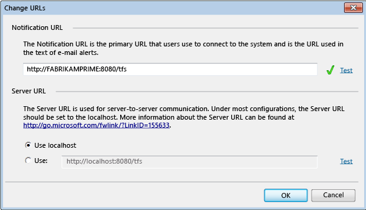
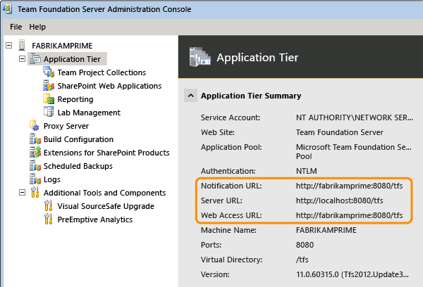
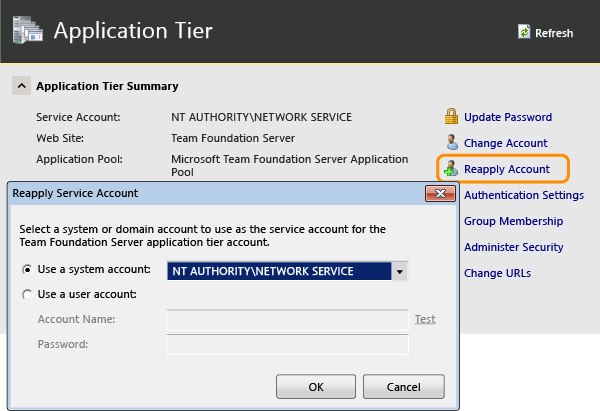

# Install and configure Team Foundation Server

**TFS 2015** | **TFS 2013**

This topic, the third part of the Restore a Single-Server tutorial,
teaches you how to install Team Foundation Server (TFS) using the
Application-Tier Only wizard. You will also learn how to install the
Extensions for SharePoint Products on the new server. Additionally, you
will learn how to configure SharePoint Foundation, reporting, and
analysis services to work with the new server.

Use this topic to:

> [!div class="checklist"]   
> * Install Team Foundation Server and the Extensions for SharePoint Products
> * Configure SharePoint Foundation 
> * Configure reporting and Analysis Services  

**Required permissions**: you must be a member of the following groups or have the following
permissions:

-   A member of the **Administrators** security group on the server.

-   A member of the **Team Foundation Administrators** group.

-   Either a member of the **SQL Server System Administrator** security group, or your **SQL Server Perform Back Up and Create Maintenance Plan** permission  must be set to **Allow**.

-   A member of the **sysadmin** security group for the databases for Team Foundation.

-   A member of the **Farm Administrators** group.

## Install Team Foundation Server and the Extensions for SharePoint Products

By restoring the databases that TFS uses, you have already restored the
data tier of the original deployment. Now you must complete the
restoration process by installing the application tier (the application
and services that compose Team Foundation Server) by using the
Application-Tier Only wizard. You must also install the extensions used
by TFS and SharePoint Foundation by running the Extensions for
SharePoint Products wizard, if your original deployment was configured
with SharePoint Foundation.

To install the application tier and the extensions:

1.  Open the administration console and start the configuration process.

    

    If you don't see the administration console for TFS, you haven't
    installed the TFS software on the server. To learn how, go to
    [Install Team Foundation Server](tut-single-svr-prep-new-hw.md#install-tfs).

2.  Launch the application-tier only wizard.

    

3.  Specify the name of the SQL Server where you just restored the
    databases and choose **List Available Databases** to populate the list. Choose the
    configuration database.

    

4.  Provide the same service account information as used in the prior
    deployment, if possible.

    

5.  Complete the wizard.

    

6.  In the Configuration Center, choose **Configure
    Extensions for SharePoint Products** and complete that wizard
    to install the extensions.

7.  Open the administration console, and in the Application Tier pane,
    update or refresh the URLs to reflect the new URLs for the
    restored server. Even if you have not changed the name or ports used
    for the restored server, you should reapply this information.

    
    
    

8.  After finishing the update, verify that the URLS appear correctly.

    

9.  Reapply the service account for TFS.

    

## Configure SharePoint Products

After you install the application tier and the extensions, you must
reconfigure the settings for the SharePoint web applications that your
deployment uses.

To configure the settings for SharePoint web applications:

1.  Open the administration console for Team Foundation.

2.  In the navigation bar, choose **SharePoint Web
    Applications**.

3.  In the **SharePoint Web Applications** list,
    highlight the web application used by the original deployment, and
    then choose **Change**.

   > **Tip**:
   > By default, the web application should appear automatically in the listf web applications. If it does not, choose **Add**, and then add it manually.
 

4.  The SharePoint Web Application Settings window opens. In **Web Application URL** and 
    **Central Administration URL**, review the
    settings, and if necessary, specify or change the values to reflect
    the URLs on the new server.

5.  When you are satisfied with the settings, choose **OK**.

    For more information about how to configure SharePoint web
    applications as part of your deployment, see [Add SharePoint products to your deployment](../add-sharepoint-to-tfs.md).

## Configure reporting and Analysis Services

After you have configured SharePoint Foundation, you must redirect Team
Foundation Server to the location of the report server, restart the
warehouse, and manually rebuild the database for Analysis Services, if
your deployment used reporting.

> **Note**:
> You must complete this procedure even if you restored the TFS\_Warehouse and TFS\_Analysis databases, as the previous section describes.

To reconfigure reporting and Analysis Services:

1.  In the navigation bar for the administration console, choose **Reporting**.

2.  On the **Reporting** page, choose **Edit**.

3.  In the **Take Offline** dialog box, choose **OK**.

    The **Reporting** dialog box opens.

4.  Select the **Use Reporting** check box.

5.  On the **Warehouse** tab, in **Server**, specify the name of the report server,
    and in **Database**, type the name of the
    warehouse database. Optionally choose **Test Connection** to verify that the database is valid.

6.  On the **Analysis Services** tab, in the
    **Server** list, specify the name of the
    server that is running SQL Server Analysis Services. In 
    **Database**, specify the name of the analysis
    services database, and in **Account for accessing
    data sources**, specify the username and password of the data
    sources account.

7.  On the **Reports** tab, in the **Server** list, specify the name of the report
    server, and then choose **Populate URLs**. In **Username** and **Password**, specify the account name and password
    (if any) for the data sources account. In **Default Path**, specify the relative path for the
    location where reports are stored, and then choose **OK**.

8.  In the administration console, choose **Start Jobs** to restart reporting.

9.  Open a Command Prompt window, and then change directories to
    `%ProgramFiles%\\TFS 12.0\\Tools`.

10. Enter the following command to rebuild the database for Analysis
    Services:

    `TFSConfig RebuildWarehouse /AnalysisServices /ReportingDataSourcePassword: Password`

    *Password* is the password for the data sources account for Reporting Services.

11. Wait until the command is successfully completed.

## Try this next

> [!div class="nextstepaction"]
> * [Reconnect services and users](tut-single-svr-reconn-svcs-users.md)
