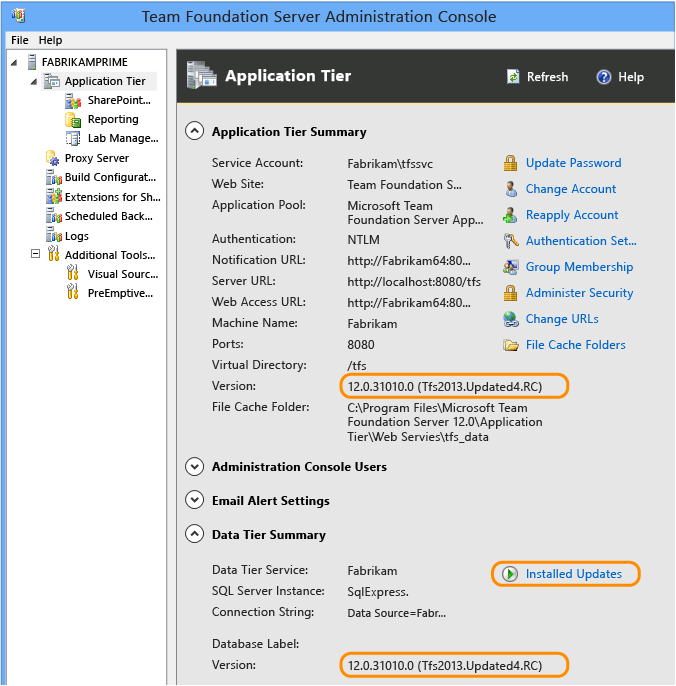
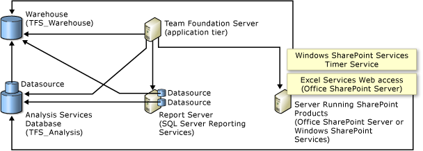

# Configure and manage TFS resources

**TFS 2017 | TFS 2015 | TFS 2013**

You configure and manage Team Foundation Server (TFS) and additional
resources to support your teams. These resources include the
application-tier and data-tier server(s), team project collections which
host team projects, and optional resources such as report servers,
SharePoint products, build servers, lab management, and more. For
information on TFS components and architecture, see <span>[Team Foundation Server architecture](../architecture/architecture.md).

> Important:
> You should not manually modify any of the TFS databases unless you're
> either instructed to do so by Microsoft Support or when you're
> following the procedures described for [manually backing up the databases](backup/manually-backup-tfs.md).  Any other modifications can invalidate your service agreement.

Through the Team Foundation Server Administration Console, you can
manage and monitor your server configuration. Tasks you can accomplish
through the administration console are indicated with this image: .


> [!div class="mx-tdBreakAll"]  
> |Application tier  |Data tier  | 
> |-------------|----------|
> |- [Add administration console users](../add-administrator-tfs.md) <br/>- [Configure an SMTP server to support alerts and feedback requests](setup-customize-alerts.md) <br/>- [Change cache settings for an application-tier server](change-caching-app-tier.md) <br/>- [Manage access to features in Team Web Access](../../security/change-access-levels.md)|- [Configure a backup schedule and plan](backup/config-backup-sched-plan.md) <br/>- [Back up and restore TFS](backup/back-up-restore-tfs.md)<br/>- [Manage TFS reports, data warehouse, and analysis services cube](../../report/admin/manage-reports-data-warehouse-cube.md)<br/>- [Understand backing up Team Foundation Server](backup/backup-db-architecture.md) |


> [!div class="mx-tdBreakAll"]  
> |Team project collections  |Team projects  | 
> |-------------|----------|
> |- [Manage team project collections](manage-team-project-collections.md) <br/>- [Move a team project collection](move-project-collection.md)<br/>- [Split a team project collection](split-team-project-collection.md) |- [Create a team project](../../accounts/create-team-project.md)<br/>- [Delete a team project](../../accounts/delete-team-project.md#delete-team-proj) <br/>- [Add reports to a team project](../../report/admin/add-reports-to-a-team-project.md)<br/>- [Configure or add a project portal](https://msdn.microsoft.com/library/ms242865.aspx)<br/>- [Support rollup of work and other fields](https://msdn.microsoft.com/en-us/library/dn217871(v=vs.120).aspx) |


> [!div class="mx-tdBreakAll"]  
> |Reports, documents, and dashboards  |Service accounts, application pools, and websites  | 
> |-------------|----------|
> |- [Add reports to a team project](../../report/admin/add-reports-to-a-team-project.md) <br/>- [Manage the data warehouse and analysis services cube](../../report/admin/manage-reports-data-warehouse-cube.md)<br/>- [Add SharePoint products to your deployment](add-sharepoint-to-tfs.md)|- [Stop and start services, application pools, and websites](stop-start-stuff.md)<br/>- [Service accounts and dependencies in TFS](service-accounts-dependencies-tfs.md)<br/>- [Change the service account or password for TFS](change-service-account-password.md) <br/>- [Change the service account or password for SQL Server Reporting Services](change-service-account-or-password-sql-reporting.md) | 

## Use the Team Foundation Administration Console to configure and manage your deployment

The administration console is installed by default on any server on
which you install one or more of the following components: an
application tier for TFS, TFS extensions for SharePoint Products, Team
Foundation Build, and Visual Studio Lab Management

If all of your components are installed on a single server, the
administration console provides management nodes for all components in
your deployment. If, however, your deployment uses multiple servers, you
must open the console on the server that is running the component that
you want to manage.

1.  If you're not a local administrator on the server where the
    console is running and an administrator in TFS, [get those
    permissions](../add-administrator-tfs.md).

2.  To open the console:

    -   From Start, open the application menu, choose Microsoft Team
        Foundation Server, and then choose Team Foundation Server
        Administration Console.

        If **Team Foundation Server Administration
        Console** doesn't appear in the list of available
        applications, you might not have permission to open it. You can
        try to open it at a command prompt, but you might not be able to
        access some or all of the administration
        console's functionality.

    -   From the command line, open a Command Prompt window running as
        an administrator, and change directories to the TFS tools
        directory (by default, *Drive*:\%programfiles%\TFS 12.0\Tools), and enter ```TfsMgmt.exe```.

**Q: When I open the administration console, why do some of the fields say "Loading"?**

**A:** On some servers, you might have to wait briefly for all the information to populate throughout the nodes of the console. This is more common on servers with minimal resources or in a multi-server deployment.

**Q: Why can't I perform one or more tasks from the administration console?**

**A:** You can only perform those tasks for which you have permissions. While you may have permission to open the admin console, you may not have all the permissions to run a task that the admin console supports. The console can be opened by anyone who has a valid user account on the server or servers on which the console is installed. However, you'll only be able to perform those functions for which you have the required permissions. 


## View installed updates on your server

To determine what updates have been installed, you can open the
administration console for Team Foundation or view the version number of
a particular file.

1.  Open the administration console and choose **Application Tier** and review the version numbers
    listed for the application-tier and data-tier.

    

2.  To learn when the software was installed, choose **Installed Updates**.

If the administration console provides isn't available, for example
during a TFS upgrade, you can view the file version number of the **Microsoft.TeamFoundation.Admin.dll** file.

1.  Open Windows Explorer (or File Explorer), and browse to \\Program
    Files\\TFS 12.0\\Tools.

2.  Expand the sub-menu for **Microsoft.TeamFoundation.Admin.dll**, and then
    choose **Properties**.

3.  Choose the **Details** tab, and review the
    information under **File Version**.


## Application areas and resource dependencies

You can add or remove resources to your deployment to better meet the
changing needs of your business and the software projects that you
support with TFS. You can add or remove reporting and Web resources at
any time. You can also use more than one instance of SQL Server to host
the databases for your deployment. For example, you can add a server
that is running SQL Server Reporting Services to your deployment after
you install and initially configure TFS. You can also upgrade the
version of SharePoint Products that supports your deployment and add its
capabilities of that product to the team projects that already exist in
your deployment.

When you create a team project, you automatically gain access to the
following functions:

-   Web access: provides a web interface to TFS that grants access to
    team projects, Agile planning and tracking tools, version control,
    and builds. For an overview, see [Work in Team Web Access](../../user-guide/work-web-portal.md) (TWA).

-   Source control repository using Team Foundation [version
    control](../../git/overview.md) or [Git repositories](../../git/gitquickstart.md).

-   Work item tracking: teams can create work items and work item
    queries to track, monitor, and report on the development of a
    product and its features. A work item is a database record that
    stores the definition, assignment, priority, and state of work. Your
    team can create only those types of work items that are defined in
    the process template that is used to create the team project or
    types that are added to the team project after it is created.

    Team members can work in TWA or Team Explorer. To learn more about
    these and other clients that connect to TFS, see [Choose the Team Foundation client to support your tasks](https://msdn.microsoft.com/library/ms181304.aspx).

The following table indicates the additional servers and functionality
that you must configure for your team to have access to the
corresponding feature. You can add resources before or after you have
created your team project.

| Feature area | Required resources | Related topics | Notes |
| --- | --- | --- | --- |
| Feedback requests and email alerts | SMTP Server | [Configure an SMTP server to support alerts and feedback requests](setup-customize-alerts.md) | The SMTP server you configure supports all team projects created under the project collections  defined on the application-tier.  If the SMTP server isn't configured, then links may not appear to access the [Request  feedback](../../feedback/get-feedback.md) and to set [Alerts](../../work/track/alerts-and-notifications.md). |
| **Builds** | Team Foundation Build | [Configure and manage your build system](../../build-release/overview.md) | The **Builds** page lists the build definitions defined for your team project. This page appears only when Team Foundation Build is installed and configured. Team Foundation Build enables your team to create and manage product builds. For example, a team can run daily builds and post them to a shared server. Team Foundation Build also supports build reports about the status and quality of each build. </br> Access to Team Foundation Build Service requires that the team project collection has been configured to use a build controller. Each build controller is dedicated to a single team project collection. The controller accepts build requests from any team project in a specified collection. See <span>[Build the application](https://msdn.microsoft.com/en-us/library/ms181709). |
| **Documents** (team project portal) | SharePoit Products | [Add SharePoint products to your deployment](add-sharepoint-to-tfs.md) </br> [Configure a Default Location for Team Project Portals](https://msdn.microsoft.com/en-us/library/dd386357) | The **Documents** page appears only when your team project has been configured with SharePoint Products.  After the team project is created, you can configure a SharePoint site or another web location as the project portal.  You may need to [configure dashboard compatibility](config-ent-sharepoint0710-dashboards.md) and [configure an enterprise application definition](../install/sharepoint/config-enterprise-app-def.md).  See also [Share information using the project portal](https://msdn.microsoft.com/en-us/library/ms242883(v=vs.120).aspx). |
| Excel reports | SharePoint Products </br> SQL Server Analysis Services | [Add Sharepoint products to your deployment](add-sharepoint-to-tfs.md) </br> [Add a report server](../../report/admin/add-a-report-server.md) | Microsoft Excel reports are uploaded to the **Document** node Documents folder when you configure your team project with a SharePoint site. With these reports you can track your team project's burn rate, bug backlog, software quality, test progress, and other metrics. Many of these reports display within your project's dashboards. In addition to the SharePoint Products dependency, Excel reports depend on your team project collection that hosts your team project has been configured with both SQL Server Analysis Services. </br> For an overview of the default Excel reports, see [Excel reports](https://msdn.microsoft.com/en-us/library/dd997876) or [Excel reports (CMMI)](https://msdn.microsoft.com/en-us/library/ee461589). </br> If your team project doesn't have a SharePoint site, you can still use Excel to create status and trend reports. See [Creating Reports in Microsoft Excel by Using Work Item Queries](../../report/excel/create-status-and-trend-excel-reports.md). |
| **Reports** | SQL Server Analysis Services </br> SQL Server Reporting Services | [Add reports to a team project](../../report/admin/add-reports-to-a-team-project.md) | The **Report** page appears only when the team project collection that hosts your team project has been configured with both SQL Server Reporting Services and SQL Server Analysis Services. This page provides access to Report Manager and the default and custom reports that you upload to the server that hosts SQL Server Reporting Services. </br> For an overview of the default reports, see [Reporting Services Reports](https://msdn.microsoft.com/en-us/library/dd380714). |
| Remote-site | Team Foundation | [How to: Install Team Foundation Proxy and set up a remote site](../install/install-proxy-setup-remote.md) </br> [Configure Visual Studio to connect to TFS Proxy](../../user-guide/connect-team-projects.md) | If some team members are located remotely from the main location for version control, you may want to install and configure Team Foundation Server Proxy to support them.  TFS Proxy manages a cache of downloaded version control files in the location of the distributed team, which significantly reduces the bandwidth that is needed across wide area connections. </br> If clients are configured to use Team Foundation Server Proxy, management of the files is transparent to the user. Any metadata exchange and file uploads continue to interface directly with TFS. See [Connect to team projects in Team Foundation Server](). |
| Virtual environments | Visual Studio Lab Management | [Configure Lab Management for SCVMM environments](config-lab-scvmm-envs.md) | By using Lab Management, your team can create, assign, and track virtual environments to support application development, deployment, and tests. Testing teams can test applications by using Microsoft Test Manager when their team project is configured to use these virtual environments. |
|Automate deployments | Release Management | [Automate deployments with Release Management](https://msdn.microsoft.com/en-us/library/dn217874.aspx) | You can support a rapid release cadence and manage simultaneous releases using Release Management. Set up release paths that represent your stages from development to production. Run actions to deploy your app to an environment for that stage. |
| Synchronize with Project Server (deprecated for TFS 2017) | TFS-Project server Integration | [Synchronize Team Foundation Server with Project Server](https://msdn.microsoft.com/en-us/library/gg455680.aspx) | To support data to flow from work items TFS to tasks in enterprise project plans in Project Server, you install Team Foundation Server Extensions for Project Server on the server hosting Project Server. This integration enables project managers and software development teams to use the tools that they prefer, work at the level of precision that supports their needs, and share information transparently. |
| Capture production incidents | Preemptive Analytics | [Preemptive Analytics](https://www.preemptive.com/pa) | With PreEmptive Analytics for Team Foundation Server, development teams can capture production incidents (unhandled, caught, and thrown exceptions) and create and update TFS work items based on custom rules and thresholds. </br> You configure PreEmptive Analytics through the Team Foundation Administrator Console. |


## Q & A 

**Q: Can I rename a team project or team project collection?**

**A:** You can't rename a team project. You can
rename a collection by first detaching the collection, editing its
settings, and then attaching the collection. See [Manage team project collections](manage-team-project-collections.md).

**Q: How does TFS manage its services?**

**A:** TFS and the products it integrates with
include several services and service accounts which run on some or all
of the logical tiers and physical computers that compose a deployment.
You can use the same account for all of these service accounts, or you
can use different accounts. Your choice of account or accounts to use
depends on the configuration of your deployment, your security needs,
and what components you have installed. For clarity, each service
account is referred to separately by using placeholder names.

To learn more, see <span>[Service accounts and dependencies in Team Foundation Server](service-accounts-dependencies-tfs.md).

**Q: How do I scale my deployment?**

**A:** You can [move TFS to a new server](move-clone-hardware.md)
or add [additional application-tier servers](backup\restore-application-tier-server.md). You can 
also [Move Team Foundation Server from one environment to another](move-across-domains.md).

**Q: How do I monitor my deployment?**

**A:** You can monitor TFS activity using the following tools:

-   From the administration console Logs page, you can open a log file
    generated when configuring or servicing TFS.

-   From the web administration page for the application-tier server,
    you can view activity logs and job monitoring charts.

    ```http://MyServer:8080/tfs/\_oi/```

    To learn more, see this blog post: [New tools for TFS
    Administrators](http://blogs.msdn.com/b/granth/archive/2013/02/13/tfs2012-new-tools-for-tfs-administrators.aspx).

-   From the Control Panel context of TWA, you can export an audit log
    of all users and their access levels. See [Change access levels](../../security/change-access-levels.md).

For additional monitoring tips, see this blog post: [What does a well
maintained Team Foundation Server look
like?](http://blogs.msdn.com/b/granth/archive/2013/10/08/what-does-a-well-maintained-team-foundation-server-look-like.aspx)

**Q: What do I need to know about maintaining multiple servers?**

**A:** Depending on how you initially installed
and configured Visual Studio Team Foundation Server (TFS), you might
need to manage it across one or multiple servers to maintain and
operate your deployment. For example, the following illustration shows
the logical architecture of a deployment of TFS that is integrated with
both SQL Server Reporting Services and SharePoint Products:



In this example, you have to manage the configuration of the components,
the users, the groups, and permissions across several servers. You must
configure firewalls or other devices to allow network traffic on the
ports that are required for communication between the servers. You have
to make sure that all services that the deployment requires are running
and configured to start automatically. Finally, you must make sure that
the service account that TFS uses is fully trusted by every computer in
the deployment. 

See also this blog post: [What does a well maintained Team Foundation
Server look
like?](http://blogs.msdn.com/b/granth/archive/2013/10/08/what-does-a-well-maintained-team-foundation-server-look-like.aspx)

**Q: Where can I learn more about TFS requirements?**

**A:** See one or more of the following topics:

-   The installation guide includes details about these elements:

    -   [system requirements](../requirements.md)

    -   [SQL Server requirements](../requirements.md#sql-server)

    -   [Active Directory requirements](../requirements.md)

    -   [SharePoint Products requirements](../requirements.md#sharepoint)

    -   [account requirements](../requirements.md#accounts)

    -   [language requirements](../requirements.md#languages)

    -   [port requirements](../architecture/required-ports.md).

-   You can also learn about requirements and infrastructure in these reference topics:

    -   [Team Foundation Server architecture](../architecture/architecture.md)

    -   [Naming restrictions in Team Foundation](../../collaborate/naming-restrictions.md)

    -   [Service accounts and dependencies in Team Foundation Server](service-accounts-dependencies-tfs.md)

-   For licensing information, read the [licensing whitepaper](https://www.microsoft.com/download/details.aspx?id=13350).


**Q: Are there any restrictions I should be aware of when maintaining TFS?**

A: Yes. As mentioned above, you should never manually modify TFS
databases, because that can invalidate your service agreement, block
upgrades and patches, and result in data loss or corruption. There are
only two circumstances where you should ever consider modification:

-   You are instructed to do so by Microsoft Support.

-   Your deployment needs require you to manually back up your
    TFS databases. In that case, you should only modify the databases as
    described [here](backup/manually-backup-tfs.md).

**Q: What other resources are available?**

**A:**The following resources and tools are available:

-   You can post questions or search for answers in the MSDN forum:
    [Team Foundation Server - Setup and
    Administration](https://social.msdn.microsoft.com/forums/vstudio/home?forum=tfsadmin)

-   [Team Foundation Server
    Blog](http://go.microsoft.com/fwlink/?LinkId=254496)

-   [Microsoft Visual Studio Team Foundation Server 2013 Power
    Tools](http://go.microsoft.com/fwlink/?LinkId=320602) includes the
    TFS Best Practices Analyzer, a Process Template editor, and
    additional tools.
