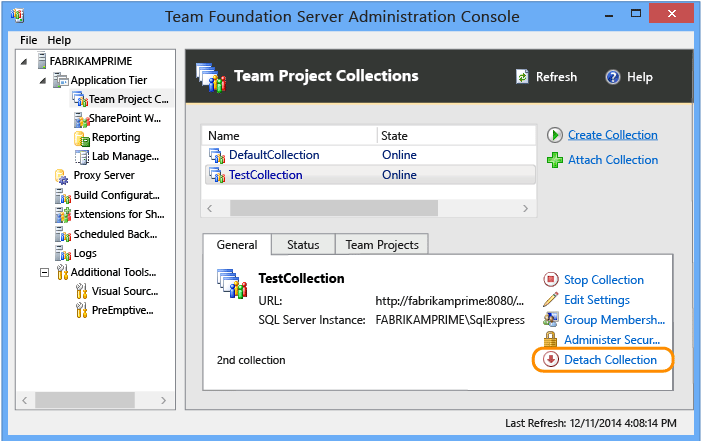

# Manage team project collections in Team Foundation Server

**TFS 2018** | **TFS 2017** | **TFS 2015** | **TFS 2013**

When your Team Foundation Server (TFS) hosts multiple team projects, you
can manage them more efficiently by grouping them together and assigning
the same resources to them. For example, you can group projects that
have similar requirements or objectives, such as all team projects that
access a particular code base. You can then manage the group of team
projects as an autonomous resource with its own user groups, server
resources, and maintenance schedule.

A group of team projects is called a *team
project collection*. When you install TFS, a default collection is
created to contain all team projects. When you create a collection, you
specify the logical and physical resources that team projects within
that collection can use. All the artifacts and data that those team
projects use are stored in the single database of the collection.

The following illustration shows how databases for team project
collections are integrated with the logical architecture of TFS. When
you create a team project, you specify the collection where its data
will be stored.

## View information or configure existing team project

1.  If you haven't been added as a TFS administrator, [get added now](../add-administrator-tfs.md).

    You must be a member of the local Administrators group on the server
    where you want to open the console, and either a member of the Team
    Foundation Administrators group or your **Edit
    Server-Level Information** permission must be set to **Allow**.

2.  Log on to the application-tier server for TFS, open the
    administration console for TFS, and open the Team Project
    Collections node.

    

    To learn how to open the admin console, see [Use the Team Foundation Administration Console to configure and manage your deployment](config-tfs-resources.md).

3.  Highlight the name of a collection and review the information
    provided from the various tabs. Some tabs only appear if the
    corresponding application has been configured to support the
    application-tier in the TFS deployment.

    You can perform the following tasks from the corresponding tab.

    | Tab | Tasks |
    | --- | --- |
    | **General** | <ul><li> **Start Collection** or **Stop Collection**: Start or stop a collection. Team projects become unavailable when you stop a collection. You typically stop a collection to support maintenance operations, such as moving or splitting a collection. </li><li> If the collection is started, only **Stop Collection** appears. If the collection is stopped, only *Start Collection** appears. Starting or stopping a collection can take several minutes to complete. You might need to choose **Refresh** to display the change in state. </li><li> **Edit settings**: Edit the collection's description or configuration. </li><li> **Group Membership**: Add or remove users or groups as members of a collection. To learn more, see [Set administrator permissions for team project collections](../../security/set-project-collection-level-permissions.md). </li><li> **Administer Security**: Manage the  permissions of a collection group. To learn more, see [Permission reference for Team Foundation Server](../../security/permissions.md). </li></ul> |
    | **Status** | View an activity log or rerun a job. |
    | **Team Projects** | <ul><li> View the team projects defined for a collection and [Delete a team project](../../accounts/delete-team-project.md). </li><li> To learn more about team projects, see [Create a team project](../../accounts/create-team-project.md). </li></ul> |
    | **Reports Folder** | <ul><li> Configure the report server for use by the collection. </li><li>  When you edit the default folder location, the operation will fail if you type the path of a folder that does not exist on the server and you do not have permission to create a folder on that server. You must specify an existing folder if you do not have permissions to create folders on that server. </li><li> To remove the default location for report subfolders, choose **Clear Configuration**.  </li><li> Removing the configuration removes the reporting functionality for all existing and future team projects in the collection.  </li><li> This tab only appears when you've [added a report server to TFS](../../report/admin/add-a-report-server.md). </li></ul> |
    | **SharePoint Site** | <ul><li> View, configure, or remove the default root location for where team project portals are created. The **Create New Team  Project Wizard** creates team project portals at this location. </li><li> If the **SharePoint Web Application** list is empty, the application-tier hasn't been configured with any applications. </li><li> This tab only appears when you've configured the application-tier with SharePoint Products. See [Add SharePoint products to your deployment](add-sharepoint-to-tfs.md). </li></ul> |

## Create a team project collection

Before creating a team project collection, jump to this [section to learn more about the pros and cons of creating multiple team project collections](#pros_cons).

1.  If you haven't been added as an administrator to TFS, [get added now](../add-administrator-tfs.md).

    You must be a member of the local Administrators group on the server
    where you want to open the console, and either a member of the Team
    Foundation Administrators group or your **Edit Server-Level Information** permission must be set to **Allow**.

2.  From the administration console, open the **Team
    Project Collections** page and choose **Create Collection**.

    

3.  Follow the guidance provided by the **Create Team
    Project Collection** wizard.

    For the **Name**, specify a unique name with
    no more than 64 characters (the shorter the better), and don't
    specify slashes, or other special characters listed in [Naming restrictions in Team Foundation](../../collaborate/naming-restrictions.md).

    The wizard supports configuration of the following resources. Some
    resources can only be configured if the application-tier server that
    hosts the collection has been previously configured to support the
    corresponding application.

    **Data Tier or SQL Server instance**

    1.  In **SQL Server Instance**, specify the
        name of the TFS data-tier server. If you want to use a named
        instance to host the database for this team project collection,
        you must also specify the name of the instance as in the
        following example:

        *ServerName* **\\** *InstanceName*

    2.  Choose **Create a new database for this
        collection** if you want to create a database for
        the collection. This option requires that the service account
        for the Visual Studio Team Foundation Background Job Agent uses
        has permissions to create a database on the instance of
        SQL Server.

        Or, choose **Use this existing database**
        if you want to use a database that already exists, and specify
        the name of the database in the text box. This option requires
        that an empty database exists on the named SQL Server instance
        and you have write permissions.

    **SharePoint web application**

    1.  **SharePoint web application** appears if
        you have configured the application-tier with a SharePoint web
        application, otherwise it is disabled. To configure it later,
        see [Add SharePoint products to your deployment](add-sharepoint-to-tfs.md).

    2.  Choose **Next** if you want to use the
        default option to create a site collection. Choose this option
        unless your business infrastructure requires that you use an
        existing site collection. This option will create a SharePoint
        site collection with the name of the collection used as the name
        of the sub-site of the root site that is configured in the
        SharePoint web application.

        This option requires the TFS service account to be a member of
        the Farm Administrators group. If it isn't, you can't create
        a site collection.

    3.  Or, to use an existing site collection that a member of the Farm
        Administrators group created for you, expand **Advanced configuration**, choose **Specify a path to an existing SharePoint
        site**, and specify the relative path of the site
        collection that was created for you.

        Choose **Verify Path**, and??if the path
        is correct, choose **Next**.

    **SQL Server Reporting Services**

    1.  **Reports** appears if you have
        configured the application-tier to use SQL Server Reporting
        Services, otherwise it is disabled. To configure it later, see
        [Add a report server](../../report/admin/add-a-report-server.md).

    2.  Review the information for the server and the folder that will
        host reports, and choose **Next**. This
        option requires your user account to have permissions to create
        a folder on the server that is running Reporting Services.

        Unless security restrictions in your business infrastructure
        prevent the automatic creation of a folder as part of the
        wizard, you should use the default option to create a folder.

    3.  If you must use a folder that an administrator created for you
        on the server that is running Reporting Services, expand **Advanced configuration**, choose **Specify a path to an existing folder**, and
        specify the relative path of the folder that has been created
        for you.

        Choose **Verify Path**, and if the path
        is correct, choose **Next**.

    **Lab Management**

    **Lab Management** appears if you have
      configured the application-tier to use Lab Management for the
      collection, otherwise it is disabled. To configure it later, see
      [Configure Lab Management for SCVMM environments](config-lab-scvmm-envs.md).

      If you do not use Lab Management, skip to **Verification process**.

      If you do use Lab Management, follow the steps provided in **To configure Lab Management for each team project
      collection** as described in [Configure Lab Management for SCVMM environments](config-lab-scvmm-envs.md).

    **Verification process**

    1.  In **Readiness Checks**, review the
        status of the checks.

        A blue underlined **Error** indicator
        appears next to any configuration that contains an error. You
        can choose the indicator for a detailed message about
        the problem. You must address all errors before you
        can continue.

        After all readiness checks have passed, choose **Create**.

    2.  The process of creating a team project collection starts.

        After the wizard finishes, choose **Close**.

## Detach or delete a team project collection

You detach a team project collection when you want to perform a
maintenance operation, such as moving or splitting a collection. Teams
can't access team projects or source code when you detach the
collection.

You delete a collection when you no longer need the data stored in the
team projects defined in the collection. The three steps to delete a
collection are (1) detach the collection, (2) delete the collection
database, and (3) delete the SharePoint site collection that supported
the deleted collection.

**Detach the collection**

1.  From the administration console, highlight the name of the
    collection that you want to delete, and then choose **Detach Collection**.

    

2.  Follow the guidance provided by the **Detach Team
    Project Collection Wizard**.

    (Optional) On the **Provide a servicing message
    for the team project collection** page, in **Servicing Message**, specify a message for users
    who might try to connect to projects in this collection.

3.  When all the readiness checks have completed successfully, choose
    **Detach**.

    On the **Monitor the team project collection
    detach progress** page, when all processes have completed,
    choose **Next**.

4.  (Optional) On the **Review supplemental
    information for this team project collection** page, note the
    location of the log file.

**Delete the database and the SharePoint site collection**

1.  Open SQL Server Management Studio, connect to the instance of the
    SQL Server Database Engine that hosts the collection database, and
    expand the instance.

    Highlight the name of the collection database (by default,
    TFS\_*CollectionName*), and then delete
    the database.

    For more information, see [How to: Delete a Database](http://go.microsoft.com/fwlink/?LinkId=178820).

2.  Open SharePoint Central Administration, and delete the site
    collection that supported the deleted collection.

    For more information, see [Delete a site collection in SharePoint 2013](https://msdn.microsoft.com/library/cc262392.aspx).

The team project collection no longer appears in the list of collections
in the administration console.

## Q & A

**Q: What are the pros and cons of creating multiple team project collections?**

If your development efforts will benefit from the ability to branch and
merge code or you must query the status of work items that relate to the
same code, you should consolidate your team projects in the same team
project collection.

**A: Advantages for creating more than one collection**

You can better separate the operational needs for one code base or other
grouping of projects from the operational needs for another grouping.
Because the data for each collection is stored in its own database, you
can independently manage many aspects of each collection separately from
other collections in your deployment. For example, you can stop and
start each collection individually. Therefore, you can schedule
maintenance operations for each collection at different times.

Grouping team projects into more than one collection provides the
following advantages:

-   **Greater flexibility and scalability in managing
    and distributing databases and resources**. A group of related
    team projects share reports, work items, and process guidance, as
    well as a code base.

    By creating a database for each collection, teams and administrators
    can perform the following tasks:

    -   Build, branch, merge, and iterate an autonomous code base
        according to the needs of the projects within the collection.
        Code dependencies outside the collection can be
        formally managed.

    -   Back up and restore the data for each collection independently
        of other collections.

    -   Store all collection databases on a single instance of SQL
        Server, or distribute the databases across one or
        more instances.

    -   Detach a collection, back it up, and then restore it to a
        different deployment of TFS.

    -   Reassign resources to better meet the demands of projects as
        they increase in size over time.

-   **Increased operational security**. Because
    each collection has its own set of users and permissions, isolating
    different code bases can be isolated under different collections.
    Administrators can add users only to the collection that contains
    the project or projects that pertain to that particular code base.

-   **Increased capability to support custom workflow
    processes**. Each collection manages process templates, work
    item types, link types, global lists, and work item fields separate
    from other collections. By separating team projects that have
    different workflow processes into different collections, you only
    expose those customizations needed to those team projects within
    a collection.

**A: Disadvantages of creating more than one collection**

The main disadvantage of creating more than one team project collection
is that you increase the complexity of your deployment of TFS.

-   You must backup and restore the database for each collection, and
    other management and maintenance tasks also increase in proportion
    to the number of collections that you have. For example, you must
    manage the set of users and permissions for each team project
    collection individually.

-   Teams cannot link work items across collections.

-   Teams cannot branch or merge code across collections.

-   Teams cannot create queries across collections.

**Q: What objects or resources are managed at the collection level?**

**A:** Each team project belongs to a collection.
In addition, the following objects are managed at the collection level:

-   **Source control (TFVC)**: [File types](https://msdn.microsoft.com/library/ms181457(v=vs.100).aspx)
    and [enabling/disabling asynchronous checkout in server workspaces](../../tfvc/decide-between-using-local-server-workspace.md).

-   **Work item tracking**: [Process templates](../../work/work-items/guidance/manage-process-templates.md),
    [work item types](../../work/customize/add-modify-wit.md),
    [link types](https://msdn.microsoft.com/en-us/library/dd728085(v=vs.120).aspx),
    [work item fields](../../work/customize/add-modify-field.md),
    [global lists](../../work/customize/reference/define-global-lists.md),
    and [global workflow](https://msdn.microsoft.com/en-us/library/gg534720(v=vs.120).aspx).

    All fields defined for all team projects defined within a collection
    are managed or configured for a collection. You can define no more
    than 1,024 work item fields in the same team project collection, and
    you can set no more than 1,024 fields to be reportable in all team
    project collections.

-   **Dev-Test-Ops**: 
 -   TFS 2015: [Agent queues](../../build-release/concepts/agents/pools-queues.md)
 -   TFS 2013: [XAML build controllers](https://msdn.microsoft.com/library/dd793166%28v=vs.120%29.aspx)

-   **Security**: [Collection-level groups and permissions](../../security/permissions.md).

**Q: How does TFS support reports from data stored for different team collections?**

**A:** A single relational data warehouse
contains all reportable data from all team projects that are defined in
all project collections for a TFS deployment. Data from that warehouse
is then processed and written to the OLAP cube. Because data is
collected into a single data warehouse, you can report across multiple
team project collections.

To create or customize reports, you must [add user accounts to the TfsWarehouseDataReader role](../../report/admin/grant-permissions-to-reports.md).
Report authors need read access to both the relational data warehouse
and Analysis Services cube. These accounts can view data for all team
projects that are hosted in all team project collections in the TFS
deployment. There is no way to limit access to a team project or
collection.

**Q: How do I scale my deployment with collections?**

**A:** See [Move a team project collection](move-project-collection.md)
or [Split a team project collection](split-team-project-collection.md).

**Q: Is there a command line tool for managing collections?**

**A:** You can use the **TFSConfig Collection**
command to attach, detach, delete, or clone a team project collection.
See [Collection command \[TFSConfig\]](../command-line/tfsconfig-cmd.md#collection).
