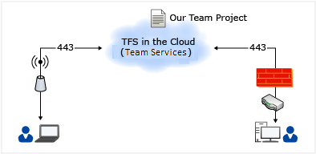
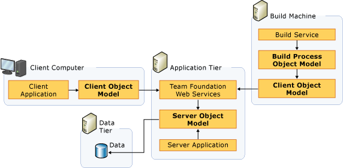
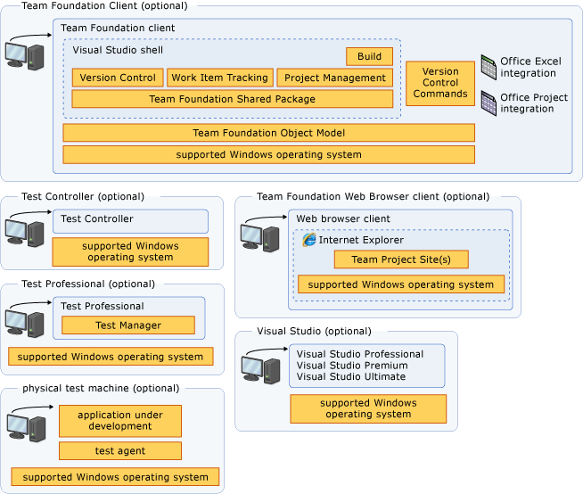

# Team Foundation Server architecture

**TFS 2017 | TFS 2015 | TFS 2013**

To best plan and manage your deployment, you should first understand the underlying architecture of Team Foundation Server (TFS). Understanding the architecture can help you maintain the overall health of the deployment and help ensure the overall availability of the servers and services your development teams require. 

You can deploy TFS in several ways: on one server; on many servers; or in one domain or workgroup or across domains. Alternatively, you might choose to use VSTS, where all the server elements of your deployment are hosted for you by Microsoft. Understanding the architecture can help you decide what topology is most likely to meet your business needs. Regardless of your choice of topology, if you understand the architecture underlying TFS, you can better manage the physical and logical requirements. This topic provides a simple overview of the various architectures, with links to more information about example deployments. It also provides technical information about the services, databases, configuration information, and network ports and protocols of local deployments.

To understand the architecture of TFS and how it affects your deployment, you should consider the following:

* The logical application, data, and client tiers of Team Foundation, and whether you want to use one or more servers for the application and data tiers, or whether you want the application and data tiers hosted in the cloud for you by using VSTS 

* The location of the physical or virtual servers that host those tiers

* Team Foundation Build and the number and location of build computers that will run in your environment, including how many you might need to support your development practices

* The potential need for Team Foundation ServerProxy 

In addition, you must consider the interactions between these entities. For example, if you choose to use the hosted TFS service, you must ensure that your clients can access the service on port 443. If you choose to deploy TFS locally, you must know what Web services, databases, and object models TFS uses. Also, you must know which network ports and protocols TFS uses by default and which network ports you can customize. Finally, you must understand what permissions you must set in Team Foundation Server and the components and programs on which your deployment depends.

Besides its own services, Team Foundation Server depends on other services in order to function. For information about these services, see Team Foundation Server concepts and Components of the TFS data warehouse. For more information about the requirements and dependencies for installation, see Team Foundation Server install guide.

> **Caution!** You should not manually modify any of the TFS databases unless you’re instructed to do so by Microsoft Support or you’re following the procedures described for manually backing up the databases. Any other modifications can invalidate your service agreement.

## Visual Studio Team Services (VSTS) 

Microsoft offers the option of using VSTS, which can host all of the server-side aspects of TFS for you. Your source code, work items, build configurations, and team features are all hosted in the cloud. From an architectural point of view, this greatly simplifies your use of TFS, as the only aspects of the architecture you need to consider are the client components and their Internet access.

When using the VSTS, you use a web browser to connect to the service using your Microsoft account. You can create team projects, add members to your team, and work as you would with a locally installed TFS, without the overhead of administering the servers. VSTS hosts your application tier, data tier, and build servers in the cloud. 

## The object model

With either the hosted or the locally-deployed architecture, you can extend the features and functionality of Team Foundation by writing an application that is based on its server or client object model. In all deployment types, you can write applications that extend client capabilities. However, if you want to extend server capabilities, your application must run on the application-tier server. To extend the client capabilities, you must run the application on the same computer as Team Explorer.

## Web services and databases for local deployments 

Team Foundation Server includes a set of Web services and databases that you install and configure separately on the server or servers that host the logical application, data, and client tiers for Team Foundation. Some features, such as the task board, and backlog team-based features, are entirely web-based and accessed solely through Team Web Access, a client-side web based service. Others, such as the version control features, can be accessed through either Team Web Access or through a client application. The following illustrations provide a high-level view of web services, applications, and databases for local deployments of TFS.

### Collection-level services

Collection-level services provide the functionality for operations at the level of the team project collection. You can create applications that extend Team Foundation Server by using some of these services. For more information about creating applications for TFS, see Extending Team Foundation. 

> **Tip!** Some services appear in more than one level. For example, the Registry service functions at the collection level and the server level, and appears in both lists.

Team Foundation Framework Services:

* Registry service

* Registration service (for compatibility with earlier versions of Team Foundation Server)

* Property Service

* Event Service

* Security service

* Location service

* Identity Management service

* Version Control Web service

* Work Item Tracking Web service

* Team Foundation Build Web service

* Lab Management Web service

* VMM Administration Web service

* Test Agent Controller Web service

### Server-level services

Server-level services (also known as application-level services) provide the functionality for operations for Team Foundation Server as a software application. You can create applications that extend Team Foundation Server by using some of these services. For more information, see [Extending Team Foundation](extend-vs-for-alm.md).

Team Foundation Framework Services:

* Registry service
* Event service
* Team Project Collection service
* Property service
* Security service
* Location service
* Identity Management service
* Administration Service
* Collection Management Service
* Catalog Service

### Data tier  

The data tier includes data, stored procedures, and other associated logic. When you use VSTS, the data tier is hosted for you using SQL Server Azure. In a local deployment of TFS, the logical data tier consists of the following operational stores within SQL Server. These stores might be located on one physical server or distributed across many servers. You can create applications that extend Team Foundation Server by using some of these operational stores. For more information, see [Extending Team Foundation](extend-vs-for-alm.md).

* Configuration database (TFS_Configuration)
* Application warehouse (TFS_Warehouse)
* Analysis Services database (TFS_Analysis)
* Databases for team project collections (TFS_CollectionName)

The following table provides a list of the databases that Team Foundation Server uses in local deployments. Unless otherwise noted, you can move all databases in this list from the original server and instance where they are installed and restore them to another server or instance.

| Database Name and Description | Server |
| --- | --- |
| **TFS_Configuration** This database stores the catalog of resources and the configuration information for Team Foundation Server. This database contains the operational stores for Team Foundation Server. | Instance of SQL Server that is used when Team Foundation Server is installed and configured. |
| **TFS_Warehouse** This database stores the data for reports. | Instance of SQL Server that is used when Team Foundation Server is installed and configured. |
| **TFS_Analysis** This multi-dimensional database stores the aggregated data from team project collections. | Instance of SQL Server that is used when Team Foundation Server is installed and configured. |
| **Databases for team project collections** One database for each team project collection, containing data from all team projects in that collection. | Instance of SQL Server that is compatible with Team Foundation Server. |
 

### Client tier  
 
The client tier communicates with the application tier through the server object model, and uses the same Web services that are listed for that tier. This is true whether you deploy TFS locally, or if you use VSTS. Besides that model, the client tier consists of Visual Studio Industry Partners (VSIP) components, Microsoft Office integration, command-line interfaces, and a framework for check-in policies. 

## Configuration information  
 
The hosted service depends on the client services, deployed locally, and an Internet connection to the application and data tiers hosted in the cloud. A local deployment of Team Foundation Server depends on SQL Server, Internet Information Services (IIS), and the Windows operating system. Contingent on your chosen topology, Team Foundation Server might also depend on SQL Server Reporting Services or SharePoint Products. Therefore, configuration information for Team Foundation Server can be stored in any of the following locations:

* IIS data stores.
* Configuration files for Team Foundation Server.
* Data sources for Reporting Services (for example, TFSREPORTS data).
* Configuration database for Team Foundation Server. The Team Foundation Server registry is part of the configuration database.
* Windows Registry.

For examples of different local deployment topologies and where these resources are stored, see [Examples of Simple Topology](examples-simple-topo.md), [Examples of Moderate Topology](examples-moderate-topo.md), and [Examples of Complex Topology](examples-complex-topo.md). As you maintain a local deployment of Team Foundation Server, you must take these configuration sources into account. To change the configuration in any way, you might need to modify information that is stored in multiple locations. You might also need to change configuration information for the data and client tiers. Team Foundation Server includes an administration console and several command-line utilities to help you make these changes. For more information, see [Configure and manage TFS resources](../admin/config-tfs-resources.md).

## Synchronization of group identities between Active Directory and Team Foundation Server  
 
In local deployments where Team Foundation Server is running in an Active Directory domain, group and identity information is synchronized when any of the following events occur:

* The application-tier server for Team Foundation starts.

* An Active Directory group is added to a group in Team Foundation Server.

* The period of time that is specified in the scheduled job elapses. The default is one hour, and all groups in Team Foundation Server update every 24 hours.

Identity Management Services (IMS) synchronizes with Active Directory, and changed identities propagate from the server to the clients. By default, all groups update within 24 hours, but you can customize this to better suit the needs of your deployment. For more information, see [Trusts and Forests Considerations for Team Foundation Server](https://msdn.microsoft.com/en-us/library/ms253081(v=vs.120).aspx). For local deployments that do not use Active Directory, see [Managing Team Foundation Server in a Workgroup](https://msdn.microsoft.com/en-us/library/ms252507(v=vs.120).aspx).

## Groups and permissions  
 
In a local deployment, Team Foundation Server has its own set of default groups and permissions that you can set at the project, collection, or server level. You can create custom groups and customize permissions at group and individual levels. However, users or groups that you add to Team Foundation Server are not automatically added to two components on which local deployments of Team Foundation Server can depend: SharePoint Products and Reporting Services. If your deployment uses these programs, you must add users and groups to them and grant the appropriate permissions before those users or groups will function correctly across all operations in Team Foundation Server. For more information, see [Manage users or groups in TFS](../../security/permissions.md).

For hosted deployments, access is controlled through a combination of Microsoft accounts and team membership. For more information, see the [VSTS overview](../../overview.md). 

## Network ports and protocols  

By default, a local deployment of TFS is configured to use specific network ports and protocols. The following illustration shows network traffic for Team Foundation Server in a simple deployment.

Similarly, the hosted service for TFS is configured to use specific network ports and protocols. The following illustration shows network traffic in a hosted deployment.

The following illustration shows network traffic in a more complex deployment that includes the components for Visual Studio Lab Management.

Virtual machines use port 80 to communicate with any test controller about the download of a lab management agent. Check that this port is enabled if you are having any communication issues. 

## Default network settings  

By default, communication between the computers in a deployment of Team Foundation uses the protocols and ports shown in the following table. If an asterisk (*) follows the port number, you can customize that port.

| Tier and service | Protocol | Port |
| --- | --- | --- |
| Application tier – Web Services | HTTP/HTTPS | 8080/443* |
| Application tier – SharePoint Products Administration | HTTP | 17012* if SharePoint Products was installed with Team Foundation Server; otherwise, randomly generated |
| Application tier – SharePoint Products and Reporting Services | HTTP   Windows Management Instrumentation (WMI) service (required during installation to specify and verify the URLs for reporting services) | 80* Dynamic port |
| Data tier | MS-SQL TCP | 1433* |
| Data tier (SQL Server Analysis Services) | MS-AS | default (2382 or 2383)*   The default port varies depending on the version of SQL Server you installed and the type of instance. Use SQL Server Configuration Manager to determine the ports used by your deployment. |
| Team Foundation Server Proxy - client to proxy | HTTP | 8081* |
| Team Foundation Server Proxy - proxy to application tier | HTTP/HTTPS | 8080/443* |
| Client tier - Reporting Services | HTTP | 80* |
| Client tier - Web services | HTTP/HTTPS | 8080/443* |
| Build controller to application tier HTTP/HTTPS | 8080/443 |
| Build agent to application tier | HTTP/HTTPS | 8080/443 |
| Release Management Server | HTTP or HTTPS | 1000* |
| Release Management Client | HTTP or HTTPS | 1000* |
| Release Management Agent | HTTP or HTTPS | 1000* |
| Test controller to application tier | HTTP/HTTPS | 8080/443* |
| Application tier to test controller | .NET remoting | 6901*|
| Application tier to Domain Name System (DNS) | DNS Dynamic Update | 53 |
| Application tier – Virtual Machine Manager | HTTP | 8100 |
| Test controller to test agent | .NET remoting | 6910* |
| Test agent to test controller | .NET remoting | 6901* |
| Build controller to build agent | SOAP over HTTP | 9191 |
| Lab agent to lab agent in an isolated environment | TCP sockets | 9050 | 
| Build agent to build controller | SOAP over HTTP | 9191 |
| Virtual Machine Manager Administrator Console – Virtual Machine Manager | HTTP | 8100 |
| Virtual Machine Manager– Virtual Machine Manager hosts | Windows Remote Management (WinRM) to perform actions   Background Intelligent Transfer Service (BITS) to transfer data | 80 to perform actions   443 to transfer data |
| Virtual Machine Manager– Virtual Machine Manager library server | WinRM to perform actions   BITS to transfer data | 80 to perform actions   443 to transfer data |
| Application tier – Virtual Machine Manager hosts | Distributed Component Object Model/Windows Management Interface (DCOM/WMI) communication to transfer data | 135   Dynamically assigned in the range 49152 to 65535 |
| Client tier – Virtual Machine Manager hosts | Host-based connection to the virtual machine. | 2179 to perform host-based connections |
| Hosted services | HTTPS | 443 |

## Customizable network settings  

As the previous table shows, you can change communication between the application, data, and client tiers in local deployments by modifying Team Foundation Server to use custom ports. The following table describes example changes in ports from HTTP to HTTPS.

> [!NOTE]
>To configure Team Foundation Server to use HTTPS and Secure Sockets Layer, you must not only enable ports for HTTPS network traffic but also perform many other tasks. For more information, see [Set up HTTPS with Secure Sockets Layer (SSL) for Team Foundation Server](../admin/setup-secure-sockets-layer.md).
 
| Service | Protocol | Port |
| --- | --- | --- |
| Web Services with SSL | HTTPS | Configured by the administrator |
| SharePoint Central Administration HTTPS | Configured by the administrator |
| SharePoint Products | HTTPS | 443 |
| Reporting Services | HTTPS | 443 |
| Client Web Services | HTTPS | Configured by the administrator |
| Release Management | HTTPS | Configured by the administrator |

## See Also 

[Team Foundation Server concepts](tfs-concepts.md)

