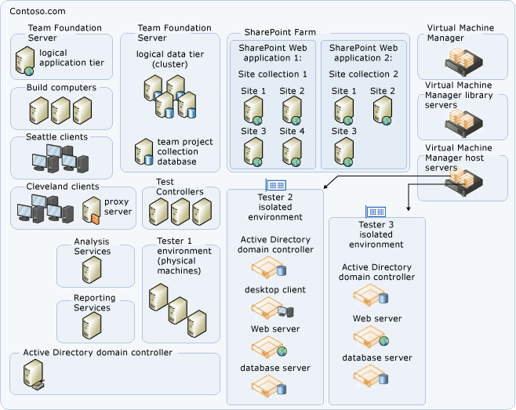
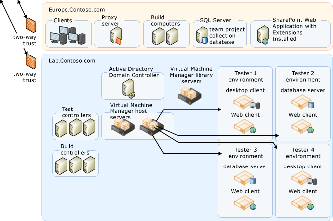

# Examples of Complex Topology for Team Foundation Server

**TFS 2017** | **TFS 2015** | **TFS 2013**

You can configure Visual Studio Team Foundation Server in one of several
topology configurations. Generally speaking, the simpler the topology,
the more easily you will be able to maintain a??Team Foundation Server
deployment. You should deploy the simplest topology that meets your
business needs.

This topic describes two complex Team Foundation Server topologies. A
complex topology has Team Foundation Server components distributed
across many servers. It is accessed by clients in multiple domains in
geographically distant physical locations. Team Foundation Server Proxy
is installed in addition to optional components such as SharePoint
Products and SQL Server Reporting Services. There are several different
code bases, and these code bases each have their own team project
collection for the projects that use them. The databases for team
project collections are stored on several different servers that are
running SQL Server.

## Complex Single-Domain Topology

A complex server topology uses multiple servers in clusters or other
failover configurations to host the logical Team Foundation data and
application tier components. The following diagram demonstrates a
complex single-domain topology:

This example topology is similar to the [moderate topology](examples-moderate-topo.md).
Team Foundation Server services are deployed on one server and the Team
Foundation Server databases are installed on a separate server, with
Team Foundation Build and the team's test agents and test agent
controllers deployed on additional servers. Also, fail-over components
have been added. The Team Foundation databases have been installed on
a??SQL Server cluster.

The example diagram shows child domains in Seattle and Cleveland, each
with a two-way transitive trust to the parent domain. The service
account for Team Foundation Server is trusted by both domains.??Each
geographically distant child domain uses a limited bandwidth connection.
Since getting an enlistment from the version code control component of
Team Foundation Server can take a very long time under such limited
bandwidth conditions, a??Team Foundation Server Proxy is installed in
each child domain to act as a version control file proxy cache. All
client requests go directly to the application tier, with the exception
of version control code **get** requests. These requests are directed
through the Team Foundation Server Proxy, which then caches all source
files that it downloads on the proxy server.

The topology in this example is also concerned about fault tolerance and
high performance. Data tier fault tolerance is provided by taking
advantage of the SQL Server clustering technologies. Multiple SharePoint
Web applications are configured for use by team projects within
collections in a SharePoint Web farm. Team project collection databases
are distributed across SQL Server instances for improved performance and
ease of individual management. SQL Server Reporting Services and SQL
Server Analysis Servers are running on separate servers for improved
performance.

This example is designed for a large product development team with up to
2,000 users.

## Complex Multi-Domain Topology

A complex multi-domain server topology uses multiple servers in two or
more domains. As with the complex single-domain topology, the deployment
uses clusters or other failover configurations to host the components of
the data tier for Team Foundation. The administrators for this
deployment have configured network load balancing and added multiple
application-tier servers to distribute the operational load. The
following illustration demonstrates a complex multi-domain topology:

As in the above example, this topology is configured for fault tolerance
and high performance. In addition, this topology is distributed across
multiple domains, some of which are fully trusted child domains of the
parent domains, but one of which (IsolatedLab.com) is a completely
separate domain. The service accounts used by Team Foundation Server are
fully trusted members of all domains, and user accounts have been
configured in both the parent domain and the separate domain as
necessary for users who must work in both domains. Firewalls have been
configured to allow traffic across the ports required by Team Foundation
Server.

## See also

[Examples of simple topology](examples-simple-topo.md)

[Examples of moderate topology](examples-moderate-topo.md)

[TFS architecture](architecture.md)
