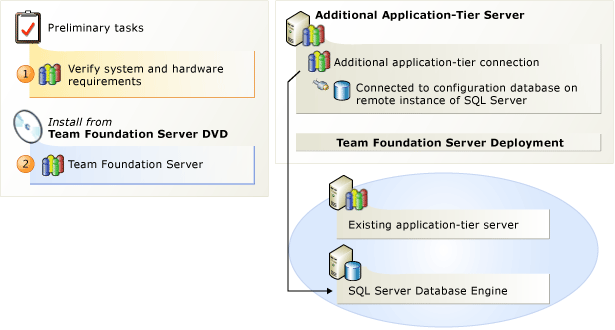

# How to: Create a Team Foundation server farm (high availability)

**TFS 2013**

You might add an application-tier server to an existing deployment of Team Foundation Server for any of the following reasons:

-   You want to build redundancy into your deployment of Team Foundation Server.  
-   You want your deployment of Team Foundation Server to run faster.  
-   You want to restore an application-tier server that has failed.  
-   You want to move an application tier to a different server.

**Redundancy and performance**  
By using the Application-tier Only Configuration wizard, you can enhance the availability, scalability, and performance of your application tier. 

To benefit from multiple application-tier servers, you should ensure that your initial deployment of Team Foundation Server includes the following characteristics:

-   The application tier and the configuration database are installed on separate servers.  
-   You used a domain account for the Team Foundation Server service account (TFSSERVICE).  
-   Network Load Balancing (NLB) is deployed.

You use NLB to create a cluster of Web servers that appear as a single logical Web service. This procedure is separate from the Application-tier Only Configuration wizard. For more information about how to set up NLB, see the following page on the Microsoft website: [Network Load Balancing](http://go.microsoft.com/fwlink/?LinkId=158320).

If you create an NLB cluster, you do not need to use a SQL Server cluster for your configuration database or any team project collection. For the purposes of performance, scalability, and availability, any SQL Server cluster that you might deploy is independent of the NLB cluster.

**Disaster recovery and hardware upgrade**  
If you have a backup of your configuration database and your application tier has a hardware failure, you can use the Application-tier Only Configuration wizard to restore the application tier.

You can also move your application tier with the Application-tier Only Configuration wizard. Although no particular architecture is required to move an application tier, you must have access to the configuration database for the deployment.

## Create a Team Foundation Server Farm

Use the steps in this checklist to add an application tier to an existing deployment of Team Foundation Server.

| | Task | Detailed instructions |
| --- | --- | --- |
| [Step 1](_img/ic646324.png) | **Check for supported hardware and software**. Verify that the operating system and hardware meet requirements for Team Foundation Server. | [System requirements for Team Foundation Server](../requirements.md) |
| [Step 2](_img/ic646325.png) | **Set up Team Foundation Server**. Install Team Foundation Server and run the Application-Tier Only Configuration wizard. | [Run Team Foundation Server installation](install-2013/install-tfs.md#installer)   [Configure TFS using the application-tier-only configuration wizard](#config-tfs-app-tier-wiz) |

## Configure TFS using the application-tier-only configuration wizard

You can use a wizard to add an application tier to an existing Team Foundation Server deployment. 

Your Team Foundation Server deployment must use a domain account for its service account. If you originally used a built-in account for the TFS service account, you must change it to a domain account. For more information, see the section "Assigning a Different Account as the Service Account" on this page on the Microsoft website: Change the Service Account or Password for Team Foundation Server.

> [!TIP]
> You can access the Team Foundation Server Configuration tool by launching Team Foundation Server Administration Console, choosing **Application Tier**, and then choosing **Configure Installed Features**.
 
**Required permissions:** To perform this procedure, you must be a member of the **Administrators** security group on the server. 

To configure Team Foundation Server by using the application-tier only option:

  1. Choose **Application-Tier Only Configuration**, and then choose **Start Wizard**.

  The **Team Foundation Server Application-Tier Only** wizard appears.

  2. Read the Welcome screen, and then choose Next.

  3. In **SQL Server Instance**, type the instance of SQL Server that hosts the configuration database for the installation of TFS for which you want to add an application-tier server, and then choose **List Available Databases**.

  The wizard lists all the databases on that instance of SQL Server.

  4. Choose a database, and then choose **Next**.

  The wizard displays the application-tier settings for this server.

  5. In the list, choose the account you want to use. Enter the password for the service account. To test the user account and password combination, you can optionally choose **Test**.

    > [!NOTE]
    > Make sure that the service account you specify has been added to the Farm Administrators group for the SharePoint Central Administration site. For more information, see [Add the service account for Team Foundation Server to the Farm Administrators group](sharepoint/setup-remote-sharepoint.md#tfs-svc-acct-to-farm-admin-group).

  6. Under **Authentication Method**, choose **NTLM** to use NTLM authentication or **Negotiate (Kerberos)** to first attempt Kerberos authentication, the more secure option. If that fails, fall back to NTLM. Choose **Next**.

  NTLM is the default value.

  7. On the Review page, review the settings, and then choose **Next**.

  8. Choose Configure to apply the configuration settings.

  The wizard applies configuration settings. 

  9. Choose **Next**, **Close**, **Close**.

  The Team Foundation Server Administration Console appears.

> [!TIP]
> If you want to connect to an NLB cluster from a client that is running on one of the application-tier servers in the cluster, you should connect using localhost as the name of the server, instead of the Domain Name System (DNS) name for the load balancer. By default, Internet Information Services (IIS) prevents you from connecting to an NLB cluster from any server in the cluster, unless you use localhost as the name of the cluster.
 
