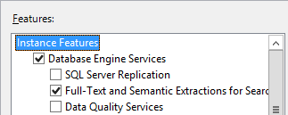
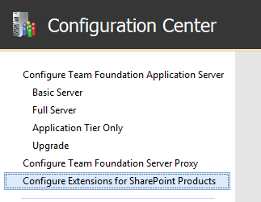
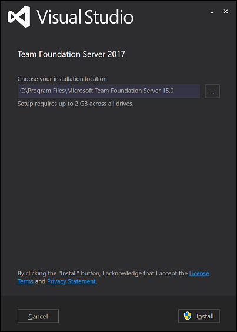
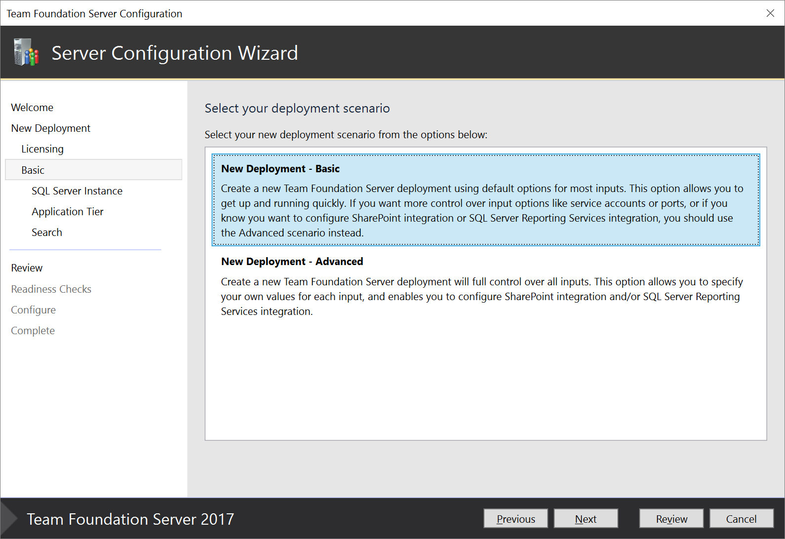

# How to set up TFS in a dual server configuration

**TFS 2018** | **TFS 2017** | **TFS 2015**

You can enable your Team Foundation Server (TFS) deployment to handle more load than a single server configuration by deploying the application and data tiers on separate servers. Make sure to review our [hardware recommendations](../requirements.md#hardware-recommendations) to confirm that this configuration seems appropriate for your team. If not, consider a [single server](single-server.md) or [multiple server](multiple-server.md) configuration instead.

> If you're upgrading to TFS 2018 from another version, you may want to look at the [requirement changes](../requirement-changes-tfs16.md) and [release notes](../whats-new.md#tfs-2018-rc1).

## Preparation

0. Prepare an application tier server that satisfies the [system requirements](../requirements.md) for TFS.

0. Prepare a data tier server that meets the [hardware recommendations](../requirements.md#hardware-recommendations) for your team. 

	Set up an [appropriate version of SQL Server](../requirements.md#sql-server) on the data tier. When you set SQL Server up for TFS, install at least the database engine and the full text search services.

	

	Paid copies of Team Foundation Server come with a license to SQL Server Standard for use with TFS. The 
	[Team Foundation Server pricing page](https://www.visualstudio.com/team-services/tfs-pricing) explains the details. If you use the license that's included with TFS, you can only use it for the TFS databases.

0. Configure the firewall on your data tier to [allow access to the SQL Server database engine](https://msdn.microsoft.com/library/ms175043.aspx)
so that TFS can get through the firewall to connect to the SQL Server database engine from the application tier.

0. Ensure that the account you plan to use to configure TFS is a member of the 
[SysAdmin server role in SQL Server](https://msdn.microsoft.com/library/ms188659.aspx). 

	> Installing TFS involves a complex set of operations that require a high degree of privilege - these include creating databases, 
	> provisioning logins for service accounts, and more. Technically, all that is required is membership in the ServerAdmin role; 
	> ALTER ANY LOGIN, CREATE ANY DATABASE, and VIEW ANY DEFINITION server scoped permissions; and CONTROL permission on the master 
	> database. Membership in the SysAdmin server role will confer all of these memberships and permissions,
	> and is therefore the easiest way to ensure that TFS configuration will succeed. If necessary, these memberships and permissions 
	> can be revoked after TFS is installed.  

0. If you're going to enable reporting, prepare the application and data tiers for that.

	Install SQL Server Analysis Services and install and configure SQL Server Reporting Services. Configure your firewall to 
	[allow access to Reporting Services](https://msdn.microsoft.com/library/bb934283.aspx) and to 
	[allow access to Analysis Services](https://msdn.microsoft.com/library/ms174937.aspx).

	If you're using a version of TFS prior to TFS 2017, install SQL Server Client Tools Connectivity on the application tier server.

	

0. If you're going to enable SharePoint integration, prepare one of the servers for that.

	Install [an appropriate version of SharePoint](../requirements.md#sharepoint). If you already have SharePoint deployed, you can use that deployment instead of 
	installing it on one of your new servers - just install TFS on the SharePoint server and run the Configure Extensions for SharePoint Products wizard.

	

	Add the service account you plan to use for your TFS deployment to the Farm Administrators group in SharePoint. Note that if you plan to use NetworkService 
	as your service account, this will look like *{domain}\\{app-tier-machine-name}$*.

## Installation

0. You can download TFS from:
	* [www.visualstudio.com/tfs/](https://www.visualstudio.com/tfs/) (the simplest method), 
	* [MSDN Subscriber Downloads](https://msdn.microsoft.com/en-us/library/hh442898.aspx), 
	* the [Volume Licensing Service Center](https://www.microsoft.com/Licensing/servicecenter/default.aspx), 
	* or purchase a DVD through retail channels

0. Kick off the installation.

The installation process itself simply gets TFS bits onto your machine. 
At the end of this process, the installer will launch the TFS 
Configuration Center. 

## Configuration

Configure TFS using your selected scenario. Even in a dual-server configuration,
the easiest way to set up Team Foundation Server is to use the Server Configuration
Wizard with the *New Deployment - Basic* scenario.

> In previous versions of TFS, you would use the Basic Configuration Wizard.

This scenario is optimized for simplicity, using default options for most inputs. If you want full control over all inputs, use the *New Deployment - Advanced* scenario instead. 

When selecting a SQL Server instance in the wizard, be sure to point to the data tier you have already configured. With the New Deployment - Basic scenario, you will also need to choose:

- **Application Tier**: Which website settings to use, including whether to use HTTP or HTTPS bindings. See [website settings](../../security/websitesettings.md) for more information.
- **Search**: Whether to install and configure Code Search features. See [configuring Search](../../search/code/administration.md#config-tfs) for more information.

If you select the *New Deployment - Advanced* scenario, you will additionally need to choose:

- The service account your various TFS deployment processes will run as. The default value used in the Basic scenario is `NT AUTHORITY\NETWORK SERVICE` in domain joined scenarios, and `LOCAL SERVICE` in workgroup scenarios.
- Whether to enable SSH, along with the port it should listen on. The default value used in the Basic scenario is to configure SSH on port 22.
- The location of the file cache used for frequently accessed TFS resources. The default value used in the Basic scenario is the path `TfsData\ApplicationTier\_fileCache` on the local drive which has the most free space.
- Whether to configure Reporting features and SharePoint integration. The default behavior used in the Basic scenario is to not configure these features. Note that these options are not available on client  operating systems.
- Whether to create a team project collection in which to store your projects, along with the name of that collection. The default behavior in the Basic scenario is to create a project collection named `DefaultCollection`.

In both cases, the wizard will run readiness checks to validate your environment and your setting selections. If all goes well, the wizard will then let you configure your deployment. If there are errors, you will need to fix each of them and re-run the readiness checks before you can continue.