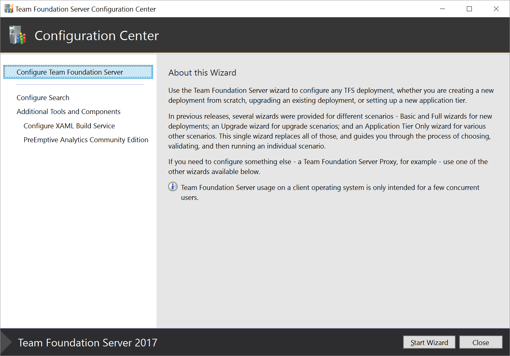
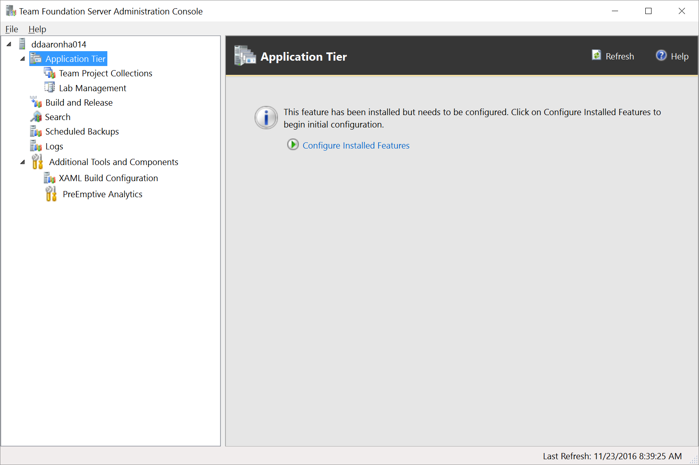

# Install and configure TFS

**TFS 2017** | **TFS 2015**

You have several choices
in how to deploy TFS, from putting everything on a single server all the way to using multiple 
application tiers, multiple SQL instances, and a SharePoint farm. See our
[hardware recommendations](../requirements.md#hardware-recommendations) for more detailed help 
in determining the right type of deployment for your team. 

* [Single server](single-server.md)    
	A single server deployment is the easiest way to deploy TFS, with the 
	application tier and data tier on the same machine.

* [Dual server](dual-server.md)  
	A dual server deployment, with separate application and data tiers, can 
	provide better performance for larger teams or teams with heavier usage.

* [Multiple server configuration](multiple-server.md)  
	Multiple server deployments, which can involve multiple application 
	and/or data tiers, can provide better performance for larger teams or 
	teams with heavier usage. Using multiple servers can also improve high 
	availability and disaster recovery capabilities.

## For evaluation or personal use

If you're setting up TFS for personal use or to evaluate the core features
(version control, build and work item tracking),
use [TFS Express](https://www.visualstudio.com/downloads/).
It's free, it's simple to set up,
and it can be installed on both client and server operating systems.
In TFS 2015 Update 2 and later, it supports all of the same features as TFS. 
TFS Express licensing limits it to five active users, however. 

You might also want to consider using a free
[VSTS account](../../accounts/create-account-msa-or-work-student.md)
for personal use.
Because it's in the cloud, you won't have to install SQL Server and TFS on your own hardware,
and you won't need to do things like manage your own backups.

## The installation process

No matter how you plan to deploy TFS, the process always involves three steps - 
preparation, installation, and configuration. 

Preparation is the process of getting one or more servers prepared for TFS by 
reviewing and following the system requirements. If in doubt, don't worry - the 
configuration process runs a series of readiness checks to ensure your system
meets the TFS requirements. 

Installation is the process of getting TFS bits on your server, and involves 
running an installer obtained from VisualStudio.com, MSDN Subscriber Downloads, 
the Volume Licensing Service Center, or physical media purchased through retail 
channels.
 
When installation completes, it will launch the Team Foundation Server 
Configuration Center. Configuration is the process of going through the 
appropriate wizard to actually get TFS up and running. In TFS 2017, a unified 
wizard is used for all TFS configurations - new installations, upgrades, and 
application-tier only scenarios. Prior to TFS 2017, you would pick the 
appropriate wizard for your scenario. Other wizards are available to configure
proxies, SharePoint extensions, and so forth.

If you need to close the configuration center for any reason, you can always get 
back to it by launching the installed Team Foundation Server Administration 
Console and clicking the Configure Installed Features link from the Application 
Tier node.

When you run a configuration wizard, it will run a series of readiness checks
to ensure that your system meets the TFS requirements and that your setting selections
look like they are going to work. If there are issues, you will be presented
with one or more warnings or errors. When all the errors have been resolved,
you can run your configuration to set up your TFS deployment. 