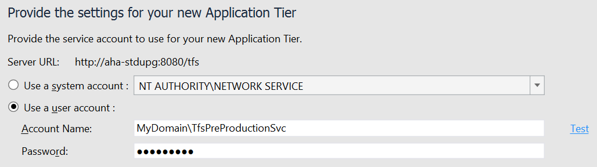
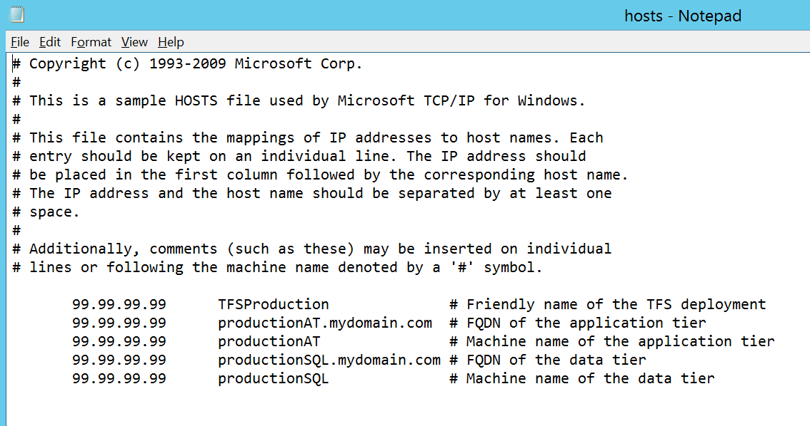

# Do a dry run of your upgrade in a pre-production environment

**TFS 2017** | **TFS 2015** | **TFS 2013**

## Do I need to bother?

Doing a dry run of your upgrade in a pre-production environment is strongly recommended, but it doesn't always
make sense. If you are debating whether or not to do a pre-production upgrade, weigh the costs of doing so 
against the costs of not doing so. In particular, if something goes wrong with your production upgrade the primary 
cost will be the downtime involved while you roll back to the old version of TFS. Depending on the specifics of your 
upgrade, this could be a fast and straightforward process, or it could take a very long time and involve a lot of 
moving parts. Just as with upgrade, the complexity of the rollback will depend on things like the size of your 
databases, the number of machines involved, etc.  

## The basics

If you decide to move forward with a pre-production upgrade, the general process consists of:

1.	Standing up a pre-production environment that is similar to your production environment.
2.	Protecting your production environment.
3.	Restoring databases from backups.
5.	Doing the upgrade.

## Standing up an environment

In an ideal world, your pre-production environment would look exactly like your production environment – this way 
you would get as accurate as possible a picture of how long your upgrade will take, whether you will encounter any 
issues along the way, etc. In the real world, however, this is not always possible or desirable. The product doesn't 
support cloning SharePoint integration features, for example. And the costs of provisioning a second set of 
identical machines for pre-production testing can be prohibitive. Don't let these discrepancies 
dissuade you, however – almost any pre-production environment is better than nothing.

## Protecting production

TFS databases contain a number of settings which point to various resources in their deployment environment. For
example, the collection database connection strings are stored in the configuration database, as is the network 
share used by the scheduled backups feature. As a result, it is possible for a pre-production environment to 
cause problems in a production environment, and it is a best practice when standing up a pre-production environment 
to take steps to prevent this.

The most important step you can take is to use a service account in your pre-production environment that does not 
have any permissions to your production environment. Ideally it should not have any permissions in TFS, in
SQL, on network shares, etc. Options here include Network Service (assuming your pre-production machine account
does not need permissions in production) or a dedicated pre-production domain account, as in the example below.

Another optional step is to add entries to your pre-production machine(s)' hosts files to map your production 
machine names to invalid IP addresses. See the Wikipedia entry [here](https://en.wikipedia.org/wiki/Hosts_(file) ) 
if you are unsure what a hosts file is. This can prevent outbound communication to your production machines 
from your pre-production machines.

 
## Restoring databases

If you use the [scheduled backups wizard](../admin/backup/config-backup-sched-plan.md) to generate 
database backups from your production deployment, you can also use it to restore backups on your pre-production 
deployment. If not, you can of course follow standard SQL procedures to restore backups as well. Your list of 
databases to backup and restore should always include your configuration database and all your collection databases. 
If your pre-production environment will include reporting features, you should also include the warehouse and report
server databases.

## Doing the upgrade

Install the new version of TFS on your application tier machines. Prior to running the upgrade wizard, 
run the [ChangeServerId command](../command-line/tfsconfig-cmd.md#changeserverid). This will ensure that you
don't run into problems if you access both your production and pre-production environments from the same clients,
and should be done any time you are cloning either a collection or a complete deployment. 

Once you are ready, upgrade your pre-production environment using the same steps you will use to upgrade 
production. Make sure you remember to use a service account which has no permissions in your production environment. 

## Configure new features

Some upgrades introduce new features which take additional steps to configure, since they involve process changes to 
your existing team projects. Depending on the specifics of your team projects and the version of TFS you are upgrading 
from, this could be more or less complicated. See [here](../../work/customize/configure-features-after-upgrade.md) for details. 

## Try things out

Take the pre-production server out for a spin! Poke around a bit, try out some of the new features... Note that 
some things, like running builds, will require some additional configuration.

If you discover any issues, try to work through them here in order to avoid hitting them again in production. 
When you are satisfied, call it a day and move on to your production upgrade. 