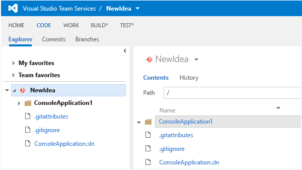
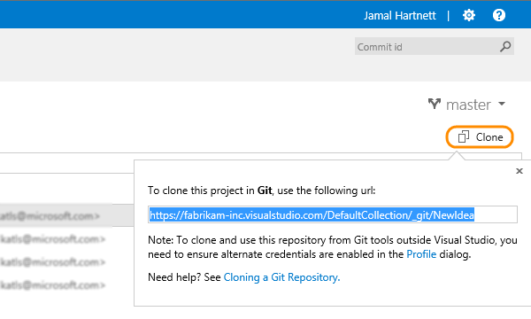

#### Q: Where can I find the URL for my Git repository?

A: You'll find it in the code hub in your team project.

1. Sign in to your VSTS account and browse to your team project or type the team project URL directly in your browser. 

* The URL will look like ```https://{your_account}.visualstudio.com/DefaultCollection/{your_team_project}```

* If you are not sure about your team project URL, [Sign in to your Visual Studio](http://go.microsoft.com/fwlink/?LinkID=309329) and select your account.

2. Open the code hub from your you team project's home page.

 

3. Select the the repository and click on the **clone** action to get the URL.

 

