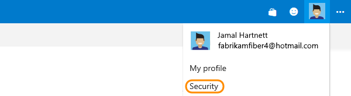
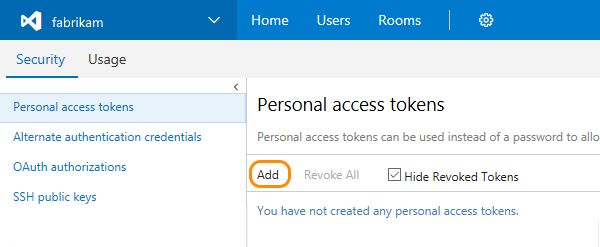
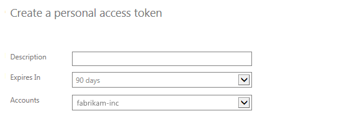
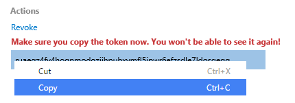

0.  Sign in to your Visual Studio Team Services account 
(```http://{youraccount}.visualstudio.com```).

0.  From your home page, open your profile. Go to your security details.

	

0. Create a new personal access token.

   

0.  Name your token. Select a lifespan for your token.

	If you're using Team Services, and you have more than one account, 
	you can also select the Team Services account where you want to use the token.

   

0.  Select the [scopes](../../integrate/get-started/authentication/oauth.md#scopes) 
that this token will authorize for **your specific tasks**.

	For example, to build and release apps with a Windows, OSX, or Linux agent, 
	[limit your token's scope to **Agent Pools (read, manage)**](/vsts/build-release/admin/index).
   
0. When you're done, make sure to *copy the token*. You'll use this token as your password.

   

	**Note: Remember that this token is your identity and acts as you when it's used. 
	Keep your tokens secret and treat them like your password.**

	**Tip:** To keep your token more secure, use credential managers 
	so that you don't have to enter your credentials every time. 
	Here are some recommended credential managers:
    
	*	Git: [Git Credential Manager for Mac OS X and Linux](https://github.com/Microsoft/Git-Credential-Manager-for-Mac-and-Linux) 
	or [Git Credential Manager for Windows](https://github.com/Microsoft/Git-Credential-Manager-for-Windows) 
	(Requires [Git for Windows](https://www.git-scm.com/download/win))
	*	NuGet: [NuGet Credential Provider](/vsts/package/nuget/nuget-exe)

0.  When you don't need your token anymore, just revoke it to remove its access.
