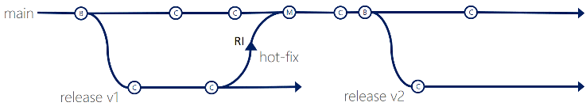
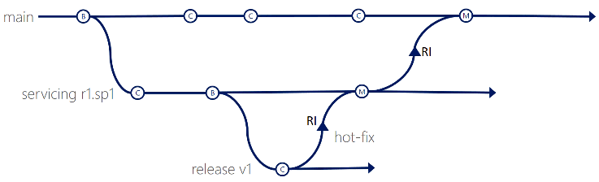
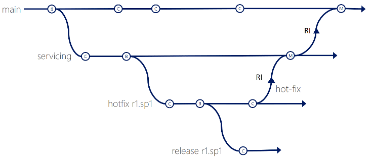

# Branching strategies with TFVC
#### VSTS | TFS 2018 | TFS 2017 | TFS 2015 | VS 2017 | VS 2015 | VS 2013

Do you plan to adopt Team Foundation Version Control ([TFVC](index.md)), and are wondering how to best use branches? We will not delve deep into branching features, as they are well documented in the product [documentation](use-branches-isolate-risk-team-foundation-version-control.md) and [guidance](https://blogs.msdn.microsoft.com/visualstudioalmrangers/2015/04/22/library-of-tooling-and-guidance-solutions-aka-msvsarsolutions/), but will explore a few common branching strategies to help you make the right decision.

Unlike Git branches, which are repository scoped, TFVC branches are path scoped and not as light-weight. Set your bar for creating branches high, to avoid the management it takes to keep track of branches, storage resources and resolution of merge conflicts. Consider branching only if you have multiple teams working on the same codebase, or need isolation for development or release.

## Main Only

The **Main Only** strategy can be folder based or with the **main** folder [converted to a Branch](branch-folders-files.md), to enable additional visibility features. You commit your changes to the main branch and optionally indicate development and release milestones with labels.

> RISK: The mutability and lack of history with TFVC labels can add risk of change control.

Start with the the main only branching strategy, [branch strategically](branch-strategically.md) and adopt other strategies to evolve into more complex strategies as needed.

## Development isolation
When you need to maintain and protect a stable **main** branch, you can branch one or more **dev** branches from **main**, giving you isolation and concurrent development. Work can be isolated in development branches by feature, organization or temporary collaboration.

Changes made to **main** branch, should be forward integrated (FI) to the **dev** branch and merge conflicts resolved, before changes are reverse integrated (RI) back to **main**. To maintain the same quality bar across branches, always build and run build verification tests (BVTs) on **dev** the same way you are doing on **main**. Optionally combine this branching strategy with other strategies covered herein.

> NOTE: With this strategy, teams are likely to keep the **dev** branch around forever, potentially building a large merge ticket history.

## Feature isolation

Feature isolation is a special derivation of the development isolation, allowing you to branch one or more **feature** branches from **main**, as shown, or from your **dev** branches. 

When you need to work on a particular feature, it might be a good idea to create a feature branch.

You should keep the lifetime of feature work and the associated feature branch short-lived. Forward integrate (FI) changes from the parent branch frequently, but reverse integrate (RI) back to the parent only when some agreed team criteria, for example definition of done, is met. Rollback of features on **main** can be costly and may reset testing.

## Release isolation

Release isolation introduces one or more **release** branches from **main**, enabling concurrent release management, multiple and parallel releases, and accurate snapshots of your codebase at release time.

When your codebase has the first release candidate or the release is ready to be locked down, it might be a good time to create a new branch for the release.

Never forward integrate (FI) from **main** and lock release branches using access permissions, to prevent unintended modifications to a **release**. Patches and hot fixes made to the **release** branch can be reverse integrated (RI) back to the **main** branch.

> NOTE: None of the branching scenarios are immutable, which is why you notice emergency hotfixes performed on release branches. Evolve each strategy to match your requirements, without losing sight of complexity and associated cost.

## Servicing and Release isolation

Servicing and Release Isolation strategy introduces **servicing** branches, enabling concurrent servicing management of service packs, and accurate snapshots of your codebase at service and release time.

Consider this strategy if you need a servicing model for customers to upgrade to the next major release and additional service packs per release.

Like the release isolation, the **servicing** isolation and **release** branches are created when the release is ready to be locked down. Never forward integrate from **main** to **servicing**, or from **servicing** to **release**, and lock the **release** branch to prevent modifications. Future servicing changes can be done on the **servicing** branch.

Create new servicing and release branches for subsequent releases if you require that level of isolation.

## Servicing, Hotfix, Release isolation

Although not recommended, you can continue to evolve the strategies, by introducing additional **hotfix** branches and associated release scenarios.

At this point you have successfully explored a few of the common TFVC branching scenarios. You can evolve them, or investigate other strategies such as [feature toggling](https://msdn.microsoft.com/magazine/dn683796.aspx), toggling features on and off to determine whether a feature is available at run time.

## Q&A

### Why should branches be short-lived?

By keeping branches short-lived,  merge conflicts are kept to as few as possible. 

### Why only branch if neccessary?

To embrace [DevOps](http://aka.ms/devops) you need to rely on automation of build, test and deployment. Change is **continuous**, frequent and merge operations more challenging as merge conflicts often require manual intervention. It is therefore recommended to avoid branching and rely on other strategies, such as feature toggling.

### Why remove branches?

Your goal should be get changes back into **main** as soon as possible, to mitigate long-term merge consequences. Temporary, unused and abundant branches cause confusion and overhead for the team.

### Can a codebase be branched across team projects?

Yes, but it is not recommended, unless teams must share source and cannot share a common process.

### What about the code promotion strategy?

The Code Promotion strategy feels like a relic from the waterfall development era. It is typically with long testing cycles, and separate development and testing teams. The strategy is no longer recommended. Refer to the [branching guidance](https://blogs.msdn.microsoft.com/visualstudioalmrangers/2015/04/22/library-of-tooling-and-guidance-solutions-aka-msvsarsolutions/) for more information. 

### When merging **dev** to **main** branch, why are no changes detected?

You have likely ignored changes in previous merges, for example, using the `keep source` conflict resolution option. See [merging developement branch to main: there were no changes to merge](http://stackoverflow.com/questions/27590388/merging-developement-branch-to-main-there-were-no-changes-to-merge) for details.

### Are there similarities between TFVC and Git branch strategies?

The TFVC Feature Isolation branching strategy is similar to the Git [topic branches](http://www.git-scm.com/book/en/v2/Git-Branching-Branching-Workflows#Topic-Branches).

> Authors: Jesse Houwing, Marcus Fernandez, Mike Fourie, and Willy Schaub
 
*(c) 2015 Microsoft Corporation.ÿAll rights reserved.ÿThis document is
provided "as-is." Information and views expressed in this document,
including URL and other Internet Web site references, may change without
notice. You bear the risk of using it.*

*This document does not provide you with any legal rights to any
intellectual property in any Microsoft product. You may copy and use
this document for your internal, reference purposes.*